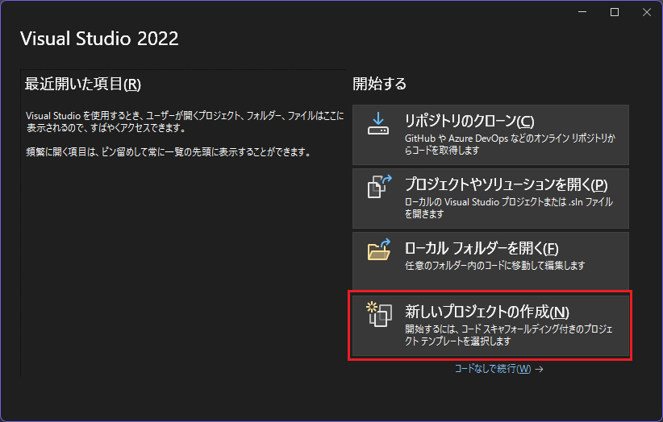
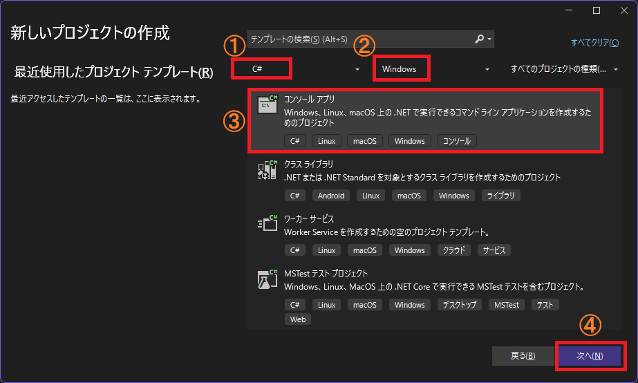
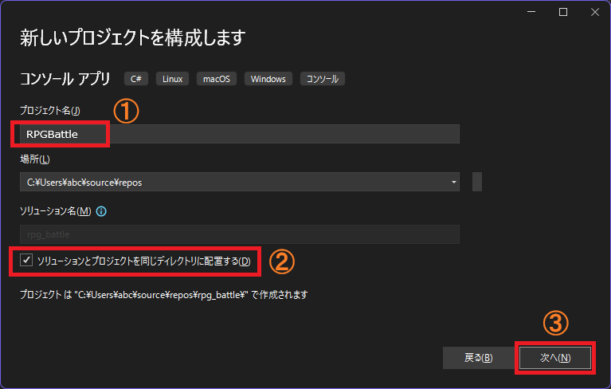
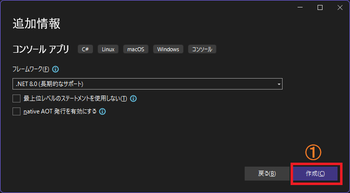
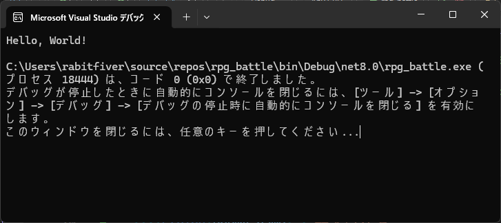
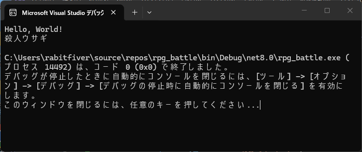
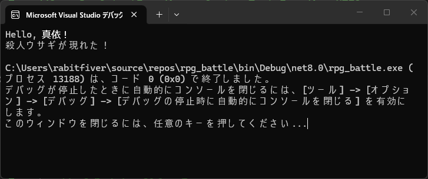
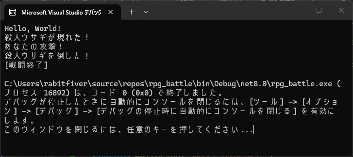

[C#言語2026 第01回]

# C#のプログラムを書いてみよう

この授業では、C#(シー・シャープ)という「プログラミング言語」について学習します。

本テキストの目的は、簡単なゲームの制作を通じて「C#言語の書きかた、機能、そしてプログラミングの基本を覚える」ことです。

## 1 アプリケーションを実行しよう

### 1.1 C#言語について

<p align="center"></p>

コンピューターのプログラムは「プログラミング言語」と呼ばれるもので書かれます。

世界では、国や地域によってさまざまな言語が使われています。それと同じように、コンピューターの世界にもさまざまなプログラミング言語が存在します。ただし、プログラミング言語の場合は「国や地域」ではなく、「目的」によって使う言語が変わります。

このテキストでは、C#(シー・シャープ)というプログラミング言語を使って、簡単なコンピューター・ゲームを作っていきます。C#言語には次のような特徴があります。

* アプリの実行速度が速い
* 様々な機能が用意されていてアプリを作りやすい
* 同じプログラムが、WindowsだけでなくmacOSやLinuxでも動作する
* C++やJavaより後に作られたので、設計が洗練されている

### 1.2 プロジェクトの作成

Visual Studio を起動してください。起動すると、次のような画面が表示されます。右側のリストから「新しいプロジェクトの作成」をクリックしましょう。

<p align="center"></p>

すると「新しいプロジェクトの作成」ウィンドウが開きます。

この場面では、まず言語選択ボックス(1)をクリックして、言語を`C#`に設定します。<br>
次にプラットフォーム選択ボックス(2)をクリックして、`Windows`に設定します。<br>
続いて、テンプレート一覧(3)から「コンソール アプリ」をクリックします。<br>
これら3つの項目を選択し終えたら、右下の「次へ」ボタン(4)をクリックしてください。

<p align="center"></p>

すると「新しいプロジェクトの構成」ウィンドウが開きます。<br>
ここでは「プロジェクトの名前」や「プロジェクトの保存場所」を設定します。

まずは、プロジェクト名ボックス(1)に`RPGBattle`と入力します。この名前は、プロジェクトを格納するフォルダや、作成される実行ファイルの名前にも使われます。<br>
それから、下の方にある「ソリューションとプロジェクトを同じディレクトリに配置する」をクリックして、チェックマークを付けます。これで、余分なディレクトリが作られなくなります。

>`_`(アンダーバー)記号は、Shiftキーを押しながらキーボード右下の「ろ」キー)を押します。

名前、チェックボックスをもう一度確認してください。問題がなければ「次へ」ボタン(3)をクリックします。

<p align="center"></p>

最後に「追加情報」を設定しますが、特に変更の必要はありません。右下の「作成」ボタン(1)をクリックして下さい。<br>
すると、プロジェクトが作成されて、Visual Studioが起動します。

<p align="center"></p>

>**【ソリューションって何？】**<br>
>「ソリューション」は複数のプロジェクトをまとめて扱うための機能です。ソリューション用のフォルダを作り、その中に複数のプロジェクト用フォルダを配置することで、プログラムを管理しやすくします。しかし、ひとつのプロジェクトしか使わない場合、階層が増えて分かりにくくなるだけです。だから、今回はソリューション用フォルダを作成しません。

### 1.3 アプリを実行しよう

Visual Studoは、作成したプロジェクトを自動的に開きます。画面には次のような「英語の文章」が表示されていると思います。

```c#
// See https://aka.ms/new-console-template for more information
Console.WriteLine("Hello, World!");
```

とても短いですが、れっきとしたC#プログラムです。<br>
このアプリケーションを実行してみましょう。ウィンドウ上部にある`▶RPGBattle`と書かれた部分をクリックしてください。

すると、Visual Studioの下の方に、「ビルドが開始されました...」というメッセージが表示されます。<br>
「ビルド」というのは、「C#で書かれたプログラムをアプリに変換する作業」のことです。ビルドには少しだけ時間がかかります。<br>
ビルドが終わると自動的にアプリが起動し、黒い画面が表示されます。

<p align="center"></p>

なお、この「黒い画面」は「コンソール」といいます。プロジェクトを作成するときの「コンソール・アプリケーション」というテンプレートは、「コンソールで動くアプリ」を意味します。

>コンピューター業界において、「コンソール」は「制御卓」や「制御盤」という意味です。

### 1.4 コメント

それでは、プログラムを見ていきましょう。最初の行は`//`(ダブルスラッシュ)記号から始まっています。これは「コメント」と呼ばれるもので、「人間用のメモ」を書くための機能です。

```c#
// See https://aka.ms/new-console-template for more information
```

コメントは`//`で始まり、行の終わりまで続きます。プログラムの説明を書いたり、今後の予定や、気づいたことをメモしておくために使います。コンピュータはコメントを無視します。

### 1.5 文章の表示

２行目が実際のプログラムです。`Console.WriteLine`(コンソール・ライトライン)という部分が、コンピュータに与える命令です。この命令は「コンソールに文章を表示する」という機能を持っています。

```c#
Console.WriteLine("Hello, World!");
```

後ろに続く`(`記号から`)`記号の範囲には、命令に与える「パラメータ」を指定できます。`"Hello, World!"`の部分が、パラメータとして与える文章です。

`"`(ダブル・クォーテーション)記号で囲んだ範囲は、プログラムの命令ではなく「書かれたままの文章」として扱われます。

つまり、`Console.WriteLine("Hello, World!");`というプログラムは、「"Hello, World!"という文章を、コンソールに表示しなさい」という意味になるわけです。

それから、最後の`;`(セミコロン)記号は、命令の終わりを指示するものです。命令の終わりには必ず`;`が必要です。

<pre class="tnmai_assignment">
<strong>【課題01 アイサツ】</strong>
<code>"Hello, World!"</code>の<code>World</code>の部分を「あなたの名前」に書き換えて、アプリを実行しなさい。
名前は、漢字、ひらがな、カタカナ、ローマ字など、どれで書いても構いません。
</pre>

<div style="page-break-after: always"></div>

## 2 バトルプログラムを作ろう

### 2.1 表記について

プログラムの練習として、RPGでよくある「ターン制バトル」を作ってもらいます。

ここから先、みなさんが実際に書き写す必要のあるプログラムは、次のように細い枠付きで示します。

```diff
 サンプルプログラム
```

以前のサンプルプログラムに追加したり削除した部分がある場合、行頭にプラスまたはマイナスの記号を付けます。

```diff
-先頭にマイナス記号が付いているのは、削除する行です。
+プラス記号が付いているのは追加する行です。
 どちらも付いていない場合は変更しない行です。
```

プログラムを書き写すときは、先頭の`+`記号は書かないでください。例えば、

```diff
+Console.WirteLine("こんにちわ");
```

を書き写すときは、先頭の`+`は無視して、残りの

```txt
Console.WirteLine("こんにちわ");
```

の部分だけを書きます。

また、書き写す必要のないサンプルプログラムや特記事項は、以下のように薄い水色の背景で示すことにします。

>これは書き写さない。

### 2.2 変数

`"`で囲った文章は、あとから変更したりできません。ですが、状況に応じて異なる文章を表示したり、文章を加工して表示したいこともあるでしょう。

そんなときに役立つのが「変数(へんすう)」です。名前に「変」という文字があることから分かるように、変数は「文章や数値をいつでも自由に変えられる」機能です。

説明だけではよく分からないと思うので、実際に変数を使ってみましょう。`Hello, [自分の名前]`を表示するプログラムの下に、次のプログラムを追加して下さい。

>行の最後の`;`(セミコロン)を忘れないこと。

```diff
 // See https://aka.ms/new-console-template for more information
 Console.WriteLine("Hello, Mai!");
+
+string enemyName = "殺人ウサギ";
+Console.WriteLine(enemyName);
```

プログラムが書けたら、ウィンドウ上部にある`▶RPGBattle`をクリックしてアプリを実行して下さい。<br>
`Hello, [自分の名前]`の下に、「殺人ウサギ」という単語が出力されていたら成功です。

<p align="center"></p>

さて、追加した最初の行は次のような構成になっています。

```c#
string enemyName = "殺人ウサギ";
```

これは、

&emsp;文章用の`enemyName`(エネミー・ネーム)という名前の変数に、`殺人ウサギ`という文章を割り当てる

という意味です。

この`enemyName`のように、「データを割り当てられた名前」のことを「変数(へんすう)」といいます。

名前の前にある`string`(ストリング)は、変数の種類をあらわす「型(かた)」です。「型」にはさまざまな種類があって、型ごとに「変数が使える機能」が違います。`string`型は「文章を扱う機能」を持っています。

`=`(イコール)記号は、変数にデータ(この場合は文章)を割り当てることを意味します。

さて、次の行の`Console.WriteLine`(コンソール・ライトライン)は「文章を表示する命令」でした。ここでは「変数`enemyName`に割り当てられている文章」を表示するために使っています。変数は`"`で囲ってはいけません。

>変数を作ることを「変数を定義する」といいます。

### 2.3 変数と文章を組み合わせる

変数と文章を組み合わせて表示したい、という場合は、`+`(プラス)記号を使います。`enemyName`を表示するプログラムを、次のように変更して下さい。

>先頭が`-`の行と`+`の行の内容が似ている場合、「`-`の行を、`+`の行のように書き換えてください」という指示になります。例えば、以下の変更では、`enemyName`の直後に`+ "が現れた！"`を追加するだけです。全体を削除してから書き直す必要はありません。

```diff
 // See https://aka.ms/new-console-template for more information
 Console.WriteLine("Hello, Mai!");

 string enemyName = "殺人ウサギ";
-Console.WriteLine(enemyName);
+Console.WriteLine(enemyName + "が現れた！");
```

プログラムが書けたら、`▶RPGBattle`をクリックしてアプリを実行して下さい。`Hello, [自分の名前]`の下に、「殺人ウサギが現れた！」という文章が出力されていたら成功です。

<p align="center"></p>

このように、`+`記号を使うと、文章と変数を自由に組み合わせて表示できます。

もう少しプログラムを追加しましょう。現在のプログラムに、次のプログラムを追加して下さい。

```diff
 // See https://aka.ms/new-console-template for more information
 Console.WriteLine("Hello, Mai!");

 string enemyName = "殺人ウサギ";
 Console.WriteLine(enemyName + "が現れた！");
+
+Console.WriteLine("あなたの攻撃！");
+Console.WriteLine(enemyName + "を倒した！");
+
+Console.WriteLine("[戦闘終了]");
```

プログラムが書けたら、`▶RPGBattle`をクリックしてアプリを実行して下さい。「殺人ウサギ」との戦闘の様子が出力されていたら成功です。

<p align="center"></p>

### 2.4 殺人ウサギを表示しよう

さて、現在のプログラムの状態は、殺人ウサギと遭遇し、1回攻撃するだけで倒しています。これはあまり面白い読み物ではありませんし、プレイヤーが操作できる要素がなくて、ゲームとはいえません。

そこで、少しずつプログラムを付け足して、もう少しゲームっぽく改造しましょう。

手始めに、敵の殺人ウサギの表示を追加してみます。「記号の出し方の表」を参考に、以下のプログラムを追加してください。

```diff
 // See https://aka.ms/new-console-template for more information
 Console.WriteLine("Hello, Mai!");

 string enemyName = "殺人ウサギ";
 Console.WriteLine(enemyName + "が現れた！");
+Console.WriteLine("+-----+");
+Console.WriteLine("| 🐰 |");
+Console.WriteLine("+-----+");

 Console.WriteLine("あなたの攻撃！");
 Console.WriteLine(enemyName + "を倒した！");

 Console.WriteLine("[戦闘終了]");
```

| 記号 | 出し方 |
|:-----|:------|
| ＋(プラス) | Shiftを押しながら、キーボードの左のほうの「れ」キー |
| ー(マイナス) | ＋の上のほうにある「ほ」キー |
| ｜(縦棒、バーチカル・バー) | Shiftを押しながら、キーボード左上の「￥」キー |
| 🐰(ウサギの絵文字) | 全角モードで「うさぎ」と入力して変換 |

プログラムを追加したら、`▶RPGBattle`をクリックしてアプリを実行してください。...おや、ウサギが表示されませんね？

### 2.5 絵文字を表示しよう

ウサギの絵文字が表示されないのは、コンソールが絵文字に対応しない設定になっているためです。コンソールを絵文字に対応させるために、次のプログラムを追加して下さい。

>プログラムが長くなってきたので、これからはプログラムに追加や変更をする行と、その前後の変更しない数行だけを書くことにします。

```diff
 // See https://aka.ms/new-console-template for more information
+Console.OutputEncoding = System.Text.Encoding.UTF8;
 Console.WriteLine("Hello, Mai!");

 string enemyName = "殺人ウサギ";
 Console.WriteLine(enemyName + "が現れた！");
 Console.WriteLine("+----+");
 Console.WriteLine("| 🐰 |");
 Console.WriteLine("+----+");
```

`Console.OutputEncoding`(コンソール・アウトプット・エンコーディング)は、文字の表示ルールを決める「変数」です。この変数はC#に最初から組み込まれているので、宣言しなくても使えます。

絵文字を使えるようにするには、表示ルールとして`System.Text.Encoding.UTF8`(システム・テキスト・エンコーディング・ユーティーエフ・エイト)を指定します。

>表示ルール(エンコーディング)については、機会を改めて説明する予定です。今は「そういうもの」だと受け止めてください。

プログラムを追加したら、`▶RPGBattle`をクリックして、アプリを実行してください。今度こそ「枠に囲まれたウサギアイコン」が出力されたら成功です。

>コンソールの上にマウスカーソルを移動させて、`Ctrl`キーを押しながらマウスホイールを回すと、文字の大きさを変えられます。

<pre class="tnmai_assignment">
<strong>【課題02 戦う相手を選ぶ】</strong>
ブラウザでWebサイト<code>lets-emoji.com</code>にアクセスすると、さまざまな絵文字を見つけられます。
🐰を好きな絵文字に変更しなさい。まずは以下のカテゴリを見てみるとよいでしょう。
  ・「動物と自然」カテゴリ
  ・「ファンタジー」カテゴリ
変更した絵文字と合うように、「殺人ウサギ」という名前も別の名前に変えること。
余裕があれば、絵文字を使って枠の部分を森や山、レンガなどに変えてみても面白いでしょう。
</pre>

<div style="page-break-after: always"></div>

## 3 バトルプログラムを改良しよう

### 3.1 敵の体力を設定しよう

今のところ、殺人ウサギは一撃でやられてしまいます。明らかに名前負けしているので、体力を表す変数を設定して、簡単にはやられないようにしましょう。

体力のような整数を扱うには`int`(イント)型を使います。`int`という名称は`integer`(インテジャー、「整数」という意味)を省略したものです。

`int`型の変数を定義するには、次のように書きます。

```c#
int 名前 = 数値;
```

`enemyName`変数と同様に、`=`記号を使って名前に数値を割り当てます。

それでは、殺人ウサギの体力を作りましょう。名前は`enemyHP`(エネミー・エイチピー)とします。プログラムに、殺人ウサギの体力をあらわす変数を追加してください。

```diff
 // See https://aka.ms/new-console-template for more information
 Console.OutputEncoding = System.Text.Encoding.UTF8;
 Console.WriteLine("Hello, Mai!");

 string enemyName = "殺人ウサギ";
+int enemyHP = 16;
+
 Console.WriteLine(enemyName + "が現れた！");
 Console.WriteLine("+----+");
 Console.WriteLine("| 🐰 |");
 Console.WriteLine("+----+");
```

### 3.2 殺人ウサギの体力を減らそう

次は、殺人ウサギの体力を減らすプログラムを追加します。C#では以下の書きかたで数値の計算ができます。

```c#
名前 = 式;
```

「式」の部分は算数や数学の式と同じように書きます。例えば「100+100」や「5-(10+1)」などです。また、数値の部分を変数に置き換えることもできます。

C#言語の`=`(イコール)記号は「データの割り当て」、つまり「代入」を意味します。算数や数学の`=`にある「等しい」という意味は持ちません。

>あとで説明しますが、「等しい」という意味には`==`(イコール・イコール)を使います。

それでは、体力を減らすプログラムを追加しましょう。次のプログラムを追加してください。

```diff
 Console.WriteLine(enemyName + "が現れた！");
 Console.WriteLine("+----+");
 Console.WriteLine("| 🐰 |");
 Console.WriteLine("+----+");

 Console.WriteLine("あなたの攻撃！");
+Console.WriteLine(enemyName + "に３点のダメージを与えた！");
+enemyHP = enemyHP - 3;
 Console.WriteLine(enemyName + "を倒した！");

 Console.WriteLine("[戦闘終了]");
```

ここで追加した

```c#
enemyHP = enemyHP - 3;
```

というプログラムは、「`enemyHP`から`3`を引いた数値を、 `enemyHP`に割り当てなおす」という意味です。「両辺が等しい」という意味ではないので、注意して下さい。

C#の書き方ではないですが、次のように`=`を`←`(矢印)に読み替えたほうが、理解しやすいかもしれません。

```c#
enemyHP ← enemyHP - 3;
```

なお、計算だけでなく「３点のダメージを与えた」と出力するプログラムを追加した理由は、プレイヤーに状況を伝えるためです。

プログラムを追加したら、`▶RPGBattle`ボタンをクリックしてアプリを実行してください。

「殺人ウサギに３点のダメージを与えた！」とい文章が出力されたら成功です。しかし、殺人ウサギは一撃でやられてしまいます。

### 3.3 残ったHPを調べよう

体力が残っているのにやられてしまうのは、「体力が残っていたら死なない」という判定をしていないからです。<br>
このような判定には`if`(イフ、「もしも～ならば」という意味)文を使います。`if`文は次のように書きます。

```c#
if (条件)
{
  条件が満たされたときだけ実行するプログラム
}
```

`if`に続く`()`の内側に「条件」を書きます。条件が成立したときだけ、次の`{}`の内側にあるプログラムが実行されます。条件が不成立の場合、`{}`の内側は無視され、全く実行されません。

殺人ウサギがやられる条件は「敵の体力が0以下」の場合とします。<br>
そして、「殺人ウサギを倒した！」という文章は、「条件が成立したときだけ出力される」ようにします。

条件に書く式は数学と似ていますが、記号の書きかたが違います。条件として使える記号を以下に示します。

| 意味           | 数学の<br>書き方 | C#の<br>書き方 |
|:--------------:|:------:|:------:|
| AはB以下       | A ≦ B | A <= B |
| AはB以上       | A ≧ B | A >= B |
| AはB未満       | A ＜ B | A < B  |
| AはBより大きい | A ＞ B | A > B  |
| AとBは等しい   | A ＝ B | A == B |
| AとBは異なる   | A ≠ B | A != B |

この表にあるように、「ある数値以下」という条件は、数学では`≦`記号を使います。しかし、C#にはこの記号がないので、代わりに`<`と`=`を横につなげて`<=`のように書きます。このとき、2つの記号の間に空白を入れないように注意してください。

また、C#で「等しい」を表すときは、`==`のように「イコールを2つ」書かなくてはなりません。なぜなら、「イコール１つは代入」を意味するからです。これは忘れやすいので、条件を書くときは必ず確認してください。

さて、敵である殺人ウサギの体力は`enemyHP`変数であらわされます。ということは、「敵の体力が0以下」という条件式は、

```c#
enemyHP <= 0
```

と書くことができます。

それでは、敵の体力を判定しましょう。<br>
「殺人ウサギを倒した！」と表示するプログラムの前後に、次のプログラムを書き加えてください。

```diff
 Console.WriteLine("あなたの攻撃！";
 Console.WriteLine(enemyName + "に３点のダメージを与えた！");
 enemyHP = enemyHP - 3;
+if (enemyHP <= 0)
+{
   Console.WriteLine(enemyName + "を倒した！");
+}

 Console.WriteLine("[戦闘終了]");
```

プログラムを追加したら、`▶RPGBattle`ボタンをクリックしてアプリを実行して下さい。殺人ウサギが倒されなければ成功です。

>if文の`{`と`}`の間のプログラムは、if文のプログラムだと分かるように、先頭に2～4個の空白を入れます。これは「インデント」といいます。

### 3.4 プレイヤーの体力を設定しよう

殺人ウサギは攻撃に耐えて生き残りました。今度は殺人ウサギが攻撃する番です。<br>
そうなると、プレイヤーにも体力がなければ、その攻撃に耐えることができません。

そこで、プレイヤーの体力を作りましょう。体力は数値であらわせるので、`int`型を使います。次のように、`playerHP`(プレイヤー・エイチピー)という名前で「プレイヤーの体力をあらわす変数」を作成してください。

```diff
 // See https://aka.ms/new-console-template for more information
 Console.OutputEncoding = System.Text.Encoding.UTF8;
 Console.WriteLine("Hello, Mai!");
+
+int playerHP = 20;

 string enemyName = "殺人ウサギ";
 int enemyHP = 16;

 Console.WriteLine(enemyName + "が現れた！");
 Console.WriteLine("+----+");
 Console.WriteLine("| 🐰 |");
 Console.WriteLine("+----+");
```

これで、殺人ウサギの攻撃にも耐えられるでしょう。

### 3.5 殺人ウサギに攻撃させよう

それでは、殺人ウサギに攻撃してもらいましょう。殺人ウサギの体力判定の下に、次のプログラムを書き加えてください。

```diff
 if (enemyHP <= 0)
 {
   Console.WriteLine(enemyName + "を倒した！");
 }
+
+Console.WriteLine(enemyName + "の攻撃！");
+Console.WriteLine("あなたは４点のダメージを受けた");
+playerHP = playerHP - 4;
+
 Console.WriteLine("[戦闘終了]");
```

さらに、プレイヤーが死んでしまう場合も考えなくてはなりません。殺人ウサギの体力を調べたときと同じく、`if`を使ってプレイヤーの体力を判定しましょう。殺人ウサギの攻撃プログラムの下に、次のプログラムを追加してください。

```diff
 Console.WriteLine(enemyName + "の攻撃！");
 Console.WriteLine("あなたは４点のダメージを受けた");
 playerHP = playerHP - 4;
+if (playerHP <= 0)
+{
+  Console.WriteLine("あなたは死んでしまった");
+}

 Console.WriteLine("[戦闘終了]");
```

プログラムを追加したら、`▶RPGBattle`ボタンをクリックしてアプリを実行して下さい。殺人ウサギが攻撃してきて、プレイヤーにダメージを与えていたら成功です。

### 3.6 戦いを続けよう

殺人ウサギは一撃で死ななくなりました。しかし、一度しか攻撃していないので、このままでは殺人ウサギを倒せません。そこで、プログラムの繰り返し機能を使って、何度も攻撃するようにしましょう。

プログラムを繰り返し実行するには`for`(フォー)文を使います。`for`文は次のように書きます。

```c#
for (;;)
{
  繰り返し実行するプログラム
}
```

つまり、「繰り返したいプログラムの手前」に`for(;;){`を書き、「繰り返たいプログラムの最後」に`}`を書くわけです。すると、`for(;;){`と`}`で囲まれた範囲のプログラムは、無限に繰り返し実行されます。

`for`文を使って、プレイヤーのターンと敵のターンを無限に繰り返するようにしましょう。敵の表示から敵のターンの範囲を囲うように、`for`を書き加えてください。

```diff
 Console.WriteLine(enemyName + "が現れた！");
+for (; ; )
+{
   Console.WriteLine("+-----+");
   Console.WriteLine("| 🐰 |");
   Console.WriteLine("+-----+");
 
   Console.WriteLine("あなたの攻撃！");
   Console.WriteLine(enemyName + "に３点のダメージを与えた！");
   enemyHP = enemyHP - 3;
   if (enemyHP <= 0)
   {
     Console.WriteLine(enemyName + "を倒した！");
   }
 
   Console.WriteLine(enemyName + "の攻撃！");
   Console.WriteLine("あなたは４点のダメージを受けた");
   playerHP = playerHP - 4;
   if (playerHP <= 0)
   {
     Console.WriteLine("あなたは死んでしまった");
   }
+}
 
 Console.WriteLine("[戦闘終了]");
```

プログラムを追加したら、`▶RPGBattle`ボタンをクリックしてアプリを実行して下さい。お互いの攻撃が無限に続いて、プレイヤーも殺人ウサギも死に続けていたら成功です。

`for(;;)`は無限ループになります。無限ループに入ってしまうと、もうアプリは終了しません。アプリを強制的に終了するには、コンソールの右上の`✕`ボタンをクリックします。

### 3.7 戦いを終わらせよう

繰り返しが終わらないので、プレイヤーも殺人ウサギも死んでいるのに戦いを止めることができません。原因は、繰り返しを終わらせるプログラムを書いていないからです。こうした終わりのない繰り返しのことを「無限ループ」といいます。

無限ループを終わらせるには`break`(ブレイク)文を使います。`break`行されると、`for`後の`}`のプログラムは飛ばされ、繰り返しが終了します。今回は、プレイヤーが死んだときと、敵を倒したときに無限ループを終わらせるようにします。次のように、プログラムに`break`加してください。

```diff
   Console.WriteLine(enemyName + "に３点のダメージを与えた！");
   enemyHP = enemyHP - 3;
   if (enemyHP <= 0)
   {
     Console.WriteLine(enemyName + "を倒した！");
+    break;
   }

   Console.WriteLine(enemyName + "の攻撃！");
   Console.WriteLine("あなたは４点のダメージを受けた");
   playerHP = playerHP - 4;
   if (playerHP <= 0)
   {
     Console.WriteLine("あなたは死んでしまった");
+    break;
   }
 }

 Console.WriteLine("[戦闘終了]");
```

プログラムを追加したら、`▶RPGBattle`ボタンをクリックしてアプリを実行して下さい。「[戦闘終了]」と表示されて、プログラムが終了したら成功です。

### 3.8 一定時間待とう

かなり「バトル」らしくなってきました。しかし、文章がどんどん流れていってしまうので、戦闘状況がさっぱり分かりません。そこで、文章を少しずつ表示させましょう。

`Thread.Sleep`(スレッド・スリープ)命令を使うと、指定したミリ秒だけプログラムの実行を停止できます(1秒=1000ミリ秒)。
プレイヤーの行動に、次のプログラムを追加してください。

```diff
   string playerAction = Console.ReadLine();
   if (playerAction == "1")
   {
     Console.WriteLine("あなたの攻撃！");
+    Thread.Sleep(500);
     Console.WriteLine(enemyName + "に３点のダメージを与えた！");
     enemyHP = enemyHP - 3;
+    Thread.Sleep(1000);
   }
   if (playerAction == "2")
   {
     Console.WriteLine("あなたは薬草を使った\n体力が１０点回復した");
     playerHP = playerHP + 10;
+    Thread.Sleep(1000);
   }
   if (enemyHP <= 0)
   {
     Console.WriteLine(enemyName + "を倒した！");
     break;
   }
```

プログラムを追加したら、`▶RPGBattle`ボタンをクリックしてアプリを実行して下さい。行動の文章が表示される前に、少し待ち時間ができていたら成功です。

<pre class="tnmai_assignment">
<strong>【課題03 敵のターンもカッコよく】</strong>
プレイヤーのターンに追加した<code>Thread.Sleep</code>を参考に、以下の2箇所に<code>Thread.Sleep</code>を追加しなさい。
・<code>enemyName + "の攻撃！"</code>を表示した直後(500ミリ秒)
・<code>playerHP</code>を減らした直後(1000ミリ秒)
</pre>

<div style="page-break-after: always"></div>

## 4 ゲームらしい要素を増やそう

### 4.1 行動を選ぼう

殺人ウサギは凶暴で、ただ攻撃するだけではプレイヤーはやられてしまいます。このままでは勝てないので、必要に応じて薬草を使って体力を回復できるようにしましょう。

プログラムに入力を与えるには`Console.ReadLine`(コンソール・リードライン)命令を使います。`Console.ReadLine`は次のように書きます。

```c#
string n = Console.ReadLine();
```

それでは、次のように`*Console.ReadLine`を使って行動を選ぶプログラムを追加してください。

```diff
   Console.WriteLine("+-----+");
   Console.WriteLine("| 🐰 |");
   Console.WriteLine("+-----+");

+  Console.WriteLine("行動の番号を選んでください");
+  Console.WriteLine("1=攻撃する");
+  Console.WriteLine("2=薬草を使う");
+  string playerAction = Console.ReadLine();
   Console.WriteLine("あなたの攻撃！");
   Console.WriteLine(enemyName + "に３点のダメージを与えた！");
   enemyHP = enemyHP - 3;
```

プログラムを追加したら、`▶RPGBattle`ボタンをクリックしてアプリを実行して下さい。

アプリが実行されると「行動の番号を選んでください」と表示され、入力待ちになります。`1`か`2`を入力して`Enter`キーを押してください。すると数値が入力されます。

ですが、行動を選んでも何も変わりません。それは、「入力された数値をもとに行動を変える」というプログラムがないからです。

### 4.2 行動を実行しよう

入力された数値をもとに行動を変えるには、`if`を使います。行動選択の下に次のプログラムを追加してください。

```diff
   Console.WriteLine("行動の番号を選んでください");
   Console.WriteLine("1=攻撃する");
   Console.WriteLine("2=薬草を使う");
   string playerAction = Console.ReadLine();
+  if (playerAction == "1")
+  {
     Console.WriteLine("あなたの攻撃！");
     Console.WriteLine(enemyName + "に３点のダメージを与えた！");
     enemyHP = enemyHP - 3;
+  }
+  if (playerAction == "2")
+  {
+    Console.WriteLine("あなたは薬草を使った\n体力が１０点回復した");
+    playerHP = playerHP + 10;
+  }
   if (enemyHP <= 0)
   {
     Console.WriteLine(enemyName + "を倒した！");
     break;
   }
```

プログラムを追加したら、`▶RPGBattle`ボタンをクリックしてアプリを実行して下さい。選択した番号の行動が行われたら成功です。上手に行動すれば、殺人ウサギを倒すことができるでしょう。

### 4.3 体力を表示しよう

プレイヤーの現在の体力が分からないと、薬草を使うべきタイミングが分かりにくいです。そこで、体力を表示しましよう。行動選択の手前に、次のプログラムを追加してください。

```diff
 for (;;)
 {
   Console.WriteLine("+----+");
   Console.WriteLine("| 🐰 |");
   Console.WriteLine("+----+");

+  Console.WriteLine("あなたの体力：" + playerHP);
   Console.WriteLine("行動の番号を選んでください");
   Console.WriteLine("1=攻撃する");
   Console.WriteLine("2=薬草を使う");
```

プログラムを追加したら、`▶RPGBattle`ボタンをクリックしてアプリを実行して下さい。プレイヤーの体力が表示されていたら成功です。

### 4.4 文章を消そう

ターンが進むと、文章がどんどん追加されて少し画面が見にくいです。そこで、次のターンが始まる前に、いったん表示されている文章を消しましょう。

表示されている文章を消すには`Console.Clear`(コンソール・クリア)命令を使います。プレイヤーの死亡判定の下に、次のプログラムを追加してください。

```diff
   Console.WriteLine(enemyName + "の攻撃！");
   Thread.Sleep(500);
   Console.WriteLine("あなたは４点のダメージを受けた");
   playerHP = playerHP - 4;
   Thread.Sleep(1000);
   if (playerHP <= 0)
   {
     Console.WriteLine("あなたは死んでしまった");
     break;
   }
+  Console.Clear();
 }

 Console.WriteLine("[戦闘終了]");
```

プログラムを追加したら、`▶RPGBattle`ボタンをクリックしてアプリを実行して下さい。敵の攻撃が終わったあと、一瞬で画面が消去されて次のターンの文章が表示されていたら成功です。

### 4.5 乱数を使おう

ダメージの数値がいつも同じだと、毎回同じ展開になってしまってすぐ飽きてしまいます。そこで、毎回違う数値になるようにしてみましょう。
毎回違う数値を出すには`Random`(ランダム)型を使います。`Hello, [自分の名前]`を出力するプログラムの下に、ランダム型の変数を定義するプログラムを追加してください。

```diff
 // See https://aka.ms/new-console-template for more information
 Console.OutputEncoding = System.Text.Encoding.UTF8;
 Console.WriteLine("Hello, Mai!");
+
+Random rand = new();

 int playerHP = 20;

 string enemyName = "殺人ウサギ";
 int enemyHP = 16;
 Console.WriteLine(enemyName + "が現れた！");
 Console.WriteLine("+----+");
 Console.WriteLine("| 🐰 |");
 Console.WriteLine("+----+");
```

`new()`(ニュー)命令は、`Random`型のような、「高機能な型」の変数を作成します。なお、変数名の`rand`(ランド)は、`random`の短縮形です。

次に、ダメージの数値を変更します。`Random`型の`Next`(ネクスト)命令を使うと、ランダムな数値を取り出せます。敵にダメージを与えるプログラムを、次のように変更して下さい。

```diff
     if (playerAction == "1")
     {
         Console.WriteLine("あなたの攻撃！");
         Thread.Sleep(500);
-        Console.WriteLine(enemyName + "に３点のダメージを与えた！");
-        enemyHP = enemyHP - 3;
+        int damage = rand.Next(3) + 2;
+        Console.WriteLine(enemyName + "に" + damage + "点のダメージを与えた！");
+        enemyHP = enemyHP - damage;
         Thread.Sleep(1000);
     }
     if (playerAction == "2")
     {
         Console.WriteLine("あなたは薬草を使った\n体力が１０点回復した");
```

`Next`命令は`rand.Next(選ばれる値の範囲)`のように書きます。すると、`0`以上「選ばれる値の範囲」未満のいずれかの整数が、無作為(むさくい)に選ばれます。

例えば、上のプログラムで`Next`に指定した範囲は`3`です。この場合、 0, 1, 2 の３種類のうち、いずれかの値が選ばれます。範囲の値である`3`は含まれない点に注意してください。

また、`rand.Next(3)`の後に`2`を足しています。結果として、実際に`damage`(ダメージ)変数に代入されるのは、2, 3, 4 のいずれかです。運良く4ダメージ与えられることもあれば、運悪く2ダメージしか与えられないこともあるわけです。

プログラムを変更したら、`▶RPGBattle`ボタンをクリックしてアプリを実行して下さい。敵に与えるダメージの数値が、攻撃のたびに異なっていたら成功です。

プレイヤーが受けるダメージもランダムにしましょう。プレイヤーがダメージを受けるプログラムを、次のように変更して下さい。

```diff
   Console.WriteLine(enemyName + "の攻撃！");
   Thread.Sleep(500);
-  Console.WriteLine("あなたは４点のダメージを受けた");
-  playerHP = playerHP - 4;
+  int enemyDamage = rand.Next(7) + 1;
+  Console.WriteLine("あなたは" + enemyDamage + "点のダメージを受けた");
+  playerHP = playerHP - enemyDamage;
   Thread.Sleep(1000);
   if (playerHP <= 0)
   {
     Console.WriteLine("あなたは死んでしまった");
     break;
   }
   Console.Clear();
 }
```

今度のプログラムでは範囲を`7`にしています。そのため、0, 1, 2, 3, 4, 5, 6 の７種類から、いずれかの値が無作為に選ばれます。範囲に指定した`7`は選ばれません。また、`Next(7)`のあとで`1`を足しているので、最終結果は 1, 2, 3, 4, 5, 6, 7 のいずれかになります。

プログラムを変更したら、`▶RPGBattle`ボタンをクリックしてアプリを実行して下さい。プレイヤーが受けるダメージが毎回異なっていたら成功です。

### 4.6 音を鳴らそう

コンソール・アプリケーション自体には、音声を再生する機能はありません。そこで、Windowsの音声再生機能をC#から使えるようにします。

C#の少し高度な使い方になるので、今はまだ詳しい説明はしません。とにかく、ファイルの先頭に次のプログラムを追加してください。

```diff
 // See https://aka.ms/new-console-template for more information
+
+// 音声再生機能を有効にするプログラム
+using System.Runtime.InteropServices;
+[DllImport("winmm.dll", CharSet = CharSet.Auto)]
+static extern bool PlaySound(string pszSound, nint hmod, uint fdwSound);
+static void PlayWave(string soundFile)
+{
+    PlaySound("../../../" + soundFile, nint.Zero, 0x00020003);
+}

 Console.OutputEncoding = System.Text.Encoding.UTF8;
 Console.WriteLine("Hello, Mai!");

 Random rand = new();
```

追加したプログラムによって、`PlayWave`(プレイ・ウェーブ)命令が使えるようになります。「パラメータ」は、「音声ファイル名」です。

音声ファイルは`Share2/※講師フォルダ※/田中真依/CSharp/audio`フォルダに用意しましたので、コピーして使ってください。

音声ファイルのコピー先ですが、Visual Studioのソリューションエクスプローラーでプロジェクト名(`RPGBattle`)を右クリックし、下の方に表示される「エクスプローラーで開く」を選ぶと、プロジェクトのフォルダが開きます。ここに音声ファイルをコピーすると、プログラムで使えるようになります。

それでは、コピーした音声ファイルを再生しましょう。次のように、プレイヤーの攻撃メッセージを表示するプログラムの下に、`PlayWave`命令を追加してください。

```diff
     string playerAction = Console.ReadLine();
     if (playerAction == "1")
     {
         Console.WriteLine("あなたの攻撃！");
+        PlayWave("attack_1.wav");
         Thread.Sleep(500);
         int damage = rand.Next(3) + 2;
         Console.WriteLine(enemyName + "に" + damage + "点のダメージを与えた！");
         enemyHP = enemyHP - damage;
         Thread.Sleep(1000);
     }
```

プログラムを追加したら、`▶RPGBattle`ボタンをクリックしてアプリを実行して下さい。攻撃するときに音声が再生されたら成功です。

<pre class="tnmai_assignment">
<strong>【課題04 何か行動したら音を鳴らす】</strong>
薬草を使うプログラムと、敵の攻撃プログラムに<code>PlayWave</code>命令を追加して、プレイヤーの攻撃とは異なる音声ファイルを再生しなさい。
</pre>

<div style="page-break-after: always"></div>

## 5 おわりに

おめでとうございます！<br>
これで、「RPGのターン制バトル」の基本的な仕組みが完成しました。

ですが、ゲームを面白くするためにできることは、まだいくらでも残っています。例えば、次のようなアイデアを追加できるでしょう。

* 体力の最大値を決めて、薬草を使ったとき、体力の最大値を越えないようにする
* 薬草を使える回数を制限する
* `for(;;)`の前に、簡単なストーリーを表示する(殺人ウサギと戦うことになった理由など)
* 時々、敵に強力な攻撃をさせる
* プレイヤーに防御行動を追加する

次回からは、C#の機能をひとつずつ取り上げて、それらの基本的な使いかたを説明していきます。
