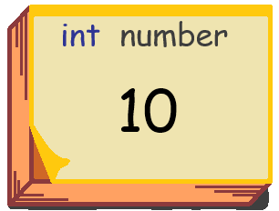
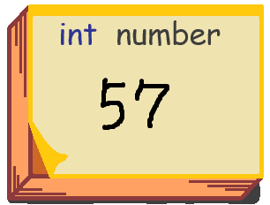
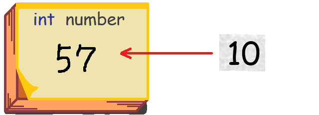
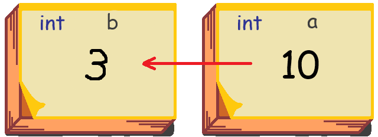
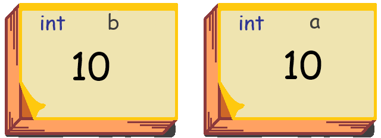
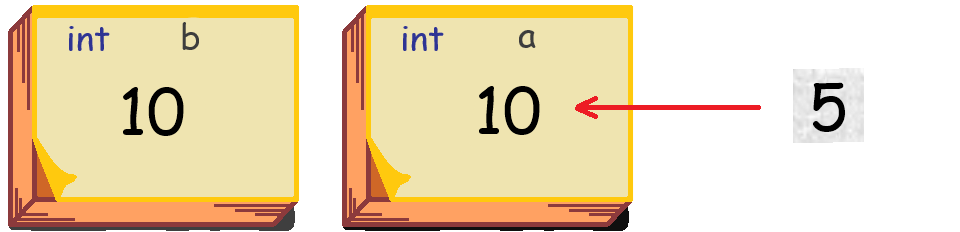
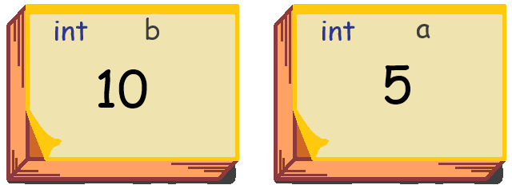

[C#言語2026 第02回]

# 変数と型

## キーポイント

* 「掛け算と割り算」は「足し算と引き算」より先に計算される
* 整数同士の割り算では、小数点以下は切り捨てられる
* メモリは「メモ帳」のようなもの。変数は「メモ帳に書かれたメモ」に当たる
* 「型」や「クラス」はデータの種類のことで、整数用の`int`(イント)、実数用の`float`(フロート)、<br>
  文章用の`string`(ストリング)などがある
* 変数を使うには「宣言(せんげん)」して「初期化」する必要がある<br>
  変数の宣言は次のように書く<br>
  &emsp;<code><span class="hljs-keyword">変数の型</span> 変数の名前 = 初期値;</code>
* 変数にデータを書き込む(代入する)には、`=`(イコール)記号を使って次のように書く<br>
  &emsp;<code>変数 = 数値、文章、別の変数など;</code>

## 1 四則演算

### 1.1 計算に使う記号

C#言語で利用できる文字は、キーボードに印字されている範囲に限られます。そのため、普段書いているものとは違う書きかたになる場合があります。

例えば、普段、掛け算や割り算を書くときは、`✕`や`÷`といった記号を使います。<br>
しかし、キーボードにはこれらの記号がありません。そこで、代わりに次の記号を使います。

| 計算 | 数学 | プログラム | 読み方 |
|:----:|:----:|:--------:|:-------|
| 足し算 | <font size=3>＋</font>  | <font size=3>＋</font> | プラス |
| 引き算 | <font size=3>ー</font>  | <font size=3>ー</font> | マイナス |
| 掛け算 | <font size=3>✕</font> | <font size=3>＊</font> | アスタリスク |
| 割り算 | <font size=3>÷</font> | <font size=3>/</font> | スラッシュ |

**コード**

```c#
Console.WriteLine(1 + 2);   // 3
Console.WriteLine(3 - 4);   // -1
Console.WriteLine(11 * 12); // 132
Console.WriteLine(13 / 4);  // 3
```

**実行結果**<br>
&emsp;3<br>
&emsp;-1<br>
&emsp;132<br>
&emsp;3

これらの計算に使う記号`+`, `-`, `*`, `/`は、「算術演算子(さんじゅつえんざんし)」と呼ばれます。

>`Console.WriteLine`(コンソール・ライトライン)は、文章や計算結果を画面に出力する命令です。

### 1.2 計算の優先順位

計算には優先順位があります。優先順位は、算数や数学と同じです。<br>
つまり、掛け算、割り算が先におこなわれ、そのあとで足し算、引き算がおこなわれます。

**コード**

```c#
Console.WriteLine(1 + 2 * 3 - 4 / 2);
```

**実行結果**<br>
&emsp;5

部分的に先に計算させたい場合は、その部分を`()`「丸カッコ」で囲みます。

**コード**

```c#
Console.WriteLine(1 + (2 * 3 - 4) / 2);
```

**実行結果**<br>
&emsp;2

<div style="page-break-after: always"></div>

数学では外側のカッコには`{}`「中カッコ」や`[]`「大カッコ」を使いますが、C#言語では全部`()`「丸カッコ」を使います。

**コード**

```c#
Console.WriteLine(1 + (2 * (3 - 4)) / 2); 
```

**実行結果**<br>
&emsp;0

なお、足し算と引き算、または掛け算と割り算のように、優先順位が同じ場合は、式の左側にある部分が優先されます。これは、次に説明する「整数と実数」が混ざった式で重要になります。

**コード**

```c#
Console.WriteLine(3 / 2 * 2); // (3 / 2) * 2 と同じ
```

**実行結果**<br>
&emsp;2

>**その他の演算子の優先順位**<br>
>C#言語の計算ではさまざまな記号が使われますが、その全てに優先順位が定められています。

### 1.3 整数と実数

C#言語では「整数」と「実数」を区別します。例えば、`3`や`4`のように「小数部を持たない数値」は「整数」になります。それに対して、`13.0`のように「小数部を持つ数字」は「実数」になります。

整数と実数の違いは、おもに「割り算」であらわれます。<br>
例えば、以下のプログラムの`13 / 4`は「整数同士の割り算」となるので、答えは整数の`3`になります(小数点以下は切り捨て)。<br>
しかし、`13.0 / 4`や`13 / 4.0`は「実数と整数の割り算」となるので、答えは実数の`3.25`になります。

**コード**

```c#
Console.WriteLine(13 / 4);     // 3
Console.WriteLine(13.0 / 4);   // 3.25
Console.WriteLine(13 / 4.0);   // 3.25
Console.WriteLine(13.0 / 4.0); // 3.25
Console.WriteLine(13.0 / (13 / 3)); // 3.25
```

**実行結果**<br>
&emsp;3<br>
&emsp;3.25<br>
&emsp;3.25<br>
&emsp;3.25<br>
&emsp;3.25

整数と実数では「実数が優先」されます。式に実数があらわれると、それ以降の計算は実数で行われます。

上記の最後の`13.0 / (13 / 3)`という式の場合、`(13 / 3)`の部分は「整数同士の割り算」なので、答えは整数の`4`になります。<br>
その後`13.0 / 4`が実行されますが、これは「実数と整数の割り算」なので、答えは`3.25`となります。

### 1.4 剰余(じょうよ)

整数の割り算では「あまり」が切り捨てられます。では「あまり」が知りたい場合はどうしたらよいでしょう。<br>
答えは「`%`(パーセント)記号を使う」です。

割り算の`/`記号の代わりに`%`記号を使うと、「割ったあまり」を計算できます。

**コード**

```c#
Console.WriteLine("13 / 4 = " + (13 / 4) + "あまり" + (13 % 4));
```

**実行結果**<br>
&emsp;13 / 4 = 3あまり1

`%`記号も算術演算子です。

#### 負の数のあまり

`-8 % 3`のように、「割られる数が負の数」の場合、「あまり」は以下のように計算されます。

>あまり = -(割られる数の絶対値 % 割る数の絶対値)

例えば、`-8 % 3`の場合は`-(8 % 3) = -2`となります。割る数の正負は無視されるので、`-8 % -3`の場合も`-(8 % 3) = -2`となります。

<div style="page-break-after: always"></div>

<pre class="tnmai_assignment">
<strong>【課題01 体力を計算する】</strong>
Visual Studioでプロジェクト<code>RPGBattle</code>を開き、
次のように、プレイヤーと敵の体力を計算で決めるようにしなさい。

 Console.OutputEncoding = System.Text.Encoding.UTF8;
 Console.WriteLine("Hello, Mai!");

 Random rand = new();

<code class="hljs-deletion">-int playerHP = 20;</code>
<code class="hljs-addition">+int playerHP = rand.Next(5) * 2 + 14;</code>

 string enemyName = "殺人ウサギ";
<code class="hljs-deletion">-int enemyHP = 16;</code>
<code class="hljs-addition">+int enemyHP = rand.Next(4) * 2 + 13;</code>
 Console.WriteLine(enemyName + "が現れた！");
 Console.WriteLine("+----+");
 Console.WriteLine("| 🐰 |");
 Console.WriteLine("+----+");
</pre>

<div style="page-break-after: always"></div>

## 2 変数

変数は「プログラムが必要とするデータを扱う」機能です。コンピューターの中には「メモリ」という「電子的なメモ帳」があります。このメモ帳のページにラベル(名前)を付けると、プログラムからはそのページが「変数」として使えるようになります。

つまり、変数は **名前の付いたメモ** といえます。以下の画像は、メモ用紙に`number`というラベルを付けて、`10`という数字を書き込んだ状態をあらわしています。

<p align="center"></p>

プログラムからは、`number`という名前を使って、このメモ用紙に書き込んだり、メモに書かれた内容を読み出すことができます。

### 2.1 宣言

変数を使うには、最初に変数を「宣言(せんげん)」する必要があります。変数の宣言は次のように書きます。

&emsp;<code><span class="hljs-keyword">変数の型</span> 変数の名前 = 初期値;</code>

変数の「型(かた)」は、「データの種類」のことです。例えば`int`(イント)型は「整数」、`string`(ストリング)型は文章が扱えます。そして、「変数の名前」のことを「変数名(へんすうめい)」と言います。

次のプログラムでは、「型が`int`」「ラベルが`number`」の変数を宣言し、「整数の`57`」を割り当てています。

&emsp;<code><span class="hljs-keyword">int</span> number = 57;</code>

<p align="center"></p>

<div style="page-break-after: always"></div>

### 2.2 代入

変数にデータを割り当てなおすには、`=`(イコール)記号を使って次のように書きます。

&emsp;<code>number = 10;</code>

<div align="center"><br>
↓&emsp;&emsp;&emsp;&emsp;&emsp;&emsp;&emsp;&emsp;&emsp;&emsp;&emsp;<br>
&emsp;&emsp;&emsp;&emsp;&emsp;&emsp;&emsp;&emsp;&emsp;&emsp;&emsp;</div>

これで`number`という名前の変数に`10`が書き込まれます。<br>
このような`=`による割り当てを「代入(だいにゅう)」といいます。<br>
また、変数に書き込む数値や文章のことを、「データ」または「値（あたい）」といいます。

>**【C#の=記号は「代入」だけ】**<br>
> 算数や数学では`=`記号を「代入」と「等しい」の２つの意味で使います。しかし、C#の`=`記号の意味は「代入」だけです。「等しい」という意味を表すには`==`を使う必要があります。

### 2.3 読み出し

変数を代入以外の場所で使うと、変数に書き込まれたデータが読み出されます。<br>
例えば、変数`number`にメモした値(あたい)をコンソールに表示するには、次のように書きます。

**コード**

```c#
Console.WriteLine(number); // 変数 number に割り当てたデータが読み出され、 10 が表示される
```

**実行結果**<br>
&emsp;10

変数の値(あたい)を読み書きすることを「変数にアクセスする」ということもあります。

<div style="page-break-after: always"></div>

### 2.4 変数を代入するとコピーされる

`変数1 = 変数2;`のように書いた場合、変数の値(あたい)そのものがコピーされます。<br>
その後、どちらかの変数の値(あたい)が変更されても、もう片方の変数は影響を受けません。

**コード**

```c#
int a = 10;
int b = 3;
b = a; // a の値がコピーされ、 b に 10 が代入される
a = 5; // a の値は5に書き換わるが、 b は 10 のまま
Console.WriteLine("a=" + a); // 5 が表示される
Console.WriteLine("b=" + b); // 10 が表示される
```

**実行結果**<br>
&emsp;a=5<br>
&emsp;b=10

`b = a`というプログラムは、 **変数 a の内容を、変数 b に上書きする** ものだと考えてください。

<p align="center">&emsp;&emsp;&emsp;&emsp;<br>
↓&emsp;&emsp;&emsp;&emsp;<br>
&emsp;&emsp;&emsp;&emsp;<br>
↓&emsp;&emsp;&emsp;&emsp;<br>
&emsp;&emsp;&emsp;&emsp;&ensp;<br>
↓&emsp;&emsp;&emsp;&emsp;<br>
&emsp;&emsp;&emsp;&emsp;</p>

<div style="page-break-after: always"></div>

### 2.5 複数の変数を同時に宣言する

`,`(カンマ)記号を使うことで、複数の変数を同時に宣言することもできます。

**コード**

```c#
int a = 10, b = 5;

Console.WriteLine(a); // 10 が表示される
Console.WriteLine(b); // 5 が表示される
```

**実行結果**<br>
&emsp;10<br>
5

`int a = 10, b = 5`の部分は、次のように行を分けて書いた場合と同じ意味になります。

```c#
int a = 10;
int b = 5;
```

### 2.6 計算と代入をまとめて行う演算子

「ある変数に何かを足したり引いたりしたい」ということはよくあります。これは次のように書くことができます。

```c#
int a = 2;
a = a + 5;
Console.WriteLine(a); // 7 が表示される
```

`a = a + 5`は、「変数`a`を読み出した値に`5`を足して、計算結果を`a`に代入する」という意味です。

このようなことはよくあるので、次のように計算と代入をまとめて行う演算子が用意されています。

```c#
a += 5; // a = a + 5;と同じ
```

これは「複合代入演算子(ふくごう・だいにゅう・えんざんし)」といって、四則演算の記号に続けて等号記号`=`を書きます。演算記号と`=`記号のあいだに **空白を入れてはいけない** 点に注意してください。

この書き方のいいところは、「変数名を1回書くだけで済むため、変数名を間違えることがない」という点です。

それから、数を数えるために`1`を足したり引いたりする、ということもよくあります。<br>
この用途のために、「インクリメント演算子」と「デクリメント演算子」が用意されています。

```c#
a++; // a = a + 1; と同じ
a--; // a = a - 1; と同じ
```

>「インクリメント」は「増やす」、「デクリメント」は「減らす」という意味です。

### 2.7 変数名のルール

変数名はかなり自由に決められますが、次に示すルールを守る必要があります。<br>
変数名がひとつでもこのルールに違反する場合、コンパイルエラーになります。

1. 変数名に使える文字は英数字と`_`(アンダーバー)だけ(※`_`以外の記号(`-`や`@`など)は使えません)
2. 最初の文字は英字または`_`(アンダーバー)でなくてはならない(※数字で始まる名前は使えません)
3. C#のキーワードではない(※「キーワード」は、C#で予約されている`int`や`for`などの単語です)
4. 同じ名前の変数は作れない

以下のような名前はエラーになります(変数名にできません)。

```c#
int 10count; // 数字で始まる名前にはできない
int na+me;   // 変数名に + を使うことはできない
int int;     // int はキーワードなので変数名にできない
```

以下のような名前はエラーになりません(変数名にできます)。

```c#
int count10;  // 2文字目以降は数字にできる
int na_me;    // アンダーバーは変数名に使える
int Int;      // 大文字と小文字は区別されるので、 int と Int は違う名前になる
```

キーワードには一般的な英単語も含まれているので、変数名を決めようとして「え、これキーワードなの？」となる場合があります。その場合は別の名前を付けてください。

また、既に同じ名前の変数がある場合、その名前は使えません。別の名前を付けてください。

```c#
int a = 0;
int a = 5; // この行でコンパイルエラーになる
```

>「スコープ」という機能を使うと同じ名前の変数を宣言できます。スコープについては別の回に説明します。

### 2.8 変数名の決めかた

変数名は、ここまでに示したルールに従うかぎり自由に決められます。<br>
といっても、慣れないうちは、どんな名前を付けたらいいか迷うことが多いと思います。

基本的には、「変数に代入する情報を意味する単語」を名前にします。<br>
英単語が望ましいですが、思いつかない場合は日本語のローマ字表記でも構いません。

以下に、いくつか例を挙げます。

| 情報 | 変数の名前(英語) | 変数の名前(ローマ字) |
|:-----|:-----------------|:---------------------|
| 人やモノの数 | count, number | kazu, ninzu |
| 得点   | score | tokuten |
| 最大値 | maxValue | saidai |
| 最小値 | minValue | saisyo |
| 体力   | hitPoint, hp, health | tairyoku |
| 名前   | name | namae |

名前が全く思いつかない場合は、とりあえず`a`とか`b`などと名付けても構いません。<br>
また、AIに名前を提案してもらうのも良い方法です。

>単語の頭文字だけを使うこともあります。<br>
>例えば「数」をあらわす変数名に`n`(`number`の頭文字)を使うなどです。

<pre class="tnmai_assignment">
<strong>【課題02 攻撃力と防御力を追加する】</strong>
Visual Studioでプロジェクト<code>RPGBattle</code>を開き、
プレイヤーと敵に、攻撃力と防御力をあらわす変数を追加しなさい。

 // See https://aka.ms/new-console-template for more information
 Console.OutputEncoding = System.Text.Encoding.UTF8;
 Console.WriteLine("Hello, Mai!");

 Random rand = new();

 int playerHP = rand.Next(5) + 18;
<code class=hljs-addition>+int playerAttack = 7;  // プレイヤーの攻撃力</code>
<code class=hljs-addition>+int playerDefense = 3; // プレイヤーの防御力</code>

 string enemyName = "殺人ウサギ";
 int enemyHP = rand.Next(7) + 13;
<code class=hljs-addition>+int enemyAttack = 9;  // 敵の攻撃力</code>
<code class=hljs-addition>+int enemyDefense = 2; // 敵の防御力</code>
 Console.WriteLine(enemyName + "が現れた！");
</pre>

<pre class="tnmai_assignment">
<strong>【課題03 敵に与えるダメージを計算で決める】</strong>
敵に与えるダメージを「あなたの攻撃力 - 敵の防御力」の50%～100%の範囲でランダムに選ぶようにしたい。
敵(殺人ウサギ)に与えるダメージの計算方法を、次のように変更しなさい。

   Console.WriteLine("あなたの攻撃！");
   PlayWave("attack_1.wav");
   Thread.Sleep(500);
<code class=hljs-deletion>-  int damage = rand.Next(3) + 2;</code>
<code class=hljs-addition>+  int damage = playerAttack - enemyDdefense;</code>
<code class=hljs-addition>+  damage = (rand.Next(damage + 1) + damage) / 2;</code>
   Console.WriteLine(enemyName + "に" + damage + "点のダメージを与えた！");
   enemyHP = enemyHP - damage;
   Thread.Sleep(1000);

<code>rand.Next(damage + 1)</code>の部分で<code>damage</code>に1を足しているのは、
<code>damage</code>の値が選ばれるようにするためです。
</pre>

<pre class="tnmai_assignment">
<strong>【課題04 プレイヤーが受けるダメージを計算で決める】</strong>
敵からプレイヤーが受けるダメージの計算方法を、プレイヤーが敵に与えるダメージの計算方法と同じにしたい。
プレイヤーが受けるダメージの計算方法を、次のように変更しなさい。

   Console.WriteLine(enemyName + "の攻撃！");
   Thread.Sleep(500);
<code class=hljs-deletion>-  int enemyDamage = rand.Next(7) + 1;</code>
<code class=hljs-addition>+  int enemyDamage = enemyAttack - playerDefense;</code>
<code class=hljs-addition>+  enemyDamage = (rand.Next(enemyDamage + 1) + enemyDamage) / 2;</code>
   Console.WriteLine("あなたは" + enemyDamage + "点のダメージを受けた");
   playerHP = playerHP - enemyDamage;
   Thread.Sleep(1000);
</pre>

<div style="page-break-after: always"></div>

## 3 型(かた)

### 3.1 型とは

型(かた)は「データの種類」をあらわすプログラミング用語です。型ごとに「できること(機能)」が決まっています。<br>
例えば、`int`型は「整数の計算」ができます。`float`型は「実数の計算」ができます。<br>
C#には、整数をあらわす`int`以外にもさまざまな型があります。以下に、よく使われる型の一部を示します。

| データの種類 | 型の名前 | 読みかた       |  例 |
|:---------|:---------------|:-------------|:---|
| 整数(符号付き整数)     | int    | イント               | 0, 1, 842, -57, -99999999 |
| 正の整数(符号なし整数) | uint   | ユー・イント | 0, 1, 47, 9999999 |
| 実数（浮動小数点数）   | float  | フロート               | 0.0, 1.0, 3.14, 0.000001, -0.875 |
| 文字列                 | string | ストリング           | "abc", "Hello", "あいうえお" |
| 文字                   | char   | チャー、キャラ       | 'a', 'b', 'z', '@', '+', '#' |

>この表にない他の型については、必要になったときに改めて解説します。

`string`型は、`"abc"`や`"Hello, World"`のように、単語や文章を`"`(ダブルクォーテーション)記号で囲ったデータを代入できます。

`"`記号で囲ったデータのことを **文字列(もじれつ)** といいます(これまでは「文章」と呼んでいました)。

`char`型は、`'a'`や`'-'`のように、1つの文字を`'`(シングルクォーテーション)記号で囲ったデータを代入できます。

`'`記号で囲ったデータのことを **文字** といいます。

**コード**

```c#
// 変数の宣言
int a = 10;
float b = 0.5f;
string c = "Hello, World!";
char d = 'A';

Console.WriteLine(a); // 10 が表示される
Console.WriteLine(b); // 0.5 が表示される
Console.WriteLine(c); // Hello, World! が表示される
Console.WriteLine(d); // A が表示される
```

**実行結果**<br>
&emsp;10<br>
&emsp;0.5<br>
&emsp;Hello, World!<br>
&emsp;A<

#### float 型の実数は、最後に f を付ける

`float`型に実数を代入するときは、数値の後ろに文字`f`(エフ)を付けなくてはなりません。<br>
この`f`は`float`の頭文字です。

```c#
float a = 3.14f;
float b = 3.14F; // 大文字の F でも OK
```

最後に文字`f`が必要な理由は、C#の実数型は次のように３種類あって、どの型のデータなのかをはっきり示す必要があるからです。

| 型      | 読み方   | 最後に付ける文字 | 速度 | 精度 | 用途 |
|:-------:|:---------|:------:|:---|:---|:---|
| float   | フロート | f      | ◎ | ✕ | ゲーム |
| double  | ダブル   | (不要) | ○ | ○ | 科学技術計算 |
| decimal | デシマル | m      | ✕ | ◎ | 金融 |

表にあるように`double`型だけ何も付ける必要はありません。ですが、ゲームでは、速度にすぐれる`float`型が好まれます。本テキストでも基本的には`float`型を使うので、「最後の`f`」を忘れないようにしてください。

### 3.2 変数と文字列

「`"`(ダブルクォーテーション)記号で囲んだ単語」は文字列になり、変数とは区別されます。<br>
変数の値を表示したい場合は、`"`で囲まないでください。

**コード**

```c#
int number = 123;
Console.WriteLine(number);   // 変数のデータ 123 が表示される
Console.WriteLine("number"); // 文字列 number が表示される

string text = "This is a string.";
Console.WriteLine(text);     // 変数のデータ This is a string. が表示される
Console.WriteLine("text");   // 文字列 text が表示される
```

**実行結果**<br>
&emsp;123<br>
&emsp;number<br>
&emsp;This is a string.<br>
&emsp;text

### 3.3 異なる型を混ぜて計算する

数値を扱う型であれば、型が違っても混ぜて式を作れます。計算結果の型は「より大きな数値を表現できる側の型」になります。例えば、`int`型と`float`型の計算結果は`float`型になります。<br>
この機能を **型変換(かたへんかん)** といいます。

`string`型は少し特殊で、「加算」だけが可能です。減算や乗算、除算はできません。<br>
`string`型同士を加算すると、2つの文字列をつなげた新しい文字列が作られます。`string`以外の型を加算すると、その型の値は文字列に変換されます。

**コード**

```c#
int i = 31;
float d = 1.5f;
string s = "20";
string t = "25";

Console.WriteLine(i + d);     // 32.5 が表示される
Console.WriteLine(i / 2);     // 15 が表示される(小数点以下切り捨て)
Console.WriteLine(i * d / 2); // 23.25 が表示される(小数点以下も残る)
Console.WriteLine(s + t);     // 2025 が表示される
```

**実行結果**<br>
&emsp;32.5<br>
&emsp;15<br>
&emsp;23.25<br>
&emsp;2025

計算の途中に`float`型のデータが入ってくるかどうかで、小数点以下を切り捨てるかどうかが変わってきます。

<div style="page-break-after: always"></div>

文字列と`string`型は加算しかできません。引き算や掛け算、割り算をしようとするとエラーになります。

**コード**

```c#
Console.WriteLine(123);           // OK. 数値 123 が(文字列に変換されて)表示される
Console.WriteLine(123 + 123);     // OK. 246 が表示される
Console.WriteLine(123 - 123);     // OK. 0 が表示される
Console.WriteLine("123");         // OK. 文字列 123 が直接表示される
Console.WriteLine("123" + 123);   // OK. 数値 123 が文字列に変換され、 123123 が表示される
Console.WriteLine(123 + "123");   // OK. これも 123123 が表示される
//Console.WriteLine("123" - 123); // エラー. 文字列は引き算できない
//Console.WriteLine(123 - "123"); // エラー. 文字列は引き算できない
```

**実行結果**<br>
&emsp;123<br>
&emsp;246<br>
&emsp;0<br>
&emsp;123<br>
&emsp;123123<br>
&emsp;123123

### 2.3 異なる型同士の代入

変数の型と、代入するデータの種類が違っていると、エラーになる場合があります。<br>
異なる型同士の代入でも型変換が発生します。変換できない型同士の代入はエラーになります。

**コード**

```c#
//int i = 1.5f;  // エラー. 実数は int に代入できない
float d = 10;  // OK. 整数は float に代入できる
//int j = "abc"; // エラー. 文字列は int や float には代入できない
//string s = 10; // エラー. 整数や実数は string に代入できない
```

このように、型が違うと大抵はエラーになります。唯一、`int`型を`float`型に代入することだけが可能です。
しかし、どうしても代入が必要な場合は、次のように変数名の前に`(int)`と書きます。

```c#
int a = (int)1.5f; // OK. int 型に強制的に変換して代入
Console.WriteLine(a); // 1 が出力される( 1.5 ではない)
```

このように、`(型の名前)データ`と書くと、データを`()`内に書いた「型」に変換できます。<br>
この、「`()`を使って型を変換する」方法を **キャスト** といいます。

変換先の型で表現できない部分は切り捨てられます。例えば、`int`型は小数点以下を表現できません。<br>
そのため、`(int)1.5f`と書いた場合、変換後のデータは、小数点以下が切り捨てられて`1`になります。

キャストできる型は、基本的には`int`や`float`のような数値型だけです。<br>
例えば、`string`型は`int`型にキャストできません。

```c#
//int a = (int)"あああ";   // エラー. 文字列は int にキャストできない
//string b = (string)123; // エラー. 数値型は string にキャストできない
```

文字列と数値の変換には、キャストの代わりに専用の命令が用意されています。

>正確には、キャストできるのは「表現可能な範囲が重複する型」です。例えば、`int`と`float`はどちらも整数を表現できるのでキャスト可能です。しかし、`int`は文字列を表現できないので、`string`にキャストできません。

### 3.4 文字列を数値に変換する

文字列に数値が書かれている、つまり`"123"`のような場合は、`int.Parse`(イント・パース)命令を使うことで`int`型に変換できます。

>`Parse`(パース)は「解析する」という意味です。

```c#
string s = "123";
int a = int.Parse(s);

Console.WriteLine(a); // 123 が表示される
```

`float`型に変換したい場合は`float.Parse`(フロート・パース)を使います。

```c#
string s = "1.23";
float a = float.Parse(s);

Console.WriteLine(a); // 1.23 が表示される
```

<div style="page-break-after: always"></div>

例えば、`Console.ReadLine`命令の結果は文字列です。<br>
計算に使いたい場合は`int.Parse`命令で`int`型に変換する必要があります。

```c#
string s = Console.ReadLine();
int a = int.Parse(s);
```

なお、このプログラムは次のように、1行にまとめることもできます。

```c#
int a = int.Parse( Console.ReadLine() );
```

### 3.5 数値を文字列に変換する

`int`や`float`を文字列にしたい場合は、変数に対して`.ToString`(ドット・トゥ・ストリング)命令を使います。

```c#
int a = 456;
float b = 1.23;
string s = a.ToString(); // 変数 a に対して .ToString を使う
string t = b.ToString(); // 変数 b に対して .ToString を使う

Console.WriteLine(s); // 456 が表示される
Console.WriteLine(t); // 1.23 が表示される
```

ただし、`+`記号を使って、文字列と数値を組み合わせて表示する場合、数値は自動的に文字列に変換されます。

```c#
int a = 57;
string s = "数値=";
Console.WriteLine(s + a); // 数値=57が表示される
```

とりあえずは、「文字列にしようとしてエラーになったら`.ToString`を使う」という方針でいいと思います。

<div style="page-break-after: always"></div>

### 3.6 定数

変数を宣言するとき、型の前(または後ろ)に`const`(コンスト)キーワードを付けると、その変数は変更不能な「定数(ていすう)」になります。

>`const`は`constant`(コンスタント、「変化しない、継続的な」という意味)の省略形です。

定数は上書きできません。定数にデータを代入しようとするとエラーになります。

```c#
const int ca = 10; // 定数を宣言して初期化
const int cb = ca; // OK. 定数は、定数で初期化できる
//ca = 5;          // エラー. 定数には代入できない
//cb += 1;         // エラー. これは(cb = cb + 1)と同じ. 定数には代入できない

int a = ca;        // OK. 定数は、変数の初期化に使える
a = ca;            // OK. 定数は、変数に代入できる
a += cb;           // OK. (a = a + cb)と同じ. 変数には代入できる

//const int cc = a; // エラー. 変数は、定数の初期化には使えない
```

定数は、書き換えられると困るデータをあらわすために使います。<br>
例えば、得点の最大値は`const int maxScore = 100;`とあらわすことができます。

**コード**

```c#
Console.WriteLine("得点を入力して下さい");
int score = int.Parse(Console.ReadLine());

// 得点が最大値より大きい場合、最大値にする
const int maxScore = 100;
if (score > maxScore) {
   score = maxScore;
   //maxScore = score; // const を付けておくと、こういう書き間違いをしてもエラーになる
}

Console.WriteLine("score:" + score);
```

**実行例（１）**<br>
&emsp;得点を入力して下さい<br>
&emsp;123<br>
&emsp;score:100

**実行例（２）**<br>
&emsp;得点を入力して下さい<br>
&emsp;99<br>
&emsp;score:99

`const`を付けておけば、間違えて`maxScore`を上書きしようとするとエラーになります。つまり、「バグを未然に防げる」のです。

<pre class="tnmai_assignment">
<strong>【課題05 絵文字もstring】</strong>
敵の絵文字を、<code>string</code>型の変数であらわすように、プログラムを変更しなさい。
敵の絵文字は、自分で決めた絵文字で置き換えること。

 int playerHP = rand.Next(5) + 18;
 int playerAttack = 7;  // プレイヤーの攻撃力
 int playerDefense = 3; // プレイヤーの防御力

 string enemyName = "殺人ウサギ";
<code class="hljs-addition">+string enemyIcon = "🐰";</code>
 int enemyHP = rand.Next(7) + 13;
 int enemyAttack = 9;  // 敵の攻撃力
 int enemyDefense = 2; // 敵の防御力

 Console.WriteLine(enemyName + "が現れた！");
 for (; ; )
 {
   Console.WriteLine("+----+");
<code class="hljs-deletion">-  Console.WriteLine("| 🐰 |");</code>
<code class="hljs-addition">+  Console.WriteLine("| " + enemyIcon + " |");</code>
   Console.WriteLine("+----+");

</pre>

<div style="page-break-after: always"></div>

<pre class="tnmai_assignment">
<strong>【課題06 いろいろな敵】</strong>
敵の種類をランダムに変えるプログラムを追加しなさい。
敵の絵文字は、自分で決めた絵文字で置き換えること。

 string enemyName = "殺人ウサギ";
 string enemyIcon = "🐰";
 int enemyHP = rand.Next(7) + 13;
 int enemyAttack = 9;  // 敵の攻撃力
 int enemyDefense = 2; // 敵の防御力

<code class="hljs-addition">+// 敵の種類をランダムに決める
+int enemyKind = rand.Next(3); // 0, 1, 2 をランダムに決定
+if (enemyKind == 1)
+{
+    enemyName = "オオカミ";
+    enemyIcon = "🐺";
+    enemyHP = rand.Next(9) + 10;
+    enemyAttack = 7;
+    enemyDefense = 3;
+}
+</code>
 Console.WriteLine(enemyName + "が現れた！");
 for (; ; )
 {

</pre>

<pre class="tnmai_assignment">
<strong>【課題07 いろいろな敵(その２)】</strong>
課題06を参考にして、<code>enemyKind</code>(エネミー・カインド)が<code>2</code>の場合に、
殺人ウサギとオオカミ以外の敵データを設定するプログラムを追加しなさい。
</pre>
