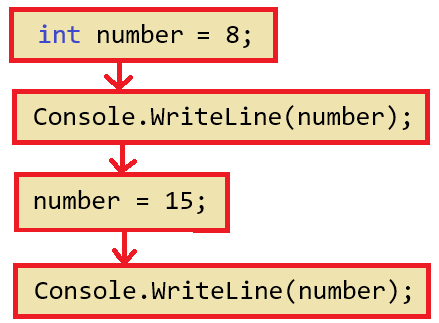
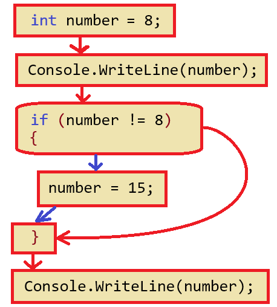
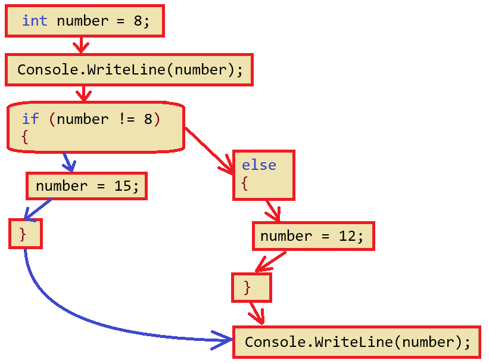
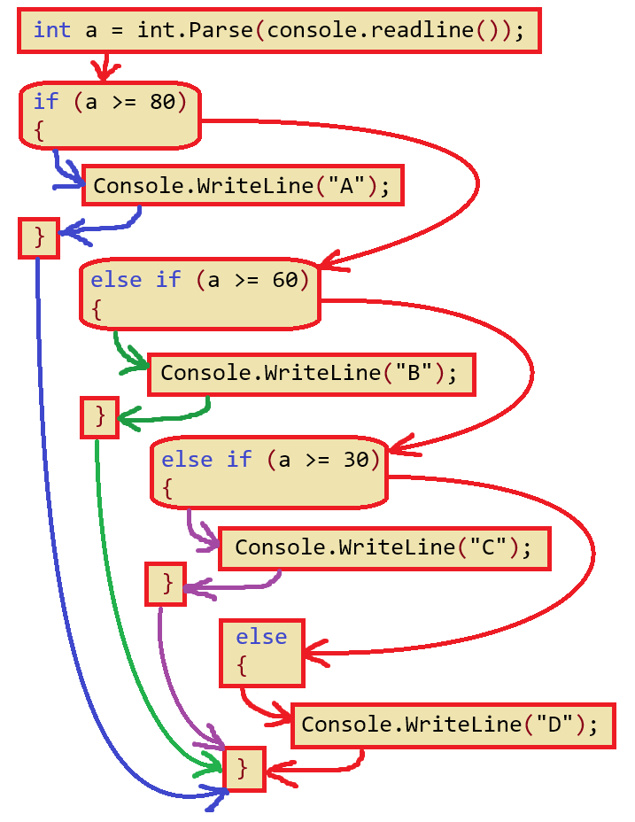

[C#言語2026 第04回]

# プログラムの実行順序とスコープ

## キーポイント

* プログラムは上から下に向かって、順番に実行される
* if文やelse句を使うと、プログラムの流れを分岐し、その中からひとつの流れを選べるようになる
* if文では、より厳しい条件を先にチェックする
* `{`と`}`で囲われた範囲を「ブロック」という
* 変数が使える範囲を「スコープ」という
* スコープは、「変数の宣言」で始まり、「同じレベルのブロックの`}`」で終わる

## 1 プログラムの実行順序

### 1.1 プログラムは上から下に向かって順番に実行される

プログラムは上から下に向かって、順番に実行されます。改めて、以下のプログラムで確認してみましょう。

**コード** 1

```c#
int number = 8;

Console.WriteLine(number);

number = 15;

Console.WriteLine(number);
```

**実行結果**<br>
&emsp;8<br>
&emsp;15

<div style="page-break-after: always"></div>

このプログラムの実行順は、次のようになります。

<div align="center"></div>

`number`には最終的に`15`が代入されます。しかし、最初の`WriteLine`の時点では、まだ`8`が代入された状態です。そのため、まず`8`が出力され、次に`15`が出力されるのです。

このように、プログラムは、上から下に向かって順番に実行されます。

### 1.2 if文は流れを2つに分岐する

if文を使うと、プログラムに2つの流れを作り出せます。

**コード** 2

```c#
int number = 8;

Console.WriteLine(number);

if (number != 8) // if文を追加
{
  number = 15;
}

Console.WriteLine(number);
```

**実行結果**<br>
&emsp;8<br>
&emsp;8

<div style="page-break-after: always"></div>

このプログラムの実行順は、次のようになります。

<div align="center"></div>

if文から、赤色と青色の２つの矢印が出ている点に注目してください。<br>
下に向かう<font color="darkblue">**青色**</font>の矢印は「`number`変数が`8`と **等しくない**」の場合の流れです。<br>
右に出ている<font color="red">**赤色**</font>の矢印は「`number`変数が`8`と **等しい**」場合の流れです。

さて、このプログラムは最初に、`number`変数を`8`で初期化しています。<br>
そして、if文の条件式は「`number`が`8`以外」です。そのため、if文の流れは赤色の矢印をたどります。

この赤色の流れでは、`{}`の内側にある`number = 15;`の行は飛ばされます。<br>
ですから、`number`変数は最後まで`8`のままです。

次に、else句を使ったプログラムを見てみます。

**コード** 3

```c#
int number = 8;

Console.WriteLine(number);

if (number != 8)
{
  number = 15;
}
else // else句を追加
{
  number = 12;
}

Console.WriteLine(number);
```

**実行結果**<br>
&emsp;8<br>
&emsp;12

このプログラムの実行順は、次のようになります。

<div align="center"></div>

「`number`変数が`8`と **等しい**」の場合の<font color="red">**赤色**</font>の矢印が、else句につながっている点に注目してください。

このように、 **if文使うと、プログラムの流れの一部を飛ばす** ことができます。<br>
また、 **else句を使うと、プログラムの流れを2つに分ける** ことができます。

<div style="page-break-after: always"></div>

### 1.3 3つ以上の分岐を作る

else if文を使うと、3つ以上の分岐を作り出せます。

以下のプログラムは、入力された成績を4段階で評価し、評価結果を出力します。<br>
このプログラムでは、else if文を使って、4つの「プログラムの流れ」を作り出しています。

**コード** 4

```c#
int a = int.Parse(console.readline());

if (a >= 80)
{
  Console.WriteLine("A");
}
else if (a >= 60)
{
  Console.WriteLine("B");
}
else if (a >= 30)
{
  Console.WriteLine("C");
}
else
{
  Console.WriteLine("D");
}
```

このプログラムを実行し、80点、30点、60点、29点を入力した結果は、次のようになります。

**実行結果**<br>
&emsp;80<br>
&emsp;A

&emsp;30<br>
&emsp;C

&emsp;60<br>
&emsp;B

&emsp;29<br>
&emsp;D

<div style="page-break-after: always"></div>

そして、このプログラムの実行順は、次のようになります。

<div align="center"></div>

このプログラムの流れでは、以下の点に注目してください。

* 入力された点数によって、流れの変わる場所が異なる
* if文の条件が真になった場合、流れがプログラムの終わりまで一気に飛んでいる

ここまでの図から分かるように、if文を使うと「プログラムに複数の流れを作り、条件によって進む流れを変える」ことができます。しかし、「上から下へ」という流れ自体は変えられません。

<div style="page-break-after: always"></div>

### 1.4 より厳しい条件を先に調べる

同じデータを何度も調べる場合、「より厳しい条件を先に判定しなくてはならない」という点に注意してください。例えば、前のプログラムでは、点数を80点以上、60点以上、30点以上の順で判定していました。<br>
対して、次のプログラムは、30点以上、60点以上、80点以上の順で判定します。

**コード** 5

```c#
int a = int.Parse(Console.ReadLine());

if (a >= 30)
{
  Console.WriteLine("C");
}
else if (a >= 60)
{
  Console.WriteLine("B");
}
else if (a >= 80)
{
  Console.WriteLine("A");
}
else
{
  Console.WriteLine("D");
}
```

すると、実行結果は次のようになります。

**実行結果**<br>
&emsp;80<br>
&emsp;C

&emsp;30<br>
&emsp;C

&emsp;60<br>
&emsp;C

&emsp;29<br>
&emsp;D

80点と60点が、30点と同じ「C評価」に変わっている点に注目してください。「プログラムは上から順番に実行される」ので、最初の判定は`a >= 30`です。その結果、30点以上の得点はすべて「C評価」になってしまいます。

**より厳しい条件を先に調べる** ようにすれば、「下側のelse if文が実行されない」問題を防げます。

### 1.5 論理演算子

論理演算子を使うと、条件式の中に、もっと複雑な条件を書くことができます。

| 演算子 | 意味 | 数学的な意味 |
|:------------------:|:-----|:----|
| 条件式1 && 条件式2 |  条件式1と条件式2の両方が真 | 共通部分 |
| 条件式1 \|\| 条件式2 | 条件式1と条件式2の少なくとも片方が真 | 和集合 |
| !(条件式)          | 条件式が偽 | 補集合 |

`&&`(アンド・アンド)演算子は「論理積(ろんりせき)演算子」と呼ばれ、２つの条件式がどちらも真のときだけ真となります。

`||`(オア・オア)演算子は「論理和(ろんりわ)演算子」と呼ばれ、どちらか片方が真、または両方とも真の場合に真となります。

`!`(ノット、通称「びっくり」)演算子は「論理否定(ろんりひてい)演算子」と呼ばれ、条件式の意味を逆にします。例えば、`!(x == y)`は`x != y`と同じ意味になります。

これらの演算子は、高校数学の「共通部分(`&&`)」「和集合(`||`)」「補集合(`!`)」に対応します。

**コード** 6

```c#
Console.WriteLine("1～10の数字を2つ入力してください";

int x = int.Parse(Console.ReadLine());
int y = int.Parse(Console.ReadLine());

if (!(x == y))
{
  Console.WriteLine("xとyは等しくない");
}

if (x == 10 && y == 10)
{
  Console.WriteLine("xとyは10");
}

if (x == 0 || y == 0)
{
  Console.WriteLine("xかyは0");
}

Console.WriteLine("終了");
```

<div style="page-break-after: always"></div>

**実行例（１）**<br>
&emsp;1～10の数字を2つ入力してください<br>
&emsp;1<br>
&emsp;2<br>
&emsp;xとyは等しくない<br>
&emsp;終了

**実行例（２）**<br>
&emsp;1～10の数字を2つ入力してください<br>
&emsp;10<br>
&emsp;10<br>
&emsp;xとyは10<br>
&emsp;終了

**実行例（３）**<br>
&emsp;1～10の数字を2つ入力してください<br>
&emsp;10<br>
&emsp;0<br>
&emsp;xかyは0<br>
&emsp;終了

また、論理演算子を2回以上使うと、さらに複雑な条件を書くことができます。<br>
例えば「`a`と`b`と`c`と`d`が等しい」という条件は、次のように書けます。

```c#
if (a == b && a == c && a == d)
{
  Console.WriteLine("aとbとcとdは等しい");
}
```

>**【a == b == cのようには書けない】**<br>
>C#言語では、数学のように`a == b == c`や`a < b < c`とは書けません。これらの式は、論理演算子を使って`a == b && b == c`や`a < b && b < c`のように書き直す必要があります。

<div style="page-break-after: always"></div>

大抵の場合、論理演算子と同じ条件は、多重if文や`else if`を使っても実現できます。<br>
例えば、`&&`演算子は多重if文で書き換え可能です。以下の2つプログラムは、同じ条件をあらわしています。

```c#
// &&演算子を使う書きかた
if (x == 10 && y == 10)
{
  Console.WriteLine("xとyは10");
}

// 多重if文を使う書きかた
if (x == 10)
{
  if (y == 10)
  {
    Console.WriteLine("xとyは10");
  }
}
```

また、`||`演算子はelse if文で書き換え可能です。

```c#
// ||演算子を使う書きかた
if (x == 0 || y == 0)
{
  Console.WriteLine("xかyは0");
}

// else if文を使う書きかた
if (x == 0)
{
  Console.WriteLine("xかyは0");
}
else if (y ==  0)
{
  Console.WriteLine("xかyは0");
}
```

基本的には、論理演算子を使うほうがプログラムを短く書けます。<br>
ですが、多重if文やelse if文のほうが、分かりやすく書ける場合もあります。うまく使い分けてください。

>**【自分に合った書きかたを優先する】**<br>
>論理演算子に慣れないうちは、多重if文やelse if文のほうが分かりやすいかもしれません。<br>
>まずは、自分のやりやすい書きかたを優先してください。<br>
>使い分けを覚えるのは、もっとプログラミングに慣れてからでも遅くありません。

<div style="page-break-after: always"></div>

## 2 ブロックとスコープ

### 2.1 ブロック

if文が実行するプログラムは、`{`と`}`で囲われています。<br>
この、`{`と`}`で囲われた部分のことを **ブロック** といいます。

また、プログラム全体も「見えない`{`と`}`」に囲まれたブロックになっています。<br>
この「プログラム全体を囲むブロック」を **メイン・ブロック** といいます。

ブロックの機能は、変数の「有効範囲」を制御することです。<br>
ブロック内で宣言した変数は、そのブロックの終わりで削除されます。

ブロックの例を見てみましょう。

**コード** 7

```c#
string a = "Mainのa";   // Mainブロックの変数 a
Console.WriteLine(a);   // 「Mainブロックの変数 a 」を出力

if (a == "Mainのa")
{ // ←この { で、if文のブロックが開始される

  string b = "ifのb";   // if文ブロックの変数 b
  Console.WriteLine(b); // 「if文ブロックの変数 b 」を出力

} // ←ここでif文ブロックが終わり、「if文ブロックの変数 b 」が削除される

Console.WriteLine(a);   // 「Mainブロックの変数 a 」を出力
//Console.WriteLine(b); // エラー. ifのb は削除されているので使えない

// ←プログラムの最後でMainブロックが終わり、「Mainブロックの変数a」が削除される
```

**実行結果**<br>
&emsp;Mainのa<br>
&emsp;ifのb<br>
&emsp;Mainのa

このプログラム例では、Mainブロックの中に、if文のブロックを作成しています。

Mainブロックで宣言した`string`型の変数`a`は、Mainブロックが続く限り有効です。

そのあとのif文のブロックでは、`string`型の変数`b`を宣言しています。プログラムの実行が進んでif文ブロックの終りを示す`}`に到達すると、「if文ブロックで宣言した変数`b`」が削除されます。<br>
この`}`より下では、もう変数`b`は使えません。

ブロックはプログラムに階層構造を作ります。上記のプログラムの場合、最上位のMainブロックはレベル(階層)1、レベル1のすぐ内側にあるifブロックはレベル2になります。

### 2.2 スコープ

「変数の使える範囲」のことを「スコープ」といいます(スコープは「範囲」という意味)。<br>
例えば、ブロック内で宣言した変数を、ブロックの外で使おうとするとエラーになります。

**コード** 8

```c#
string a = "Mainのa";   // Mainブロックの変数 a
Console.WriteLine(a);   // 「Mainブロックの変数 a 」を出力

if (a == "Mainのa")
{ // ←この { で、if文のブロックが開始される

  Console.WriteLine("ifブロック開始");

  string b = "ifのb";   // if文ブロックの変数 b
  Console.WriteLine(b); // 「if文ブロックの変数 b 」を出力

  Console.WriteLine("ifブロック終了");

} // ←ここでif文ブロックが終わり、「if文ブロックの変数 b 」が削除される

//Console.WriteLine(b); // エラー. Mainブロックには変数 b がない

// ←プログラムの最後でMainブロックが終わり、「Mainブロックの変数a」が削除される
```

**実行結果**<br>
&emsp;Mainのa<br>
&emsp;ifブロック開始<br>
&emsp;ifのb<br>
&emsp;ifブロック終了<br>
&emsp;Mainのa

最後の行がエラーになるのは、変数`b`を使える範囲が「宣言した行」から「if文ブロックの終わり」までに限られるからです。つまり、「変数の宣言」から「ブロックの終わり」までが、その変数の「スコープ」になるわけです。

<div style="page-break-after: always"></div>

### 2.3 複数のブロックとスコープ

「同じレベルのブロックは互いに独立」しています。例えば、if文とelse句はどちらもレベル2のブロックになります。<br>
これらは互いに独立したブロックなので、if文ブロックで定義された変数をelse句ブロックで使うことはできません。

**コード** 9

```c#
string a = "Mainのa";          // Mainブロックの変数a
Console.WriteLine(a);          // 「Mainブロックの変数a」を出力

if (a == "subのb")
{ // ←ここでif文ブロックが開始される
  Console.WriteLine("if文ブロック開始");

  Console.WriteLine("  " + a); // 「Mainブロックの変数a」を出力
  string b = "ifのb";          // if文ブロックの変数a
  Console.WriteLine("  " + b); // 「if文ブロックの変数b」を出力

  Console.WriteLine("if文ブロック終了");
} // ←ここでif文ブロックが終了し、「if文ブロックの変数b」が削除される
else
{ // ←ここで、else句ブロックが開始される
  Console.WriteLine("else句ブロック開始");

  Console.WriteLine("  " + a); // 「Mainブロックの変数a」を出力
  string b = "elseのb";        // else句ブロックの変数b
  Console.WriteLine("  " + b); // 「else句ブロックの変数b」を出力

  Console.WriteLine("else句ブロック終了");
} // ←ここで、else句ブロックが終了し、「else句ブロックの変数b」が削除される

Console.WriteLine(a);          // 「Mainブロックの変数a」を出力
```

**実行結果**<br>
&emsp;Mainのa<br>
&emsp;else句ブロック開始<br>
&emsp;&emsp;Mainのa<br>
&emsp;&emsp;elseのb<br>
&emsp;else句ブロック終了<br>
&emsp;Mainのa

Mainブロックで宣言した変数`a`は、全てのブロックで使えます。ifブロックとelseブロックは「互いに独立」しているので、同じ名前の変数を宣言できます。ifブロックで宣言した変数`b`は、ifブロックの中でだけ使えます。<br>
elseブロックで宣言した変数`b`は、elseブロックの中でだけ使えます。

<div style="page-break-after: always"></div>

## 3. アクションゲームを作ろう

### 3.1 障害物をジャンプで避けるアクションゲーム

プログラムの流れを理解するために、

&emsp;**右から左にサボテンが流れてくるので、タイミングよくジャンプしてサボテンを避ける**

という、簡単なアクションゲームを作りましょう。このゲームの進行手順(プログラム)を以下に示します。

1. タイトル
   1. タイトルを表示する
   2. Enterキーの入力を待つ
2. ゲーム本体
   1. 地面を表示
   2. サボテンを表示
   3. サボテンを左に移動
   4. 操作キャラクターを表示
   5. スペースキーでジャンプ
   6. 操作キャラクターとサボテンが同じ位置になったらゲームオーバー
   7. 少し待つ
   8. 「2. サボテンを表示」に戻る
3. ゲームオーバー
   1. 「ゲームオーバー」と表示
   2. Enterキーの入力を待つ

それでは、以下の手順で、アクションゲーム用の新しいプロジェクトを作成しましょう。

1. Visual Studioを起動
2. 「新しいプロジェクトの作成」をクリック
3. 「コンソールアプリ」をクリック
4. 「プロジェクトの名前」を`JumpGame`にする
5. 「次へ」をクリック
6. 「作成」をクリック

<div style="page-break-after: always"></div>

### 3.2 タイトルを表示

最初に、タイトルを表示してEnterキーの入力を待ちます。<br>
`Program.cs`ファイルを開き、次のようにプログラムを変更してください。

```diff
-// See https://aka.ms/new-console-template for more information
-Console.WriteLine("Hello, World!");
+// 絵文字を使用可能にする
+Console.OutputEncoding = System.Text.Encoding.UTF8;
+
+// タイトルを表示して、Enterキーの入力を待つ
+Console.WriteLine("ジャンプゲーム");
+Console.WriteLine("[Enterでゲーム開始]");
+Console.ReadLine();
```

最初からあるコメントと`Hello, World!`の表示は、ゲームに使わないので削除します。

プログラムが書けたら、Visual Studio上部の`>JumpGame`ボタンをクリックして、アプリを実行してください。<br>
タイトルが表示されて、Enterキーを押すとアプリが終了したら成功です。

### 3.3 地面を表示する

続いて、地面を表示します。地面は「レンガ」の絵文字を横に10個並べて表現することにします。<br>
タイトルを表示するプログラムの下に、次のプログラムを追加してください。

>`🧱`の絵文字は「れんが」と入力して変換するか、`囲`や`田`などの漢字で代用してください。

```diff
 Console.WriteLine("ジャンプゲーム");
 Console.WriteLine("[Enterでゲーム開始]");
 Console.ReadLine();
+
+// 地面を表示
+Console.WriteLine(""); // 0行目
+Console.WriteLine(""); // 1行目
+Console.WriteLine(""); // 2行目
+Console.WriteLine(""); // 3行目
+Console.WriteLine(""); // 4行目
+Console.WriteLine(""); // 5行目
+Console.WriteLine("🧱🧱🧱🧱🧱🧱🧱🧱🧱🧱🧱"); // レンガ12個
```

ジャンプする空間を作るために、地面の上には数行の何もない行を表示しています。

プログラムが書けたら、Visual Studio上部の`>JumpGame`ボタンをクリックして、アプリを実行してください。<br>
Enterキーを押した後、レンガの地面が表示されていたら成功です。

### 3.4 サボテンを表示する

次に、障害物となる「サボテン」の絵文字を表示します。<br>
サボテンは地面の上に表示したいので、`Console.WriteLine`の前に表示位置を変更します。<br>
文章の表示位置を変更するには、`SetCursorPosition`(セット・カーソル・ポジション)命令を使います。

地面を表示するプログラムの下に、次のプログラムを追加してください。<br>
`🌵`は「さぼてん」と入力すると変換できます。または`木`などの漢字で代用してください。

```diff
 Console.WriteLine(""); // 3行目
 Console.WriteLine(""); // 4行目
 Console.WriteLine(""); // 5行目
 Console.WriteLine("🧱🧱🧱🧱🧱🧱🧱🧱🧱🧱🧱🧱"); // レンガ12個
+
+// サボテンを表示
+Console.SetCursorPosition(2, 3);
+Console.WriteLine("🌵");
```

`SetCursorPosition`(セット・カーソル・ポジション)命令は、文章の表示位置を変更します。<br>
この命令を使うと、好きな座標に文章を表示できます。

&emsp;`Console.SetCursorPosition(X座標, Y座標);`

表示位置の座標は`(0, 0)`が左上で、右下がプラス方向となります。<br>
つまり、`SetCursorPosition(2, 3)`という命令は、

&emsp;**左端から右に2文字、上端から下に3文字の位置に、表示位置を変更しなさい**

という意味です。

プログラムが書けたら`>JumpGame`をクリックしてアプリを実行してください。サボテンが表示されたら成功です。

<pre class="tnmai_assignment">
<strong>【課題01 サボテンを地面に生やす】</strong>
サボテンが座標(22, 5)に表示されるように、<code>SetCursorPosition</code>のパラメータを変更しなさい。
</pre>

<div style="page-break-after: always"></div>

### 3.5 サボテンの表示位置を変数にする

サボテンを動かすには、`SetCursorPosition`命令のパラメータを変数にします。<br>
変数の名前は、`sabotenX`(サボテン・エックス)と`sabotenY`(サボテン・ワイ)とします。<br>
タイトルを表示するプログラムの下に、サボテン用の変数宣言を追加してください。

```diff
 Console.WriteLine("ジャンプゲーム");
 Console.WriteLine("[Enterでゲーム開始]");
 Console.ReadLine();
+
+// サボテンの変数
+float sabotenX = 22.0f; // サボテンのX座標
+float sabotenY = 5.0f;  // サボテンのY座標

 // 地面を表示
 Console.WriteLine(""); // 0行目
 Console.WriteLine(""); // 1行目
```

サボテンの変数は`float`型としました。<br>
`float`型なら「`0.1`文字分移動する」といった位置調整ができるからです。

続いて、サボテンの表示プログラムを次のように変更してください。

```diff
 Console.WriteLine(""); // 3行目
 Console.WriteLine(""); // 4行目
 Console.WriteLine(""); // 5行目
 Console.WriteLine("🧱🧱🧱🧱🧱🧱🧱🧱🧱🧱🧱"); // レンガ12個

 // サボテンを表示
-Console.SetCursorPosition(22, 5);
+Console.SetCursorPosition((int)sabotenX, (int)sabotenY);
 Console.WriteLine("🌵");
```

サボテン用変数は`float`型ですが、`SetCursorPosition`命令のパラメータは`int`型で、型が違います。そこで、「キャスト」を使って`int`型に変換しています。

プログラムが書けたら`>JumpGame`をクリックしてアプリを実行してください。<br>
サボテンがプログラムの変更前と同じ位置に表示されていたら成功です。

<div style="page-break-after: always"></div>

### 3.6 サボテンを動かす

次は、サボテンを移動させましょう。サボテンを表示するプログラムに、次のプログラムを追加してください。

```diff
 Console.WriteLine(""); // 3行目
 Console.WriteLine(""); // 4行目
 Console.WriteLine(""); // 5行目
 Console.WriteLine("🧱🧱🧱🧱🧱🧱🧱🧱🧱🧱🧱"); // レンガ12個

+for (; ; )
+{
   // サボテンを表示
   Console.SetCursorPosition((int)sabotenX, (int)sabotenY);
   Console.WriteLine("🌵");
+
+  // サボテンを動かす
+  sabotenX -= 0.01f;
+} // forの終わり
```

サボテンを右から左に移動させたいので、Y座標を徐々に減らすようにプログラムしています。

プログラムが書けたら`>JumpGame`をクリックしてアプリを実行してください。<br>
サボテンが左端まで移動して、そのあとエラーが表示されたら成功です。

>**【エラーは失敗ではない】**<br>
>アプリを実行したときにエラーが出ることは、失敗ではありません。今回は「サボテンを動かしたい」という目標があり、この目標は達成できているからです。目標が達成できていれば成功です。そして、次の目標は「エラーを直すこと」になります。

<div style="page-break-after: always"></div>

### 3.7 パラメータの制限

エラーの原因は「`SetCursorPosition`命令のパラメータにマイナスの値を指定したから」です。<br>
「マイナスの座標は画面外なので文字を表示できない。だから座標も指定できない。」ということです。<br>
`sabotenX`変数がマイナスになったことで「制限」に引っかかったのです。

>パラメータの制限は命令によって違います。特に制限のない命令もあります。

制限に引っかからないように、サボテンのX座標が`0`より小さくなったら、X座標を右端に戻しましょう。<br>
これは、「X座標が`0`より小さくなったら」という条件でif文を書けば実現できます。<br>
サボテンを動かすプログラムの下に、次のプログラムを追加してください。

```diff
 for (; ; )
 {
   // サボテンを表示
   Console.SetCursorPosition((int)sabotenX, (int)sabotenY);
   Console.WriteLine("🌵");

   // サボテンを動かす
   sabotenX -= 0.01f;
+  if (sabotenX < 0.0f)
+  {
+    sabotenX = 22.0f; // 右端に戻す
+  }
 } // forの終わり
```

プログラムが書けたら`>JumpGame`をクリックしてアプリを実行してください。<br>
サボテンが左端まで移動してもエラーにならず、右端から出てきたら成功です。

<pre class="tnmai_assignment">
<strong>【課題02 サボテンを遅くする】</strong>
サボテンの移動速度が速すぎる気がします。「2秒に1回だけ画面を横切る」くらい間隔になるように、速度に調整してください。
</pre>

<div style="page-break-after: always"></div>

### 3.8 サボテンを消す

左端にサボテンの絵文字が残っているので、右端に戻すときに消しましょう。<br>
文字を消すには「空白」で上書きします。絵文字は全角なので、完全に消すには半角空白が2つ必要です。<br>
サボテンを動かすプログラムに、次のプログラムを追加してください。

```diff
   // サボテンを表示
   Console.SetCursorPosition((int)sabotenX, (int)sabotenY);
   Console.WriteLine("🌵");

   // サボテンを動かす
   sabotenX -= 0.002f;
   if (sabotenX < 0.0f)
   {
+    // サボテンを消す
+    Console.SetCursorPosition(0, (int)sabotenY);
+    Console.WriteLine("  "); // 絵文字の幅は空白2個
+
     sabotenX = 22.0f; // 右端に戻す
   }
 } // forの終わり
```

プログラムが書けたら`>JumpGame`をクリックしてアプリを実行してください。<br>
サボテンが右端に戻るとき、左端のサボテンの絵文字が消えたら成功です。

### 3.9 操作キャラクターを表示する

次に、プレイヤーが操作するキャラクターを表示します。<br>
まず、座標をあらわす2つ変数、`playerX`(プレイヤー・エックス)と`playerY`(プレイヤー・ワイ)を宣言します。<br>
タイトルを表示するプログラムの下に、次のプログラムを追加してください。

```diff
 // タイトルを表示して、Enterキーの入力を待つ
 Console.WriteLine("ジャンプゲーム");
 Console.WriteLine("[Enterでゲーム開始]");
 Console.ReadLine();
+
+// プレイヤーの変数
+float playerX = 4.0f; // プレイヤーのX座標
+float playerY = 5.0f; // プレイヤーのY座標

 // サボテンの変数
 float sabotenX = 22.0f; // サボテンのX座標
 float sabotenY = 5.0f;  // サボテンのY座標
```

それでは、操作キャラクターを表示しましょう。<br>
サボテンを動かすプログラムの下に、操作キャラクターを表示するプログラムを追加してください。

>`🧍`の絵文字は「ひと」で変換できます。漢字の`大`で代用しても構いません。

```diff
   if (sabotenX < 0.0f)
   {
     // サボテンを消す
     Console.SetCursorPosition(0, (int)sabotenY);
     Console.WriteLine("  "); // 絵文字の幅は空白2個

     sabotenX = 22.0f; // 右端に戻す
   }
+
+  // 操作キャラクターを表示
+  Console.SetCursorPosition((int)playerX, (int)playerY);
+  Console.WriteLine("🧍");
 } // forの終わり
```

プログラムが書けたら`>JumpGame`をクリックしてアプリを実行してください。<br>
地面の上に操作キャラクターが表示されていたら成功です。

### 3.10 キーの状態をリアルタイムに調べる

C#でプレイヤーの入力を調べるには、`ReadLine`命令を使います。しかし、`ReadLine`命令は「入力があるまで待ち続ける」仕組みになっています。そのため、「入力がなくても時間が進んでほしいアプリ」では使えません。

「現在のキーの状態を調べる」ような機能は、C#ではなくOS(オーエス)の仕事です。そこで、OSの機能を使えるようにしましょう。`Program.cs`ファイルの先頭に、次のプログラムを追加してください。

```diff
+using System.Runtime.InteropServices;
+
+// OSの「キーを調べる機能」を使えるようにする
+[DllImport("user32.dll")]
+static extern short GetAsyncKeyState(int key);
+
 // タイトルを表示して、Enterキーの入力を待つ
 Console.WriteLine("ジャンプゲーム");
 Console.WriteLine("[Enterでゲーム開始]");
 Console.ReadLine();
```

`using`(ユージング)命令と`DllImport`(ディーエルエル・インポート)命令は、C#にはない機能を、外部(OSなど)から取り込むために使っています。今回は`GetAsyncKeyState`(ゲット・エイシンク・キー・ステート、「今のキー状態を得る」という意味)命令を取り込んでいます。

`GetAsyncKeyState`命令を使うと、パラメータで指定したキーの状態を調べられます。<br>
指定したキーが押されている場合、命令の結果がマイナスになります。押されていなければ`0`です。

記号や英数字キーは対応する文字を指定すればOKです(例えばAキーの場合は`A`を指定)。<br>
スペースキーやEnterキーなどの「文字で指定できないキー」は、代わりに「仮想キー番号」を指定します。<br>
例えば、スペースキーの仮想キー番号は`32`です。

それでは、スペースキーの状態を調べてみましょう。<br>
サボテンを動かすプログラムの下に、次のプログラムを追加してください。

```diff
   if (sabotenX < 0.0f)
   {
     // サボテンを消す
     Console.SetCursorPosition(0, (int)sabotenY);
     Console.WriteLine("  "); // 絵文字の幅は空白2個

     sabotenX = 22.0f; // 右端に戻す
   }
+
+  // スペースキーの状態を調べる
+  if (GetAsyncKeyState(32) < 0)
+  {
+    // 左上にキー状態を表示
+    Console.SetCursorPosition(0, 0);
+    Console.WriteLine("jump");
+  }
+  else
+  {
+    // 左上のキー状態を消す
+    Console.SetCursorPosition(0, 0);
+    Console.WriteLine("    "); // 半角空白を4個
+  }

   // 操作キャラクターを表示
   Console.SetCursorPosition((int)playerX, (int)playerY);
   Console.WriteLine("🧍");
```

プログラムが書けたら、`>JumpGame`をクリックしてアプリを実行してください。<br>
スペースキーを押している間、左上に`jump`と表示されたら成功です。

<div style="page-break-after: always"></div>

### 3.11 ジャンプ状態にする

実際にジャンプを処理するには、少なくとも以下の2つのデータが必要です。

* ジャンプできる状態: 空中でジャンプできなくする<br>
  変数は`bool`型で、`isJumping`(イズ・ジャンピング、「ジャンプしてる？」という意味)という名前
* ジャンプ速度: 上昇と下降を制御する<br>
  変数は`float`型で、`jumpSpeed`(ジャンプ・スピード、「ジャンプ速度」という意味)という名前

プレイヤーの変数を定義するプログラムに、次のプログラムを追加してください。

```diff
 // プレイヤーの変数
 float playerX = 4.0f; // プレイヤーのX座標
 float playerY = 5.0f; // プレイヤーのY座標
+bool isJumping = false; // ジャンプ中ならtrue
+float jumpSpeed = 0.0f; // ジャンプの速度

 // サボテンの変数
 float sabotenX = 22.0f; // サボテンのX座標
 float sabotenY = 5.0f;  // サボテンのY座標
```

さて、`🧍`がジャンプできる条件は、「ジャンプ中ではない」と「スペースキーが押されている」の2つです。<br>
このように複数の条件がある場合は、`&&`演算子を使います。<br>
スペースキーの状態を調べるプログラムを、次のように変更してください。

```diff
     Console.SetCursorPosition(0, (int)sabotenY);
     Console.WriteLine("  "); // 絵文字の幅は空白2個

     sabotenX = 22.0f; // 右端に戻す
   }

   // スペースキーの状態を調べる
-  if (GetAsyncKeyState(32) < 0)
+  if (isJumping == false && GetAsyncKeyState(32) < 0)
   {
+    // ジャンプ開始
+    isJumping = true;
+    jumpSpeed = -3.0f;
     Console.SetCursorPosition(0, 0);
     Console.WriteLine("jump");
   }
```

ジャンプ速度にはマイナス値を指定します。左上が原点なので、Y座標を減らせば上に移動します。

### 3.12 操作キャラクターをジャンプさせる

次に、ジャンプ用の変数を使って、操作キャラクターの座標を徐々に変えていくプログラムを追加します。<br>
これには、以下の2つのプログラムを追加します。

* 操作キャラクターのY座標に(ジャンプ速度 * 経過時間)を足す
* ジャンプ速度に(重力 * 経過時間)を足す

また、この2つのプログラムは「ジャンプ中」のみ実行し、ジャンプしていないときは実行しません。<br>
それでは、ジャンプのプログラムの下に次のプログラムを追加してください。

```diff
   else
   {
     Console.SetCursorPosition(0, 0);
     Console.WriteLine("    "); // 半角空白を4個
   }
+
+  // ジャンプの制御
+  if (isJumping)
+  {
+    playerY += jumpSpeed * 0.001f; // Y座標に(ジャンプ速度*経過時間)を足す
+    jumpSpeed += 2.0f * 0.001f; // ジャンプ速度に(重力*経過時間)を足す
+  }

   // 操作キャラクターを表示
   Console.SetCursorPosition((int)playerX, (int)playerY);
   Console.WriteLine("🧍");
```

このプログラムでは、以下の式から得られる値を使って、Y座標とジャンプ速度を変化させています。

&emsp;&emsp;&emsp;&ensp;繰り返し1回ごとのY座標の変化量 = ジャンプ速度 × 繰り返し1回にかかる時間<br>
&emsp;繰り返し1回ごとのジャンプ速度の変化量 = 重力加速度 × 繰り返し1回にかかる時間

「繰り返し1回にかかる時間」はプログラムの長さによって変わるので、とりあえず`0.001`秒としました。

プログラムが書けたら、`>JumpGame`をクリックしてアプリを実行してください。<br>
スペースキーを押すとキャラクターがジャンプします。

そのあと、`🧍`が地面を突き抜けて落ちていき、最後にはエラーで停止したら成功です。

<div style="page-break-after: always"></div>

### 3.13 地面を判定する

エラーの原因は`SetCursorPosition`命令のパラメータ制限を越えてしまったことです。<br>
`SetCursorPosition`命令には、「大きすぎる数値は禁止」という制限もあるからです。

対策として、if文を使って地面に着いたことを判定し、ジャンプを終わらせます。<br>
そうすれば、Y座標が`5`より大きくなることを防げます。<br>
ジャンプの制御プログラムに、次のプログラムを追加してください。

```diff
   // ジャンプの制御
   if (isJumping)
   {
     playerY += jumpSpeed * 0.001f; // Y座標にジャンプ速度を足す
     jumpSpeed += 0.002f; // ジャンプ速度に重力を足す
+
+    // Y座標が地面の高さ以上になったらジャンプ終了
+    if (playerY >= 5.0f)
+    {
+      playerY = 5.0f;    // 地面ぴったりの高さを代入
+      jumpSpeed = 0.0f;  // ジャンプ速度をゼロにする
+      isJumping = false; // ジャンプしてない状態にする
+    }
   }

   // 操作キャラクターを表示
   Console.SetCursorPosition((int)playerX, (int)playerY);
   Console.WriteLine("🧍");
```

プログラムが書けたら、`>JumpGame`をクリックしてアプリを実行してください。<br>
スペースキーを押すとキャラクターがジャンプします。<br>
その後、地面を突き抜けないで着地して、スペースキーを押すたびに何度でもジャンプできたら成功です。

<div style="page-break-after: always"></div>

### 3.14 キャラクターとサボテンの衝突

操作キャラクターとサボテンが衝突したらゲームオーバーにしたいです。<br>
衝突するのは「操作キャラクターとサボテンの座標の **整数部分** が同じ」場合とします。

座標はXとYの2種類あるので、`&&`演算子を使って2つの条件を合体させます。<br>
操作キャラクターを表示するプログラムの下に、次のプログラムを追加してください。

```diff
   // 操作キャラクターを表示
   Console.SetCursorPosition((int)playerX, (int)playerY);
   Console.WriteLine("🧍");
+
+  // 操作キャラクターとサボテンの座標が同じだったら衝突
+  if ((int)playerX == (int)sabotenX && (int)playerY == (int)sabotenY)
+  {
+    Console.SetCursorPosition(0, 0);
+    Console.WriteLine("GAME OVER");
+    Console.WriteLine("[Enterキーでリスタート]");
+    Console.ReadLine();
+  }
 } // forの終わり
```

プログラムが書けたら、`>JumpGame`をクリックしてアプリを実行してください。<br>
キャラクターとサボテンが衝突して、ゲームオーバーになったら成功です。

<pre class="tnmai_assignment">
<strong>【課題03 サボテンを右端に戻す】</strong>
ゲームオーバーになってリスタートしても、すぐにゲームオーバーになってしまいます。
これは、サボテンのX座標が衝突したときのままだからです。
リスタートしたとき、サボテンのX座標を右端に移動させるようにしなさい。
</pre>

<pre class="tnmai_assignment">
<strong>【課題04 GAMEOVERの文字を消す】</strong>
リスタートしても、GAME OVERの文章が表示されたままになっています。
リスタートしたとき、GAME OVERの文字を空白で上書きして消しなさい。
</pre>
