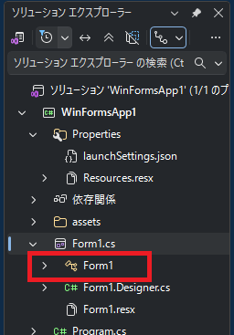
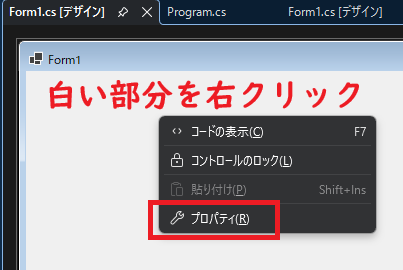
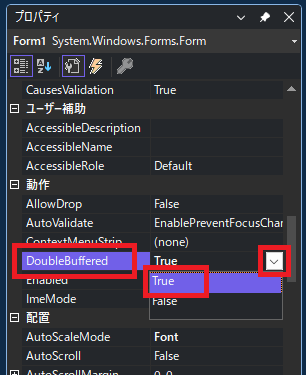
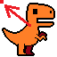

[C#言語2026 第07回]

# メソッドと型と名前空間

## キーポイント

* C#プログラムは「名前空間」、「クラス」、「メソッド」の順番で、3段階の階層を持つ
* 「クラス」には変数やメソッドを定義できる
  ```c#
    クラス
    {
      変数1
      変数2
      ...
      メソッド1
      メソッド2
      ...
    }
  ```
* アプリの実行には「メイン・メソッド」が必要
* メソッドは次のように書く
  ```c#
  属性キーワード 戻り型 メソッド名(パラメータ・リスト)
  {
    メソッド・ブロック
  }
  ```
* メソッドは自分で書いてもいいし、C#言語やOSで用意されているメソッドを使ってもいい
* 複雑なプログラムは、さまざまなメソッドを利用して作られる
* Windowsアプリをゲーム向きにするには、`Application.Run`メソッドの代わりに「ゲームループ」を書く
* 画像を読み込んで利用するには`Bitmap`(ビットマップ)クラスを使う
* ウィンドウに絵を描くには、`Graphics`(グラフィックス)クラスのメソッドを使う
* 画面のちらつきをなくすには、フォームの`DoubleBufferd`プロパティを`true`にする
* 文字を利用するには`Font`(フォント)クラスを使う
* ウィンドウに文字を描くには`TextRenderer`(テキスト・レンダラー)クラスのメソッドを使う

<div style="page-break-after: always"></div>

## 1. Windowsアプリ版のジャンプゲームを作る

### 1.1 Windowsフォームアプリを作成する

今回からは、以前に作成したジャンプゲームの「Windowsアプリ版」を作ります。<br>
Windowsアプリの良い点は **画像を扱える** ことです。<br>
以下の手順で、新しいWindowsアプリ用のプロジェクトを作成し、プロジェクトを開いてください。

>コンソールアプリでも画像を扱う方法もあるのですが、Windowsアプリと比べてかなり手間がかかります。

1. Visual Studioを起動して「新しいプロジェクトの作成」をクリック
2. 「新しいプロジェクトの作成」画面になったら、右上の検索ボックスに「form」と入力
3. テンプレート一覧に`form`を含むテンプレートが表示されるので、C#の「Windowsフォームアプリ」を選択し、右下の「次へ」ボタンをクリック
4. 「プロジェクト名」欄に`DinoRun`とし、「場所」はデスクトップのC#フォルダを選択
5. 「ソリューションとプロジェクトを同じディレクトリに配置する」にチェックを入れて、「次へ」をクリック
6. 「追加情報」は何も変えずに、右下の「作成」ボタンをクリック

Windowsフォームアプリの場合、最初に表示されるのは「フォーム」の設計画面です。「フォーム」は「外観、体型」といった意味で、Windows OSでは「さまざまな部品を配置できる親ウィンドウ」を指します。

ですが、今回はフォームには触れません。ゲームではウィンドウ全体がゲーム画面として扱われ、ボタンやメニューなどの部品を配置することは少ないからです。

とりあえず、Visual Sutidoの上部に表示される`>DinoRun`ボタンをクリックして、アプリを実行してください。何もないウィンドウが表示されたら成功です。

<div style="page-break-after: always"></div>

### 1.2 C#プログラムのブロック階層

Windowsアプリでも、プログラムは基本的に`Program.cs`に書いていきます。<br>
右側のソリューションエクスプローラーにある`Program.cs`をクリックして、ファイルを開いてください。

`Program.cs`を開くと、そこに書かれているプログラムが「コンソールアプリとかなり違う」ことに気づくでしょう。<br>
ですが、今のところは、これらのプログラムはあまり気にしなくて大丈夫です。ここでは概要だけを解説します。

さて、Visual Studioが自動生成したプログラムは、次のようになっています。

```c#
namespace DinoRun
{
  internal static class Program
  {
    /// <summary>
    ///  The main entry point for the application.
    /// </summary>
    [STAThread]
    static void Main()
    {
      // To customize application configuration such as set high DPI settings or default font,
      // see https://aka.ms/applicationconfiguration.
      ApplicationConfiguration.Initialize();
      Application.Run(new Form1());
    }
  }
}
```

`{}`は「ブロック」ですが、各ブロックの前に見慣れないプログラムが書かれています。<br>
ブロックの前に書く内容によって「ブロックの種類」と「性質」が決まります。<br>
このプログラムでは、以下の3種類のブロックが使われています。

* 名前空間(なまえくうかん)
* クラス
* メソッド

C#プログラムは「名前空間 → クラス → メソッド」の順で階層化(ブロック化)されます。

>**【階層化する意味はある？】**<br>
>今回作成するような小さなアプリでは、プログラムを階層化する意味は少ないです。ですが、もっと規模の大きなアプリでは、名前空間やクラスを使ってプログラムを適切に階層化することが重要になります。

<div style="page-break-after: always"></div>

#### 名前空間(なまえくうかん)

一番外側の`namespace DinoRun`(ネームスペース・ディノラン)は、アプリ専用の「名前空間(なまえくうかん)」ブロックです。名前空間は、アプリに必要なあらゆる型、メソッド、データ、プログラムを入れる、最上位の「枠組み」です。

名前空間は`namespace 名前空間名`の形式で始まります。<br>
`namespace`(ネームスペース)は「名前空間」という意味です。

```c#
namespace 名前空間名
{
  名前空間ブロック
}
```

#### クラス

名前空間のすぐ内側にある、`internal static class Program`(インターナル・スタティック・クラス・プログラム、「内部の静的な`Program`という名前の型」という意味)の部分は、「クラス」を作るブロックです。

クラスは`属性キーワード class クラス名`の形式で始まり、型ブロックが続きます。<br>
`internal static`の部分が「属性キーワード」です。この部分は当面は無視してください。

```c#
属性キーワード class クラス名
{
  クラスブロック
}
```

`class`は「型」という意味で、ここからが「クラスの定義」になります。<br>
このプログラムの場合、クラス名は`Program`(プログラム)です。<br>
この`Program`クラスは「アプリに必要なプログラムを入れる枠組み」となります。

クラスブロックに書かれたメソッドや変数、定数、プロパティは、そのクラスの「メンバー」となります。<br>
例えば、`Main`メソッドは「`Program`クラスのメンバー」です。

>**【クラス＝型】**<br>
>「クラス」を日本語にすると「型」になります。`Program`クラス、`Program`型(がた)、どちらの呼び方でも正解です。

<div style="page-break-after: always"></div>

#### メソッド(メイン・ブロック)

まず、中央付近の`static void Main()`(スタティック・ボイド・メイン、「静的な、型のない、メインメソッド」という意味)は「メソッド」ブロックです。「メソッド」は「手順」や「方法」という意味です。

これまで「命令」と呼んでいたものは、実はほとんどが「メソッド」です。<br>
今後は「命令」ではなく「メソッド」と呼ぶことにします。

もう少し詳しく`Main`メソッドを見てみましょう。

```c#
static void Main()
{
  プログラム
}
```

先頭の`static`(スタティック)は、「属性キーワード」というものです。<br>
今は「メソッドの前にあったりなかったりする」くらいの認識で構いません。詳しい説明は別の機会にします。

`static`から後ろが「メソッドの定義」です。<br>
メソッドは`戻り型 メソッド名(パラメータ・リスト)`の形式で始まり、直後にメソッド・ブロックが続きます。

```c#
属性キーワード 戻り型 メソッド名(パラメータ・リスト)
{
  メソッド・ブロック
}
```

「戻り型(もどりがた)」は、 **メソッドが最終的に作り出すデータの種類** です。<br>
例えば整数の計算を行うメソッドでは、戻り型は`int`になるでしょう。詳しいことは別の機会に説明します。

`void`(ボイド)は「型がない」ことを意味する「特別な型」です。<br>
メソッドが終わるとき、何のデータも作り出さない場合に指定します。

パラメータ・リストは必要な場合だけ書きます。`Main`メソッドの場合、パラメータは不要(0個)ということです。

>`static void Main()`メソッドはC#プログラムには必ず必要です。コンソールアプリの場合、ビルドするときに、コンピューターが自動的に`static void Main()`を追加する仕組みになっています。

<div style="page-break-after: always"></div>

### 1.3 ゲームループを作る

Visual Studioによって自動作成されたプログラムは、一般的なWindowsアプリ用に設計されています。つまり、「ゲーム向きではない」ということです。例えば、for文を使って繰り返し状態を変化させる、ゲームループが作れません。

そこで、少しプログラムを変更して、ゲームループを作りましょう。下準備として、不要なコメントを削除し、プロックの終わりを分かりやすくするために閉じ`}`にコメントを付けましょう。`Progra.cs`を次のように変更してください。

```diff
 namespace DinoRun
 {
   internal static class Program
   {
-    /// <summary>
-    ///  The main entry point for the application.
-    /// </summary>
     [STAThread]
     static void Main()
     {
-      // To customize application configuration such as set high DPI settings or default font,
-      // see https://aka.ms/applicationconfiguration.
       ApplicationConfiguration.Initialize();
       Application.Run(new Form1());
-    }
-  }
-}
+    } // Mainメソッドブロックの終わり
+  } // Program型ブロックの終わり
+} // DinoRun名前空間ブロックの終わり
```

下準備が済んだので、ゲームループを作りましょう。メインメソッドのプログラムを、次のように変更してください。

```diff
     [STAThread]
     static void Main()
     {
       ApplicationConfiguration.Initialize();
-      Application.Run(new Form1());
+
+      // フォームを作成して表示
+      Form1 form = new();
+      form.Show();
+
+      // ゲームループ
+      for (; ; )
+      {
+        // ウィンドウが閉じていたらループ終了
+        if (form.IsDisposed)
+        {
+          break;
+        }
+
+        // ウィンドウのイベントを実行
+        Application.DoEvents();
+      }
     } // Mainメソッドブロックの終わり
   } // Program型ブロックの終わり
 } // DinoRun名前空間ブロックの終わり
```

**Application.Runメソッド**

* 削除した`Application.Run`(アプリケーション・ラン)メソッドは、上記のゲームループとほぼ同じプログラムを実行します。`Run`メソッドを使う場合の問題は、ゲームループにプログラムを追加できないことです。

リアルタイムに動作するゲームを作るには、ゲームループにプログラムを追加できなくてはなりません。そこで、`Run`メソッドと同じことを行うプログラムを、自分で書く必要があるのです。

**Showメソッド**

* ループの前に追加した`Show`(ショウ)メソッドは、ウィンドウを画面に表示します。このメソッドを実行しないと、ウィンドウは画面に表示されません。

**IsDisposedプロパティ**

* `IsDisposed`(イズ・ディスポーズド、「処分済み」という意味)プロパティは、Xボタンなどでウィンドウが終了状態になると`true`になります。このプロパティを調べることで、ゲームの起動状態がわかります。

**Application.DoEventsメソッド**

* `Application.DoEvents`(アプリケーション・ドゥイベンツ)メソッドは、ボタンのクリックなどの操作をウィンドウに反映します。このメソッドがないと、Xボタンを押してもウィンドウが閉じません。

プログラムを変更したら、`>DinoRun`ボタンをクリックして、アプリを実行してください。ウィンドウが表示され、Xボタンで閉じることができたらゲームループ化は成功です。

<div style="page-break-after: always"></div>

### 1.4 画像ファイルを用意する

とりあえず、なにか画像を表示させましょう。<br>
画像は以下のURLにあります。ブラウザを開き、以下のURLにアクセスしてください。

&emsp;`github.com/tn-mai/CSharp2026`

ページが開いたら、以下の手順で画像を含むZIPファイルをダウンロードしてください。

1. ファイル`DinoRunAssets.zip`をクリック
2. 右端にある「下矢印」アイコンをクリック
3. ダウンロード先を選択

ファイルをダウンロードしたら、以下の手順で`assets`フォルダのコピーを作成してください。

1. ダウンロードした`DinoRunAssets.zip`ファイルを開く
2. `assets`(アセッツ)というフォルダを選択
3. `Ctrl`キーを押しながら`C`キーを押して、`assets`フォルダをコピー
4. プロジェクトのフォルダを開く
5. `Ctrl`キーを押しながら`V`キーを押して、`assets`フォルダを貼り付け

次に、コピーしたファイルを読み込めるように、プロジェクトの設定を変更します。<br>
以下の手順で設定を変更してください。

1. Visual Studioで`DinoRun`プロジェクトを開く
2. ウィンドウ最上部にある「デバッグ」項目をクリックして開く
3. デバッグメニューの一番下にある「DinoRunのデバッグ プロパティ」をクリック
4. 「作業ディレクトリ」項目に「 **$(ProjectDir)** 」と入力する
5. 「プロファイルの起動」ウィンドウ右上の`x`ボタンをクリックして、ウィンドウを閉じる

>「作業ディレクトリ」は、アプリをVisual Studioで実行したときに、ファイルの読み書きに使うフォルダのことです。

### 1.5 画像を表示する

コピーした画像を表示しましょう。<br>
Windowsアプリで画像を表示するには、`Bitmap`型と「イベント」という機能を使います。

&emsp;`Bitmap`(ビットマップ)型: 画像を管理する
&emsp;ペイント・イベント: 画像をウィンドウに描く

最初に、`Bitmap`型を使って画像ファイルをメモリに読み込みます。

<div style="page-break-after: always"></div>

フォームを作成して表示するプログラムの下に、次のプログラムを追加してください。

```diff
 namespace WinFormsApp1
 {
   internal static class Program
   {
+    // ファイルから画像を読み込む
+    private static Bitmap bmpDino = new("assets/images/dino_0.png");
+
     [STAThread]
     static void Main()
     {
```

型ブロックでは、変数宣言の前に`private static`(プライベート・スタティック)などの「属性」を追加できます。
`private static`が付いた変数は、「この型ブロックでしか使えない」ように設定されます。本テキストのプログラムでは、変数を型ブロックの外から使う予定はありません。そのため、必ずこの指示が付きます。

画像ファイルを読み込むには、`Bitmap`型の変数を作成するときに、`new`メソッドのパラメータとして「ファイル名」を指定します。変数名は`bmpDino`(ビーエムピー・ディノ、「恐竜のビットマップ画像」という意味)としました。

この`bmpDino`のように、「型ブロックで宣言した変数」のことを「メンバ変数」といいます。

>画像のようなデータは、いくつも読み込むことが多いです。「同じ型の変数がいくつも必要」な場合、変数名は「データの種類の略称+データの名前」のように名付けると、分かりやすいです。

#### イベント

「イベント」は **アプリを操作すると、操作に割り当てたメソッドが実行される** という、Windowsアプリの機能です。<br>
例えば、ウィンドウに絵を描く場合を考えます。「ウィンドウに絵を描く」という操作は、Windowsアプリでは「ペイント・イベント」と呼ばれます。

この「ペイント・イベント」に「絵を描くメソッド」を割り当てます。すると、OSが「今、絵を描く必要があるな」と判断したとき、自動的に「絵を描くメソッド」が呼び出されます。

こういう仕組みなので、「イベント」を利用するにはメソッドを書く必要があります。<br>
メソッドの名前は`OnPaint`(オン・ペイント)とします。

画像を読み込むプログラムの下に、次のプログラムを追加してください。

```diff
   internal static class Program
   {
     // ファイルから画像を読み込む
     private static Bitmap bmpDino = new("assets/images/dino_0.png");
+
+    // ペイントイベントで実行されるメソッド
+    private static void OnPaint(object? sender, PaintEventArgs e)
+    {
+      // フォームに画像を描く
+      Graphics g = e.Graphics;
+      g.DrawImage(bmpDino, 0, 0);
+    }

     [STAThread]
     static void Main()
     {
```

フォーム(=ウィンドウ)に画像を描くには`Graphics`(グラフィックス)型を使います。`Graphics`型の変数は、
`event`(イベント)パラメータが持つ`Graphics`(グラフィックス)プロパティからコピーできます。

実際の描画(びょうが)は`DrawImage`(ドロー・イメージ、「画像を描く」という意味)メソッドで行います。<br>
パラメータには「画像変数」、「X座標」、「Y座標」の3つをこの順番で指定します。

>**【OnPaintという名前について】**<br>
>`on`という接頭辞(せっとうじ、「単語の先頭につける字句」のこと)は、「～が起きたとき」を意味します。<br>
>つまり、`OnPaint`という名前は「ペイント(絵を描く)操作が起きたとき」という意味です。<br>
>プログラムの世界では「イベント用のメソッド名は`on`で始める」という暗黙の了解があります。

次に、作成した`OnPaint`メソッドを、フォームのペイント・イベントに割り当てます。イベントにメソッドを割り当てるには、`+=`演算子を使って、イベントにメソッドを加えます。

フォームを作成するプログラムに、次のプログラムを追加してください。

```diff
     [STAThread]
     static void Main()
     {
       ApplicationConfiguration.Initialize();

       // フォームを作成して表示
       Form1 form = new();
+      form.Paint += OnPaint; // ペイントイベントにメソッドを追加
       form.Show();

       // ゲームループ
       for (; ; )
       {
```

ここまでのプログラムを追加したら、`>DinoRun`ボタンをクリックして、アプリを実行してください。<br>
ウィンドウにオレンジ色の恐竜が表示されたら成功です。

さて、恐竜だけでは画面がさみしいので、背景を表示しましょう。<br>
画像を読み込むプログラムに、次のプログラムを追加してください。

```diff
   internal static class Program
   {
     // ファイルから画像を読み込む
+    private static Bitmap bmpBackground = new("assets/images/bg_yellow.png");
     private static Bitmap bmpDino = new("assets/images/dino_0.png");

     // ペイントイベントで実行されるメソッド
     private static void OnPaint(object? sender, PaintEventArgs event)
```

それから、`OnPaint`メソッドに、次のプログラムを追加してください。

```diff
     // ペイントイベントで実行されるメソッド
     private static void OnPaint(object? sender, PaintEventArgs event)
     {
       // フォームに画像を描く
       Graphics g = event.Graphics;
+      g.DrawImage(bmpBackground, 0, 0);
       g.DrawImage(bmpDino, 0, 0);
     }
```

プログラムを追加したら、`>DinoRun`ボタンをクリックして、アプリを実行してください。<br>
ウィンドウの背景色が少し変わっていたら成功です。

>画像の描き順に注意しましょう。後から描いた画像が上に表示されます。

実は、背景画像は今見えているものより大きく、1280x720のサイズがあります。<br>
ウィンドウを大きくすることで、画像全体が表示されるようにしましょう。

ウィンドウのサイズは、`ClientSize`(クライアント・サイズ)プロパティで変更できます。<br>
フォームを作成して表示するプログラムに、次のプログラムを追加してください。

```diff
     // フォームを作成して表示
     Form1 form = new();
+    form.ClientSize = new(1280, 720); // ウィンドウのサイズを変更
     form.Paint += OnPaint; // ペイントイベントにメソッドを追加
     form.Show();
```

`ClientSize`プロパティの型は、XとYの2つの要素を持つ`Size`(サイズ)型です。<br>
2つの数値をまとめた **少し複雑な型** なので、データの作成には`new`を使います。

プログラムを追加したら、`>DinoRun`ボタンをクリックして、アプリを実行してください。<br>
ウィンドウが大きくなり、背景画像全体が表示されたら成功です。

>メソッドをイベントに追加すると、アプリが必要だと判断したときに、自動的にメソッドを実行してくれます。<br>
>例えばペイント・イベントの場合、フォームが「画面を描き直すべきだ」と判断したときに実行されます。

<pre class="tnmai_assignment">
<strong>【課題01 サボテンの画像を読み込む】</strong>
サボテン画像用に<code>Bitmap</code>型の変数<code>bmpSaboten</code>を作成し、
画像ファイル<code>assets/images/saboten_0.png</code>を読み込みなさい。
</pre>

<pre class="tnmai_assignment">
<strong>【課題02 サボテンを表示する】</strong>
<code>OnPaint</code>メソッドに、<code>bmpSaboten</code>を描くプログラムを追加しなさい。
</pre>

### 1.6 画像を動かす

画面が止まったままではゲームにならないので、恐竜を動かしましょう。まずは、恐竜の座標をあらわす変数を追加します。画像を読み込むプログラムの下に、次のプログラムを追加してください。

```diff
     // ファイルから画像を読み込む
     private static Bitmap bmpBackground = new("assets/images/bg_yellow.png");
     private static Bitmap bmpDino = new("assets/images/dino_0.png");
     private static Bitmap bmpSaboten = new("assets/images/saboten_0.png");
+
+    // 恐竜の変数
+    private static float dinoX = 300.0f; // 恐竜のX座標
+    private static float dinoY = 580.0f; // 恐竜のY座標

     // ペイントイベントで実行されるメソッド
     private static void OnPaint(object? sender, PaintEventArgs event)
```

そして、追加した変数を使って恐竜を描きます。フォームに画像を各プログラムを、次のように変更してください。

```diff
     private static void OnPaint(object? sender, PaintEventArgs event)
     {
       // フォームに画像を描く
       Graphics g = event.Graphics;
       g.DrawImage(bmpBackground, 0, 0);
-      g.DrawImage(bmpDino, 0, 0);
+      g.DrawImage(bmpDino, dinoX, dinoY);
       g.DrawImage(bmpSaboten, 0, 0);
     }
```

続いて、キーの状態を調べて恐竜の座標を変更しましょう。Windowsアプリにはキーの状態を調べる機能があります。ですが、ゲーム用に設計されていないので少し使いにくいです。そこで、コンソールアプリのときと同じく、OSの機能を使ってキー状態を調べます。

それでは、OSの機能を使えるようにしましょう。`Program.cs`の先頭に、次のプログラムを追加してください。

```diff
+using System.Runtime.InteropServices;
+
 namespace WinFormsApp1
 {
   internal static class Program
   {
+    // OSの「キーを調べる機能」を使えるようにする
+    [DllImport("user32.dll")]
+    static extern short GetAsyncKeyState(int key);
+
     // ファイルから画像を読み込む
     private static Bitmap bmpBackground = new("assets/images/bg_yellow.png");
     private static Bitmap bmpDino = new("assets/images/dino_0.png");
```

`using`(ユージング)は、ファイルの先頭に書かなくてはなりません。また、`DllImport`(ディーエルエル・インポート)によるOS機能の取り込みは、「その機能を使いたい型ブロック」で行う必要があります。

`GetAsyncKeyState`(ゲット・エイシンク・キー・ステート)命令は、パラメータで指定したキーの状態を調べてくれます。スペースキーなどの特殊キーは「仮想キー番号」で指定します。

仮想キー番号は覚えにくいので、定数を使って番号に名前を付けます。キーを調べる機能を使えるようにするプログラムの下に、次のプログラムを追加してください。

```diff
     // OSの「キーを調べる機能」を使えるようにする
     [DllImport("user32.dll")]
     static extern short GetAsyncKeyState(int key);
+
+    // GetAsyncKeyStateで使う仮想キー番号
+    const int vkReturn = 13; // Enterキー
+    const int vkEscape = 27; // ESCキー
+    const int vkSpace = 32;  // スペースキー
+    const int vkLeft = 37;   // 矢印キー(左)
+    const int vkUp = 38;     // 矢印キー(上)
+    const int vkRight = 39;  // 矢印キー(右)
+    const int vkDown = 40;   // 矢印キー(下)

     // ファイルから画像を読み込む
     private static Bitmap bmpBackground = new("assets/images/bg_yellow.png");
     private static Bitmap bmpDino = new("assets/images/dino_0.png");
```

>ここで挙げた以外の仮想キー番号については「仮想キーコード」で検索すると見つかります。

それでは、キーを調べて恐竜を動かすプログラムを作りましょう。ゲームループに次のプログラムを追加してください。

```diff
       // ウィンドウが閉じていたらループ終了
       if (form.IsDisposed)
       {
         break;
       }
+
+      // 左矢印キーが押されていたら、恐竜を左に移動
+      if (GetAsyncKeyState(vkLeft) < 0)
+      {
+          dinoX -= 10.0f;
+      }
+
+      // 右矢印キーが押されていたら、恐竜を右に移動
+      if (GetAsyncKeyState(vkRight) < 0)
+      {
+          dinoX += 10.0f;
+      }

       // ウィンドウのイベントを実行
       Application.DoEvents();
```

移動量の`10`という数値は適当です。プログラムを追加したら、`>DinoRun`ボタンをクリックして、アプリを実行してください。矢印キーの左右を押して恐竜が動いたら成功…なんですが、動きませんね？

### 1.7 画面の描き直しを指示する

座標を変更したのに画面が変化しないのは **描き直しの指示を出していない** からです。画面の描き直しはかなり時間のかかる処理なので、変数がちょっと変わったくらいでは、OSは描き直しの指示を出さないのです。<br>
そのため、必要ならプログラムから描き直しを指示しなくてはなりません。

描き直しを指示するには`Refresh`(リフレッシュ、「状態を最新にする」という意味)メソッドを使います。<br>
恐竜を動かすプログラムの下に、次のプログラムを追加してください。

```diff
       if (GetAsyncKeyState(vkRight) < 0)
       {
           dinoX += 10.0f;
       }
+
+      form.Refresh();

       // ウィンドウのイベントを実行
       Application.DoEvents();
```

プログラムを追加したら、`>DinoRun`ボタンをクリックして、アプリを実行してください。<br>
画面が激しく点滅しますが、一応、矢印キーの左右を押すと恐竜が動かせるようです。

### 1.8 画像が点滅しないようにする

画面全体が点滅するのは、ウィンドウを描き直すたびに、「画像を消す→画像を描く」という動作が行われるためです。この点滅をなくすには、フォームの「ダブルバッファ」という機能を有効にします。

ソリューションエクスプローラーに表示されている`Form1.cs`というファイルをダブルクリックしてください。<br>
すると、フォームのデザイン画面が表示されます。

<p align="center"></p>

デザイン画面が表示されたら、フォーム内の白い部分を右クリックしてください。右クリックメニューが開くので、「プロパティ」項目をクリックしてください。

<p align="center"></p>

すると、Visual Studioの右側に「プロパティ・ウィンドウ」が表示されます。項目をスクロールさせて「動作」にある`DoubleBufferd`(ダブル・バッファード)という項目をクリックし、`True`(トゥルー)を選択してください。

<p align="center"></p>

これで、「ダブルバッファ」が有効になります。

プロパティを変更したら、`>DinoRun`ボタンをクリックして、アプリを実行してください。<br>
画面が点滅しなくなっていたら成功です。

### 1.9 設定を改善する

`DrawImage`メソッドで画像を描くとき、グラフィックス設定によって大きく速度が変わります。特に影響が大きい設定は以下の2つです。

* `InterporationMode`(インターポレーション・モード、「補間方法」という意味): 画像の拡大縮小の方法
* `CompositingMode`(コンポジティング・モード、「合成方法」という意味): 画像の透明部分の合成方法

初期状態では、「滑らかに拡大縮小」と「透明部分を透過して合成」になっています。ですが、背景は拡大縮小しませんし、透明部分もありません。そこで、拡大縮小の品質を下げたり、透明部分を無視するように設定すると、描く速度が大きく向上します。

なお、これらの設定項目の正式な名前は、<br>
&emsp;`System.Drawing.Drawing2D.InterporationMode`<br>
&emsp;`System.Drawing.Drawing2D.CompositingMode`<br>
です。

ちょっと長すぎるので、`using`を使って名前を省略可能にしましょう。

<div style="page-break-after: always"></div>

`Program.cs`の先頭に、次のプログラムを追加してください。

```diff
 using System.Runtime.InteropServices;
+using System.Drawing.Drawing2D;
 
 namespace WinFormsApp1
 {
   internal static class Program
```

それでは、グラフィックス設定を追加しましょう。`OnPaint`メソッドに次のプログラムを追加してください。

```diff
     private static void OnPaint(object? sender, PaintEventArgs event)
     {
       // フォームに画像を描く
       Graphics g = event.Graphics;

+      // 背景を描く
+      g.InterporationMode = InterporationMode.NearestNeighbor;
+      g.CompositingMode = CompositingMode.SourceCopy;
       g.DrawImage(bmpBackground, 0, 0);
+
+      // 恐竜を描く
+      g.InterporationMode = InterporationMode.Bilinear;
+      g.CompositingMode = CompositingMode.SourceOver;
       g.DrawImage(bmpDino, dinoX, dinoY);
+
+      // サボテンを描く
       g.DrawImage(bmpSaboten, 0, 0);
     }
```

このプログラムでは、以下のモードを使っています。

| モード名 | 機能 |
|:--|:--|
| `NearestNeighbor`<br>(ニアレスト・ネイバー、「最も近い」という意味) | 拡大縮小を滑らかにする処理を一切行わない |
| `Bilinear`<br>(バイリニア、「2点線形補間」という意味) | 拡大縮小を少し滑らかにする(初期設定はこれ) |
| `SourceCopy`<br>(ソース・コピー、「元絵をコピー」という意味) | 透明色を黒として描く |
| `SourceOver`<br>(ソース・コピー、「元絵を上書き」という意味) | 透明色を透明として描く(初期設定はこれ) |

グラフィックスの設定は、最後に設定した状態が継続します。<br>
そのため、サボテンには恐竜と同じ設定が使われます。

プログラムが書けたら、`>DinoRun`ボタンをクリックして、アプリを実行してください。<br>
恐竜の移動が少し速くなっていたら成功です。

### 1.10 正確な時間計測によるループ

恐竜の移動速度が速くなったのは、画像を早く描けるようになったことで、繰り返しの速度も上がったためです。<br>
ですが、ちょっと何かを変えるたびに速度が変わるようでは、意図した内容のゲームを作ることなど不可能です。

そこで、コンソールアプリのときと同様に、ゲームが1/60秒ごとに繰り返されるようにしましょう。まず、ストップウオッチ型のために`using`を追加します。`Program.cs`の先頭に、次のプログラムを追加してください。

```diff
 using System.Runtime.InteropServices;
 using System.Drawing.Drawing2D;
+using System.Diagnostics;

 namespace WinFormsApp1
 {
```

次に、ストップウオッチ変数を作成します。フォームを表示するプログラムの下に、次のプログラムを追加してください。

```diff
     form.ClientSize = new(1280, 720); // ウィンドウのサイズを変更
     form.Paint += OnPaint; // ペイントイベントにメソッドを追加
     form.Show();
+
+    Stopwatch stopwatch = new(); // 繰り返し時間の管理用のストップウオッチ

     // ゲームループ
     for (; ; )
```

ループ終了を判定するプログラムの下に、時間計測を開始するプログラムを追加してください。

```diff
       if (form.IsDisposed)
       {
         break;
       }
+
+      stopwatch.Restart(); // 時間計測を開始

       // 左矢印キーが押されていたら、恐竜を左に移動
       if (GetAsyncKeyState(vkLeft) < 0)
```

次に、ウィンドウのイベントを実行するプログラムの下に、一定時間スリープさせるプログラムを追加してください。

```diff
       form.Refresh();

       // ウィンドウのイベントを実行
       Application.DoEvents();
+
+      // 経過時間が1/60秒未満の場合、1/60秒が経過するまで停止
+      stopwatch.Stop(); // 時間計測を終了
+      if (stopwatch.ElapsedMilliseconds < 1000 / 60)
+      {
+        Thread.Sleep(1000 / 60 - (int)stopwatch.ElapsedMilliseconds);
+      }
     }
   } // Mainメソッドブロックの終わり
 } // Program型ブロックの終わり
```

プログラムが書けたら、`>DinoRun`ボタンをクリックして、アプリを実行してください。<br>
恐竜の移動が遅くなっていたら成功です。

### 1.11 Sleepの精度を改善する

現在、恐竜の移動速度を「繰り返し1回あたり10ドット」としています。繰り返し1回にかかる時間は1/60秒なので、1秒間に600ドット移動できるはずです。そして、現在のウィンドウの横幅は`1280`ドットですから、ウィンドウを右端から左端まで横切るのに約2秒かかるはずです。ですが、実際に移動させてみると2秒以上かかります。

これは、`Thread.Sleep`の精度が低いためです。<br>
精度を高めるには`timeBeginBeriod`(タイム・ビギン・ピリオド)メソッドを使います。

まず`DllImport`を使ってOSの機能を使えるようにします。<br>
`Program`ブロックの先頭に、次のプログラムを追加してください。

```diff
 namespace WinFormsApp1
 {
   internal static class Program
   {
+    // OSの「スリープ時間の精度を変える機能」を使えるようにする
+    [DllImport("winmm.dll")]
+    static extern uint timeBeginPeriod(uint uMilliseconds);
+
     // OSの「キーを調べる機能」を使えるようにする
     [DllImport("user32.dll")]
     static extern short GetAsyncKeyState(int key);
```

次に、Mainメソッドの先頭に、次のプログラムを追加してください。

```diff
     static void Main()
     {
       ApplicationConfiguration.Initialize();
+
+      timeBeginPeriod(1); // スリープの精度を1ミリ秒に設定

       // フォームを作成して表示
       Form1 form = new();
       form.Paint += OnPaint; // ペイントイベントにメソッドを追加
```

プログラムが書けたら、`>DinoRun`ボタンをクリックして、アプリを実行してください。<br>
恐竜が画面を横切るのにかかる時間が約2秒になっていたら成功です。

>速度の変化はPCごとに違うので、あまり違いが感じられない場合もあります。

<pre class="tnmai_assignment">
<strong>【課題03 恐竜の移動速度を調整する】</strong>
恐竜の移動速度を、操作しやすい速度に変更しなさい。前進と後退で速度が違っても構いません。
</pre>

### 1.12 サボテンの移動

障害物となるサボテンを移動させしょう。`Program`型ブロックに、サボテンの座標を管理する`float`型のメンバ変数を追加してください。

```diff
     // 恐竜の変数
     private static float dinoX = 300.0f; // 恐竜のX座標
     private static float dinoY = 580.0f; // 恐竜のY座標
+
+    // サボテンの変数
+    private static float sabotenX = 1280.0f; // サボテンのX座標
+    private static float sabotenY = 580.0f;  // サボテンのY座標

     // ペイントイベントで実行されるメソッド
     private static void OnPaint(object? sender, PaintEventArgs event)
     {
```

それでは、サボテンを移動させましょう。恐竜をキーで動かすプログラムの下に、サボテンを移動させるプログラムを追加してください。

```diff
       // 右矢印キーが押されていたら、恐竜を右に移動
       if (GetAsyncKeyState(vkRight) < 0)
       {
           dinoX += 10.0f;
       }
+
+      // サボテンを左に移動
+      sabotenX -= 6.0f;
+
+      // サボテンが左端まで来たら右端に戻す
+      if (sabotenX < 0.0f)
+      {
+        sabotenX = 1280.0f;
+      }

       form.Refresh();

       // ウィンドウのイベントを実行
       Application.DoEvents();
```

<pre class="tnmai_assignment">
<strong>【課題04 サボテンの座標を画像に反映する】</strong>
<code>OnPaint</code>メソッドのサボテン表示プログラムについて、
座標(0, 0)の代わりに、変数<code>sabotenX</code>と<code>sabotenY</code>を使うように変更しなさい。
</pre>

課題04が終わったら、`>DinoRun`ボタンをクリックして、アプリを実行してください。<br>
サボテンが右から左に移動していたら成功です。

### 1.13 衝突判定

恐竜とサボテンの衝突を判定しましょう。まずは、コンソールアプリと同じように、座標が一致していることを調べます。サボテンを右端に戻すプログラムの下に、次のプログラムを追加してください。

```diff
       // サボテンが左端まで来たら右端に戻す
       if (sabotenX < 0.0f)
       {
         sabotenX = 1280;
       }
+
+      // 恐竜とサボテンの衝突判定
+      if (dinoX == sabotenX && dinoY == sabotenY)
+      {
+          break;
+      }

       form.Refresh();

       // ウィンドウのイベントを実行
       Application.DoEvents();
```

追加したプログラムは「恐竜とサボテンのX座標とY座標の両方を調べて、どちらも同じ座標ならゲームを終了させる」というものです。

プログラムが書けたら、`>DinoRun`ボタンをクリックして、アプリを実行してください。恐竜とサボテンが衝突したとき、ゲームが終了する…はずですが、終了しませんね？

### 1.14 衝突判定の改良

衝突判定が機能しない理由は「恐竜とサボテンの大きさは1ドットではない」からです。コンソールアプリのときは、人間とサボテンはどちらも1文字として考えることができました。

ですが、Windowsアプリで表示する画像は多数のドットからできていて、移動もドット単位で行えます。そのため、「座標」で判定すると、衝突するのは「画像が完全に重なった場合」だけになってしまいます。

<div align="center">[左上の1ドットの座標で判定する場合]<br>
&emsp;
</div>

画像のように「大きさを持つもの同士の衝突」を判定するには、「座標の範囲」で判定しなくてはなりません。

Windowsアプリの場合、画像の原点は左上です。また、恐竜とサボテンの画像サイズは縦64ドット、横64ドットなので、画像が占める範囲はX方向(横)が`0`～`64`、Y方向(縦)が`0`～`64`となります。

<div align="center">[画像全体(64x64ドット)で判定する場合]<br>
&emsp;
</div>

このため、恐竜とサボテンの範囲が重なるには、サボテンの座標が「恐竜の座標 - 64ドット」より大きく、「恐竜の座標 + 64ドット」未満でなくてはなりません。

<div align="center">[サボテンの座標(黒点)が範囲(水色)に入ったら衝突]<br>
</div>

<div style="page-break-after: always"></div>

なお、範囲の場合も、判定には恐竜とサボテンの座標(画像の左上)を使います。とりあえずX座標について考えてみましょう。前の図によると、サボテンの座標が恐竜の座標の左64ドットの位置より右にある、つまり<br>
&emsp;`sabotenX > dinoX - 64`<br>
の場合、衝突している可能性があります。

しかし、これは恐竜の左側を調べただけです。サボテンの座標は、恐竜のずっと右にあるかもしれません。そこで、恐竜の右側も調べます。サボテンの座標が恐竜の座標の右64ドットの位置より左にある、つまり<br>
&emsp;`sabotenX < dinoX + 64`<br>
の場合、サボテンの座標は上図の水色の範囲にあります。

あとは、Y方向でも同じように座標と範囲の重なりを調べれば、本当に衝突しているかどうかが判定できます。

結局、範囲で衝突判定を行うには、「範囲の右」、「範囲の左」、「範囲の上」、「範囲の下」の4つを調べる必要があるのです。実際に書いてみましょう。恐竜とサボテンの衝突判定プログラムを、次のように変更してください。

```diff
       // サボテンが左端まで来たら右端に戻す
       if (sabotenX < 0.0f)
       {
         sabotenX = 1280;
       }

       // 恐竜とサボテンの衝突判定
-      if (dinoX == sabotenX && dinoY == sabotenY)
+      if (sabotenX > dinoX - 64.0f && sabotenX < dinoX + 64.0f &&
+          sabotenY > dinoY - 64.0f && sabotenY < dinoY + 64.0f)
       {
           break;
       }

       form.Refresh();
```

変更したif文では、`&&`演算子を使って4つの条件をまとめています。

プログラムが書けたら、`>DinoRun`ボタンをクリックして、アプリを実行してください。<br>
恐竜とサボテンが衝突したとき、ゲームが終了したら成功です。

### 1.15 恐竜をジャンプさせる

今の恐竜は左右にしか動けないので、必ずサボテンに当たってしまいます。<br>
これではゲームにならないので、ジャンプできるようにしましょう。

ジャンプの制御には、コンソールアプリの時と同じ方法が使えます。つまり、以下の2つの変数を追加します。

* `isJumping`(イズ・ジャンピング)変数: ジャンプ状態
* `jumpSpeed`(ジャンプ・スピード)変数: ジャンプ速度

<div style="page-break-after: always"></div>

恐竜の変数を宣言するプログラムに、ジャンプ制御用のメンバ変数を追加してください。

```diff
     // 恐竜の変数
     private static float dinoX = 300.0f; // 恐竜のX座標
     private static float dinoY = 580.0f; // 恐竜のY座標
+    private static bool isJumping = false; // ジャンプ中ならtrue
+    private static float jumpSpeed = 0.0f; // ジャンプの速度

     // サボテンの変数
     private static float sabotenX = 1280.0f; // サボテンのX座標
     private static float sabotenY = 580.0f;  // サボテンのY座標
```

ジャンプの初速と重力は「等加速度直線運動の公式」を使って決めましょう。今回はより高く、より鋭いジャンプにするため、高さを「恐竜約`4`体分」、時間を「`0.25`秒(コンソールアプリの半分)」とします。

* 0.25秒で恐竜4体分の高さ(約200ドット)までジャンプする → 0.25秒で200ドット落下する
* 等加速度直線運動の変位の公式 $ x(t) = v_0 t + \frac{1}{2} a t ^ 2 $ を使い、重力加速度 $ a $ 求める
  * 200ドットジャンプしたいので変位 $ x(t) $ は`200`、時間 $ t $ は`0.25`= $ \frac{1}{4} $ 、ジャンプ頂点では速度`0`になるので、初速 $ v_0 $ は`0`と仮定
  * $ 200 = \frac{1}{2} a (\frac{1}{4})^2 $
  * $ 200 = \frac{1}{2 \times 4 \times 4} a $
  * $ a = 6400 $ より、重力加速度は`6400`
  * 改めて初速 $ v_0 $ を求めると、
  * $ 200 = \frac{v_0}{4} - \frac{6400}{2 \times 4 \times 4} $
  * $ 200 = \frac{v_0}{4} - 200 $
  * $ \frac{v_0}{4} = 400 $
  * $ v_0 = 1600 $ より、初速は`1600`

つまり、「初速`1600`ドット、重力加速度`6400`ドットでジャンプすれば、高さが`200`ドットで持続時間が0.5秒のジャンプになる」わけです。

>ただし、実際のジャンプの高さは`200`ドットより少し低くなります。現実と違って、ゲームは1/60秒単位で計算するため、どうしても誤差が出るのです。

<div style="page-break-after: always"></div>

それでは、恐竜にジャンプ能力を与えましょう。まず、「スペースキーが押されたらジャンプする」プログラムを追加します。時間計測を開始するプログラムの下に、ジャンプを開始するプログラムを追加してください。

```diff
       if (form.IsDisposed)
       {
         break;
       }

       stopwatch.Restart(); // 時間計測を開始
+
+      // ジャンプしていないとき、スペースキーが押されたらジャンプ開始
+      if (isJumping == false && GetAsyncKeyState(VkSpace) < 0)
+      {
+        isJumping = true;     // ジャンプ状態にする
+        jumpSpeed = -1600.0f; // 初速
+      }

       // 左矢印キーが押されていたら、恐竜を左に移動
       if (GetAsyncKeyState(vkLeft) < 0)
```

次に、ジャンプを実行するプログラムを追加します。ジャンプを開始するプログラムの下に、ジャンプを制御するプログラムを追加してください。

```diff
       if (isJumping == false && GetAsyncKeyState(VkSpace) < 0)
       {
         isJumping = true;     // ジャンプ状態にする
         jumpSpeed = -1600.0f; // 初速
       }
+
+      // ジャンプ状態ならジャンプを実行する
+      if (isJumping)
+      {
+        jumpSpeed += 6400.0f / 60.0f; // ジャンプ速度に重力を足す
+        dinoY += jumpSpeed / 60.0f; // Y座標にジャンプ速度を足す
+
+        // Y座標が地面の高さ以上になったらジャンプ終了
+        if (dinoY >= 580.0f)
+        {
+          dinoY = 580.0f;    // 地面ぴったりの高さを代入
+          jumpSpeed = 0.0f;  // ジャンプ速度をゼロにする
+          isJumping = false; // ジャンプしてない状態にする
+        }
+      }

       // 左矢印キーが押されていたら、恐竜を左に移動
       if (GetAsyncKeyState(vkLeft) < 0)
```

プログラムが書けたら、`>DinoRun`ボタンをクリックして、アプリを実行してください。<br>
スペースキーを押して恐竜をジャンプさせ、サボテンを避けることができたら成功です。

### 1.16 ゲーム―オーバーと再スタート

現在のプログラムは、サボテンと衝突するとゲームが終了します。ですが、何度もゲームを遊ぶには、そのたびにアプリを実行し直す必要があります。これは、不便極まりないです。そこで、ゲームオーバーの表示とゲームの再スタート機能を作りましょう。

コンソールアプリでは、衝突判定のif文のブロックの中で、ゲームオーバーと再スタートを処理していました。<br>
ですが、Windowsアプリでは、画像の表示がメソッドになっていて、ゲームの操作とは分かれています。

仕組みが異なるので、コンソールアプリと同じ方法は使えません。<br>
そういうわけで、Windowsアプリでは「ゲーム状態」をあらわす変数を使うことにします。

>正確には、かなり頑張れば使えなくもないのですが、面倒なだけなのでお勧めしません。

変数名は`gameState`(ゲームステート、「ゲーム状態」という意味)とします。<br>
仮想キー番号を宣言するプログラムの下に、次のプログラムを追加してください。

```diff
     const int vkLeft = 37;      // 矢印キー(左)
     const int vkUp = 38;        // 矢印キー(上)
     const int vkRight = 39;     // 矢印キー(右)
     const int vkDown = 40;      // 矢印キー(下)
+
+    // ゲームの状態
+    const int gsPlay = 0;     // プレイ状態
+    const int gsGameover = 1; // ゲームオーバー状態
+    private static int gameState = gsPlay; // 現在のゲーム状態

     // ファイルから画像を読み込む
     private static Bitmap bmpBackground = new("assets/images/bg_yellow.png");
     private static Bitmap bmpDino = new("assets/images/dino_0.png");
     private static Bitmap bmpSaboten = new("assets/images/saboten_0.png");
```

`gsPlay`(ジーエス・プレイ)は「プレイ中」状態に対応する定数です。`gsGameover`(ジーエス・ゲームオーバー)は「ゲームオーバー」状態に対応する定数です。

>定数名の先頭に付いている`gs`は、`game state`の頭文字です。

次に、if文を使って **ゲーム状態ごとに違うプログラムを実行** します。この変更を行うことで、現在のプログラムの多くの部分は、ゲーム状態が「プレイ中」のときだけ実行されるようになります。時間計測を開始するプログラムの下に、次のif文を追加してください。

```diff
     if (form.IsDisposed)
     {
       break;
     }

     stopwatch.Restart(); // 時間計測を開始
+
+    if (gameState == gsPlay)
+    {
+      // ゲーム状態が「プレイ中」の場合
+
       // ジャンプしていないとき、スペースキーが押されたらジャンプ開始
       if (isJumping == false && GetAsyncKeyState(VkSpace) < 0)
```

続いて、 **ゲーム状態がゲームオーバーのときだけ実行** されるブロックを追加します。恐竜とサボテンの衝突判定の下に、次のelse if文を追加してください。

```diff
       if (sabotenX > dinoX - 64.0f && sabotenX < dinoX + 64.0f &&
           sabotenY > dinoY - 64.0f && sabotenY < dinoY + 64.0f)
       {
         break;
       }
+    }
+    else if (gameState == gsGameover)
+    {
+      // ゲーム状態が「ゲームオーバー」の場合
+    }

     form.Refresh();

     // ウィンドウのイベントを実行
     Application.DoEvents();
```

これで、ゲーム状態に応じてプログラムを切り替えられるようになりました。それでは、衝突したときにゲームオーバー状態にしましょう。恐竜とサボテンの衝突判定プログラムを、次のように変更してください。

```diff
       if (sabotenX > dinoX - 64.0f && sabotenX < dinoX + 64.0f &&
           sabotenY > dinoY - 64.0f && sabotenY < dinoY + 64.0f)
       {
-        break;
+        // ゲームオーバー状態にする
+        gameState = gsGameover;
       }
     }
     else if (gameState == gsGameover)
```

最後に、ゲームオーバー状態のとき再スタートを行うプログラムを追加します。ゲーム状態がゲームオーバーの場合のブロックに、Enterキーが押されたら再スタートするプログラムを追加してください。

```diff
         // ゲームオーバー状態にする
         gameState = gsGameover;
       }
     }
     else if (gameState == gsGameover)
     {
       // ゲーム状態が「ゲームオーバー」の場合
+
+      // Enterキーが押されたら再スタート
+      if (GetAsyncKeyState(vkReturn) < 0)
+      {
+        // 恐竜を初期状態に戻す
+        dinoX = 300.0f;
+        dinoY = 580.0f;
+        isJumping = false;
+        jumpSpeed = 0.0f;
+
+        // サボテンを初期状態に戻す
+        sabotenX = 1280.0f;
+
+        // プレイ中の状態にする
+        gameState = gsPlay;
+      }
     }

     form.Refresh();
```

再スタートプログラムで重要なことは、 **恐竜とサボテンの変数を初期状態に戻している** 点です。これがないと、再スタートしてもすぐ衝突してゲームオーバーになってしまいます。

プログラムが書けたら、`>DinoRun`ボタンをクリックして、アプリを実行してください。恐竜がサボテンに衝突するとゲームが停止して、それからEnterキーを押すとゲームが再スタートしたら成功です。

<div style="page-break-after: always"></div>

### 1.17 フォント

恐竜がサボテンと衝突するとゲームオーバーになるのはいいのですが、画面が停止するだけなので、何が起こっているのかさっぱり分かりません。そこで、`GAME OVER`という文章を表示することにします。

C#のWindowsアプリには、文章を表示するメソッドが2つあります。

| メソッド名 | 機能 | 速度 |
|:--|:--|:--|
| `Graphics.DrawString`(グラフィックス・ドロー・ストリング) | ○ | △ |
| `TextRenderer.DrawText`(テキストレンダラー・ドロー・テキスト) | ✖ | ○ |

いま作っているのはアクションゲームなので、できるだけ高速に文章を表示したいです。<br>
そこで、速度に優れる`TextRenderer.DrawText`メソッドを使うことにします。

さて、どちらのメソッドを使うにしても、文字を描くには「フォント(文字の形)」が必要となります。<br>
ですから、先にフォントを用意しましょう。フォントは`Font`(フォント)型を使って制御します。<br>

`Font`型の変数を作るには、`new`メソッドのパラメータに「フォントの名前」と「大きさ」を指定します。<br>
`Program`型ブロックに、フォント変数の宣言を追加してください。

```diff
     // ゲームの状態
     const int gsPlay = 0;     // プレイ状態
     const int gsGameover = 1; // ゲームオーバー状態
     private static int gameState = gsPlay; // 現在のゲーム状態
+
+    // フォント
+    private static Font font = new("Impact", 32.0f);

     // ファイルから画像を読み込む
     private static Bitmap bmpBackground = new("assets/images/bg_yellow.png");
     private static Bitmap bmpDino = new("assets/images/dino_0.png");
```

フォントは`Impact`(インパクト)を選びました。`Impact`はかなり太いゴシック体の英字フォントです。

それでは、フォントと`TexRenderer.DrawText`メソッドを使って文章を表示しましょう。<br>
`OnPaint`メソッドに次のプログラムを追加してください。

```diff
       g.DrawImage(bmpDino, dinoX, dinoY);

       // サボテンを描く
       g.DrawImage(bmpSaboten, sabotenX, sabotenY);
+
+      // ゲームオーバー状態の表示
+      if (gameState == gsGameover)
+      {
+        TextRenderer.DrawText(g, "GAME OVER", font, new Point(500, 300), Color.Black);
+      }
     }

     [STAThread]
     static void Main()
```

`DrawString`メソッドには、以下の5個のパラメータを指定します。

1. 表示先となるグラフィックス型の変数
2. 表示する文章
3. 表示に使うフォント
4. `Point`(ポイント)型であらわされる表示開始座標
5. `Color`(カラー)型であらわされる文字の色

文章の表示位置は、`Point`型を使って指定します。`Point`型は、X座標とY座標をまとめて扱う「少し複雑な型」です。そのため、`new`メソッドを使って作成します。パラメータはX座標、Y座標の順です。

文字の色は、`Color`(カラー)型で、指定します。`Color`型には色の名前を持つプロパティが数多く用意されているので、好きな色の名前を使います。

プログラムが書けたら、`>DinoRun`ボタンをクリックして、アプリを実行してください。恐竜がサボテンに衝突したときに、`GAME OVER`という文字が表示され、再スタートすると文字が消えたら成功です。

<pre class="tnmai_assignment">
<strong>【課題05 文字の大きさ変える】</strong>
文字が小さすぎる気がするので、大きさを<code>48.0f</code>に変更してください。もっと大きくしても構いません。
</pre>

<pre class="tnmai_assignment">
<strong>【課題06 文字の色を変える】</strong>
黒い文字はあまり見やすくありません。それに、雰囲気も普通すぎます。文字の色を変えて、イメージを変えましょう。
「C# colorクラス」で検索すると、Microsoftの<code>Color</code>クラスの解説ページが見つかります。
そこには、さまざまな色の名前が書いてあるはずです。
「ゲームオーバーにふさわしい色」を選んで、文字の色を変更してください。
</pre>
