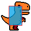
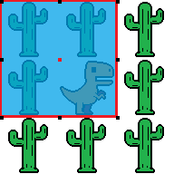
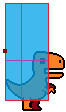
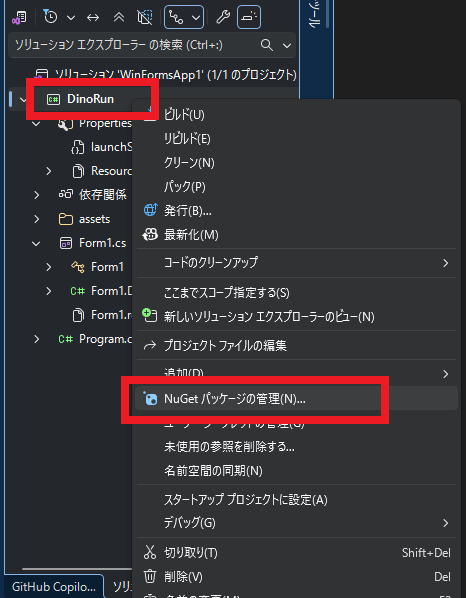
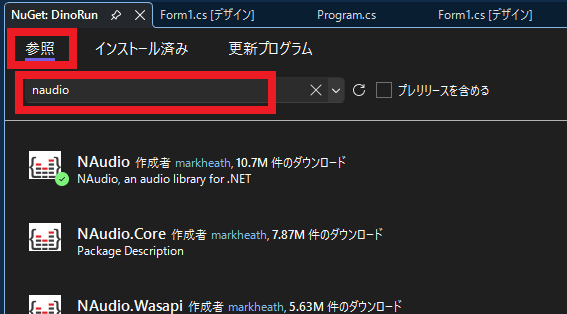
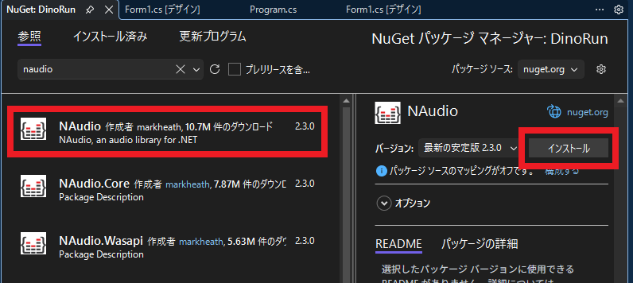
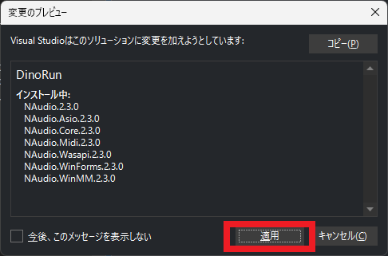
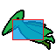

[C#言語2026 第08回]

# ジャンプゲームの改良

## キーポイント

* 
* 

## 1 

### 1.1 サボテンの数を増やす

前回のテキストでは、Windowsアプリ版のジャンプゲームを作成しました。ですが、まだ「とりあえず動く」といった段階で、「ゲームとして面白い」という段階には達していません。

そこで今回は、ジャンプゲームにさまざまな **要素の追加** や **改良** を行い、「ゲームとして面白い」という段階にすることを目指します。追加・改良点のリストは次のとおりです。

* サボテンを配列化
* 衝突判定の改善
* サボテンの出現位置をランダムにする
* スコア、ハイスコア
* アニメーション
* 徐々にスピードアップ
* NAudioインストールしてSEとBGMを再生
* 背景スクロール
* プテラを増やす
* タイトル画面
* サボテンとプテラの出現位置を調整(Shuffle)
* ボーナスアイテムを出す

サボテンを配列にして数を増やすのは、コンソールアプリと同じ手順で実現できます。つまり、以下の5つを変えることになります。

1. 変数の宣言
2. サボテンを描く
3. 移動
4. 衝突
5. 再スタート

それでは、「1. 変数の宣言」から配列に変えていきましょう。次のように、`sabotenX`変数を3要素の配列に書き換えてください。

```diff
     // 恐竜の変数
     private static float dinoX = 300.0f; // 恐竜のX座標
     private static float dinoY = 580.0f; // 恐竜のY座標
     private static bool isJumping = false; // ジャンプ中ならtrue
     private static float jumpSpeed = 0.0f; // ジャンプの速度

     // サボテンの変数
-    private static float sabotenX = 1280.0f; // サボテンのX座標
+    private static float[] sabotenX = { 1280.0f, 1780.0f, 1830.0f }; // サボテンのX座標
     private static float sabotenY = 580.0f;  // サボテンのY座標

     // ペイントイベントで実行されるメソッド
     private static void OnPaint(object? sender, PaintEventArgs event)
```

追加した2つのサボテンの座標は、ジャンプが少し難しくなるように並べて配置してみました。

次に、「サボテンを描く」プログラムを配列に対応させます。サボテンを描くプログラムを、次のように変更してください。

```diff
       // 恐竜を描く
       g.InterporationMode = InterporationMode.Bilinear;
       g.CompositingMode = CompositingMode.SourceOver;
       g.DrawImage(bmpDino, dinoX, dinoY);

       // サボテンを描く
+      for (int a = 0; i < sabotenX.Length; a += 1)
+      {
-        g.DrawImage(bmpSaboten, sabotenX, sabotenY);
+        g.DrawImage(bmpSaboten, sabotenX[a], sabotenY);
+      }

       // ゲームオーバー状態の表示
       if (gameState == gsGameover)
       {
         TextRenderer.DrawText(g, "GAME OVER", font, new Point(500, 300), Color.DarkRed);
       }
```

このプログラムでは、サボテンを描く`DrawImage`メソッドをfor文のブロックで囲み、`sabotenX`変数に添字(そえじ)`[a]`を追加しています。このやりかたは「変数を配列に変える場合の基本的な手順」です。

続いて、「3. 移動」を配列に対応させます。やりかたは「2. サボテンを描く」と同じです。サボテンを左に移動するプログラムを、次のように変更してください。

```diff
       // 右矢印キーが押されていたら、恐竜を右に移動
       if (GetAsyncKeyState(vkRight) < 0)
       {
           dinoX += 10.0f;
       }

       // サボテンを左に移動
+      for (int a = 0; a < sabotenX.Length; a += 1)
+      {
-        sabotenX -= 6.0f;
+        sabotenX[a] -= 6.0f;

         // サボテンが左端まで来たら右端に戻す
-        if (sabotenX < 0.0f)
+        if (sabotenX[a] < 0.0f)
         {
-          sabotenX = 1280.0f;
+          sabotenX[a] = 1280.0f;
         }
+      }

       // 恐竜とサボテンの衝突判定
       if (sabotenX > dinoX - 64.0f && sabotenX < dinoX + 64.0f &&
           sabotenY > dinoY - 64.0f && sabotenY < dinoY + 64.0f)
       {
```

移動プログラムのすぐ下には、「4. 衝突」のプログラムがあります。こちらも配列に対応させます。恐竜とサボテンの衝突判定プログラムを、次のように変更してください。

```diff
         // サボテンが左端まで来たら右端に戻す
         if (sabotenX[a] < 0.0f)
         {
           sabotenX[a] = 1280.0f;
         }
       }

       // 恐竜とサボテンの衝突判定
+      for (int a = 0; a < sabotenX.Length; a += 1)
+      {
-        if (sabotenX > dinoX - 64.0f && sabotenX < dinoX + 64.0f &&
+        if (sabotenX[a] > dinoX - 64.0f && sabotenX[a] < dinoX + 64.0f &&
             sabotenY > dinoY - 64.0f && sabotenY < dinoY + 64.0f)
         {
           // ゲームオーバー状態にする
           gameState = gsGameover;
         }
+      } // 恐竜とサボテンの衝突判定の終わり
     }
     else if (gameState == gsGameover)
     {
```

上記のプログラムでは、for文ブロックの終りを示す`}`に「恐竜とサボテンの衝突判定の終わり」というコメントを付けています。これは、他の`}`と間違えないようにするためです。

複数の`}`が連続する場所では、`}`記号とブロックの対応関係が分かりにくいので、位置や数を間違えてしまう可能性があるからです。いくつかの`}`に「どのブロックの終わりか」を示すコメントを入れておくことで、間違える可能性を減らせます。

>ただし、すべてのブロックの終わりにコメントを入れるのは **やりすぎ** です。「`}`が多くて分かりにくいな」と感じた部分に、少しコメントを入れるだけで十分です。

それでは、最後の「5. 再スタート」を配列に対応させましょう。再スタートを行うプログラムを、次のように変更してください。

```diff
       // Enterキーが押されたら再スタート
       if (GetAsyncKeyState(vkReturn) < 0)
       {
         // 恐竜を初期状態に戻す
         dinoX = 300.0f;
         dinoY = 580.0f;
         isJumping = false;
         jumpSpeed = 0.0f;

         // サボテンを初期状態に戻す
-        sabotenX = 1280.0f;
+        sabotenX[0] = 1280.0f;
+        sabotenX[1] = 1780.0f;
+        sabotenX[2] = 1830.0f;

         // プレイ中の状態にする
         gameState = gsPlay;
       }
```

プログラムの変更が終わったら、`>DinoRun`ボタンをクリックしてアプリを実行してください。サボテンの数が増えていたら成功です。

### 1.2 衝突判定の改善

現在の恐竜とサボテンの衝突判定は、画像の大きさを元にしています。ですが、画像の端のほうは透明なドットばかりで、実際に描かれる物体は画像より少し小さいです。

そのため、画像の大きさで衝突判定をすると、「見かけは当たっていない」のに、「プログラムでは当たっている」と判定されてしまいます。これでは、プレイヤーとしては納得しにくいでしょう。

納得感を高めるには、「見かけ」と「プログラム」の違いを小さくする必要があります。これは、適切な判定になるまで、判定に使う範囲を小さくすればOKです。

問題は、 **具体的に、どこまで小さくすればいいのか** という点です。これは、画像を見て透明なドット数を調べたり、尻尾の先などの「これが当たった程度で死ぬのは理不尽」という部分を除外して決めます。

例えば、以下の画像の水色の部分は、上記の条件を考慮した範囲の例です。

<div align="center">&emsp;
</div>

この例では、恐竜の範囲を`(18,12)`～`(46,52)`、サボテンの範囲を`(24,4)`～`(40,60)`としています。

2つの範囲を合成すると、以下の右側の画像になります。範囲が小さくなっていることが分かります。サボテンの **範囲の左上座標** がこの水色の範囲に入っていたら、衝突しています。

<div align="center">&emsp;</div>

さて、今回は物体の原点(画像の赤点)と、範囲の原点(水色の四角形の左上)が異なります。

衝突判定には「範囲の原点」を使います。これまでは「画像の原点」と「範囲の原点」が等しかったので区別しませんでしたが、今後はこの2つを区別します。ですが、「恐竜の範囲の上下左右と、サボテンの座標を比べる」という基本は変わりません。

X座標から見てみましょう。サボテンの範囲の幅は`40 - 24`で`16`ドットです。恐竜の範囲の左端は`18`ドットなので、範囲の左側の境界は`18 - 16`で、`2`となります。つまり、範囲の左側の条件式は`sabotenX + 24 > dinoX + 2`です。

同様に、範囲の右側の条件式は`sabotenX + 24 < dinoX + 46`となります。

```diff
       // 恐竜とサボテンの衝突判定
       for (int a = 0; a < sabotenX.Length; a += 1)
       {
+        // 恐竜の範囲(18,12)-(46,52)
+        // サボテンの範囲(24,4)-(40,60)
-        if (sabotenX[a] > dinoX - 64.0f && sabotenX[a] < dinoX + 64.0f &&
-            sabotenY > dinoY - 64.0f && sabotenY < dinoY + 64.0f)
+        if (sabotenX[a] + 24.0f > dinoX + 2.0f && sabotenX[a] + 24.0f < dinoX + 46.0f &&
+            sabotenY + 4.0f > dinoY - 44.0f && sabotenY + 4.0f < dinoY + 52.0f)
         {
           // ゲームオーバー状態にする
           gameState = gsGameover;
         }
       } // 恐竜とサボテンの衝突判定の終わり
```

プログラムの変更が終わったら、`>DinoRun`ボタンをクリックしてアプリを実行してください。かなりサボテンに近づくまで衝突と判定されず、サボテンが避けやすくなっていたら成功です。

### 1.3 ゲームの展開に変化をつける

サボテンの数を増やしたとはいえ、まだゲーム内容はかなり単調です。これは、サボテンの出現する間隔が決まっているためです。そこで、出現間隔をランダムにしましょう。

まず乱数用の変数を宣言します。ゲームの状態変数を宣言するプログラムの下に、乱数の変数を宣言するプログラムを追加してください。

```diff
     // ゲームの状態
     const int gsPlay = 0;     // プレイ状態
     const int gsGameover = 1; // ゲームオーバー状態
     private static int gameState = gsPlay; // 現在のゲーム状態
+
+    // 乱数
+    private static Random random = new();

     // ファイルから画像を読み込む
     private static Bitmap bmpBackground = new("assets/images/bg_yellow.png");
     private static Bitmap bmpDino = new("assets/images/dino_0.png");
     private static Bitmap bmpSaboten = new("assets/images/saboten_0.png");
```

出現間隔をランダムにする方法として、今回は、サボテンを右端に戻すときの「戻す距離」をランダムに決めるようにします。サボテンを右端に戻すプログラムを、次のように変更してください。

```diff
       // サボテンを左に移動
       for (int a = 0; a < sabotenX.Length; a += 1)
       {
         sabotenX[a] -= 6.0f;

         // サボテンが左端まで来たら右端に戻す
         if (sabotenX[a] < 0.0f)
         {
-          sabotenX[a] = 1280.0f;
+          sabotenX[a] = 1280.0f + rand.Next(32) * 40.0f;
         }
       }
```

サボテン同士があまり重ならないように、戻す距離は`50`ドット間隔にしています。戻す距離の最大値は`1280`ドットで、背景のサイズと同じにしてみました。

戻す距離の範囲が広すぎると、サボテン再登場までの待ち時間が退屈です。逆に、戻す距離の範囲がせますぎると、出現間隔があまりランダムになりません。

プログラムを変更したら、`>DinoRun`ボタンをクリックしてアプリを実行してください。サボテンの出現間隔が予測できなくなっていたら成功です。

### 1.4 得点を表示する

ゲームに「たくさんサボテンを避けたこと証明する機能」があると、やり甲斐が生まれます。証明の簡単な方法は、プレイ時間に応じて得点を付けることです。というわけで、得点機能を追加しましょう。

まず、現在の得点をあらわす変数と、得点表示用のフォントを追加します。ゲームの状態とフォントの宣言に、次の変数宣言を追加してください。

```diff
     // ゲームの状態
     const int gsPlay = 0;     // プレイ状態
     const int gsGameover = 1; // ゲームオーバー状態
     private static int gameState = gsPlay; // 現在のゲーム状態
+    private static int score = 0;          // 現在のゲームの得点

     // フォント
     private static Font font = new("Impact", 48.0f);
+    private static Font fontScore = new("Segoe Print", 26.0f);

     // ファイルから画像を読み込む
     private static Bitmap bmpBackground = new("assets/images/bg_yellow.png");
     private static Bitmap bmpDino = new("assets/images/dino_0.png");
     private static Bitmap bmpSaboten = new("assets/images/saboten_0.png");
```

ゲームオーバーに使っている`Impact`フォントは、名前のとおりインパクト重視のデザインなので、得点などの普段から表示される文字にはあまり向いていません。そこで、手書き風の`Segoe Print`(シーゴ・プリント)フォントを選んでみました。

>Windows OSに標準でインストールされているフォントは、スタートメニューから「設定→個人用設定→フォント」と選択することで調べられます。

得点を表示しましょう。`OnPaint`メソッドに、得点を表示するプログラムを追加してください。

```diff
       // サボテンを描く
       for (int a = 0; i < sabotenX.Length; a += 1)
       {
         g.DrawImage(bmpSaboten, sabotenX[a], sabotenY);
       }
+
+      // 得点を表示
+      TextRenderer.DrawText(g, score.ToString(), fontScore, new Point(1100, 50), Color.Black);

       // ゲームオーバー状態の表示
       if (gameState == gsGameover)
       {
         TextRenderer.DrawText(g, "GAME OVER", font, new Point(500, 300), Color.DarkRed);
       }
```

得点は文字で表示するので、`TextRenderer.DrawText`メソッドを使います。また、`score`変数は`int`型で文章ではないので、そのままでは表示できません。そこで、`ToString`メソッドによって`string`型に変換しています。

プログラムを追加したら、`>DinoRun`ボタンをクリックしてアプリを実行してください。ウィンドウの右上に、得点をあらわす`0`が表示されていたら成功です。

あとは、得点を増やすだけです。ゲーム状態が「プレイ中」の場合のプログラムに、得点を増やすプログラムを追加してください。

```diff
     if (gameState == gsPlay)
     {
       // ゲーム状態が「プレイ中」の場合
+
+      // 得点を増やす
+      score += 1;

       // ジャンプしていないとき、スペースキーが押されたらジャンプ開始
       if (isJumping == false && GetAsyncKeyState(VkSpace) < 0)
       {
         isJumping = true;     // ジャンプ状態にする
         jumpSpeed = -1600.0f; // 初速
       }
```

プログラムを追加したら、`>DinoRun`ボタンをクリックしてアプリを実行してください。ウィンドウの右上の数字がどんどん増えていったら成功です。

### 1.5 最高得点を表示する

前のプレイよりも良い結果を目指すには、前のプレイの得点を覚えておく必要があります。数字を覚えておくのは大変ですから、コンピューターにやらせましょう。ゲームの状態変数を宣言するプログラムに、最高得点の変数宣言を追加してください。

```diff
     // ゲームの状態
     const int gsPlay = 0;     // プレイ状態
     const int gsGameover = 1; // ゲームオーバー状態
     private static int gameState = gsPlay; // 現在のゲーム状態
+    private static int highScore = 0;      // 過去のゲームの最高得点
     private static int score = 0;          // 現在のゲームの得点

     // フォント
     private static Font font = new("Impact", 48.0f);
     private static Font fontScore = new("Segoe Print", 26.0f);
```

次に、最高得点を表示します。得点を表示するプログラムに、最高得点を表示するプログラムを追加してください。

```diff
       // サボテンを描く
       for (int a = 0; i < sabotenX.Length; a += 1)
       {
         g.DrawImage(bmpSaboten, sabotenX[a], sabotenY);
       }

       // 得点を表示
+      TextRenderer.DrawText(g, "HI " + highScore.ToString(), fontScore, new Point(860, 50), Color.Gray);
       TextRenderer.DrawText(g, score.ToString(), fontScore, new Point(1100, 50), Color.Black);

       // ゲームオーバー状態の表示
       if (gameState == gsGameover)
       {
         TextRenderer.DrawText(g, "GAME OVER", font, new Point(500, 300), Color.DarkRed);
       }
```

それから、一番重要な、最高得点を更新するプログラムを作ります。ゲームオーバー状態にするプログラムの前に、最高得点を更新するプログラムを追加してください。

```diff
       // 恐竜とサボテンの衝突判定
       for (int a = 0; a < sabotenX.Length; a += 1)
       {
         // 恐竜の範囲(18,12)-(46,52)
         // サボテンの範囲(24,4)-(40,60)
         if (sabotenX[a] + 24.0f > dinoX + 2.0f && sabotenX[a] + 24.0f < dinoX + 46.0f &&
             sabotenY + 4.0f > dinoY - 44.0f && sabotenY + 4.0f < dinoY + 52.0f)
         {
+          // 最高得点を更新
+          if (score > highScore)
+          {
+            highScore = score;
+          }
+
           // ゲームオーバー状態にする
           gameState = gsGameover;
         }
       } // 恐竜とサボテンの衝突判定の終わり
```

最高得点のプログラムを追加したら、`>DinoRun`ボタンをクリックしてアプリを実行してください。ゲームオーバーになったとき、最高得点が更新されたら成功です。

### 1.6 アニメーション

画像をアニメーションさせると、キャラクターが「生きている」という感覚になり、没入感を高められます。恐竜をアニメーションさせて、没入感を高めましょう。

2Dゲームの基本的なアニメーションは、複数の画像を切り替えることで実現します。そのためには、複数の画像を読み込まねばなりません。これは配列を使うのが簡単です。

`Bitmap`型のような「少し複雑な型」も配列にできます。`int`型配列との違いは、データを作成するときに`new`メソッドを使うことだけです。それでは、恐竜の画像変数の宣言を、次のように変更してください。

```diff
     // フォント
     private static Font font = new("Impact", 48.0f);
     private static Font fontScore = new("Segoe Print", 26.0f);

     // ファイルから画像を読み込む
     private static Bitmap bmpBackground = new("assets/images/bg_yellow.png");
-    private static Bitmap bmpDino = new("assets/images/dino_0.png");
+    private static Bitmap[] bmpDino =
+    {
+      new("assets/images/dino_0.png"),
+      new("assets/images/dino_1.png"),
+      new("assets/images/dino_0.png"),
+      new("assets/images/dino_2.png"),
+    };
     private static Bitmap bmpSaboten = new("assets/images/saboten_0.png");

     // 恐竜の変数
     private static float dinoX = 300.0f; // 恐竜のX座標
     private static float dinoY = 580.0f; // 恐竜のY座標
```

恐竜にはアニメーション用に3枚の画像があります。0番は足がまっすぐな絵、1番と2番はそれぞれ右足と左足を前に出した絵になっています。0番の絵は、1番と2番の中間の状態の絵なので、2回読み込みます。

画像を切り替えてアニメーションさせる場合、切り替えるタイミングを決めなくてはなりません。これは、時間経過によって画像番号を切り替えることで実現できます。そのために、経過時間をあらわす変数を宣言しましょう。

恐竜の変数宣言に、アニメーション用の経過時間をあらわす変数の宣言を追加してください。

```diff
     // 恐竜の変数
     private static float dinoX = 300.0f; // 恐竜のX座標
     private static float dinoY = 580.0f; // 恐竜のY座標
     private static bool isJumping = false; // ジャンプ中ならtrue
     private static float jumpSpeed = 0.0f; // ジャンプの速度
+    private static float dinoAnimeTimer = 0.0f; // 恐竜のアニメーション経過時間

     // サボテンの変数
     private static float[] sabotenX = { 1280.0f, 1780.0f, 1830.0f }; // サボテンのX座標
     private static float sabotenY = 580.0f;  // サボテンのY座標
```

変数の名前は`dinoAnimeTimer`(ディノ・アニメ・タイマー、「恐竜アニメ用の計時器」という意味)としました。

画像を配列にしているおかげで、アニメーションのための画像の切り替えは、配列の添字を変えるだけで済みます。`OnPaint`メソッドの恐竜を描くプログラムを、次のように変更してください。

```diff
       // 恐竜を描く
       g.InterporationMode = InterporationMode.Bilinear;
       g.CompositingMode = CompositingMode.SourceOver;
-      g.DrawImage(bmpDino, dinoX, dinoY);
+      g.DrawImage(bmpDino[(int)dinoAnimeTimer], dinoX, dinoY);

       // サボテンを描く
       for (int a = 0; i < sabotenX.Length; a += 1)
       {
         g.DrawImage(bmpSaboten, sabotenX[a], sabotenY);
       }
```

このプログラムでは、タイマーの数値を`int`型に変換して添字としています。このプログラムを適切に動作させるには、タイマーを適切に更新しなくてはなりません。

それでは、タイマーを更新しましょう。`Main`メソッドの得点を増やすプログラムの下に、タイマーを更新するプログラムを追加してください。

```diff
     if (gameState == gsPlay)
     {
       // ゲーム状態が「プレイ中」の場合

       // 得点を増やす
       score += 1;
+
+      // 恐竜アニメのタイマーを更新
+      dinoAnimeTimer += 0.2f;
+      if (dinoAnimeTimer >= bmpDino.Length)
+      {
+        dinoAnimeTimer -= bmpDino.Length;
+      }

       // ジャンプしていないとき、スペースキーが押されたらジャンプ開始
       if (isJumping == false && GetAsyncKeyState(VkSpace) < 0)
       {
         isJumping = true;     // ジャンプ状態にする
         jumpSpeed = -1600.0f; // 初速
       }
```

タイマーに加算する数値によって、画像を切り替える速度を変えられます。今回は`0.2`としてみました。繰り返しの速度が1/60秒なので、`0.2`は`5/60`秒で1枚切り替わる速度になります。

また、タイマーの数値は配列の添字に使われます。そのため、常に「添字として有効な範囲」に収まらなくてはなりません。そこで、if文を使って添字の最大値を越えないように制御しています。

アニメーションのプログラムを追加したら、`>DinoRun`ボタンをクリックしてアプリを実行してください。恐竜がアニメーションしていたら成功です。

>配列を使うと、アニメーションのような「順序付けられたデータ」を簡単に表現できます。

### 1.7 サボテンを徐々に速くする

サボテンの数を増やし、出現間隔をランダムにしたことで、ゲームの単調さはある程度改善されています。ですが、平均的な難易度は変わっていないので、何度も遊びたくなるレベルには到達していません。

そこで、サボテンの移動速度を徐々に速くすることで、ゲームの難易度が上がっていくようにしましょう。サボテンの変数を宣言するプログラムに、速度の変数宣言を追加してください。

```diff
     // サボテンの変数
     private static float[] sabotenX = { 1280.0f, 1780.0f, 1830.0f }; // サボテンのX座標
     private static float sabotenY = 580.0f;  // サボテンのY座標
+    private static int sabotenSpeed = 0; // サボテンの速度

     // ペイントイベントで実行されるメソッド
     private static void OnPaint(object? sender, PaintEventArgs event)
```

変数名は`sabotenSpeed`(サボテン・スピード、「サボテンの速度」という意味)としました。

それでは、サボテンの移動速度を徐々に速くしましょう。恐竜を右に移動させるプログラムの下に、サボテンの移動速度を更新するプログラムを追加してください。

```diff
       // 右矢印キーが押されていたら、恐竜を右に移動
       if (GetAsyncKeyState(vkRight) < 0)
       {
           dinoX += 10.0f;
       }
+
+      // サボテンの移動速度を更新
+      sabotenSpeed += 0.002f;
+      if (sabotenSpeed >= 20.0f)
+      {
+          sabotenSpeed = 20.0f; // 最高速度は、繰り返しごとに20ドット
+      }

       // サボテンを左に移動
       for (int a = 0; a < sabotenX.Length; a += 1)
       {
```

続いて、サボテンを左に移動させるプログラムを、`sabotenSpeed`変数を使うように変更してください。

```diff
       // サボテンを左に移動
       for (int a = 0; a < sabotenX.Length; a += 1)
       {
-        sabotenX[a] -= 6.0f;
+        sabotenX[a] -= sabotenSpeed;

         // サボテンが左端まで来たら右端に戻す
         if (sabotenX[a] < 0.0f)
         {
           sabotenX[a] = 1280.0f + rand.Next(32) * 40.0f;
```

サボテンの速度を上げるプログラムを追加したら、`>DinoRun`ボタンをクリックしてアプリを実行してください。徐々にサボテンの速度が速くなったら成功です。

### 1.8 音声パッケージを追加する

C#アプリで音声を鳴らす場合、OSの機能を使うのが簡単です。ですが、この方法では音が鳴るタイミングが毎回ずれる、という問題があります。

アクション性の低いゲームでは、少しくらい音が遅れて再生されてもあまり気にならないでしょう。ですが、アクションゲームの場合、「ジャンプの音が着地してから鳴る」というのはかなり大きな問題です。

音声を即座に鳴らすには、音声専用のパッケージが必要になります。Visual Studioでパッケージを追加するには「NuGet(ヌーゲット)パッケージの管理」という機能を使います。

ソリューションエクスプローラーのプロジェクト名`DinoRun`を右クリックします。右クリックメニューが開くので、「NuGetパッケージの管理」という項目をクリックします。

<div align="center"></div>

すると、NuGetウィンドウが開きます。NuGetウィンドウ上部にある「参照」をクリックし、「検索」ボックスに`naudio`と入力してください。

<div align="center"></div>

すると、`NAudio`(エヌ・オーディオ)というパッケージが表示されます。似たような名前ばかり表示されますが、必要なのは単に`NAudio`とだけ書かれているパッケージです。

>その他のパッケージは、`NAudio`の一部だけを取り出したものです。通常は選びません。

それでは、`NAudio`パッケージをクリックしてください。すると、ウィンドウの右側にパッケージの詳細が表示されます。詳細にある「インストール」ボタンをクリックしてください。

<div align="center"></div>

すると、インストールされるパッケージの一覧が表示されます。右下の「適用」ボタンをクリックしてください。すると、インストールが行われます。

<div align="center"></div>

### 1.9 ジャンプの効果音を鳴らす

それでは、`NAudio`(エヌ・オーディオ)パッケージを使って音声を再生しましょう。

`NAudio`の主要な機能は`Naudio.Wave`(エヌオーディオ・ウェーブ)名前空間で宣言されています。`using`を使って、名前を省略できるようにしてください。

```diff
 using System.Runtime.InteropServices;
 using System.Drawing.Drawing2D;
 using System.Diagnostics;
+using NAudio.Wave;
 
 namespace WinFormsApp1
 {
     internal static class Program
     {
```

`NAudio`では、`AudioFileReader`(オーディオ・ファイル・リーダー、「音声ファイル読み込み装置」という意味)型でファイルを読み込み、`WaveOutEvent`(ウェーブ・アウト・イベント、「波形出力機能」という意味)型でを再生します。

フォント用の変数を宣言するプログラムの下に、音声用の変数を宣言するプログラムを追加してください。

```diff
     // フォント
     private static Font font = new("Impact", 48.0f);
     private static Font fontScore = new("Segoe Print", 28.0f);
+
+    // 音声
+    private static AudioFileReader audioFileJump = new("assets/audio/jump.wav");
+    private static WaveOutEvent waveOutJump = new();

     // ファイルから画像を読み込む
     private static Bitmap bmpBackground = new("assets/images/bg_yellow.png");
     private static Bitmap[] bmpDino =
     {
       new("assets/images/dino_0.png"),
       new("assets/images/dino_1.png"),
       new("assets/images/dino_0.png"),
       new("assets/images/dino_2.png"),
     };
     private static Bitmap bmpSaboten = new("assets/images/saboten_0.png");
```

`AudioFileReader`型の変数宣言では、`new`メソッドのパラメータに「音声ファイル名」を指定します。

次に、`AudioFileReader`型の変数を`WaveOutEvent`型に関連付けます。関連付けには`Init`(イニット、「初期化」という意味)メソッドを使います。フォームを作成して表示するプログラムの下に、`Init`メソッドを実行するプログラムを追加してください。

```diff
     form.ClientSize = new(1280, 720); // ウィンドウのサイズを変更
     form.Paint += OnPaint; // ペイントイベントにメソッドを足す
     form.Show();
+
+    // 音声の初期設定
+    waveOutJump.Init(audioFileJump);

     Stopwatch stopwatch = new(); // 繰り返し時間の管理用のストップウオッチ

     // ゲームループ
     for (; ; )
     {
```

これで音声再生の準備は整いました。ジャンプ音を再生しましょう。音声再生は`Play`(プレイ、「再生」という意味)メソッドを実行するだけです。

ただし、2回目以降の再生では、音声ファイルの読み取り位置を先頭(つまり`0`番目)に戻してから`Play`を実行しないと再生されません。 読み取り位置は`Position`(ポジション、「位置」という意味)プロパティで変更できます。

つまり、`Position`プロパティに`0`を代入して、`Play`メソッドで再生すれば、何度でも音声を再生できる、というわけです。それでは、スペースキーが押されたらジャンプ開始するプログラムに、ジャンプ音を再生するプログラムを追加してください。

```diff
       // ジャンプしていないとき、スペースキーが押されたらジャンプ開始
       if (isJumping == false && GetAsyncKeyState(VkSpace) < 0)
       {
+        // ジャンプ音を再生
+        audioFileJump.Position = 0;
+        waveOutJump.Play();
+
         isJumping = true;     // ジャンプ状態にする
         jumpSpeed = -1600.0f; // 初速
       }
```

音声再生プログラムを追加したら、`>DinoRun`ボタンをクリックしてアプリを実行してください。スペースキーでジャンプしたとき、音声が再生されたら成功です。

### 1.10 背景を動かす

サボテンが移動するだけだと、画面のダイナミックさが弱いです。そこで、背景も移動させましょう。そのためには、背景の位置をあらわす変数が必要です。サボテンの変数を宣言するプログラムの下に、背景の変数を宣言してください。

```diff
     // サボテンの変数
     private static float[] sabotenX = { 1280.0f, 1780.0f, 1830.0f }; // サボテンのX座標
     private static float sabotenY = 580.0f;  // サボテンのY座標
     private static int sabotenSpeed = 0; // サボテンの速度
+
+    // 背景の変数
+    private static float backgroundX = 0; // 背景のX座標

     // ペイントイベントで実行されるメソッド
     private static void OnPaint(object? sender, PaintEventArgs event)
```

次に、背景を描くときの座標を変数に変えます。背景を描くプログラムを次のように変更してください。

```diff
       // 背景を描く
       g.InterporationMode = InterporationMode.NearestNeighbor;
       g.CompositingMode = CompositingMode.SourceCopy;
-      g.DrawImage(bmpBackground, 0, 0);
+      g.DrawImage(bmpBackground, (int)backgroundX, 0);

       // 恐竜を描く
       g.InterporationMode = InterporationMode.Bilinear;
       g.CompositingMode = CompositingMode.SourceOver;
```

それから、背景のX座標を更新します。if文を使って、画面の左側まで移動し切ったら右側に戻すようにします。サボテンを動かすプログラムの下に、背景を動かすプログラムを追加してください。

```diff
         // サボテンが左端まで来たら右端に戻す
         if (sabotenX[a] < 0.0f)
         {
           sabotenX[a] = 1280.0f + rand.Next(32) * 40.0f;
         }
       }
+
+      // 背景を動かす
+      backgroundX -= enemySpeed * 0.5f;
+      if (backgroundX < -1280.0f)
+      {
+        backgroundX += 1280.0f;
+      }

       // 恐竜とサボテンの衝突判定
       for (int a = 0; a < sabotenX.Length; a += 1)
       {
         // 恐竜の範囲(18,12)-(46,52)
         // サボテンの範囲(24,4)-(40,60)
```

背景がサボテンより遠くにあるように見せたいので、移動速度をサボテンの半分にしてみました。

それから、ゲームオーバーから再スタートするときに、背景のX座標を元に戻す必要があります。再スタートのプログラムに、背景の座標を初期状態に戻すプログラムを追加してください。

```diff
         // サボテンを初期状態に戻す
         sabotenX[0] = 1280.0f;
         sabotenX[1] = 1780.0f;
         sabotenX[2] = 1830.0f;
+
+        // 背景を初期状態に戻す
+        backgroundX =0;

         // プレイ中の状態にする
         gameState = gsPlay;
       }
```

プログラムを追加したら、`>DinoRun`ボタンをクリックしてアプリを実行してください。背景が移動していたら成功です。ですが、移動した後が、何も無い空白で表示されてしまいます。

この空白を埋めるには、背景を2つ描く必要があります。背景を描くプログラムに、2枚目の背景を描くプログラムを追加してください。

```diff
       // 背景を描く
       g.InterporationMode = InterporationMode.NearestNeighbor;
       g.CompositingMode = CompositingMode.SourceCopy;
       g.DrawImage(bmpBackground, (int)backgroundX, 0);
+      g.DrawImage(bmpBackground, (int)backgroundX + 1280, 0);

       // 恐竜を描く
       g.InterporationMode = InterporationMode.Bilinear;
       g.CompositingMode = CompositingMode.SourceOver;
```

プログラムを追加したら、`>DinoRun`ボタンをクリックしてアプリを実行してください。空白が無くなって、背景がずっと流れていくようになっていたら成功です。

### 1.11 翼竜を出す

せっかく広い空があるのに、障害物が地上のサボテンだけ、というのはちょっとモッタイナイですね。なにか「空を飛ぶ障害物」を追加しましょう。

偶然にも`images`(イメージズ)フォルダに「翼竜(よくりゅう)」の画像がありますので、翼竜を出しましょう。

```diff
     // ファイルから画像を読み込む
     private static Bitmap bmpBackground = new("assets/images/bg_yellow.png");
     private static Bitmap[] bmpDino =
     {
       new("assets/images/dino_0.png"),
       new("assets/images/dino_1.png"),
       new("assets/images/dino_0.png"),
       new("assets/images/dino_2.png"),
     };
     private static Bitmap bmpSaboten = new("assets/images/saboten_0.png");
+    private static Bitmap[] bmpPtera =
+    {
+      new("assets/images/ptera_0.png"),
+      new("assets/images/ptera_1.png"),
+      new("assets/images/ptera_2.png"),
+    }

     // 恐竜の変数
     private static float dinoX = 300.0f; // 恐竜のX座標
     private static float dinoY = 580.0f; // 恐竜のY座標
```

変数名は`bmpPtera`(ビーエムピー・プテラ、「翼竜のビットマップ画像」という意味)としました(プテラは翼竜の一種「プテラノドン」を略した名前です)。また、翼竜には羽ばたきアニメーションがあるので、配列にして3枚の画像を読み込んでいます。

次に、翼竜の座標とアニメーション用の変数を宣言します。サボテンの変数宣言の下に、翼竜の変数を宣言するプログラムを追加してください。

```diff
     // サボテンの変数
     private static float[] sabotenX = { 1280.0f, 1780.0f, 1830.0f }; // サボテンのX座標
     private static float sabotenY = 580.0f;  // サボテンのY座標
     private static int sabotenSpeed = 0; // サボテンの速度
+
+    // 翼竜の変数
+    private static float pteraX = 1480.0f;    // 翼竜のX座標
+    private static float pteraY = 400.0f;     // 翼竜のY座標
+    private static float pteraAnimeTimer = 0; // 翼竜のアニメーション経過時間

     // 背景の変数
     private static float backgroundX = 0; // 背景のX座標

     // ペイントイベントで実行されるメソッド
     private static void OnPaint(object? sender, PaintEventArgs event)
```

それでは、宣言した変数を使って翼竜を描きましょう。`OnPaint`メソッドのサボテンを描くプログラムの下に、翼竜を描くプログラムを追加してください。

```diff
       // サボテンを描く
       for (int a = 0; i < sabotenX.Length; a += 1)
       {
         g.DrawImage(bmpSaboten, sabotenX[a], sabotenY);
       }
+
+      // 翼竜を描く
+      g.DrawImage(bmpPtera[(int)pteraAnimeTimer], pteraX, pteraY);

       // 得点を表示
       TextRenderer.DrawText(g, "HI " + highScore.ToString(), fontScore, new Point(860, 50), Color.Gray);
       TextRenderer.DrawText(g, score.ToString(), fontScore, new Point(1100, 50), Color.Black);
```

続いて、アニメーション用プログラムを作成しましょう。サボテンを動かすプログラムの下に、翼竜のアニメーションを更新するプログラムを追加してください。

```diff
         // サボテンが左端まで来たら右端に戻す
         if (sabotenX[a] < 0.0f)
         {
           sabotenX[a] = 1280.0f + rand.Next(32) * 40.0f;
         }
       }
+
+      // 翼竜のアニメーション
+      pteraAnimeTimer += 0.2f;
+      if (pteraAnimeTimer > bmpPtera.Length)
+      {
+        pteraAnimeTimer -= bmpPtera.Length;
+      }

       // 背景を動かす
       backgroundX -= enemySpeed * 0.5f;
       if (backgroundX < -1280.0f)
       {
         backgroundX += 1280.0f;
       }
```

最後に、翼竜を移動させます。翼竜のアニメーションを更新するプログラムの下に、翼竜を動かすプログラムを追加してください。

```diff
       // 翼竜のアニメーション
       pteraAnimeTimer += 0.2f;
       if (pteraAnimeTimer > bmpPtera.Length)
       {
         pteraAnimeTimer -= bmpPtera.Length;
       }
+
+      // 翼竜を動かす
+      pteraX -= sabotenSpeed;
+      if (pteraX < 0.0f)
+      {
+        pteraX = 1280.0f + rand.Next(64) * 40.0f;
+      }

       // 背景を動かす
       backgroundX -= enemySpeed * 0.5f;
       if (backgroundX < -1280.0f)
       {
         backgroundX += 1280.0f;
       }
```

翼竜の再出現の間隔は、サボテンの2倍にしてみました。これには、ゲームの単調さを減らす狙いがあります。

プログラムを追加したら、`>DinoRun`ボタンをクリックしてアプリを実行してください。空を飛ぶ緑の翼竜が表示されたら成功です。

### 1.12 翼竜の衝突判定

翼竜にも衝突判定を付けましょう。翼竜の衝突判定の範囲は、`(14,22)`～`(50, 46)`とします。範囲の大きさは`36x24`です。

<div align="center"></div>

恐竜の範囲は`(18,12)`～`(46,52)`です。これらの数値から、「翼竜の範囲の原点」に対する「恐竜の衝突判定の範囲」は以下のようになります。

&emsp;左: 18 - 36 = -18<br>
&emsp;右: 46<br>
&emsp;上: 12 - 24 = -12<br>
&emsp;下: 52

これらの数値から、例えば衝突範囲の左側の条件式は`pteraX + 14 > dinoX - 18`となります。それでは、恐竜とサボテンの衝突判定プログラムの下に、恐竜と翼竜の衝突判定プログラムを追加してください。

```diff
           // 最高得点を更新
           if (score > highScore)
           {
             highScore = score;
           }

           // ゲームオーバー状態にする
           gameState = gsGameover;
         }
       } // 恐竜とサボテンの衝突判定の終わり
+
+      // 恐竜と翼竜の衝突判定
+      // 恐竜の範囲(18,12)-(46,52)
+      // 翼竜の範囲(14,22)-(50,46)
+      if (pteraX + 14 > dinoX - 18 && pteraX + 14 < dinoX + 46 &&
+          pteraY + 22 > dinoY - 12 && pteraY + 22 < dinoY + 52)
+      {
+          // 最高得点を更新
+          if (score > highScore)
+          {
+              highScore = score;
+          }
+
+          // ゲームオーバー状態にする
+          gameState = gsGameover;
+      } // 恐竜と翼竜の衝突判定の終わり
     }
     else if (gameState == gsGameover)
     {
```

プログラムを追加したら、`>DinoRun`ボタンをクリックしてアプリを実行してください。空を飛ぶ緑の翼竜が表示されたら成功です。

### 1.13 翼竜を上下に移動させる

翼竜が真っすぐ進むだけだと「飛んでいる」という感覚が薄いです。そこで、波のように上下に動かしてみましょう。

「波のような動き」は「SIN(サイン)カーブ」と呼ばれます。名前のとおり、三角関数の`sin`関数を使って作成します。

```diff
       // 翼竜を動かす
       pteraX -= sabotenSpeed;
       if (pteraX < 0.0f)
       {
         pteraX = 1280.0f + rand.Next(64) * 40.0f;
       }
+
+      // 翼竜を縦方向に動かす
+      pteraY = 400.0f + MathF.Sin(pteraX * 0.01f) * 50.0f;

       // 背景を動かす
       backgroundX -= enemySpeed * 0.5f;
       if (backgroundX < -1280.0f)
       {
         backgroundX += 1280.0f;
       }
```

プログラムを追加したら、`>DinoRun`ボタンをクリックしてアプリを実行してください。翼竜が上下に動きながら移動していたら成功です。

