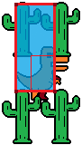
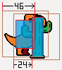
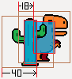
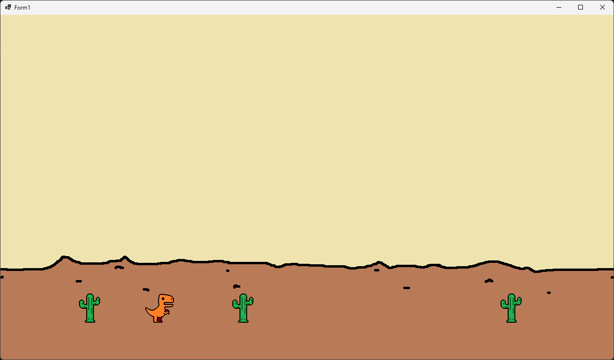
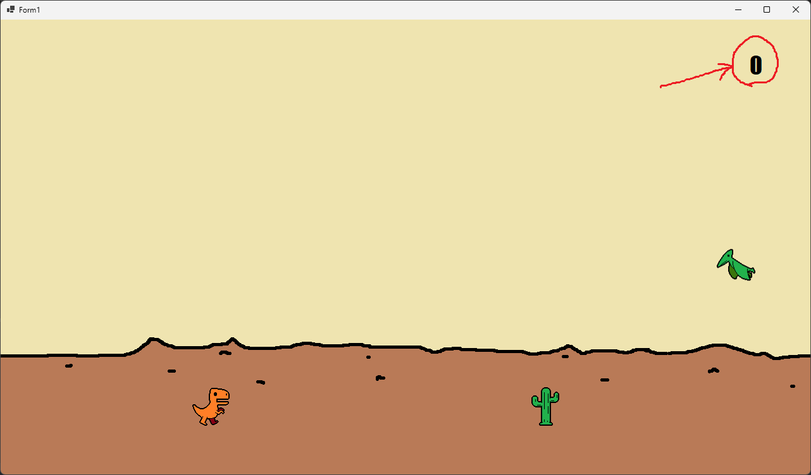
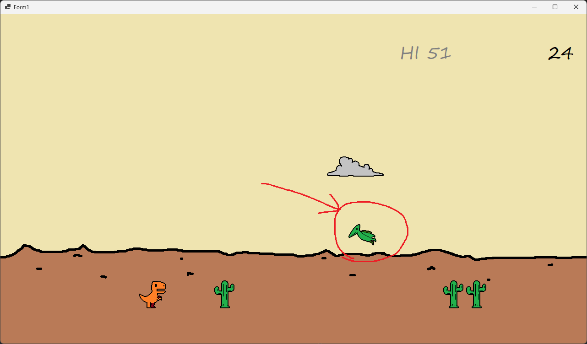

[C#言語2026 第08回]

# ジャンプゲームの改良

## キーポイント

* 変数を配列に変える場合、変数を使っているすべての箇所に「添字」を追加する
* 配列のすべての要素を処理するには for 文を使う
* `}`が多い部分では、`}`に「どのブロックの終わりか」を示すコメントを書くとよい
  ```c#
  } // サボテンの移動
  ```
* 連続した数値の列(数列)を作るには、`Enumerable`型の`Range`メソッドを使う
  ```c#
  Enumerable.Range(最初の数値, 個数);
  ```
* 配列をシャッフルするには、`Random`型の`Shuffle`メソッドを使う
  ```c#
  Random型の変数.Shuffle(配列変数);
  ```
* `Bitmap`などの複雑な型を配列にするには、個々の要素を`new`で作成する
  ```c#
  Bitmap[] bmp = { new("A.png"), new("B.png"), new("C.png") };
  ```

## 1 要素の追加

### 1.1 サボテンの数を増やす

前回のテキストでは、Windowsアプリ版のジャンプゲームを作成しました。<br>
ですが、まだ「とりあえず動く」といった段階で、「ゲームとして面白い」という段階には達していません。

そこで今回は、さまざまな **要素の追加** や **手触りの改善** を行い、 **ゲームとして面白い** という状態を目指します。<br>
次のページに、追加・改良点のリストを示します。

<div style="page-break-after: always"></div>

**追加・改良点のリスト**

> 1. 要素の追加
>    * サボテンを増やす
>    * 衝突判定の改善
>    * サボテンの出現位置をランダムにする
>    * スコア、ハイスコア
>    * 徐々にスピードアップ
> 2. 手触りの改善
>    * アニメーション
>    * 効果音とBGMを再生
>    * 背景スクロール
> 3. 要素をさらに追加
>    * 翼竜を出す
>    * 翼竜の出現位置を調整

まず、サボテンを配列にして数を増やします。これは、コンソールアプリと同じ手順で実現できます。<br>
つまり、以下の5つを変えることになります。

1. 変数の宣言
2. サボテンを描く
3. 移動
4. 衝突
5. 再スタート

それでは、「1. 変数の宣言」から配列に変えていきましょう。<br>
次のように、`sabotenX`変数を3要素の配列に書き換えてください。

```diff
     private static float dinoX = 300.0f; // 恐竜のX座標
     private static float dinoY = 580.0f; // 恐竜のY座標
     private static bool isJumping = false; // ジャンプ中ならtrue
     private static float jumpSpeed = 0.0f; // ジャンプの速度

     // サボテンの変数
-    private static float sabotenX = 1280.0f; // サボテンのX座標
+    private static float[] sabotenX = { 1280.0f, 1780.0f, 1830.0f }; // サボテンのX座標
     private static float sabotenY = 580.0f;  // サボテンのY座標

     // ペイントイベントで実行されるメソッド
     private static void OnPaint(object? sender, PaintEventArgs event)
```

追加した2つのサボテンの座標は、ジャンプが少し難しくなるように並べて配置してみました。

次に、「サボテンを描く」プログラムを配列に対応させます。<br>
サボテンを描くプログラムを、次のように変更してください。

```diff
       g.InterporationMode = InterporationMode.Bilinear;
       g.CompositingMode = CompositingMode.SourceOver;
       g.DrawImage(bmpDino, dinoX, dinoY, 64, 64);

       // サボテンを描く
+      for (int a = 0; i < sabotenX.Length; a += 1)
+      {
-        g.DrawImage(bmpSaboten, sabotenX, sabotenY, 64, 64);
+        g.DrawImage(bmpSaboten, sabotenX[a], sabotenY, 64, 64);
+      }

       // ゲームオーバー状態の表示
       if (gameState == gsGameover)
```

このプログラムでは、サボテンを描く`DrawImage`メソッドをfor文のブロックで囲み、`sabotenX`変数に添字(そえじ)`[a]`を追加しています。このやりかたは「変数を配列に変える場合の基本的な手順」です。

続いて、「3. 移動」を配列に対応させます。やりかたは「2. サボテンを描く」と同じです。<br>
サボテンを左に移動するプログラムを、次のように変更してください。

```diff
       if (GetAsyncKeyState(vkRight) < 0)
       {
           dinoX += 10.0f;
       }

       // サボテンを左に移動
+      for (int a = 0; a < sabotenX.Length; a += 1)
+      {
-        sabotenX -= 6.0f;
+        sabotenX[a] -= 6.0f;

         // サボテンが左端まで来たら右端に戻す
-        if (sabotenX < 0.0f)
+        if (sabotenX[a] < 0.0f)
         {
-          sabotenX = 1280.0f;
+          sabotenX[a] = 1280.0f;
         }
+      } // サボテンの移動の終わり

       // 恐竜とサボテンの衝突判定
       if (sabotenX > dinoX - 64.0f && sabotenX < dinoX + 64.0f &&
```

移動プログラムのすぐ下には、「4. 衝突」のプログラムがあります。こちらも配列に対応させます。<br>
恐竜とサボテンの衝突判定プログラムを、次のように変更してください。

```diff
           sabotenX[a] = 1280.0f;
         }
       } // サボテンの移動の終わり

       // 恐竜とサボテンの衝突判定
+      for (int a = 0; a < sabotenX.Length; a += 1)
+      {
-        if (sabotenX > dinoX - 64.0f && sabotenX < dinoX + 64.0f &&
+        if (sabotenX[a] > dinoX - 64.0f && sabotenX[a] < dinoX + 64.0f &&
             sabotenY > dinoY - 64.0f && sabotenY < dinoY + 64.0f)
         {
           // ゲームオーバー状態にする
           gameState = gsGameover;
         }
+      } // 恐竜とサボテンの衝突判定の終わり
     }
     else if (gameState == gsGameover)
```

複数の`}`が連続する場所では、`}`記号と対になる`{`記号の関係が分かりにくくなりがちです。<br>
そのため、プログラムを書く位置を間違えてしまうことがあります。<br>
そんなときは、一部の`}`記号に「どのブロックの終わりか」を示すコメントを書いておくと、間違えにくくなります。

> **【コメントはどれくらい書けばいいの？】**<br>
> すべての`}`記号にコメントを入れるのは **やりすぎ** です。<br>
> 「`}`が多くて分かりにくいな」と感じた`}`にだけコメントを書きます。

それでは、最後の「5. 再スタート」を配列に対応させましょう。<br>
再スタートを行うプログラムを、次のように変更してください。

```diff
         dinoX = 300.0f;
         dinoY = 580.0f;
         isJumping = false;
         jumpSpeed = 0.0f;

         // サボテンを初期状態に戻す
-        sabotenX = 1280.0f;
+        sabotenX[0] = 1280.0f;
+        sabotenX[1] = 1780.0f;
+        sabotenX[2] = 1830.0f;

         // プレイ中の状態にする
         gameState = gsPlay;
       }
```

プログラムの変更が終わったら、`>DinoRun`ボタンをクリックしてアプリを実行してください。サボテンの数が増えていたら成功です。

### 1.2 衝突判定の改善

現在の恐竜とサボテンの衝突判定は、画像の大きさを元にしています。ですが、画像の端のほうは透明なドットばかりで、実際に描かれる物体は画像より少し小さいです。

そのため、画像の大きさで衝突判定をすると、「見かけは当たっていない」のに、「プログラムでは当たっている」と判定されてしまいます。これでは、プレイヤーとしては納得しにくいでしょう。

納得感を高めるには、「見かけ」と「プログラム」の違いを小さくする必要があります。これは、適切な判定になるまで、判定に使う範囲を小さくすればOKです。

問題は、 **具体的に、どこまで小さくすればいいのか** という点です。これは、画像を見て透明なドット数を調べたり、尻尾の先などの「これが当たった程度で死ぬのは理不尽」という部分を除外して決めます。

以下の画像の水色の部分は、上記の条件を考慮した範囲の例です。<br>
恐竜の範囲は`(18,12)`～`(46,52)`、サボテンの範囲は`(24,4)`～`(40,60)`にしています。

<div align="center">&emsp;
</div>

この2つの範囲を合成すると、以下の右側の画像になります。範囲が小さくなっていることが分かります。<br>
サボテンの **範囲の左上座標** がこの水色の範囲に入っていたら、衝突しています。

<div align="center">&emsp;<br>[左=以前の衝突範囲&emsp;右=今回の衝突範囲]</div>

さて、今回は物体の原点(画像の赤点)と、範囲の原点(水色の四角形の左上)が異なります。このような場合、以下の2つの条件を調べることで「範囲AとBの重なり状態」を調べられます。

1. 範囲Aの左端が、範囲Bの右端より右にある(Aの左端座標がBの右端座標未満)
2. 範囲Aの右端が、範囲Bの左端より左にある(Aの右端座標がBの左端座標以上)

範囲Aをサボテン、範囲Bを恐竜として、条件1を考えましょう。<br>
サボテンの左側は、原点から`24`ドット目です。恐竜の右側は、原点から`46`ドット目です。

つまり、条件1の式は、`sabotenX + 24 < dinoX + 46`となります。<br>
同様に考えると、条件2の式は、`sabotenX + 40 >= dinoX + 18`となります。

<div align="center">&emsp;
</div>

それから、Y座標についても2つの式を求めます。<br>
Y座標の条件1の式は`sabotenY + 4 < dinoY + 52`となります。<br>
そして、条件2の式は`sabotenY + 40 >= dinoY + 12`です。

これらの式で衝突判定を書き換えましょう。恐竜とサボテンの衝突判定を、次のように変更してください。

```diff
       // 恐竜とサボテンの衝突判定
       for (int a = 0; a < sabotenX.Length; a += 1)
       {
+        // 恐竜の範囲(18,12)-(46,52)
+        // サボテンの範囲(24,4)-(40,60)
-        if (sabotenX[a] > dinoX - 64.0f && sabotenX[a] < dinoX + 64.0f &&
-            sabotenY > dinoY - 64.0f && sabotenY < dinoY + 64.0f)
+        if (sabotenX[a] + 24.0f <  dinoX + 46.0f &&
+            sabotenX[a] + 40.0f >= dinoX + 18.0f &&
+            sabotenY + 4.0f <   dinoY + 52.0f &&
+            sabotenY + 40.0f >= dinoY + 12.0f)
         {
           // ゲームオーバー状態にする
           gameState = gsGameover;
```

プログラムの変更が終わったら、`>DinoRun`ボタンをクリックしてアプリを実行してください。<br>
かなりサボテンに近づくまで衝突と判定されず、サボテンが避けやすくなっていたら成功です。

> if文の条件式を4行に分けたのは、2行で書くには紙面の横幅が足りないからです。<br>
> 書き写すときは、行を分ける必要はありません。

<div style="page-break-after: always"></div>

### 1.3 ゲームの展開に変化をつける

サボテンは増えましたが、出現間隔が毎回同じではすぐ飽きてしまいます。そこで、間隔をランダムにしましょう。<br>
仮想キー番号を宣言するプログラムの下に、次のプログラムを追加してください。

```diff
     const int vkUp = 38;        // 矢印キー(上)
     const int vkRight = 39;     // 矢印キー(右)
     const int vkDown = 40;      // 矢印キー(下)
+
+    // 乱数
+    private static Random rand = new();

     // ゲームの状態
     const int gsPlay = 0;     // プレイ状態
     const int gsGameover = 1; // ゲームオーバー状態
```

サボテンの出現位置をランダムにして、それでいて重ならないようにするため、次の方法を使います。

1. すべてのサボテンが左の画面外に出るまで待つ
2. サボテンの出現位置を40ドット単位で32箇所に分け、0～31の番号を振る
3. 番号をランダムに入れ替える(シャッフルする)
4. シャッフルした番号の先頭から3個を、新しいサボテンの出現位置とする

すべてのサボテンが画面外に出たことを調べるには、「画面外に出たサボテンの数」を数えます。<br>
サボテンを右端に戻すプログラムを、次のように変更してください。

```diff
       if (GetAsyncKeyState(vkRight) < 0)
       {
           dinoX += 10.0f;
       }

       // サボテンを左に移動
+      int passedSabotenCount = 0; // 画面外に出たサボテン数
       for (int a = 0; a < sabotenX.Length; a += 1)
       {
         sabotenX[a] -= 6.0f;

-        // サボテンが左端まで来たら右端に戻す
+        // サボテンが左端まで来たら「画面外に出たサボテン数」を増やす
         if (sabotenX[a] < 0.0f)
         {
-          sabotenX[a] = 1280.0f;
+          passedSabotenCount += 1;
         }
       } // サボテンの移動の終わり
```

このプログラムでは、サボテンを左に移動するfor文で、「画面外に出たサボテンの数」をかぞえています。<br>
for文が終了したとき、`passedSabotenCount`(パスド・サボテン・カウント)が「サボテンの個数」以上なら、<br>
すべてのサボテンが画面外に出ています。

すべて画面外に出ていたら、新しい出現位置を決めます。<br>
`0`～`31`の数値の列を作るには`Enumerable`(イニューメラブル、「数えられる」という意味)型を使います。<br>
数列の作成には、`Enumerable`型の以下のメソッドを使います。

* `Range`(レンジ、「範囲」という意味)メソッド: 連続した数値の列(数列)を作る
* `ToArray`(トゥ・アレイ、「配列にする」という意味)メソッド: 数列を配列に変換する

それから、配列をシャッフルするには`Random`型の`Shuffle`(シャッフル)メソッドを使います。<br>
それでは、サボテンを左に移動させるプログラムの下に、次のプログラムを追加してください。

```diff
         if (sabotenX[a] < 0.0f)
         {
           passedSabotenCount += 1;
         }
       } // サボテンの移動の終わり
+
+      // すべてのサボテンが画面外に出ていたら、サボテンを右端に戻す
+      if (passedSabotenCount >= sabotenX.Length)
+      {
+        int[] x = Enumerable.Range(0, 32).ToArray(); // 0～31の数列を配列に変換する
+        rand.Shuffle(x);
+        for (int a = 0; a < sabotenX.Length; a += 1)
+        {
+          sabotenX[a] = 1280 + x[a] * 40;
+        }
+      }

       // 恐竜とサボテンの衝突判定
       for (int a = 0; a < sabotenX.Length; a += 1)
       {
```

`Range`メソッドのパラメータは「最初の数値」と「作成する個数」です。<br>
今回は`0`から`31`まで32個の数値を作りたいので、`(0, 32)`としています。<br>
そして、`Suffle`メソッドを使って、作成した数列`x`をランダムな順番に並び替えます。

新しいサボテンのX座標は、「右の画面外の1画面分の範囲」からランダムに選ばれます。<br>
計算式の`40`という数値は、「サボテンの端がすこし重なる程度の、切りの良い間隔」として選びました。

>`32`という数列の個数は、この`40`という間隔から逆算して決めました(`1280 / 40 = 32`)。

<div style="page-break-after: always"></div>

#### メソッド・チェーン

`.`(ドット)記号でメソッドをつなぐと、前のメソッドの戻り値に対して、次のメソッドを呼び出すことができます。<br>
この書きかたを「メソッド・チェーン」といいます。

例えば、上記のプログラムの場合、`Range`メソッドの戻り値に対して`ToArray`メソッドを呼び出しています。メソッドチェーンは必要なだけ続けられます。

プログラムを変更したら、`>DinoRun`ボタンをクリックしてアプリを実行してください。<br>
サボテンの出現間隔が予測できなくなっていたら成功です。

<div align="center"></div>

### 1.4 得点を表示する

ゲームに「たくさんサボテンを避けたこと証明する機能」があると、やり甲斐が生まれます。<br>
証明の簡単な方法は、プレイ時間に応じて得点を付けることです。というわけで、得点機能を追加しましょう。

#### 1.4.1 フォントサイズに「拡大/縮小」設定を反映する

Windowsのディスプレイ設定には「拡大/縮小」という項目があります。<br>
これは、画面のドットが細かすぎて文字が読みづらい場合に、表示を調整するための機能です。

`Font`クラスを作成するときは、この「拡大/縮小」を考慮した大きさを指定する必要があります。<br>
そうしないと、文字の大きさが「拡大/縮小」の設定によって変わってしまいます。

拡大縮小の設定は、フォームの`DeviceDpi`(デバイス・ディーピーアイ)プロパティで調べられます。<br>
これは、「フォーム作成後」でないと拡大縮小の設定を調べられない、ことを意味します。

>`DPI`は「ドット・パー・インチ」の略語で、「長さ1インチ(2.54cm)に含まれるドット数」という意味です。

ところが、現在のプログラムでは、フォントはフォームの作成より前に読み込んでいます。<br>
このタイミングで読み込んでも、拡大/縮小を反映できません。<br>
そこで、順番を「フォームを作成してからフォントを読み込む」ように変更します。

<div style="page-break-after: always"></div>

まず、フォント用変数の宣言を、次のように変更してください。

```diff
     const int gsPlay = 0;     // プレイ状態
     const int gsGameover = 1; // ゲームオーバー状態
     private static int gameState = gsPlay; // 現在のゲーム状態

     // フォント
-    private static Font font = new("Impact", 48.0f);
+    private static Font font = null !;

     // ファイルから画像を読み込む
     private static Bitmap bmpBackground = new("assets/images/bg_yellow.png");
     private static Bitmap bmpDino = new("assets/images/dino_0.png");
```

`null`(ヌル)は「データが存在しない」ことをあらわすキーワードです。<br>
`null`の後ろに`!`(びっくりマーク)記号を入れることに注意してください。この`!`記号は、

&emsp;**本当はデータが必要だけど、今だけ無くてもいいことにしたい**

という場合に、`null`キーワードの直後に付けます。

>実は`null`と`!`のあいだに、空白は不要です(`null!`でOK)。<br>
>上のプログラムで空白を入れているのは、見間違いを防ぐためです。

基本的に、C#の変数は初期値を設定して使うものです。<br>
そのため、「何も無い」状態を作ろうとすると「それ、危ないですよ」と **警告** されます(実行は可能)。<br>
`!`記号を付けると「私(プログラマ)はこの危険に責任を持ちます」と表明したことになり、警告されなくなります。

それでは、フォントを読み込みましょう。<br>
フォームを作成して表示するプログラムの下に、フォントを読み込むプログラムを追加してください。

```diff
     form.ClientSize = new(1280, 720); // ウィンドウのサイズを変更
     form.Paint += OnPaint; // ペイントイベントにメソッドを追加
     form.Show();
+
+    // 現在のDPIに合わせてフォントを作成
+    float dpiScale = 96.0f / form.DeviceDpi; // 拡大率
+    font = new("Impact", 48.0f * dpiScale);

     Stopwatch stopwatch = new(); // 繰り返し時間の管理用のストップウオッチ

     // ゲームループ
     for (; ; )
```

`DeviceDpi`プロパティの値は、基本値の`96`に、拡大/縮小の設定を掛けた数値になります。<br>
変数`dpiScale`(ディーピーアイ・スケール)は、「拡大/縮小を打ち消すための拡大率」です。<br>
例えば、拡大縮小の設定が100%のDPIは基本値と同じ`96`なので、拡大率は`1.0`になります。

そして、`dpiScale`変数を掛けたフォントの大きさを使って、フォントを作成しています。

#### 1.4.2 得点を表示する

新しいフォントを作成して、得点を表示しましょう。<br>
そのために、現在の得点をあらわす変数と、得点表示用のフォントを追加します。<br>
ゲームの状態とフォントの宣言に、次の変数宣言を追加してください。

```diff
     // ゲームの状態
     const int gsPlay = 0;     // プレイ状態
     const int gsGameover = 1; // ゲームオーバー状態
     private static int gameState = gsPlay; // 現在のゲーム状態
+    private static int score = 0;          // 現在のゲームの得点

     // フォント
     private static Font font = null !;
+    private static Font fontScore = null !;

     // ファイルから画像を読み込む
     private static Bitmap bmpBackground = new("assets/images/bg_yellow.png");
     private static Bitmap bmpDino = new("assets/images/dino_0.png");
```

それから、`fontScore`(フォント・スコア)変数にフォントを読み込みます。<br>
`Main`メソッドにあるフォントを作成するプログラムに、次のプログラムを追加してください。

```diff
     // 現在のDPIに合わせてフォントを作成
     float dpiScale = 96.0f / form.DeviceDpi; // 拡大率
     font = new("Impact", 48.0f * dpiScale);
+    fontScore = new("Impact", 26.0f * dpiScale);

     Stopwatch stopwatch = new(); // 繰り返し時間の管理用のストップウオッチ

     // ゲームループ
     for (; ; )
```

<div style="page-break-after: always"></div>

それでは、得点を表示しましょう。`OnPaint`メソッドに、得点を表示するプログラムを追加してください。

```diff
       for (int a = 0; i < sabotenX.Length; a += 1)
       {
         g.DrawImage(bmpSaboten, sabotenX[a], sabotenY, 64, 64);
       }
+
+      // 得点を表示
+      TextRenderer.DrawText(
+        g, score.ToString(), fontScore, new Point(1100, 50), Color.Black);

       // ゲームオーバー状態の表示
       if (gameState == gsGameover)
```

得点の表示には`TextRenderer.DrawText`メソッドを使います。<br>
ですが、`score`変数は`int`型で文章ではないので、そのままでは`DrawText`メソッドに渡せません。<br>
そこで、`ToString`メソッドによって`string`型に変換してから表示しています。

プログラムを追加したら、`>DinoRun`ボタンをクリックしてアプリを実行してください。<br>
ウィンドウの右上に、得点をあらわす`0`が表示されていたら成功です。

<div align="center"></div>

<pre class="tnmai_assignment">
<strong>【課題01 いいかんじのフォントに変える】</strong>
Impactフォントは主張が強いデザインなので、得点のように常に表示される場合は違和感があります。
違和感をなくすために、もっと見やすいデザインのフォントに変えなさい。

PCにインストールされているフォントを調べるには、スタートメニューから次の項目を選択します。
  設定→個人用設定→フォント
</pre>

<div style="page-break-after: always"></div>

#### 1.4.3 得点を増やす

あとは、得点を増やすだけです。「プレイ中」のゲーム状態のプログラムに、次のプログラムを追加してください。

```diff
     if (gameState == gsPlay)
     {
       // ゲーム状態が「プレイ中」の場合
+
+      // 得点を増やす
+      score += 1;

       // ジャンプしていないとき、スペースキーが押されたらジャンプ開始
       if (isJumping == false && GetAsyncKeyState(VkSpace) < 0)
```

プログラムを追加したら、`>DinoRun`ボタンをクリックしてアプリを実行してください。<br>
ウィンドウの右上の数字がどんどん増えていったら成功です。

### 1.5 最高得点を表示する

前のプレイよりも良い結果を目指すには、前のプレイの得点を覚えておく必要があります。<br>
ゲームの状態変数を宣言するプログラムに、最高得点の変数宣言を追加してください。

```diff
     const int gsPlay = 0;     // プレイ状態
     const int gsGameover = 1; // ゲームオーバー状態
     private static int gameState = gsPlay; // 現在のゲーム状態
+    private static int highScore = 0;      // 過去のゲームの最高得点
     private static int score = 0;          // 現在のゲームの得点

     // フォント
     private static Font font = null !;
```

次に、最高得点を表示します。得点を表示するプログラムに、次のプログラムを追加してください。

```diff
       // 得点を表示
       TextRenderer.DrawText(
         g, score.ToString(), fontScore, new Point(1100, 50), Color.Black);
+      TextRenderer.DrawText(
+        g, "HI " + highScore, fontScore, new Point(860, 50), Color.Gray);

       // ゲームオーバー状態の表示
       if (gameState == gsGameover)
```

それから、一番重要な、最高得点を更新するプログラムを作ります。<br>
恐竜とサボテンの衝突判定プログラムに、最高得点を更新するプログラムを追加してください。

```diff
         if (sabotenX[a] + 24.0f <  dinoX + 46.0f &&
             sabotenX[a] + 40.0f >= dinoX + 18.0f &&
             sabotenY + 4.0f <   dinoY + 52.0f &&
             sabotenY + 40.0f >= dinoY + 12.0f)
         {
+          // 最高得点を更新
+          if (score > highScore)
+          {
+            highScore = score;
+          }
+
           // ゲームオーバー状態にする
           gameState = gsGameover;
```

最高得点のプログラムを追加したら、`>DinoRun`ボタンをクリックしてアプリを実行してください。<br>
ゲームオーバーになったとき、最高得点が更新されたら成功です。

### 1.6 サボテンを徐々に速くする

サボテンの数を増やし、出現間隔をランダムにしたことで、ゲームの単調さはある程度改善されています。<br>
ですが、平均的な難易度は変わっていないので、何度も遊びたくなるレベルには到達していません。

そこで、サボテンの移動速度を徐々に速くすることで、ゲームの難易度が上がっていくようにしましょう。<br>
サボテンの変数を宣言するプログラムに、速度の変数宣言を追加してください。

```diff
     // サボテンの変数
     private static float[] sabotenX = { 1280.0f, 1780.0f, 1830.0f }; // サボテンのX座標
     private static float sabotenY = 580.0f; // サボテンのY座標
+    private static float sabotenSpeed = 6.0f; // サボテンの速度

     // ペイントイベントで実行されるメソッド
     private static void OnPaint(object? sender, PaintEventArgs event)
```

変数名は`sabotenSpeed`(サボテン・スピード、「サボテンの速度」という意味)としました。

<div style="page-break-after: always"></div>

それでは、サボテンの移動速度を徐々に速くしましょう。<br>
サボテンを右端に戻すプログラムの中に、サボテンの移動速度を更新するプログラムを追加してください。

```diff
         int[] x = Enumerable.Range(0, 32).ToArray(); // 0～31の数列を配列に変換する
         rand.Shuffle(x);
         for (int a = 0; a < sabotenX.Length; a += 1)
         {
           sabotenX[a] = 1280 + x[a] * 40;
         }
+
+        // サボテンの移動速度を更新
+        sabotenSpeed += 0.5f;
       }

       // 恐竜とサボテンの衝突判定
       for (int a = 0; a < sabotenX.Length; a += 1)
```

続いて、サボテンを左に移動させるプログラムを、`sabotenSpeed`変数を使うように変更してください。

```diff
       // サボテンを左に移動
       int passedSabotenCount = 0; // 画面外に出たサボテン数
       for (int a = 0; a < sabotenX.Length; a += 1)
       {
-        sabotenX[a] -= 6.0f;
+        sabotenX[a] -= sabotenSpeed;

         // サボテンが左端まで来たら「画面外に出たサボテン数」を増やす
         if (sabotenX[a] < 0.0f)
```

サボテンの速度を上げるプログラムを追加したら、`>DinoRun`ボタンをクリックしてアプリを実行してください。徐々にサボテンの速度が速くなったら成功です。

<pre class="tnmai_assignment">
<strong>【課題02 サボテンの速度制限】</strong>
サボテンの速度は無限に速くなります。ですが、あまり速すぎるとゲームになりません。
サボテンの速度を更新した直後に、最高速度を「1/60秒ごとに20ドット」に制限するプログラムを追加しなさい。
</pre>

<pre class="tnmai_assignment">
<strong>【課題03 サボテンの速度を戻す】</strong>
ゲームオーバーになって再スタートするとき、サボテンの速度に<code>6.0f</code>を代入して、元の速度に戻しなさい。
</pre>

<div style="page-break-after: always"></div>

## 2 手触りの改善

### 2.1 アニメーション

画像をアニメーションさせると、キャラクターが「生きている」という感覚が生まれて、没入感を高められます。<br>
2Dゲームの基本的なアニメーションは、複数の画像を定期的に切り替えることで実現します。<br>
つまり、複数の画像を読み込まねばなりません。これは配列を使うのが簡単です。

`Bitmap`型のような「少し複雑な型」も配列にできます。`int`型配列との違いは、データを作成するときに`new`メソッドを使うことだけです。それでは、恐竜の画像変数の宣言を、次のように変更してください。

```diff
     // ファイルから画像を読み込む
     private static Bitmap bmpBackground = new("assets/images/bg_yellow.png");
-    private static Bitmap bmpDino = new("assets/images/dino_0.png");
+    private static Bitmap[] bmpDino =
+    {
+      new("assets/images/dino_0.png"),
+      new("assets/images/dino_1.png"),
+      new("assets/images/dino_0.png"),
+      new("assets/images/dino_2.png"),
+    };
     private static Bitmap bmpSaboten = new("assets/images/saboten_0.png");

     // 恐竜の変数
     private static float dinoX = 300.0f; // 恐竜のX座標
```

恐竜にはアニメーション用に3枚の画像があります。0番は足がまっすぐな絵、1番と2番はそれぞれ右足と左足を前に出した絵になっています。0番の絵は、1番と2番の中間の状態の絵なので、2回読み込みます。

画像を切り替えるタイミングは、経過時間をあらわす変数を使って制御します。<br>
変数名は`dinoAnimeTimer`(ディノ・アニメ・タイマー、「恐竜アニメ用の計時器」という意味)とします。<br>
恐竜の変数宣言に、アニメーション用の経過時間をあらわす変数の宣言を追加してください。

```diff
     private static float dinoX = 300.0f; // 恐竜のX座標
     private static float dinoY = 580.0f; // 恐竜のY座標
     private static bool isJumping = false; // ジャンプ中ならtrue
     private static float jumpSpeed = 0.0f; // ジャンプの速度
+    private static float dinoAnimeTimer = 0.0f; // 恐竜のアニメーション経過時間

     // サボテンの変数
     private static float[] sabotenX = { 1280.0f, 1780.0f, 1830.0f }; // サボテンのX座標
```

画像の切り替えは、配列の添字を変えるだけです。<br>
`OnPaint`メソッドにある恐竜を描くプログラムを、次のように変更してください。

```diff
       // 恐竜を描く
       g.InterporationMode = InterporationMode.Bilinear;
       g.CompositingMode = CompositingMode.SourceOver;
-      g.DrawImage(bmpDino, dinoX, dinoY, 64, 64);
+      g.DrawImage(bmpDino[(int)dinoAnimeTimer], dinoX, dinoY, 64, 64);

       // サボテンを描く
       for (int a = 0; i < sabotenX.Length; a += 1)
```

このプログラムでは、タイマーの数値を`int`型に変換して添字としています。<br>
ですから、添字として有効な範囲に収まるように、タイマーを適切に更新しなくてはなりません。

それでは、タイマーを更新しましょう。<br>
`Main`メソッドの得点を増やすプログラムの下に、タイマーを更新するプログラムを追加してください。

```diff
       // ゲーム状態が「プレイ中」の場合

       // 得点を増やす
       score += 1;
+
+      // 恐竜アニメのタイマーを更新
+      dinoAnimeTimer += 0.2f;
+      if (dinoAnimeTimer >= bmpDino.Length)
+      {
+        dinoAnimeTimer -= bmpDino.Length; // タイマーを最初に戻す
+      }

       // ジャンプしていないとき、スペースキーが押されたらジャンプ開始
       if (isJumping == false && GetAsyncKeyState(VkSpace) < 0)
```

タイマーに加算する数値によって、画像を切り替える速度を変えられます。今回は`0.2`としてみました。<br>
ゲームループの実行間隔は1/60秒ですから、`0.2`は`5/60`秒で1枚切り替わる速度になります。

また、タイマーの値はそのまま配列の添字になります。<br>
そこで、if文を使って「添字の有効範囲」を越えないように制御しています。

アニメーションのプログラムを追加したら、`>DinoRun`ボタンをクリックしてアプリを実行してください。<br>
恐竜がアニメーションしていたら成功です。

>配列を使うと、アニメーションのような「順序付けられたデータ」を簡単に表現できます。

### 2.2 音声パッケージを追加する

C#アプリで音声を鳴らす場合、OSの`PlaySound`メソッドを使うのが簡単です。<br>
ですが、`PlaySound`には「音を鳴らすタイミングがOS次第」という問題があります。

アクション性の低いゲームでは、少しくらい再生タイミングがずれてもあまり気にならないでしょう。<br>
ですが、アクションゲームの場合、「ジャンプの音が着地してから鳴る」というのはかなり大きな問題です。

そこで、すぐに音が再生される音声機能を追加します。<br>
音声機能は複数存在しますが、今回はゲーム向けの`SFML.Audio`(エスエフエムエル・オーディオ)を使います。<br>
Visual Studioで機能を追加するには「NuGet(ヌーゲット)パッケージの管理」という機能を使います。

ソリューションエクスプローラーのプロジェクト名`DinoRun`を右クリックします。<br>
右クリックメニューが開くので、「NuGetパッケージの管理」という項目をクリックします。

<div align="center"></div>

すると、NuGetウィンドウが開きます。<br>
NuGetウィンドウ上部にある「参照」をクリックし、「検索」ボックスに`sfml.audio`と入力してください。

<div align="center"></div>

すると、`SFML.Audio`(エスエフエムエル・オーディオ)というパッケージが表示されます。<br>
複数のパッケージが表示されますが、必要なのは`SFML.Audio`とだけ書かれているパッケージだけです。

それでは、`SFML.Audio`パッケージをクリックしてください。すると、右側にパッケージの詳細が表示されます。<br>

>ここでうっかり作成者名のリンクをクリックすると、Webブラウザが開いて作者のページが表示されます。

詳細の右上にある「インストール」ボタンをクリックしてください。

<div align="center"></div>

すると、インストールされるパッケージの一覧が表示されます。<br>
右下の「適用」ボタンをクリックしてください。すると、インストールが行われます。

<div align="center"></div>

<div style="page-break-after: always"></div>

### 2.3 ジャンプの効果音を鳴らす

それでは、`SFML.Audio`(エスエフエムエル・オーディオ)パッケージを使って音声を再生しましょう。

`SFML.Audio`のクラスやメソッドは`SFML.Audio`名前空間で宣言されています。<br>
何度も名前空間を書くのは手間ですから、`using`を使って名前を省略できるようにしましょう。<br>
`Program.cs`の先頭に、次のプログラムを追加してください。

```diff
 using System.Runtime.InteropServices;
 using System.Drawing.Drawing2D;
 using System.Diagnostics;
+using SFML.Audio;
 
 namespace DinoRun
 {
     internal static class Program
```

`SFML.Audio`による音声再生には、以下の3つのクラスを使います。

* **SoundBuffer**(サウンド・バッファ): 音声ファイル全体を読み込む(効果音用)
* **Sound**(サウンド): 読み込んだファイルを再生する(効果音用)
* **Music**(ミュージック): 音声ファイルを必要な範囲だけ読み込んで再生する(BGM用)

手始めに「ジャンプ」の効果音を再生しましょう。<br>
フォント用の変数を宣言するプログラムの下に、音声用の変数を宣言するプログラムを追加してください。

```diff
     // フォント
     private static Font font = null !;
     private static Font fontScore = null !;
+
+    // 音声
+    private static SoundBuffer sbJump = new("assets/audio/jump.wav");
+    private static Sound soundJump = new(sbJump);

     // ファイルから画像を読み込む
     private static Bitmap bmpBackground = new("assets/images/bg_yellow.png");
     private static Bitmap[] bmpDino =
```

`SoundBuffer`型の変数宣言では、`new`メソッドのパラメータに「音声ファイル名」を指定します。<br>
`Sound`型の変数宣言では、`new`メソッドに「再生したい`SoundBuffer`型の変数」を指定します。

これで音声再生の準備は整いました。ジャンプ音を再生しましょう。<br>
音声再生は`Play`(プレイ、「再生」という意味)メソッドを実行するだけです。

それでは、スペースキーが押されたらジャンプ開始するプログラムに、次のプログラムを追加してください。

```diff
       // ジャンプしていないとき、スペースキーが押されたらジャンプ開始
       if (isJumping == false && GetAsyncKeyState(VkSpace) < 0)
       {
+        // ジャンプ音を再生
+        soundJump.Play();
+
         isJumping = true;     // ジャンプ状態にする
         jumpSpeed = -1600.0f; // 初速
```

プログラムが書けたら`>DinoRun`ボタンをクリックしてアプリを実行してください。<br>
ジャンプしたとき音声が再生されたら成功です。

### 2.4 BGMを鳴らす

今度はBGMを再生しましょう。BGMのように容量の大きい音声ファイルの再生には`Music`クラスを使います。<br>
音声用の変数を宣言するプログラムに、BGM用の変数宣言を追加してください。

```diff
     private static Font font = null !;
     private static Font fontScore = null !;

     // 音声
+    private static Music bgm = new("assets/audio/bgm_prehistoric.mp3");
     private static SoundBuffer sbJump = new("assets/audio/jump.wav");
     private static Sound soundJump = new(sbJump);
```

BGMの再生は`Play`メソッドを呼ぶだけです。また、`IsLooping`プロパティに`true`を設定すると、ループ再生できます。フォントを読み込むプログラムの下に、BGMを再生するプログラムを追加してください。

```diff
      font = new("Impact", 48.0f * dpiScale);
      fontScore = new("Segoe Print", 28.0f * dpiScale);
      fontTitle = new("Impact", 100.0f * dpiScale, FontStyle.Italic);
+
+     // BGMを再生
+     bgm.IsLooping = true;
+     bgm.Play();

      Stopwatch sw = new();

      // ゲームループ
```

プログラムが書けたら`>DinoRun`をクリックしてアプリを実行してください。BGMが再生されたら成功です。

### 2.5 背景を動かす

サボテンが移動するだけだと、画面の動きが少なくてさみしいです。そこで、背景も移動させましょう。<br>
サボテンの変数を宣言するプログラムの下に、背景の変数を宣言してください。

```diff
     private static float[] sabotenX = { 1280.0f, 1780.0f, 1830.0f }; // サボテンのX座標
     private static float sabotenY = 580.0f; // サボテンのY座標
     private static float sabotenSpeed = 6.0f; // サボテンの速度
+
+    // 背景の変数
+    private static float backgroundX = 0; // 背景のX座標

     // ペイントイベントで実行されるメソッド
     private static void OnPaint(object? sender, PaintEventArgs event)
```

次に、背景を描く座標を`(0, 0)`から変数に変えます。背景を描くプログラムを次のように変更してください。

```diff
       // 背景を描く
       g.InterporationMode = InterporationMode.NearestNeighbor;
       g.CompositingMode = CompositingMode.SourceCopy;
-      g.DrawImage(bmpBackground, 0, 0, 1280, 720);
+      g.DrawImage(bmpBackground, backgroundX, 0, 1280, 720);

       // 恐竜を描く
       g.InterporationMode = InterporationMode.Bilinear;
```

それから、背景のX座標を更新します。if文を使って、画面の左側まで移動し切ったら右側に戻すようにします。<br>
背景がサボテンより遠くにあるように見せたいので、移動速度はサボテンの半分にします。
サボテンを動かすプログラムの下に、背景を動かすプログラムを追加してください。

```diff
         // サボテンの移動速度を更新
         sabotenSpeed += 0.5f;
       }
+
+      // 背景を動かす
+      backgroundX -= sabotenSpeed * 0.5f;
+      if (backgroundX < -1280.0f)
+      {
+        backgroundX += 1280.0f;
+      }

       // 恐竜とサボテンの衝突判定
       for (int a = 0; a < sabotenX.Length; a += 1)
```

それから、ゲームオーバーから再スタートするときに、背景のX座標を元に戻す必要があります。<br>
再スタートのプログラムに、背景の座標を初期状態に戻すプログラムを追加してください。

```diff
         sabotenX[0] = 1280.0f;
         sabotenX[1] = 1780.0f;
         sabotenX[2] = 1830.0f;
+
+        // 背景を初期状態に戻す
+        backgroundX =0;

         // プレイ中の状態にする
         gameState = gsPlay;
```

プログラムを追加したら、`>DinoRun`ボタンをクリックしてアプリを実行してください。<br>
背景が移動していたら成功です。ですが、移動した後が、何も無い空白で表示されてしまいます。

この空白を埋めるには、1枚目の背景の右に、もう一枚背景を描く必要があります。<br>
背景を描くプログラムに、2枚目の背景を描くプログラムを追加してください。

```diff
       g.InterporationMode = InterporationMode.NearestNeighbor;
       g.CompositingMode = CompositingMode.SourceCopy;
       g.DrawImage(bmpBackground, backgroundX, 0, 1280, 720);
+      g.DrawImage(bmpBackground, backgroundX + 1279.5f, 0, 1280, 720);

       // 恐竜を描く
       g.InterporationMode = InterporationMode.Bilinear;
```

2枚目の画像のX座標は、画像サイズぴったりの1280ドットではなく、1279.5ドットずらしています。<br>
ぴったりにしてしまうと、拡大/縮小が100%でない場合に、画像のあいだに隙間ができることがあるからです。

プログラムを追加したら、`>DinoRun`ボタンをクリックしてアプリを実行してください。<br>
空白が無くなって、背景がずっと流れていくようになっていたら成功です。

<pre class="tnmai_assignment">
<strong>【課題04 雲を表示する】</strong>
画像ファイル<code>assets/images/cloud.png</code>を読み込み、空に表示するプログラムを追加しなさい。
</pre>

<pre class="tnmai_assignment">
<strong>【課題05 雲を動かす】</strong>
課題04で表示した雲をゆっくりと左へ動かすプログラムを追加しなさい。
雲が<strong>完全に</strong>画面外に消えたら、右端に戻すこと。
</pre>

## 3 要素をさらに追加

### 3.1 翼竜を出す

せっかく広い空があるのに、障害物が地上のサボテンだけ、というのはちょっとモッタイナイですね。<br>
なにか「空を飛ぶ障害物」を追加しましょう。

偶然にも、`images`フォルダには「翼竜(よくりゅう)」の画像があります。翼竜を出しましょう。<br>
サボテンの画像を読み込むプログラムの下に、翼竜の画像を読み込むプログラムを追加してください。

```diff
       new("assets/images/dino_1.png"),
       new("assets/images/dino_0.png"),
       new("assets/images/dino_2.png"),
     };
     private static Bitmap bmpSaboten = new("assets/images/saboten_0.png");
+    private static Bitmap[] bmpPtera =
+    {
+      new("assets/images/ptera_0.png"),
+      new("assets/images/ptera_1.png"),
+      new("assets/images/ptera_0.png"),
+      new("assets/images/ptera_2.png"),
+    };

     // 恐竜の変数
     private static float dinoX = 300.0f; // 恐竜のX座標
```

変数名は`bmpPtera`(ビーエムピー・プテラ、「翼竜のビットマップ画像」という意味)としました。<br>
また、翼竜には羽ばたきアニメーションがあるので、配列にして4枚の画像を読み込んでいます。

次に、翼竜の座標とアニメーション用の変数を宣言します。<br>
サボテンの変数宣言の下に、翼竜の変数を宣言するプログラムを追加してください。

```diff
     private static float[] sabotenX = { 1280.0f, 1780.0f, 1830.0f }; // サボテンのX座標
     private static float sabotenY = 580.0f; // サボテンのY座標
     private static float sabotenSpeed = 6.0f; // サボテンの速度
+
+    // 翼竜の変数
+    private static float pteraX = 1480.0f;    // 翼竜のX座標
+    private static float pteraY = 400.0f;     // 翼竜のY座標
+    private static float pteraAnimeTimer = 0; // 翼竜のアニメーション経過時間

     // 背景の変数
     private static float backgroundX = 0; // 背景のX座標
```

それでは、宣言した変数を使って翼竜を描きましょう。<br>
`OnPaint`メソッドのサボテンを描くプログラムの下に、翼竜を描くプログラムを追加してください。

```diff
       // サボテンを描く
       for (int a = 0; i < sabotenX.Length; a += 1)
       {
         g.DrawImage(bmpSaboten, sabotenX[a], sabotenY, 64, 64);
       }
+
+      // 翼竜を描く
+      g.DrawImage(bmpPtera[(int)pteraAnimeTimer], pteraX, pteraY, 64, 64);

       // 得点を表示
       TextRenderer.DrawText(
         g, "HI " + highScore.ToString(), fontScore, new Point(860, 50), Color.Gray);
```

続いて、アニメーション用プログラムを作成しましょう。<br>
サボテンを動かすプログラムの下に、翼竜のアニメーションを更新するプログラムを追加してください。

```diff
         // サボテンの移動速度を更新
         sabotenSpeed += 0.5f;
       }
+
+      // 翼竜のアニメーション
+      pteraAnimeTimer += 0.2f;
+      if (pteraAnimeTimer > bmpPtera.Length)
+      {
+        pteraAnimeTimer -= bmpPtera.Length;
+      }

       // 背景を動かす
       backgroundX -= sabotenSpeed * 0.5f;
       if (backgroundX < -1280.0f)
```

<div style="page-break-after: always"></div>

最後に、翼竜を移動させます。<br>
翼竜のアニメーションを更新するプログラムの下に、翼竜を動かすプログラムを追加してください。

```diff
       // 翼竜のアニメーション
       pteraAnimeTimer += 0.2f;
       if (pteraAnimeTimer > bmpPtera.Length)
       {
         pteraAnimeTimer -= bmpPtera.Length;
       }
+
+      // 翼竜を動かす
+      pteraX -= sabotenSpeed;
+      if (pteraX < 0.0f)
+      {
+        pteraX = 1280.0f + rand.Next(2560);
+      }

       // 背景を動かす
       backgroundX -= sabotenSpeed * 0.5f;
       if (backgroundX < -1280.0f)
```

翼竜の再出現の間隔は、サボテンの2倍の範囲にしてみました。<br>
翼竜が再出現するまでの平均時間を長くすると、翼竜がサボテンと一緒に出たり、出なかったりします。<br>
これには、ゲームの単調さを減らす狙いがあります。

>まだ単調だと感じたら、もっと間隔を長くしてみるとよいでしょう。

プログラムを追加したら、`>DinoRun`ボタンをクリックしてアプリを実行してください。<br>
空を飛ぶ緑の翼竜が表示されたら成功です。

<div align="center"></div>

<div style="page-break-after: always"></div>

### 3.2 翼竜の衝突判定

翼竜にも衝突判定を付けましょう。翼竜の衝突判定の範囲は、`(14,22)`～`(50, 46)`とします。

<div align="center">&emsp;</div>

恐竜の範囲は`(18,12)`～`(46,52)`です。<br>
これらの数値から、「翼竜の範囲」に対する「恐竜の範囲」の判定は以下のようになります。

&emsp;`pteraX + 14 <　dinoX + 46`<br>
&emsp;`pteraX + 50 >= dinoX + 18`<br>
&emsp;`pteraY + 22 <　dinoY + 52`<br>
&emsp;`pteraY + 46 >= dinoY + 12`

それでは、上記の式を使って、恐竜と翼竜の衝突判定を行いましょう。<br>
恐竜とサボテンの衝突判定プログラムの下に、恐竜と翼竜の衝突判定プログラムを追加してください。

```diff
           // ゲームオーバー状態にする
           gameState = gsGameover;
         }
       } // 恐竜とサボテンの衝突判定の終わり
+
+      // 恐竜と翼竜の衝突判定
+      // 恐竜の範囲(18,12)-(46,52)
+      // 翼竜の範囲(14,22)-(50,46)
+      if (pteraX + 14 <  dinoX + 46 &&
+          pteraX + 50 >= dinoX + 18 &&
+          pteraY + 22 <  dinoY + 52 &&
+          pteraY + 46 >= dinoY + 12)
+      {
+        // 最高得点を更新
+        if (score > highScore)
+        {
+            highScore = score;
+        }
+
+        // ゲームオーバー状態にする
+        gameState = gsGameover;
+      } // 恐竜と翼竜の衝突判定の終わり
     }
     else if (gameState == gsGameover)
```

翼竜と衝突したとき、サボテンの場合と同様に「最高得点を更新」している点に注目してください。<br>
ゲームオーバーになる場合はいつでも、最高得点を更新する必要があります。

プログラムを追加したら、`>DinoRun`ボタンをクリックしてアプリを実行してください。<br>
空を飛ぶ緑の翼竜が表示されたら成功です。

### 3.3 翼竜を上下に移動させる

翼竜が真っすぐ進むだけだと「飛んでいる」という感覚が薄いです。そこで、波のように上下に動かしてみましょう。

「波のような動き」は「SIN(サイン)カーブ」と呼ばれます。名前のとおり、三角関数の`sin`(サイン)関数を使って作ります。C#では、`sin`関数は`MathF.Sin`(マス・エフ・サイン、「`float`型用の数学のサイン関数」という意味)メソッドを使います。翼竜を動かすプログラムの下に、次のプログラムを追加してください。

```diff
       // 翼竜を動かす
       pteraX -= sabotenSpeed;
       if (pteraX < 0.0f)
       {
         pteraX = 1280.0f + rand.Next(2560);
       }
+
+      // 翼竜を縦方向に動かす
+      pteraY = 400.0f + MathF.Sin(pteraX * 0.01f) * 20.0f;

       // 背景を動かす
       backgroundX -= sabotenSpeed * 0.5f;
       if (backgroundX < -1280.0f)
```

このプログラムでは、基本のY座標を`400`として、`MathF.Sin`メソッドを使って変化を付けています。<br>
`MathF.Sin`メソッドの結果は`-1`～`1`の範囲です。<br>
わずか2ドットでは動いているように見えないので、20倍して`-20`～`20`の範囲の動きにしています。

プログラムを追加したら、`>DinoRun`ボタンをクリックしてアプリを実行してください。<br>
翼竜が上下に動きながら移動していたら成功です。

>`MathF.Sin`という名前は、数学を意味する`Math`(マス)、`float`型の`F`(エフ)、サイン関数の
>`Sin`で構成されています。`MathF`は、`float`型用の数学関数」がまとめられた名前空間です。

<pre class="tnmai_assignment">
<strong>【課題06 上下の揺れ幅を増やす】</strong>
翼竜の上下の揺れ幅がまだ少ないようです。
掛ける数値を<code>40</code>以上の適当な大きさに変更して、揺れ幅を大きくしなさい。
</pre>

<pre class="tnmai_assignment">
<strong>【課題07 】</strong>
現在、翼竜の基本Y座標は400に固定されています。基本Y座標をあらわす変数<code>pteraBaseY</code>を
追加して、右端に戻るたびに、出現する高さがランダムに変わるようにしなさい。
</pre>
