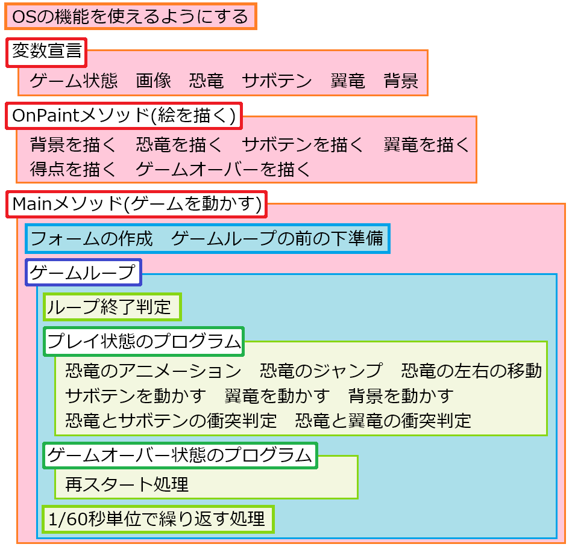
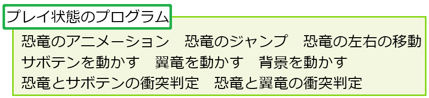
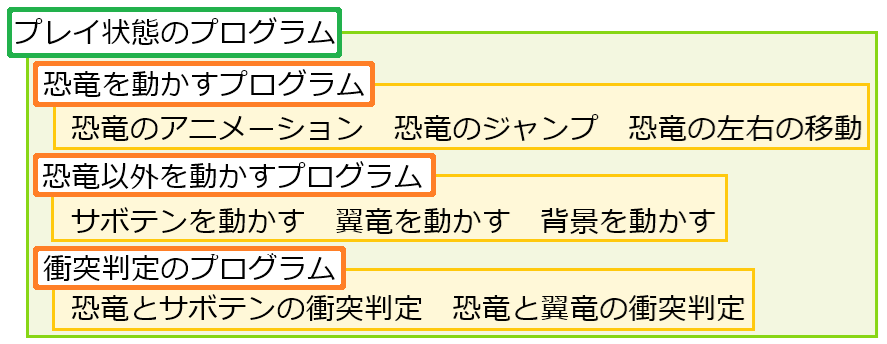

[C#言語2026 第09回]

# メソッドの作りかた

## キーポイント

* 
* 

## 1. プログラムをメソッドにする

### 1.1 プログラムの構造とメソッド

現在、`DinoRun`のプログラムは400行ほどに成長しており、おおよそ以下のような構造になっています。

<div align="center"></div>

改めて見ると、いろいろなプログラムが追加されていますね。

みなさんも最初のうちは、「自分がどこに何を書いたのか」をだいたい把握できていたと思います。<br>
ですが、いま現在、「自分がどこに何を書いたのか」をどこまで把握できているでしょう？

個人差はあるでしょうが、把握できているのは最近書いたいくつかの部分だけで、他の部分はあまり覚えていないと思います。それでも、「絵を描くプログラムは`OnPaint`メソッド、それ以外は`Main`メソッドに書いてある」くらいは覚えているでしょう。

この「プログラムをメソッド単位で覚える」というのは、メソッドを作る大きな理由です。「ある処理を行う100行のプログラム」を覚えるのは大変ですが、「ある処理を行うメソッド」は、名前だけ覚えればいいのでずっと簡単になります。

つまり、メソッドは **プログラムの構造を、C#の機能として表現する手段** なのです。

### 1.2 ゲームオーバーのメソッド化

練習を兼ねて、ゲームオーバー状態のプログラムをメソッド化してみましょう。プログラムのメソッド化は、以下の手順で行います。

1. メソッド化したい機能について「機能を端的に表現するメソッド名」を決める
2. 1のメソッド名でメソッドブロックを作る
3. メソッド化したい機能の直前でメソッドを実行する
4. メソッド化したい機能のプログラム全体を切り取り、メソッドブロックに貼り付ける

>最初の題材に「ゲームオーバー状態」を選んだのは、行数が多すぎず少なすぎず、「最初に扱うにはちょうどよい規模感」だと思われたからです。

#### メソッド名を決める

最初に「 機能を端的に表現するメソッド名」を決めます。今回メソッド化するのは「ゲームオーバー状態のプログラム」なので、「ゲームオーバー」という名前は入れたいです。あとは、ゲームオーバー状態に「何をするのか」をあらわす単語を加えます。

プログラムのすることが「移動する」とか「押す」のように明確な場合は簡単で、`Move`(ムーブ)や`Push`(プッシュ)といった具体的な単語を使います。

ですが、ゲーム―オーバー状態がすることは「Enterキーを調べて、押されたら恐竜、サボテン、翼竜、背景の変数に初期値を代入して、ゲームをプレイ状態にする」と、いろいいろあって、具体的な単語にしにくいです。こういうプログラムのメソッド名には、だいたい以下の単語が使われます。

| 単語 | 意味 | ゲームオーバーに当てはめると |
|:----|:----|:---|
| `Update`(アップデート) | 更新する | ゲームオーバーを更新する |
| `Process`(プロセス) | 処理する | ゲームオーバーを処理する |
| `Execute`(エグゼキュート) | 実行する | ゲームオーバーを実行する |
| `Do`(ドゥ) | ～する | ゲームオーバーする |

`Do`はどうも合わないようですが、他の3つの単語はどれも悪くなさそうです。こういうとき、多くのプログラムでは`Update`を選ぶことが多いです。そこで、`UpdateGameover`(アップデート・ゲームオーバー、「ゲームオーバーを更新する」という意味)という名前にします。

#### メソッドブロックを作る

最初に、プログラムの移動先となるメソッドブロックを作ります。`Main`メソッドブロックの下に、`UpdateGameover`メソッドブロックを追加してください。

```diff
         if (stopwatch.ElapsedMilliseconds < 1000 / 60)
         {
           Thread.Sleep(1000 / 60 - stopwatch.ElapsedMilliseconds);
         }
       }
     } // Mainメソッドブロックの終わり
+
+    // ゲームオーバー状態を更新する
+    private static void UpdateGameover()
+    {
+
+    } // UpdateGameoverメソッドブロックの終わり
+
   } // Program型ブロックの終わり
 } // DinoRun名前空間ブロックの終わり
```

#### メソッドを実行する

次に、作成したメソッドを実行します。ゲームオーバー状態のプログラムに、`UpdateGameover`メソッドを実行するプログラムを追加してください。

>メソッドを実行するには、メソッド名の後ろに`()`を書きます。

```diff
     else if (gameState == gsGameover)
     {
       // ゲーム状態が「ゲームオーバー」の場合
+      UpdateGameover();
       // Enterキーが押されたら再スタート
       if (GetAsyncKeyState(vkReturn) < 0)
       {
```

#### プログラムを切り取ってメソッドに貼り付ける

それでは、ゲームオーバー状態のプログラムを、`UpdateGameover`メソッドブロックに移動させましょう。まず、移動させたいプログラムを「選択状態」にします。次の手順で、プログラムを選択状態にできます。

1. 「移動させたいプログラムの先頭」にカーソルを合わせる(マウスクリックか矢印キーを使う)
2. `Shift`(シフト)キーを押しながら、カーソルを「移動させたいプログラムの終わり」に移動させる(マウスクリックまたは矢印キーを使う)
3. `Shift`キーを離す
4. 選択状態になった部分は、背景の色が変わります。もし色がもとに戻ってしまったら、手順1からやり直してください。

ゲームオーバー状態のプログラム(以下の先頭に`-`記号がついているプログラム)を「選択状態」にしてください。

```diff
     }
     else if (gameState == gsGameover)
     {
       // ゲーム状態が「ゲームオーバー」の場合
       UpdateGameover();
-      // Enterキーが押されたら再スタート
-      if (GetAsyncKeyState(vkReturn) < 0)
-      {
-        // 恐竜を初期状態に戻す
-        dinoX = 300.0f;
-        dinoY = 580.0f;
-        isJumping = false;
-        jumpSpeed = 0.0f;
-
-        // サボテンを初期状態に戻す
-        sabotenX[0] = 1280.0f;
-        sabotenX[1] = 1780.0f;
-        sabotenX[2] = 1830.0f;
-
-        // 背景を初期状態に戻す
-        backgroundX =0;
-
-        // プレイ中の状態にする
-        gameState = gsPlay;
-      }
     }

     // ウィンドウの描き直しを指示
     form.Invalidate();
```

プログラムを「選択状態」にしたら、`Ctrl`(コントロール)キーを押しながら`X`(エックス)キーを押してください。すると、選択状態の範囲が消えます。この操作のことを「切り取り」といいます。

次に、切り取ったプログラムを`UpdateGameover`メソッドブロックに「貼り付け」ます。貼り付けは以下の手順で行います。

1. 貼り付けたい場所にカーソルを合わせる(マウスクリックまたは矢印キーを使う)
2. `Ctrl`キーを押しながら`V`(ブイ)キーを押す。

>`Ctrl`キーを押しながら`Z`(ゼット)キーを押すと「最後の操作を取り消す」ことができます。うまく「貼り付け」られなかった場合は操作を取り消して、「切り取り」からやり直してください。

それでは、切り取ったプログラムを`UpdateGameover`メソッドブロックに「貼り付け」てください。うまく貼り付けられたら、以下のようになると思います。

```diff
     } // Mainメソッドブロックの終わり

     // ゲームオーバー状態を更新する
     private static void UpdateGameover()
     {
+      // Enterキーが押されたら再スタート
+      if (GetAsyncKeyState(vkReturn) < 0)
+      {
+        // 恐竜を初期状態に戻す
+        dinoX = 300.0f;
+        dinoY = 580.0f;
+        isJumping = false;
+        jumpSpeed = 0.0f;
+
+        // サボテンを初期状態に戻す
+        sabotenX[0] = 1280.0f;
+        sabotenX[1] = 1780.0f;
+        sabotenX[2] = 1830.0f;
+
+        // 背景を初期状態に戻す
+        backgroundX =0;
+
+        // プレイ中の状態にする
+        gameState = gsPlay;
+      }
     } // UpdateGameoverメソッドブロックの終わり

   } // Program型ブロックの終わり
 } // DinoRun名前空間ブロックの終わり
```

うまく「貼り付け」られたらメソッド化は完了です。うまくメソッド化できているか確認しましょう。`>DinoRun`ボタンをクリックしてアプリを実行してくだだい。ゲームオーバーになったときハイスコアが更新され、Enterキーを押すとゲームが再スタートしたら成功です。

このように、「メソッド」とは、 <br>
&emsp;**ある処理を行うプログラムを「名前付きブロック」にして、名前を書くだけで実行できるようにする**<br>
という機能です。

>プログラムをメソッド化しても、プログラムの動作はなにも変わりません。もしも少しでも動作が変わってしまったら、メソッド化に失敗しています。プログラムを元に戻して、手順を見直してください。

### 1.3 恐竜を動かすプログラムのメソッド化

「ゲームオーバー状態」をメソッド化するのは難しくなかったと思います。同じ手順で「プレイ状態」をメソッド化したいのですが、プログラムが長いぶん、コピーや貼り付けに失敗する可能性が高くなります。

そこで、プレイ状態を直接メソッド化するのではなく、プレイ状態に含まれるプログラムの部分ごとに少しずつメソッド化します。少ない行数のほうが失敗しにくいですし、失敗してもやり直しが簡単です。

プレイ状態のプログラムには、次の９種類のプログラムが含まれます。

<div align="center"></div>

９種類もあるプログラムをメソッド化するのは、ちょっと大変に思えます。ですが、よく見ると、「恐竜を動かすプログラム」「恐竜以外を動かすプログラム」「衝突判定のプログラム」の3つの部分に分けられそうです。<br>
3つに分けると次のようになります。

<div align="center"></div>

「恐竜以外のプログラム」だけごった煮感はありますが、行数は多すぎず少なすぎずで丁度良さそうです。とりあえず、この3つの部分に分けてメソッド化してみましょう。

まずは「恐竜を動かすプログラム」のメソッド名を決めましょう。処理が3つもあって具体的な単語を選びづらいので、今回も`Update`という単語を使いましょう。ということで、`UpdateDino`(アップデート・ディノ、「恐竜を更新する」という意味)という名前にします。

それでは、`UpdateDino`メソッドを作りましょう。Mainメソッドブロックの下に、`UpdateDino`メソッドのブロックを追加してください。

```diff
         if (stopwatch.ElapsedMilliseconds < 1000 / 60)
         {
           Thread.Sleep(1000 / 60 - stopwatch.ElapsedMilliseconds);
         }
       }
     } // Mainメソッドブロックの終わり
+
+    // 恐竜を更新する
+    private static void UpdateDino()
+    {
+    } // UpdateDinoメソッドブロックの終わり

     // ゲームオーバー状態を更新する
     private static void UpdateGameover()
     {
```

次に、作成した`UpdateDino`メソッドを実行します。プレイ状態を処理するプログラムに、`UpdateDino`メソッドを実行するプログラムを追加してください。

```diff
     if (gameState == gsPlay)
     {
       // ゲーム状態が「プレイ中」の場合

       // 得点を増やす
       score += 1;

+      UpdateDino();
       // 恐竜アニメのタイマーを更新
       dinoAnimeTimer += 0.2f;
       if (dinoAnimeTimer >= bmpDino.Length)
       {
```

続いて、恐竜のプログラムを切り取って`UpdateDino`メソッドに貼り付けます。全部で50行くらいあるので、まとめて移動させると失敗が怖いです。こういうときは、少しずつ進めるのが得策(とくさく)です。

まずアニメーションプログラムを移動させます。プレイ中のプログラムにある「恐竜アニメのタイマーを更新」するプログラムを「範囲選択」し、`Ctrl`キーを押しながら`X`キーを押して「切り取って」ください。

>「`Ctrl`キーを押しながら`???`キーを押す」ではちょっと長くて読みづらいですね。そこで、今後は<br>
>`Ctrl+???`と書くことにします。例えば、切り取りは`Ctrl+X`、貼り付けは`Ctrl+V`という具合です。

```diff
     if (gameState == gsPlay)
     {
       // ゲーム状態が「プレイ中」の場合

       // 得点を増やす
       score += 1;

       UpdateDino();
-      // 恐竜アニメのタイマーを更新
-      dinoAnimeTimer += 0.2f;
-      if (dinoAnimeTimer >= bmpDino.Length)
-      {
-        dinoAnimeTimer -= bmpDino.Length;
-      }
-
       // ジャンプしていないとき、スペースキーが押されたらジャンプ開始
       if (isJumping == false && GetAsyncKeyState(VkSpace) < 0)
       {
```

うまく切り取れたら、切り取ったアニメーションのプログラムを`UpdateDino`メソッドブロックに「貼り付け」てください(ブロック内でマウスクリックして`Ctrl+V`)。

```diff
     } // Mainメソッドブロックの終わり

     // 恐竜を更新する
     private static void UpdateDino()
     {
+      // 恐竜アニメのタイマーを更新
+      dinoAnimeTimer += 0.2f;
+      if (dinoAnimeTimer >= bmpDino.Length)
+      {
+        dinoAnimeTimer -= bmpDino.Length;
+      }
+
     } // UpdateDinoメソッドブロックの終わり

     // ゲームオーバー状態を更新する
     private static void UpdateGameover()
     {
```

プログラムの移動に成功したか確かめましょう。`>DinoRun`ボタンをクリックしてアプリを実行してください。恐竜がアニメーションしていたら成功です。

次はジャンプ開始プログラムを移動させます。プレイ状態のプログラムから、スペースキーでジャンプを開始するプログラムを選択範囲にして、`Ctrl+X`で切り取ってください。

```diff
     if (gameState == gsPlay)
     {
       // ゲーム状態が「プレイ中」の場合

       // 得点を増やす
       score += 1;

       UpdateDino();
-      // ジャンプしていないとき、スペースキーが押されたらジャンプ開始
-      if (isJumping == false && GetAsyncKeyState(VkSpace) < 0)
-      {
-        // ジャンプ音を再生
-        audioFileJump.Position = 0;
-        waveOutJump.Play();
-
-        isJumping = true;     // ジャンプ状態にする
-        jumpSpeed = -1600.0f; // 初速
-      }
-
       // ジャンプ状態ならジャンプを実行する
       if (isJumping)
       {
```

`UpdateDino`メソッドブロックのアニメーションプログラムの下に、切り取ったジャンプ開始プログラムを、`Ctrl+V`で貼り付けてください。

```diff
       // 恐竜アニメのタイマーを更新
       dinoAnimeTimer += 0.2f;
       if (dinoAnimeTimer >= bmpDino.Length)
       {
         dinoAnimeTimer -= bmpDino.Length;
       }
 
+      // ジャンプしていないとき、スペースキーが押されたらジャンプ開始
+      if (isJumping == false && GetAsyncKeyState(VkSpace) < 0)
+      {
+        // ジャンプ音を再生
+        audioFileJump.Position = 0;
+        waveOutJump.Play();
+
+        isJumping = true;     // ジャンプ状態にする
+        jumpSpeed = -1600.0f; // 初速
+      }
+
     } // UpdateDinoメソッドブロックの終わり

     // ゲームオーバー状態を更新する
     private static void UpdateGameover()
     {
```

ジャンプ開始プログラムを移動させたら`>DinoRun`ボタンをクリックしてアプリを実行してください。スペースキーを押して恐竜がジャンプしたら成功です。

さらに、ジャンプを実行するプログラムを移動させます。プレイ状態のプログラムにある「ジャンプを実行するプログラム」を選択範囲にして、`Ctrl+X`で切り取ってください。

```diff
     if (gameState == gsPlay)
     {
       // ゲーム状態が「プレイ中」の場合

       // 得点を増やす
       score += 1;

       UpdateDino();
-      // ジャンプ状態ならジャンプを実行する
-      if (isJumping)
-      {
-        dinoY += jumpSpeed / 60.0f; // Y座標にジャンプ速度を足す
-        jumpSpeed += 6400.0f / 60.0f; // ジャンプ速度に重力を足す
-
-        // Y座標が地面の高さ以上になったらジャンプ終了
-        if (dinoY >= 580.0f)
-        {
-          dinoY = 580.0f;    // 地面ぴったりの高さを代入
-          jumpSpeed = 0.0f;  // ジャンプ速度をゼロにする
-          isJumping = false; // ジャンプしてない状態にする
-        }
-      }
-
       // 左矢印キーが押されていたら、恐竜を左に移動
       if (GetAsyncKeyState(vkLeft) < 0)
       {
```

`UpdateDino`メソッドの「ジャンプ開始プログラム」の下に、切り取った「ジャンプを実行するプログラム」を`Ctrl+V`で貼り付けてください。

```diff
         // ジャンプ音を再生
         audioFileJump.Position = 0;
         waveOutJump.Play();
 
         isJumping = true;     // ジャンプ状態にする
         jumpSpeed = -1600.0f; // 初速
       }

+      // ジャンプ状態ならジャンプを実行する
+      if (isJumping)
+      {
+        dinoY += jumpSpeed / 60.0f; // Y座標にジャンプ速度を足す
+        jumpSpeed += 6400.0f / 60.0f; // ジャンプ速度に重力を足す
+
+        // Y座標が地面の高さ以上になったらジャンプ終了
+        if (dinoY >= 580.0f)
+        {
+          dinoY = 580.0f;    // 地面ぴったりの高さを代入
+          jumpSpeed = 0.0f;  // ジャンプ速度をゼロにする
+          isJumping = false; // ジャンプしてない状態にする
+        }
+      }
+
     } // UpdateDinoメソッドブロックの終わり

     // ゲームオーバー状態を更新する
     private static void UpdateGameover()
     {
```

ジャンプを実行するプログラムを移動させたら、`>DinoRun`ボタンをクリックしてアプリを実行してください。スペースキーを押して恐竜がちゃんとジャンプしたら成功です。

最後に、恐竜を左右に動かすプログラムを移動させましょう。プレイ状態のプログラムに残った「恐竜を左に移動するプログラム」と「恐竜を右に移動するプログラム」を、`Ctrl+X`で切り取ってください。

```diff
     if (gameState == gsPlay)
     {
       // ゲーム状態が「プレイ中」の場合

       // 得点を増やす
       score += 1;

       UpdateDino();
-      // 左矢印キーが押されていたら、恐竜を左に移動
-      if (GetAsyncKeyState(vkLeft) < 0)
-      {
-          dinoX -= 10.0f;
-      }
-
-      // 右矢印キーが押されていたら、恐竜を右に移動
-      if (GetAsyncKeyState(vkRight) < 0)
-      {
-          dinoX += 10.0f;
-      }

       // サボテンの移動速度を更新
       sabotenSpeed += 0.002f;
       if (sabotenSpeed >= 20.0f)
       {
```

そして、`UpdateDino`メソッドのジャンプを実行するプログラムの下に、切り取ったプログラムを`Ctrl+V`で貼り付けてください。

```diff
           dinoY = 580.0f;    // 地面ぴったりの高さを代入
           jumpSpeed = 0.0f;  // ジャンプ速度をゼロにする
           isJumping = false; // ジャンプしてない状態にする
         }
       }

+      // 左矢印キーが押されていたら、恐竜を左に移動
+      if (GetAsyncKeyState(vkLeft) < 0)
+      {
+          dinoX -= 10.0f;
+      }
+
+      // 右矢印キーが押されていたら、恐竜を右に移動
+      if (GetAsyncKeyState(vkRight) < 0)
+      {
+          dinoX += 10.0f;
+      }
     } // UpdateDinoメソッドブロックの終わり

     // ゲームオーバー状態を更新する
     private static void UpdateGameover()
     {
```

恐竜を左右に動かすプログラムを移動させたら、`>DinoRun`ボタンをクリックしてアプリを実行してください。矢印キーを押して恐竜が左右に移動できたら成功です。

これで、「恐竜を動かすプログラムのメソッド化」は完了です。

>**【インデントを直すには】**<br>
>プログラムを移動させると、インデント(各行の先頭にある空白のこと)がずれてしまうことがあります。数行なら手作業で直せばいいです。ですが、10行くらいから手作業では面倒になってくるので、Visual Studioの機能でぱぱっと直すのがよいでしょう。<br>
>方法は、ウィンドウの上部にある「編集」メニューをクリックし、次に「詳細(リストの中央ちょっと下にあります)」→「ドキュメントのフォーマット(上の方にあります)」をクリックするだけです。

### 1.4 恐竜以外を動かすプログラムのメソッド化

今度は「恐竜以外を動かすプログラム」をメソッド化しましょう。恐竜以外とは、つまり「その他」です。そこで、メソッド名は`UpdateOthers`(アップデート・アザーズ、「その他を更新する」という意味)とします。

`UpdateDino`メソッドの下に、`UpdateOther`メソッドを追加してください。

```diff
       // 右矢印キーが押されていたら、恐竜を右に移動
       if (GetAsyncKeyState(vkRight) < 0)
       {
           dinoX += 10.0f;
       }
     } // UpdateDinoメソッドブロックの終わり
+
+    // 恐竜以外を更新する
+    private static void UpdateOthers()
+    {
+
+    } // UpdateOthersメソッドブロックの終わり

     // ゲームオーバー状態を更新する
     private static void UpdateGameover()
     {
```

次に、作成した`UpdateOthers`メソッドを実行します。プレイ中状態のプログラムに、`UpdateOthers`メソッドを実行するプログラムを追加してください。

```diff
     if (gameState == gsPlay)
     {
       // ゲーム状態が「プレイ中」の場合

       // 得点を増やす
       score += 1;

       UpdateDino();
+      UpdateOthers();

       // サボテンの移動速度を更新
       sabotenSpeed += 0.002f;
       if (sabotenSpeed >= 20.0f)
       {
```

さて、「その他」に分類されるものには、サボテン、翼竜、背景があります。とりあえずサボテンのプログラムから移動しましょう。サボテンの移動を制御するプログラムを選択して、`Ctrl+X`で切り取ってください。

```diff
       // ゲーム状態が「プレイ中」の場合

       // 得点を増やす
       score += 1;

       UpdateDino();
       UpdateOthers();

-      // サボテンの移動速度を更新
-      sabotenSpeed += 0.002f;
-      if (sabotenSpeed >= 20.0f)
-      {
-          sabotenSpeed = 20.0f; // 最高速度は、繰り返しごとに20ドット
-      }
-
-      // サボテンを左に移動
-      for (int a = 0; a < sabotenX.Length; a += 1)
-      {
-        sabotenX[a] -= sabotenSpeed;
-
-        // サボテンが左端まで来たら右端に戻す
-        if (sabotenX[a] < 0.0f)
-        {
-          sabotenX[a] = 1280.0f + rand.Next(32) * 40.0f;
-      }
-
       // 翼竜のアニメーション
       pteraAnimeTimer += 0.2f;
       if (pteraAnimeTimer > bmpPtera.Length)
       {
```

そして、切り取ったプログラムを、`UpdateOthers`メソッドブロックの中に`Ctrl+V`で貼り付けてください。

```diff
     } // UpdateDinoメソッドブロックの終わり

     // 恐竜以外を更新する
     private static void UpdateOthers()
     {
+      // サボテンの移動速度を更新
+      sabotenSpeed += 0.002f;
+      if (sabotenSpeed >= 20.0f)
+      {
+          sabotenSpeed = 20.0f; // 最高速度は、繰り返しごとに20ドット
+      }
+
+      // サボテンを左に移動
+      for (int a = 0; a < sabotenX.Length; a += 1)
+      {
+        sabotenX[a] -= sabotenSpeed;
+
+        // サボテンが左端まで来たら右端に戻す
+        if (sabotenX[a] < 0.0f)
+        {
+          sabotenX[a] = 1280.0f + rand.Next(32) * 40.0f;
+      }
+
     } // UpdateOthersメソッドブロックの終わり

     // ゲームオーバー状態を更新する
     private static void UpdateGameover()
     {
```

サボテンを動かすプログラムを移動させたら、`>DinoRun`ボタンをクリックしてアプリを実行してください。移動前と同じように、3つのサボテンが右から左に移動していたら成功です。

同様に、翼竜を動かすプログラムを移動させます。翼竜を動かすプログラムを選択し、`Ctrl+X`で切り取ってください。

```diff
       // ゲーム状態が「プレイ中」の場合

       // 得点を増やす
       score += 1;

       UpdateDino();
       UpdateOthers();

-      // 翼竜のアニメーション
-      pteraAnimeTimer += 0.2f;
-      if (pteraAnimeTimer > bmpPtera.Length)
-      {
-        pteraAnimeTimer -= bmpPtera.Length;
-      }
-
-      // 翼竜を動かす
-      pteraX -= sabotenSpeed;
-      if (pteraX < 0.0f)
-      {
-        pteraX = 1280.0f + rand.Next(64) * 40.0f;
-      }
-
-      // 翼竜を縦方向に動かす
-      pteraY = 400.0f + MathF.Sin(pteraX * 0.01f) * 50.0f;
-
       // 背景を動かす
       backgroundX -= enemySpeed * 0.5f;
       if (backgroundX < -1280.0f)
       {
```

そして、切り取ったプログラムを、`UpdateOthers`メソッドブロックの中に`Ctrl+V`で貼り付けてください。

```diff
         // サボテンが左端まで来たら右端に戻す
         if (sabotenX[a] < 0.0f)
         {
           sabotenX[a] = 1280.0f + rand.Next(32) * 40.0f;
       }

+      // 翼竜のアニメーション
+      pteraAnimeTimer += 0.2f;
+      if (pteraAnimeTimer > bmpPtera.Length)
+      {
+        pteraAnimeTimer -= bmpPtera.Length;
+      }
+
+      // 翼竜を動かす
+      pteraX -= sabotenSpeed;
+      if (pteraX < 0.0f)
+      {
+        pteraX = 1280.0f + rand.Next(64) * 40.0f;
+      }
+
+      // 翼竜を縦方向に動かす
+      pteraY = 400.0f + MathF.Sin(pteraX * 0.01f) * 50.0f;
+
     } // UpdateOthersメソッドブロックの終わり

     // ゲームオーバー状態を更新する
     private static void UpdateGameover()
     {
```

翼竜を動かすプログラムを移動させたら、`>DinoRun`ボタンをクリックしてアプリを実行してください。移動前と同じように、翼竜が上下に揺れながら移動していたら成功です。

最後に、背景を動かすプログラムを移動します。プレイ状態のプログラムから、背景を動かすプログラムを選択して、`Ctrl+X`で切り取ってください。

```diff
       // ゲーム状態が「プレイ中」の場合

       // 得点を増やす
       score += 1;

       UpdateDino();
       UpdateOthers();

-      // 背景を動かす
-      backgroundX -= enemySpeed * 0.5f;
-      if (backgroundX < -1280.0f)
-      {
-        backgroundX += 1280.0f;
-      }

       // 恐竜とサボテンの衝突判定
       for (int a = 0; a < sabotenX.Length; a += 1)
       {
```

切り取ったプログラムを、`UpdateOthers`メソッドに`Ctrl+V`で貼り付けてください。

```diff
       if (pteraX < 0.0f)
       {
         pteraX = 1280.0f + rand.Next(64) * 40.0f;
       }

       // 翼竜を縦方向に動かす
       pteraY = 400.0f + MathF.Sin(pteraX * 0.01f) * 50.0f;

+      // 背景を動かす
+      backgroundX -= enemySpeed * 0.5f;
+      if (backgroundX < -1280.0f)
+      {
+        backgroundX += 1280.0f;
+      }
     } // UpdateOthersメソッドブロックの終わり

     // ゲームオーバー状態を更新する
     private static void UpdateGameover()
     {
```

背景を動かすプログラムを移動させたら、`>DinoRun`ボタンをクリックしてアプリを実行してください。サボテン、翼竜、背景が、プログラムの移動前と同じように動いていたら、恐竜以外のメソッド化は成功です。

### 1.5 衝突判定のメソッド化

恐竜と、恐竜以外を動かすプログラムをメソッド化したので、「プレイ状態のプログラム」に残っているのは衝突判定プログラムだけです。これもメソッド化しましょう。メソッド名は`DetectCollision`(ディテクト・コリジョン、「衝突を見つける」という意味)とします。

`UpdateOthers`メソッドの下に、`DetectCollision`メソッドのブロックを追加してください。

```diff
       // 背景を動かす
       backgroundX -= enemySpeed * 0.5f;
       if (backgroundX < -1280.0f)
       {
         backgroundX += 1280.0f;
       }
     } // UpdateOthersメソッドブロックの終わり
+
+    // 衝突判定
+    private static void DetectCollision()
+    {
+
+    } // DetectCollisionブロックの終わり

     // ゲームオーバー状態を更新する
     private static void UpdateGameover()
     {
```

作成した`DetectCollision`メソッドを実行します。プレイ中状態のプログラムに、`DetectCollision`メソッドを実行するプログラムを追加してください。

```diff
     if (gameState == gsPlay)
     {
       // ゲーム状態が「プレイ中」の場合

       // 得点を増やす
       score += 1;

       UpdateDino();
       UpdateOthers();
+      DetectCollision();

       // 恐竜とサボテンの衝突判定
       for (int a = 0; a < sabotenX.Length; a += 1)
       {
```

それでは、衝突判定プログラムを移動させましょう。衝突判定には「恐竜とサボテン」と「恐竜と翼竜」の2種類があるので、ひとつずつ移動させます。恐竜とサボテンの衝突判定プログラムを選択状態にして、`Ctrl+X`で切り取ってください。

```diff
       // 得点を増やす
       score += 1;

       UpdateDino();
       UpdateOthers();
       DetectCollision();

-      // 恐竜とサボテンの衝突判定
-      for (int a = 0; a < sabotenX.Length; a += 1)
-      {
-        // 恐竜の範囲(18,12)-(46,52)
-        // サボテンの範囲(24,4)-(40,60)
-        if (sabotenX[a] + 24.0f > dinoX + 2.0f && sabotenX[a] + 24.0f < dinoX + 46.0f &&
-            sabotenY + 4.0f > dinoY - 44.0f && sabotenY + 4.0f < dinoY + 52.0f)
-        {
-          // 最高得点を更新
-          if (score > highScore)
-          {
-            highScore = score;
-          }
-
-          // ゲームオーバー状態にする
-          gameState = gsGameover;
-        }
-      } // 恐竜とサボテンの衝突判定の終わり

       // 恐竜と翼竜の衝突判定
       // 恐竜の範囲(18,12)-(46,52)
       // 翼竜の範囲(14,22)-(50,46)
       if (pteraX + 14 > dinoX - 18 && pteraX + 14 < dinoX + 46 &&
           pteraY + 22 > dinoY - 12 && pteraY + 22 < dinoY + 52)
```

切り取ったプログラムを、`DetectCollision`メソッドに`Ctrl+V`で貼り付けてください。

```diff
         backgroundX += 1280.0f;
       }
     } // UpdateOthersメソッドブロックの終わり

     // 衝突判定
     private static void DetectCollision()
     {
+      // 恐竜とサボテンの衝突判定
+      for (int a = 0; a < sabotenX.Length; a += 1)
+      {
+        // 恐竜の範囲(18,12)-(46,52)
+        // サボテンの範囲(24,4)-(40,60)
+        if (sabotenX[a] + 24.0f > dinoX + 2.0f && sabotenX[a] + 24.0f < dinoX + 46.0f &&
+            sabotenY + 4.0f > dinoY - 44.0f && sabotenY + 4.0f < dinoY + 52.0f)
+        {
+          // 最高得点を更新
+          if (score > highScore)
+          {
+            highScore = score;
+          }
+
+          // ゲームオーバー状態にする
+          gameState = gsGameover;
+        }
+      } // 恐竜とサボテンの衝突判定の終わり

     } // DetectCollisionブロックの終わり

     // ゲームオーバー状態を更新する
     private static void UpdateGameover()
     {
```

恐竜とサボテンの衝突判定プログラムを移動させたら、`>DinoRun`ボタンをクリックしてアプリを実行してください。恐竜をサボテンに衝突させて、ゲームオーバーになったら成功です。

次に、恐竜と翼竜の衝突判定プログラムを選択状態にして、`Ctrl+X`で切り取ってください。

```diff
       // 得点を増やす
       score += 1;

       UpdateDino();
       UpdateOthers();
       DetectCollision();

-      // 恐竜と翼竜の衝突判定
-      // 恐竜の範囲(18,12)-(46,52)
-      // 翼竜の範囲(14,22)-(50,46)
-      if (pteraX + 14 > dinoX - 18 && pteraX + 14 < dinoX + 46 &&
-          pteraY + 22 > dinoY - 12 && pteraY + 22 < dinoY + 52)
-      {
-         // 最高得点を更新
-         if (score > highScore)
-         {
-             highScore = score;
-         }
-
-         // ゲームオーバー状態にする
-         gameState = gsGameover;
-      } // 恐竜と翼竜の衝突判定の終わり
     }
     else if (gameState == gsGameover)
     {
       // ゲーム状態が「ゲームオーバー」の場合
       UpdateGameover();
```

切り取ったプログラムを、`DetectCollision`メソッドに`Ctrl+V`で貼り付けてください。

```diff
             highScore = score;
           }

           // ゲームオーバー状態にする
           gameState = gsGameover;
         }
       } // 恐竜とサボテンの衝突判定の終わり

+      // 恐竜と翼竜の衝突判定
+      // 恐竜の範囲(18,12)-(46,52)
+      // 翼竜の範囲(14,22)-(50,46)
+      if (pteraX + 14 > dinoX - 18 && pteraX + 14 < dinoX + 46 &&
+          pteraY + 22 > dinoY - 12 && pteraY + 22 < dinoY + 52)
+      {
+         // 最高得点を更新
+         if (score > highScore)
+         {
+             highScore = score;
+         }
+
+         // ゲームオーバー状態にする
+         gameState = gsGameover;
+      } // 恐竜と翼竜の衝突判定の終わり
     } // DetectCollisionブロックの終わり

     // ゲームオーバー状態を更新する
     private static void UpdateGameover()
     {
```

恐竜と翼竜の衝突判定プログラムを移動させたら、`>DinoRun`ボタンをクリックしてアプリを実行してください。恐竜を翼竜に衝突させて、ゲームオーバーになったら成功です。

### 1.6 プレイ状態のメソッド化

プレイ状態のプログラムを個別にメソッド化したことで、プレイ状態のプログラム自体はかなり短くなっています。ようやくプレイ状態のプログラムをメソッド化できます。

メソッド名は`UpdatePlay`(アップデート・プレイ、「プレイ状態を更新する」という意味)にします。`Main`メソッドの下に、`UpdatePlay`メソッドのブロックを追加してください。

```diff
         if (stopwatch.ElapsedMilliseconds < 1000 / 60)
         {
           Thread.Sleep(1000 / 60 - stopwatch.ElapsedMilliseconds);
         }
       }
     } // Mainメソッドブロックの終わり
+
+    // プレイ状態を更新する
+    private static void UpdatePlay()
+    {
+
+    }

     // 恐竜を更新する
     private static void UpdateDino()
     {
```

次に、追加した`UpdatePlay`メソッドを実行します。プレイ状態のプログラムの先頭に、`UpdatePlay`メソッドを実行するプログラムを追加してください。

```diff
     if (gameState == gsPlay)
     {
       // ゲーム状態が「プレイ中」の場合
+      UpdatePlay();

       // 得点を増やす
       score += 1;

       UpdateDino();
       UpdateOthers();
       DetectCollision();
```

それでは、プログラムを移動しましょう。`UpdatePlay`メソッドを実行する **以外** のプレイ状態のプログラムを選択して、`Ctrl+X`で切り取ってください。

```diff
     if (gameState == gsPlay)
     {
       // ゲーム状態が「プレイ中」の場合
       UpdatePlay();

-      // 得点を増やす
-      score += 1;
-
-      UpdateDino();
-      UpdateOthers();
-      DetectCollision();
     }
     else if (gameState == gsGameover)
     {
       // ゲーム状態が「ゲームオーバー」の場合
       UpdateGameover();
```

切り取ったプログラムを、`UpdatePlay`メソッドブロックの中に、`Ctrl+V`で貼り付けてください。

```diff
     } // Mainメソッドブロックの終わり

     // プレイ状態を更新する
     private static void UpdatePlay()
     {
+      // 得点を増やす
+      score += 1;
+
+      UpdateDino();
+      UpdateOthers();
+      DetectCollision();
     }

     // 恐竜を更新する
     private static void UpdateDino()
     {
```

プレイ状態のプログラムを移動させたら、`>DinoRun`ボタンをクリックしてアプリを実行してください。普通にゲームがプレイできてスコアが加算され、なにかに衝突するとゲームオーバーになり、そのままゲームを再開できたら成功です。

これで、ゲームに直接関係するプログラムを全てメソッド化できました。

>メソッドは「ソリューションエクスプローラー」や、テキストウィンドウ上部の「ナビゲーションバー」から検索できます。ソリューションエクスプローラーは「行番号順」、ナビゲーションバーは「アルファベット順」で表示されます。

<div style="page-break-after: always"></div>

## 2. タイトル画面を作る

### 2.1 タイトル画面で使う変数を宣言する

なくてもゲームは遊べますが、あると本物のゲームっぽくなるものといえば「タイトル画面」です。そこで、タイトル画面の状態を追加しましょう。ゲーム状態の変数を宣言するプログラムに、タイトル状態をあらわす定数を追加してください。定数の名前は`gsTitle`(ジーエス・タイトル)とします。

```diff
     // ゲームの状態
     const int gsPlay = 0;     // プレイ状態
     const int gsGameover = 1; // ゲームオーバー状態
+    const int gsTitle = 2;    // タイトル状態
-    private static int gameState = gsPlay; // 現在のゲーム状態
+    private static int gameState = gsTitle;// 現在のゲーム状態
     private static int highScore = 0;      // 過去のゲームの最高得点
     private static int score = 0;          // 現在のゲームの得点

     // フォント
     private static Font font = new("Impact", 48.0f);
```

それと、タイトル画面にはタイトルロゴを表示するものです。大きめのロゴ用フォントも追加しましょう。フォント変数を宣言するプログラムに、タイトルロゴ用の変数宣言を追加してください。変数名は`fontTitleLogo`(フォント・タイトル・ロゴ)とします。

```diff
     private static int highScore = 0;      // 過去のゲームの最高得点
     private static int score = 0;          // 現在のゲームの得点

     // フォント
     private static Font font = new("Impact", 48.0f);
     private static Font fontScore = new("Segoe Print", 26.0f);
+    private static Font fontTitleLogo = new("Impact", 100.0f, FontStyle.Italic);

     // ファイルから画像を読み込む
     private static Bitmap bmpBackground = new("assets/images/bg_yellow.png");
     private static Bitmap bmpDino = new("assets/images/dino_0.png");
```

`fontTitleLogo`を作るとき、第３のパラメータとして`FontStyle.Italic`(フォントスタイル・イタリック)を追加しています。フォントスタイルはフォントの見た目を少しだけ変える機能です。`Italic`は文字を斜めに傾けます。

### 2.2 タイトル状態を更新するメソッドを作る

次に、タイトル状態を更新するメソッドを書きます。メソッド名は`UpdateTitle`(アップデート・タイトル、「タイトル状態を更新する」という意味)とします。`UpdateGameover`メソッドの下に、`UpdateTitle`メソッドのブロックを追加してください。

```diff
         // プレイ中の状態にする
         gameState = gsPlay;
       }
     } // UpdateGameoverメソッドブロックの終わり
+
+    // タイトル状態を更新する
+    private static void UpdateTitle()
+    {
+      // Enterキーが押されたらプレイ状態にする
+      if (GetAsyncKeyState(vkReturn) < 0)
+        gameState = gsPlay;
+      }
+    } // UpdateTitleメソッドブロックの終わり

   } // Program型ブロックの終わり
 } // DinoRun名前空間ブロックの終わり
```

タイトル状態のメソッドがすることは、Enterキーの入力を処理するだけです。最低限これだけあれば十分です。それでは、`UpdateTitle`メソッドを実行しましょう。ゲームオーバー状態を判定して`UpdateGameover`を実行するelse if文の下に、タイトル状態のelse if文を追加してください。

```diff
     else if (gameState == gsGameover)
     {
       // ゲーム状態が「ゲームオーバー」の場合
       UpdateGameover();
     }
+    else if (gameState == gsTitle)
+    {
+      // ゲーム状態が「タイトル」の場合
+      UpdateTitle();
+    }

     // ウィンドウの描き直しを指示
     form.Invalidate();

     // ウィンドウのイベントを実行
     Application.DoEvents();
```

### 2.3 タイトル画面を表示する

そうそう、タイトルロゴを表示するのを忘れていました。`OnPaint`メソッドに、タイトル状態のときだけ実行される、次のif文を追加してください。

```diff
       // フォームに画像を描く
       Graphics g = event.Graphics;

       // 背景を描く
       g.InterporationMode = InterporationMode.NearestNeighbor;
       g.CompositingMode = CompositingMode.SourceCopy;
       g.DrawImage(bmpBackground, 0, 0);
+
+      // タイトル状態の表示
+      if (gameState == gsTitle)
+      {
+        // タイトルロゴの影
+        TextRenderer.DrawText(g, "DINO RUN", fontTitleLogo, new Point(350, 210), Color.Black);
+
+        // タイトルロゴ
+        TextRenderer.DrawText(g, "DINO RUN", fontTitleLogo, new Point(340, 200), Color.Green);
+
+        // 操作メッセージ
+        TextRenderer.DrawText(g, "Push Enter key", fontScore, new Point(480, 400), Color.Sienna);
+
+        return; // 表示終了
+      }

       // 恐竜を描く
       g.InterporationMode = InterporationMode.Bilinear;
       g.CompositingMode = CompositingMode.SourceOver;
       g.DrawImage(bmpDino, dinoX, dinoY);
```

`return`(リターン)文は、メソッドを終了して元のブログラムに戻します。この場面の`return`文は、タイトルで背景とロゴだけを表示するために使っています。

タイトル状態のプログラムが書けたら、`>DinoRun`ボタンをクリックしてアプリを実行してください。最初にタイトル画面が表示されて、Enterキーでゲームを開始できたら成功です。

>メソッドは、既存のプログラムの切り取りと貼り付けで作る以外にも、メソッドブロックに直接プログラムを書いて作ることもできます。

