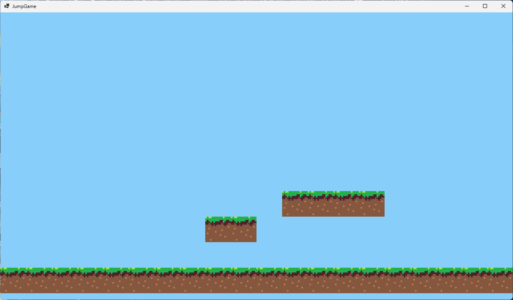
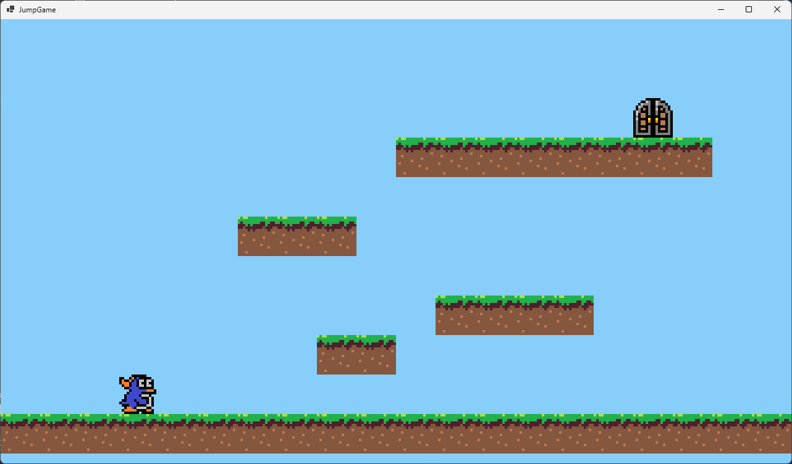
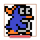
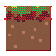

[C#言語2026 第10回]

# クラスの作りかた

## キーポイント

* クラスを使うと、「複数のデータをまとめた新しい型」を作ることができる
* 新しいクラスを定義するには次のように書く<br>
  &emsp;<code><span class="hljs-keyword">class</span> 新しい型の名前 {</code><br>
  &emsp;<code>&emsp;<span class="hljs-keyword">アクセス修飾子1 型1</span> 変数名1;</code><br>
  &emsp;<code>&emsp;<span class="hljs-keyword">アクセス修飾子2 型2</span> 変数名2;</code><br>
  &emsp;<code>&emsp;<span class="hljs-keyword">アクセス修飾子3 型3</span> 変数名3;</code><br>
  &emsp;<code>&emsp;...(必要なだけ変数を追加できる)</code><br>
  &emsp;<code>}</code>
* クラスの中で宣言した変数やメソッドのことを「メンバー」という
* 「アクセス修飾子」には`public`(誰でも使える)か`private`(メンバーだけ使える)を指定する
* クラスの変数を宣言するには次のように書く<br>
  &emsp;<code><span class="hljs-keyword">新しい型の名前</span> 変数名 = <span class="hljs-keyword">new</span>();</code>
* メンバーを個別に読み書きするには、クラスの変数とメンバー名を.(ドット)でつないで次のように書く<br>
  &emsp;<code>変数名.メンバー名</code>

## 1. クラスの基本

### 1.1 クラスの特徴

「クラス」は「種類の異なる複数のデータをまとめて扱う」ための機能です。配列との違いは以下の3点です。

* クラスは、データごとに型を変えられる(配列はすべて同じでなくてはならない)
* クラスの要素を読み書きするには「名前」を使う(配列は添字を使う)
* クラスの名前は「新しい型」となる(配列はすべて同じ型なので名前を付ける必要がない)

<div style="page-break-after: always"></div>

### 1.2 クラス定義の書きかた

クラスは「クラスの定義」と「クラス変数の宣言」を分けて作成します。
クラスの定義は「新しい型の設計図」です。クラスの定義は次のように書きます。

```c#
アクセス修飾子 class 新しい型の名前 {
  アクセス修飾子 型1 変数名1 = 初期値1;
  アクセス修飾子 型2 変数名2 = 初期値2;
  アクセス修飾子 型3 変数名3 = 初期値3;
  ...(必要なだけメンバーを追加できる)
}
```

クラス定義の`{`と`}`の間で宣言された変数のことを「メンバー・フィールド(member field)」、あるいは単に「フィールド」といいます。

#### アクセス修飾子

「アクセス修飾子」は **メンバーの利用権** を制御する機能で、以下のどれかを指定します。

* `public`(パブリック): 誰でも利用できる
* `internal`(インターナル): このファイル内でだけ利用できる
* `private`(プライベート): メンバーだけが利用できる

最初のうちは、とりあえず`public`を選ぶとよいでしょう。

アクセス指定子は**省略可能**です。<br>
クラスのアクセス指定子を省略すると、そのクラスは`internal`に設定されます。<br>
メンバーのアクセス修飾子を省略すると、そのメンバーは`private`に設定されます。

>`private`を指定したメンバーは、「メソッド」や「プロパティ」からのみ利用できます。これらについては別の機会に説明します。

#### クラスの例

例えば、「犬」を扱うクラスは次のように書けるでしょう。

```c#
public class Dog {
  public string Name = "きなこ";
  public string Breed = "柴犬";
  public int Age = 3;
  public int Gender = 0;
}
```

このクラスの名前は`Dog`(ドッグ)で、メンバーフィールドは`Name`(ネーム), `Breed`(ブリード), `Age`(エイジ), `Gender`(ジェンダー), `Friendship`(フレンドシップ)の5個です。

#### コメントで変数の意味を説明する

変数名は英語で書くのが基本ですが、英語だと意味が分かりにくい場合があります。<br>
こういう場合、次のように「コメントで変数の意味を説明する」ことが多いです。

```c#
public class Dog {
  public string Name = "きなこ";  // 名前
  public string Breed = "柴犬";  // 犬種
  public int Age = 3;            // 年齢
  public int Gender = 0;         // 性別
}
```

### 1.3 クラス変数の宣言と初期化

クラスは、例えメンバーが`int`型ひとつしかない場合でも「複雑な型」に分類されます。<br>
そのため、クラスの変数を宣言するには、`new`命令を使わなくてはなりません。

```c#
クラスの名前 変数名 = new();
```

例えば、`Dog`クラスの変数`myDog`(マイ・ドッグ)を宣言するには、次のように書きます。

```c#
Dog myDog = new();
```

### 1.4 メンバーの読み書き

メンバーを読み書きするには、次のようにクラス変数名とメンバー名を`.`(ドット)演算子でつなぎます。

```c#
クラス変数名.メンバー名
```

例えば、`Dog`クラスの`Age`メンバーの値を出力するには、次のように書きます。

**コード**

```c#
Dog myDog = new();
Console.WriteLine(myDog.Age);
```

**実行結果**<br>
&emsp;3

`Dog.Age`とは書けないことに注意してください。`Dog`は型の名前で、変数ではないからです。

メンバーに値を代入するには、`=`演算子を使います。

**コード**

```c#
myDog.Age = 4;
```

このように、普通の変数とメンバーの違いは`クラス変数名.`の有無だけです。<br>
普通の変数と同じように、式に組み込んだり、条件式に使うこともできます。

**コード**

```c#
Dog myDog = new();
Console.WriteLine(myDog.Name + "の3年後の年齢は" + (myDog.Age + 3) << "歳です");
if (myDog.Gender == 0)
{
  Console.WriteLine(myDog.Name + "は男の子です");
}
else
{
  Console.WriteLine(myDog.Name + "は女の子です");
}
```

**実行結果**<br>
&emsp;きなこの3年後の年齢は6歳です<br>
&emsp;きなこは男の子です

### 1.5 コンストラクタ

配列では、次のように要素の初期値を指定できました。

```c#
int[] a = { 1, 2, 3 };
```

ですが、クラスは同じようには書けません。次のように、メンバーごとにデータを代入しなくてはなりません。

```c#
Dog yourDog = new();
yourDog.Name = "わたげ";
yourDog.Breed = "マルチーズ";
yourDog.Age = 4;
yourDog.Gender = 1;
```

しかし、毎回メンバーごとに代入するのは面倒です。そのため、C#には「初期化専用のメソッド」を作る機能が用意されています。この機能を **コンストラクタ** といいます。

例えば、「`Dog`クラスのコンストラクタ(初期化専用メソッド)」は次のように書きます。

```c#
public class Dog {
  public string Name = "きなこ";  // 名前
  public string Breed = "柴犬";   // 犬種
  public int Age = 3;             // 年齢
  public int Gender = 0;          // 性別

  // コンストラクタ(初期化専用のメソッド)
  public Dog(string name, string breed, int age, int gender)
  {
    Name = name;
    Breed = breed;
    Age = age;
    Gender = gender;
  } // コンストラクタ・ブロックの終わり
}
```

「コンストラクタ」の書きかたは、次のような形式になっています。

<span class="hljs-function">&emsp;<span class="hljs-keyword">アクセス修飾子</span> <span class="hljs-title">クラス名</span>(<span class="hljs-params">パラメータ・リスト</span>)</span><br>
&emsp;{<br>
&emsp;&emsp;メンバーにパラメータを代入するプログラム<br>
&emsp;}

コンストラクタの名前は **クラス名と同じ** でなくてはなりません。<br>
また、コンストラクタには「戻り型」を書きません。戻り型は「クラス自身」になると決まっています。

基本的に、コンストラクタのアクセス修飾子には`public`(パブリック)を指定します。<br>
`public`を指定すると「クラスブロックの外でも使える」ようになります。

コンストラクタのブロック内では **メンバーフィールド名を使って代入先を指定** します。<br>
フィールドやパラメータなどの変数には、同じ名前を付けられません。<br>
そのため、 **フィールドは大文字で始まる名前、パラメータは小文字で始まる名前** にしています。

このコンストラクタを使うと、`yourDog`変数は次のように初期化できます。

```c#
Dog yourDog = new("わたげ", "マルチーズ", 4, 1);
```

このように、クラスにコンストラクタを書いておけば、配列と似た書きかたでクラス変数を初期化できます。<br>
違いは、`new`命令が必要なこと、丸カッコを使うこと、の2点です。

### 1.6 クラスを使う場面

クラスは「種類の異なる複数のデータをまとめて扱う」ものです。<br>
実際に利用する場面では「あるものごとに関連するデータをまとめて扱う」ために使われます。

例えば、前の章で挙げた`Dog`クラスは「犬に関連するデータをまとめた型」です。<br>
ゲームでは、「物体の座標」や「アイテムデータ」、「敵データ」などをクラスにすることが多いです。

アイテムや敵ごとにデータが数個しかないゲームなら、クラスにまとめる意義は少ないです。<br>
例えば、前回作ったジャンプゲームでは、敵となるサボテンはX座標だけで管理できました。

しかし、翼竜にはX座標とY座標、そしてアニメーションタイマーの3つのデータがありました。<br>
とはいえ、前回の翼竜は一匹しか表示しなかったので、クラスを使う意義は弱かったのです。<br>
もしも何匹も表示したい場合は、クラスを使うとプログラムが読みやすくなります。

例えば、3匹の翼竜を出したいとなったら、配列を使って次のように書けるでしょう。

```c#
float[] pteraX = { 1.0f, 2.0f, 3.0f };
float[] pteraY = { 4.0f, 5.0f, 6.0f };
float[] pteraAnimeTimer = { 0.0f, 0.0f, 0.0f };
```

クラスを使うと、前のプログラムは次のように書き直せます。

```c#
public class Ptera
{
  public float X;
  public float Y;
  public float AnimeTimer = 0.0f;

  public Ptera(float x, float y)
  {
    X = x;
    Y = y;
  }
}
Ptera[] ptera = { new(1.0f, 4.0f), new(2.0f, 5.0f), new(3.0f, 6.0f) };
```

>コンストラクタで代入することが分かっている変数の場合、初期値は不要です。

翼竜の数を変えたくなったとき、基本型の配列では`pteraX`、`pteraY`、`pteraAnimeTimer`の3つを個別に変更する必要があります。しかし、クラスを使った例のほうは、`ptera`配列だけを変更すれば済みます。<br>
そのため、「配列のどれかを変更し忘れる」といったミスは起きようがありません。

`Ptera`クラスのコンストラクタが、アニメーションタイマーを設定していない点に注意してください。<br>
コンストラクタで代入しなかったメンバーには、メンバーの宣言で指定した初期値が代入されるからです。<br>
つまり、`AnimeTimer`メンバーには`0.0f`が代入されるわけです。

それから、「動きの違う翼竜を増やしたい」と思ったときも、次のように新しい配列をひとつ増やすだけです。<br>
もちろん、動きのプログラムは別に必要ですが。

```c#
Ptera[] ptera = { new(1.0f, 4.0f), new(2.0f, 5.0f), new(3.0f, 6.0f) };
Ptera[] ptera2 = { new(11.0f, 14.0f), new(12.0f, 15.0f), new(13.0f, 16.0f) };
```

それに対して、基本型の配列の場合、次のようにデータの種類だけ行を追加しなくてはなりません。

```c#
float[] pteraX = { 1.0f, 2.0f, 3.0f };
float[] pteraY = { 4.0f, 5.0f, 6.0f };
float[] pteraAnimeTimer = { 0.0f, 0.0f, 0.0f };
float[] ptera2X = { 11.0f, 12.0f, 13.0f };
float[] ptera2Y = { 14.0f, 15.0f, 16.0f };
float[] ptera2AnimeTimer = { 0.0f, 0.0f, 0.0f };
```

メンバーが増えれば増えるほど、また、配列の要素数が増えれば増えるほど、クラスを使うほうが書く手間が少なくなります。

とはいえ、これくらいの例であれば、どちらの方法でも、動きの違う翼竜のプログラムを書くのは難しくないでしょう。無理にクラスを使わなくても作れるプログラムは、たくさんあります。<br>
ですが、上の`Ptera`型のように「関連する複数のデータがある」場合、クラスを使うほうが書きやすくなります。

<div style="page-break-after: always"></div>

## 2. プラットフォームゲームを作る

今回から3回かけて、簡易的なのスーパーマリオのようなゲームを作ります。<br>
プレイヤーは左右移動とジャンプを使って空中ブロックを飛び移り、ゴールのドアを目指します。<br>
そして、ゲームの制作を通じて、クラスの作りかたと使いかたを学習します。

> この形式のゲームは「プラットフォーム・ゲーム」や「プラットフォーマー」と呼ばれます。

各回では以下の内容を予定しています。

&emsp;**今回: 地形の表示, プレイヤーとゴールの表示, プレイヤーの移動とジャンプ, プレイヤーの着地**<br>
&emsp;次回: プレイヤーの向き, プレイヤーの上側の判定, プレイヤーの側面の判定, ゴール判定, クリア状態,<br>
&emsp;&emsp;&emsp;&ensp;トゲブロック, ゲームオーバー状態<br>
&emsp;次々回: 敵の表示, 敵の衝突判定, アニメーション, ステージ数を増やす

### 2.1 Windowsフォームアプリを作成する

Visual Studioを起動して「新しいプロジェクトの作成」を選びます。<br>
「新しいプロジェクトの作成」画面になったら、右上の検索ボックスに「form」と入力します。

テンプレート一覧に`form`を含むテンプレートが表示されるので、C#の「Windowsフォームアプリ」を選択し、右下の「次へ」ボタンをクリックしてください。

「プロジェクト名」は`PenguinsJump`(ペンギンズ・ジャンプ)としてください。<br>
「場所」はデスクトップのC#フォルダを選択してください。<br>
「ソリューションとプロジェクトを同じディレクトリに配置する」にチェックを入れて、「次へ」をクリックしてください。

「追加情報」は特に変更不要です。何も変えずに、右下の「作成」ボタンをクリックしてください。<br>
プロジェクト用のファイルが作成された後、プロジェクトが開きます。

Windowsフォームアプリの場合、最初に表示されるのは「フォーム」のデザイン画面です。<br>
「フォーム」は「外観、体型」といった意味で、Windows OSでは「さまざまな部品を配置できる親ウィンドウ」を指します。

デザイン画面が表示されたら、フォーム内の白い部分を右クリックしてください。<br>
右クリックメニューが開くので、「プロパティ」項目をクリックしてください。

すると、Visual Studioの右側に「プロパティ・ウィンドウ」が表示されます。項目をスクロールさせて「動作」にある
`DoubleBufferd`(ダブル・バッファード)という項目をクリックし、`True`(トゥルー)を選択してください。

設定を変更したら、Visual Sutidoの上部に表示される`>PenguinsJump`ボタンをクリックして、アプリを実行してください。何もないウィンドウが表示されたら成功です。`X`ボタンでウィンドウを閉じてください。

### 2.2 ゲームループを作る

そこで、少しプログラムを変更して、ゲームループを作りましょう。とりあえず、不要なコメントは消しておきます。
`Program.cs`を次のように変更してください。

```diff
 namespace PenguinsJump
 {
   internal static class Program
   {
-    /// <summary>
-    ///  The main entry point for the application.
-    /// </summary>
     [STAThread]
     static void Main()
     {
-      // To customize application configuration such as set high DPI settings or default font,
-      // see https://aka.ms/applicationconfiguration.
       ApplicationConfiguration.Initialize();
       Application.Run(new Form1());
     }
```

次に、必要そうな名前空間を`using`します。`Progra.cs`の先頭に、次のプログラムを追加してください。

```diff
+using System.Runtime.InteropServices;
+using System.Drawing.Drawing2D;
+using System.Diagnostics;
+
 namespace PenguinsJump
 {
   internal static class Program
```

それから、「スリープ時間の精度を変えるメソッド」と「キーの状態を調べるメソッド」も使えるようにしておきましょう。
`Program.cs`に次のプログラムを追加してください。

```diff
 namespace PenguinsJump
 {
   internal static class Program
   {
+    // OSの「スリープ時間の精度を変える機能」を使えるようにする
+    [DllImport("winmm.dll")]
+    static extern uint timeBeginPeriod(uint uMilliseconds);
+
+    // OSの「キーを調べる機能」を使えるようにする
+    [DllImport("user32.dll")]
+    static extern short GetAsyncKeyState(int key);
+
+    // GetAsyncKeyStateで使う仮想キー番号
+    const int vkReturn = 13; // Enterキー
+    const int vkEscape = 27; // ESCキー
+    const int vkSpace = 32;  // スペースキー
+    const int vkLeft = 37;   // 矢印キー(左)
+    const int vkUp = 38;     // 矢印キー(上)
+    const int vkRight = 39;  // 矢印キー(右)
+    const int vkDown = 40;   // 矢印キー(下)
+
     [STAThread]
     static void Main()
     {
```

それでは、ゲームループを作りましょう。<br>
`Progra.cs`を次のように変更してください。

```diff
     [STAThread]
     static void Main()
     {
       ApplicationConfiguration.Initialize();
-      Application.Run(new Form1());
-    }
-  }
-}
+      // フォームを作成して表示
+      Form1 form = new();
+      form.ClientSize = new(1280, 720);
+      form.Show();
+
+      // ゲームループ
+      Stopwatch stopwatch = new(); // 繰り返し時間の管理用のストップウオッチ
+      for ( ; form.IsDisposed == false; )
+      {
+        stopwatch.Restart(); // 時間計測を開始
+
+        form.Refresh();         // ウィンドウの描き直しを指示
+        Application.DoEvents(); // ウィンドウのイベントを実行
+
+        // 経過時間が1/60秒未満の場合、1/60秒が経過するまで停止
+        stopwatch.Stop(); // 時間計測を終了
+        if (stopwatch.ElapsedMilliseconds < 1000 / 60)
+        {
+          Thread.Sleep(1000 / 60 - (int)stopwatch.ElapsedMilliseconds);
+        }
+      }
+    } // Mainメソッドブロックの終わり
+  } // Program型ブロックの終わり
+} // PenguinsJump名前空間ブロックの終わり
```

### 2.3 ゲーム状態を作る

ジャンプゲームは以下の4つのゲーム状態を取れるものとします。

* **タイトル状態**: タイトル画面を表示している状態
* **プレイ状態**: ゲームを遊んでいる状態
* **ゴール状態**: プレイヤーがゴールに到達した状態
* **死亡状態**: プレイヤーが危険物に当たった状態

これらのゲーム状態をあらわす変数を作ります。`Program.cs`に次のプログラムを追加してください。

```diff
     const int vkUp = 38;     // 矢印キー(上)
     const int vkRight = 39;  // 矢印キー(右)
     const int vkDown = 40;   // 矢印キー(下)
+
+    // ゲーム状態
+    const int gsTitle = 0; // タイトル状態
+    const int gsPlay = 1;  // プレイ状態
+    const int gsGoal = 2;  // ゴール状態
+    const int gsDead = 3;  // 死亡状態
+    private static int gameState = gsPlay; // 現在のゲーム状態

     [STAThread]
     static void Main()
     {
```

最初は「プレイ状態」で始めることにします。タイトル画面は、ゲームが動くようになってから作ればいいです。

### 2.4 状態更新メソッドを作る

次に、ゲーム状態に対応する「状態更新メソッド」を定義します。ゲーム状態は4つありますが、当面使うのは「プレイ状態」だけのつもりです。そこで、必要なメソッドだけ定義します。`Main`メソッドブロックの下に、次のプログラムを追加してください。

```diff
         if (stopwatch.ElapsedMilliseconds < 1000 / 60)
         {
           Thread.Sleep(1000 / 60 - (int)stopwatch.ElapsedMilliseconds);
         }
       }
     } // Mainメソッドブロックの終わり
+
+    // プレイ状態を更新する
+    private static void UpdatePlay()
+    {
+    } // UpdatePlayメソッドブロックの終わり
   } // Program型ブロックの終わり
 } // PenguinsJump名前空間ブロックの終わり
```

そして、作成したメソッドをゲームループから呼び出します。ゲームループに次のプログラムを追加してください。

```diff
       Stopwatch stopwatch = new(); // 繰り返し時間の管理用のストップウオッチ
       for ( ; form.IsDisposed == false; )
       {
         stopwatch.Restart(); // 時間計測を開始
+
+        // ゲーム状態に対応する更新メソッドを呼び出す
+        if (gameState == gsPlay)
+        {
+          UpdatePlay();
+        }

         form.Refresh();         // ウィンドウの描き直しを指示
         Application.DoEvents(); // ウィンドウのイベントを実行
```

### 2.5 描画メソッドを作る

さて、前に作成した`DinoRun`アプリでは、画像の表示を全部`OnPaint`メソッドの中で行っていたため、少し分かりにくくなっていました。

そこで、今回作成する`PenguinsJump`アプリでは、絵を描くメソッドもゲーム状態ごとに分けます。これも、とりあえず「プレイ状態」のメソッドだけ定義します。`UpdatePlay`メソッドの定義の下に、「プレイ状態の描画メソッド」を追加してください。

```diff
     // プレイ状態を更新する
     private static void UpdatePlay()
     {
     } // UpdatePlayメソッドブロックの終わり
+
+    // プレイ状態を描く
+    private static void PaintPlay(Graphcis g)
+    {
+    } // PaintPlayメソッドブロックの終わり
+
+    // ペイントイベントで実行されるメソッド
+    private static void OnPaint(object? sender, PaintEventArgs e)
+    {
+      Graphics g = e.Graphics;
+      if (gameState == gsPlay)
+      {
+        PaintPlay(g);
+      }
+    } // OnPaintメソッドブロックの終わり
   } // Program型ブロックの終わり
 } // PenguinsJump名前空間ブロックの終わり
```

描画メソッドのパラメータは、ウィンドウに絵を描くために必要な`Graphics`(グラフィックス)型の変数`g`(ジー、graphcisの頭文字)です。

作成した`PaintPlay`メソッドを、ペイントイベントに追加しましょう。`Main`メソッドにある、フォームを作成するプログラムに、次のプログラムを追加してください。

```diff
       // フォームを作成して表示
       Form1 form = new();
       form.ClientSize = new(1280, 720);
+      form.Paint += OnPaint;
       form.Show();

       // ゲームループ
       Stopwatch stopwatch = new(); // 繰り返し時間の管理用のストップウオッチ
       for ( ; ; )
```

これで、ゲーム状態によって異なるメソッドが実行されるようになりました。ようやく、ゲームを作る下準備が完了しました。

### 2.6 背景に色を塗る

、今のところなにも描いていないので、うまくプログラムできているのかが分かりません。とりあえず、背景に色を付けましょう。背景に色を塗るには`Graphics`型の`Clear`(クリア)メソッドを使います。`PaintPlay`メソッドに、次のプログラムを追加してください。

```diff
     // プレイ状態を描く
     private static void PaintPlay(Graphcis g)
     {
+      // 背景に色を塗る
+      g.Clear(Color.Gray);
     } // PaintPlayメソッドブロックの終わり

     // ペイントイベントで実行されるメソッド
     private static void OnPaint(object? sender, PaintEventArgs e)
```

`Claer`メソッドのパラメータには、色をあらわす`Color`型のメンバーを指定できます。好きな色を設定してください。

プログラムが書けたら`>PenguinsJump`ボタンをクリックしてアプリを実行してください。ウィンドウが灰色で塗りつぶされていたら成功です。

<pre class="tnmai_assignment">
<strong>【課題01 背景の色を変える】</strong>
<code>Clear</code>メソッドに指定する色を、もう少し鮮やかな色に変更しなさい。
色の名前を調べるには、Webブラウザで「c# color」を検索します。
</pre>

### 2.7 画像ファイルを用意する

背景の次は、何か画像を表示しましょう。画像は以下のURLにあります。Webブラウザで以下のURLにアクセスして、ページを開いてください。

&emsp;`github.com/tn-mai/CSharp2026`

ページが開いたら、以下の手順で画像を含むZIPファイルをダウンロードしてください。

1. ファイル`JumpGameAssets.zip`をクリック
2. 右端にある「下矢印」アイコンをクリック
3. ダウンロード先を選択

ファイルをダウンロードしたら、以下の手順で`assets`フォルダのコピーを作成してください。

1. ダウンロードした`JumpGameAssets.zip`ファイルを開く
2. `assets`(アセッツ)というフォルダを選択
3. `Ctrl`キーを押しながら`C`キーを押して、`assets`フォルダをコピー
4. プロジェクトのフォルダを開く
5. `Ctrl`キーを押しながら`V`キーを押して、`assets`フォルダを貼り付け

次に、コピーしたファイルを読み込めるように、プロジェクトの設定を変更します。<br>
以下の手順で設定を変更してください。

1. Visual Studioで`PenguinsJump`プロジェクトを開く
2. ウィンドウ最上部にある「デバッグ」項目をクリックして開く
3. デバッグメニューの一番下にある「PenguinsJumpのデバッグ プロパティ」をクリック
4. 「作業ディレクトリ」項目に「 **$(ProjectDir)** 」と入力する
5. 「プロファイルの起動」ウィンドウ右上の`x`ボタンをクリックして、ウィンドウを閉じる

>「作業ディレクトリ」は、Visual Studioでアプリを実行したとき、ファイルの読み書きに使うフォルダです。

### 2.8 画像を読み込む

`Bitmap`型と「イベント」機能を使って、コピーした画像を表示しましょう。

最初に、画像ファイルをメモリに読み込みます。ゲーム状態を定義するプログラムの下に、次のプログラムを追加してください。

```diff
     const int gsGoal = 2;  // ゴール状態
     const int gsDead = 3;  // 死亡状態
     private static int gameState = gsPlay; // 現在のゲーム状態
+
+    // ファイルから画像を読み込む
+    private static Bitmap bmpBlock = new("assets/images/block_soil_ct.png");

     [STAThread]
     static void Main()
     {
```

変数名は`bmpBlock`(ビーエムピー・ブロック、「ブロックのビットマップ画像」という意味)としました。

### 2.9 ブロッククラスを作る

次に、ブロックの「位置」と「長さ」をあらわす「ブロック・クラス」を作ります。型名は`Block`(ブロック)とします。<br>
メンバーは、「どこに」をあらわす`X`座標と`Y`座標、それから「長さ」をあらわす`Size`(サイズ)の3つとします。

ゲーム状態を定義するプログラムの下に、次のように`Block`クラスの定義を追加してください。

>大文字と小文字の違いに注意。最初の文字は**型名やメンバー名は大文字、パラメータは小文字**です。

```diff
     const int gsGoal = 2;  // ゴール状態
     const int gsDead = 3;  // 死亡状態
     private static int gameState = gsPlay; // 現在のゲーム状態

+    // ブロックの配置データクラス
+    public class Block
+    {
+      public float X;  // X座標
+      public float Y;  // Y座標
+      public int Size; // 大きさ
+
+      // コンストラクタ
+      public Block(float x, float y, int s)
+      {
+        X = x;
+        Y = y;
+        Size = s;
+      }
+    } // Blockクラスブロックの終わり
+
     // ファイルから画像を読み込む
     private static Bitmap bmpBlock = new("assets/images/block_soil_ct.png");
```

次に、表示するブロックの配列を作ります。`Block`クラスの定義の下に、次のプログラムを追加してください。

```diff
         X = x;
         Y = y;
         Size = s;
       }
     } // Blockクラスブロックの終わり
+
+    // ブロックの配列
+    private static Block[] blockList = {
+      new(0.0f, 10.0f, 20), new(8.0f, 8.0f, 2), new(11.0f, 7.0f, 4),
+    };

     // ファイルから画像を読み込む
     private static Bitmap bmpBlock = new("assets/images/block_soil_ct.png");
```

とりあえず3つのブロックデータを作ってみました。この配列の内容や長さを変えることで、自由にブロックを配置できます。

### 2.10 ブロックを表示する

それではブロックを表示しましょう。`PaintPlay`メソッドに、ブロックを表示するプログラムを追加してください。

```diff
     private static void PaintPlay()
     {
       // 背景に色を塗る
       g.Clear(Color.LightSkyBlue);
+
+      // ブロックを描く
+      for (int a = 0; a < blockList.Length; a++)
+      {
+        Block block = blockList[a];
+        for (int b = 0; b < block.Size; b++)
+        {
+          g.DrawImage(bmpBlock, (block.X + b) * 64, block.Y * 64);
+        }
+      }
     } // PaintPlayメソッドブロックの終わり

     // ペイントイベントで実行されるメソッド
     private static void OnPaint(object? sender, PaintEventArgs e)
```

描画プログラムで座標を64倍している理由は、ブロックの画像サイズが64x64ドットだからです。

プログラムが書けたら`>PenguinsJump`ボタンをクリックしてアプリを実行してください。画面にブロックが表示されていたら成功です。

<div align="center"><br>[ブロックを表示]</div>

<pre class="tnmai_assignment">
<strong>【課題02 ブロックを増やす】</strong>
<code>blockList</code>配列に、以下の2つのブロックのデータを追加しなさい。
  - X座標=6 Y座標=5 長さ=3
  - X座標=10 Y座標=3 長さ=8
</pre>

### 2.11 プレイヤーを表示する

次は、ブロックの上にプレイヤーのキャラクターを表示しましょう。とりあえず、画像を1枚読み込みます。ファイルから画像を読み込むプログラムに、次のプログラムを追加してください。

```diff
     private static Block[] blockList = {
       new(0.0f, 10.0f, 20), new(8.0f, 8.0f, 2), new(11.0f, 7.0f, 4),
       new(6.0f, 5.0f, 3), new(10.0f, 3.0f, 8),
     };

     // ファイルから画像を読み込む
     private static Bitmap bmpBlock = new("assets/images/block_soil_ct.png");
+    private static Bitmap bmpPlayer = new("assets/images/player_0.png");

     [STAThread]
     static void Main()
     {
```

ブロックと同様に、プレイヤー用のクラスを作ります。ブロックの配列を定義するプログラムの下に、次のプログラムを追加してください。

```diff
     private static Block[] blockList = {
       new(0.0f, 10.0f, 20), new(8.0f, 8.0f, 2), new(11.0f, 7.0f, 4),
       new(6.0f, 5.0f, 3), new(10.0f, 3.0f, 8),
     };
+
+    // プレイヤークラス
+    public class Player
+    {
+      public float X; // X座標
+      public float Y; // Y座標
+
+      // コンストラクタ
+      public Player(float x, float y)
+      {
+        X = x;
+        Y = y;
+      }
+    } // Playerクラスブロックの終わり
+    Player player = new(192.0f, 576.0f);

     // ファイルから画像を読み込む
     private static Bitmap bmpBlock = new("assets/images/block_soil_ct.png");
     private static Bitmap bmpPlayer = new("assets/images/player_0.png");
```

プレイヤーの画像サイズは1ブロック相当なので、`Size`メンバーはありません。

それでは、画面にプレイヤーを描きましょう。`OnPaint`メソッドに、プレイヤーを描くプログラムを追加してください。

```diff
         Block block = blockList[a];
         for (int b = 0; b < block.Size; b++)
         {
           g.DrawImage(bmpBlock, (block.X + b) * 64, block.Y * 64);
         }
       }
+
+      // プレイヤーを描く
+      g.DrawImage(bmpPlayer, player.X, player.Y);
     } // PaintPlayメソッドブロックの終わり

     // ペイントイベントで実行されるメソッド
     private static void OnPaint(object? sender, PaintEventArgs e)
```

プログラムが書けたら`>PenguinsJump`ボタンをクリックしてアプリを実行してください。青いプレイヤー画像が表示されていたら成功です。

<pre class="tnmai_assignment">
<strong>【課題03 ゴールを表示する】</strong>
以下の手順を参考にゴールクラスを作成し、画面にゴール画像を表示しなさい。

  1. <code>blockList</code>の定義の下に、ゴールをあらわす<code>Goal</code>クラスを定義する。メンバーは<code>float</code>型の<code>X</code>座標と<code>Y</code>座標の2つ。X, Y座標を設定するコンストラクタを定義すること。
  2. <code>Goal</code>クラスの定義の下に、<code>Goal</code>型の変数を宣言する。
     変数名は<code>goal</code>、<code>new</code>に指定する座標は<code>(1024.0f, 128.0f)</code>とすること。
  3. ゴール画像<code>assets/images/door_closed.png</code>を読み込む。変数名は<code>bmpGoal</code>とすること。
  4. <code>PaintPlay</code>メソッドのブロックを描くプログラムの下に、ゴール画像を表示するプログラムを追加する。
     X座標は<code>goal.X</code>、Y座標は<code>goal.Y</code>とすること。
</pre>

<div align="center"><br>[プレイヤーとゴールを表示]</div>

### 2.12 プレイヤーの移動

絵を表示するだけではゲームにならないので、キー入力でプレイヤーを動かしましょう。`UpdatePlay`メソッドに次のプログラムを追加してください。

```diff
   // プレイ状態を更新する
   private static void UpdatePlay()
   {
+    // プレイヤーの左右移動
+    if (GetAsyncKeyState(vkRight) < 0)
+    {
+      player.X += 5.0f;
+    }
+    else if (GetAsyncKeyState(vkLeft) < 0)
+    {
+      player.X -= 5.0f;
+    }
   } // UpdatePlayメソッドブロックの終わり

   // プレイ状態を描く
   private static void PaintPlay()
```

プログラムが書けたら`>PenguinsJump`ボタンをクリックしてアプリを実行してください。矢印キーの左右を押したとき、プレイヤー画像が左右に移動したら成功です。

### 2.13 プレイヤーのジャンプ

横に動けるだけでは、ゴールの扉にたどりつけません。そこで、プレイヤーにジャンプ能力を与えましょう。

ジャンプできるようにするには、まずジャンプを制御するための変数を、プレイヤークラスに追加します。<br>
`Player`クラスの定義に、次のプログラムを追加してください。

```diff
   // プレイヤークラス
   public class Player
   {
     public float X; // X座標
     public float Y; // Y座標
+    public float JumpSpeed; // ジャンプ力
+    public bool IsJumping;  // ジャンプ中は true

     // コンストラクタ
     public Player(float x, float y)
     {
       X = x;
       Y = y;
+      JumpSpeed = 0.0f;
+      IsJumping = false;
     }
   } // Playerクラスブロックの終わり
```

次に、スペースキーが押されたらジャンプするようにします。<br>
プレイヤーを左右に動かすプログラムの下に、次のプログラムを追加してください。

```diff
     else if (GetAsyncKeyState(vkLeft) < 0)
     {
       player.X -= 5.0f;
     }
+
+    // ジャンプ中ではないとき、スペースキーが押されたらジャンプする
+    if (player.IsJumping == false && GetAsyncKeyState(vkSpace) < 0)
+    {
+      player.IsJumping = true;   // ジャンプ状態を「ジャンプ中」にする
+      player.JumpSpeed = 800.0f; // ジャンプ速度を設定する
+    }
   } // UpdatePlayメソッドブロックの終わり

   // プレイ状態を描く
   private static void PaintPlay()
```

ジャンプ速度は「毎秒800ドット」にしてみました。

続いて、ジャンプ状態を座標に反映します。ジャンプするプログラムの下に、次のプログラムを追加してください。

```diff
     if (player.IsJumping == false && GetAsyncKeyState(vkSpace) < 0)
     {
       player.IsJumping = true;   // ジャンプ状態を「ジャンプ中」にする
       player.JumpSpeed = 800.0f; // ジャンプ速度を設定する
     }
+
+    // ジャンプ中ならジャンプ状態を更新する
+    if (player.IsJumping)
+    {
+      player.Y -= player.JumpSpeed / 60.0f; // Y座標を更新
+    }
   } // UpdatePlayメソッドブロックの終わり

   // プレイ状態を描く
   private static void PaintPlay()
```

プログラムが書けたら`>PenguinsJump`ボタンをクリックしてアプリを実行してください。スペースキーを押したとき、プレイヤーがずっと上に移動続けたら成功です。

### 2.14 重力を影響させる

重力がないので、一度ジャンプしたら二度と落ちてきません。これはジャンプとは言いがたいです。<br>
ジャンプらしくするには「重力」を与えなくてはなりません。

ジャンプ状態を更新するプログラムに、次のプログラムを追加してください。

```diff
     // ジャンプ中ならジャンプ状態を更新する
     if (player.IsJumping)
     {
+      player.JumpSpeed -= 2300.0f / 60.0f;  // 重力に従ってジャンプ速度を減らす
       player.Y -= player.JumpSpeed / 60.0f; // Y座標を更新
     }
   } // UpdatePlayメソッドブロックの終わり
```

重力は「2300ドット毎秒毎秒」としました(重力は **加速度** なので、単位は「毎秒毎秒」となります)。

プログラムが書けたら`>PenguinsJump`ボタンをクリックしてアプリを実行してください。スペースキーを押してジャンプしたとき、プレイヤーが途中から落下しはじめたら成功です。

>**【ジャンプ速度800ドット毎秒、重力2300ドット毎秒毎秒は、どんなジャンプになる？】**<br>
>ジャンプ速度と重力を「等加速度直線運動の公式」に当てはめると、
>
>&emsp;$ 0 = 800t - \frac{2300}{2}t^2 $
>
>&emsp;$ 0 = 800 - 1150t $
>
>&emsp;$ 1150t = 800 $
>
>&emsp;$ t = 0.695... $
>
>となり、これは、ジャンプ全体の動作に約0.7秒かかる、という意味です。表現を変えると、 0.35秒でジャンプの頂点に達し、そこから0.35秒かけて元の地点に戻ってくる、ということです。
>
>また、同じ公式に、頂点に達するまでの時間0.35秒を代入すると、
>
>$ X = 800 \times 0.35 - \frac{2300}{2} \times 0.35^2 $
>
>$ X = 139.125 $
>
>となるので、ジャンプの高さは約139ドットだと分かります。<br>
>ただ、ゲームでは位置と速度を1/60秒単位で更新しているため、計算通りにはいきません。<br>
>実際に計ってみると約132.5ドットでした。基本的に、計算より少し小さくなると思ってください。

### 2.15 地面に着地させる

ジャンプすると、ブロックをすり抜けて無限落下を始めてしまいます。というのも、「プレイヤーの足元にブロックがあれば着地する」というプログラムを書いていないからです。

すべてのブロックについて「プレイヤーの足元」にあるかどうかを確認し、ブロックが足元にあれば「ジャンプを止める」必要があります。

とりあえず、すべてのブロックを処理するfor文を作りましょう。ジャンプ状態を更新するプログラムの下に、次のプログラムを追加してください。

```diff
     if (player.IsJumping)
     {
       player.JumpSpeed -= 2300.0f / 60.0f;  // 重力に従ってジャンプ速度を減らす
       player.Y -= player.JumpSpeed / 60.0f; // Y座標を更新
     }
+
+    // プレイヤーとブロックの衝突
+    player.IsJumping = true; // ジャンプ中にする
+    for (int a = 0; a < blockList.Length; a++)
+    {
+      // ブロックの上下左右の座標を計算
+      float blockL = blockList[a].X * 64.0f;             // ブロックの左側の X 座標
+      float blockR = blockL + blockList[a].Size * 64.0f; // ブロックの右側の X 座標
+      float blockT = blockList[a].Y * 64.0f;             // ブロックの上側の Y 座標
+      float blockB = blockT + 64.0f;                     // ブロックの下側の Y 座標
+    } // プレイヤーとブロックの衝突の終わり
   } // UpdatePlayメソッドブロックの終わり

   // プレイ状態を描く
   private static void PaintPlay()
```

足元の判定を行う前に、プレイヤーをジャンプ中の状態にしておきます。<br>
もし足元に何かブロックが見つかったら、ジャンプしていない状態に戻ります。<br>
しかし、足元に何もなければジャンプ中になります。

`Block`クラスの座標は64x64ドットのブロック単位なので、ドット単位の座標に直すには64倍します。64倍した座標はブロックの左上を指します。そのため、右側や下側の端をあらわすには、64倍してから、さらに64ドットを足す必要があります。

とにかく、これでブロックが画面上で占める範囲が分かりました。次は、「足元」がこの範囲にあるかどうかを調べます。ブロックの座標を計算するプログラムの下に、次のプログラムを追加してください。

```diff
       float blockR = blockL + blockList[a].Size * 64.0f; // ブロックの右側の X 座標
       float blockT = blockList[a].Y * 64.0f;             // ブロックの上側の Y 座標
       float blockB = blockT + 64.0f;                     // ブロックの下側の Y 座標
+
+      // プレイヤーの足元の座標を計算
+      float footL = player.X + 12.0f; // 左足のX座標
+      float footR = player.X + 52.0f; // 右足のX座標
+      float footY = player.Y + 64.0f; // 足のY座標(左右共通)
+
+      // 足が、ブロックの上側 20 ドットの範囲に入ったら、着地したことにする
+      if (footR >= blockL && footL < blockR &&
+          footY >= blockT && footY < blockT + 20.0f)
+      {
+        player.Y = blockT - 64.0f; // プレイヤーをブロックの上に強制移動
+        player.IsJumping = false;  // ジャンプしていない状態にする
+        player.JumpSpeed = 0.0f;   // ジャンプ速度を 0 にする
+      }
     } // プレイヤーとブロックの衝突の終わり
   } // UpdatePlayメソッドブロックの終わり

   // プレイ状態を描く
   private static void PaintPlay()
```

キャラクター画像の横幅は64ドットですが、両足は画像の端より内側にあります。そのため、端から12ドット内側を「足元の座標」としています。画像は`0`～`63`まで`64`ドットあるので、「足のすぐ下」は`64`ドット下になります。

それから、ブロック側の着地判定の範囲は「ブロックの上端から20ドット」にしています。<br>
ブロックの横や下からぶつかったときに「着地」と判定させないためです。

<div align="center">&emsp;<br>&emsp;[足元の判定]&emsp;[着地判定の範囲]</div>

プログラムが書けたら`>PenguinsJump`ボタンをクリックしてアプリを実行してください。スペースキーを押してジャンプし、ブロックに着地できたら成功です。

### 2.16 着地できないことがある

少し高いところからジャンプすると、ブロックに着地できないときがあります。これは落下速度が速すぎるためです。着地判定の範囲は高さ方向に20ドットなので、1/60秒ごとの落下量が20ドットを越えると、着地判定の範囲をすり抜けてしまう場合があるのです。

すり抜けないようにするには、落下速度の最大値を「着地判定をすり抜けない速度」に制限します。現在、着地判定の高さは20ドットなので、秒速1200ドット(=20 * 60)を越えないようにします。

ジャンプ状態を更新するプログラムに、次のプログラムを追加してください。

```diff
     if (player.IsJumping)
     {
       player.JumpSpeed -= 2300.0f / 60.0f;  // 重力に従ってジャンプ速度を減らす
       player.Y -= player.JumpSpeed / 60.0f; // Y座標を更新
+
+      // 落下速度が着地判定の高さを越えないようにする
+      if (player.JumpSpeed < -20.0f * 60.0f)
+      {
+        player.JumpSpeed = -20.0f * 60.0f;
+      }
     }

     // プレイヤーとブロックの衝突
     for (int a = 0; a < blockList.Length; a++)
```

プログラムが書けたら`>PenguinsJump`ボタンをクリックしてアプリを実行してください。スペースキーを押してジャンプし、ブロックをすり抜けなくなっていたら成功です。

<pre class="tnmai_assignment">
<strong>【課題04 ブロックを増やしたり減らしたりする】</strong>
ブロックの配置や個数を自由に変更して、面白い地形を作ってください。
</pre>
