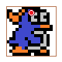
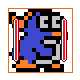
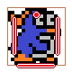
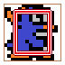
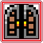
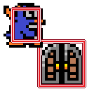
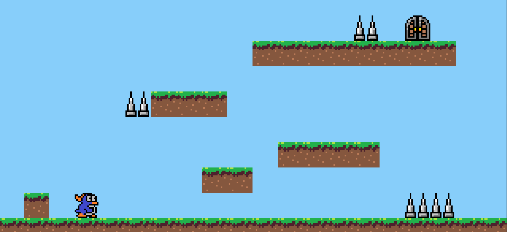
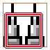

[C#言語2026 第11回]

# インスタンス・メソッドの作りかた

## キーポイント

* 属性キーワード`static`の付いたメソッドを「スタティック・メソッド」という
* 「スタティック・メソッド」は **staticの付いたメンバーだけ** を読み書きできる
* 属性キーワード`static`のないメソッドを「インスタンス・メソッド」という
* 「インスタンス・メソッド」は **全てのメンバー** を読み書きできる
* 「インスタンス・メソッド」は、フィールドを読み書きするプログラムを **かたまり** にするもの

## 1 インスタンス・メソッド
### 1.1 static(スタティック)キーワードの効果

メンバーの前に付く`static`(スタティック)は「属性キーワード」の一種です。<br>
`static`の付いたメンバーは **クラスの共有メンバー** となり、その型の変数を作らなくても使えます。<br>
`static`のないメンバーは **クラス変数ごとのメンバー** となり、変数と作らなくては使えません。

例えば、以下のようなクラス`Test`があるとします。

```c#
public class Test
{
  public int Number; // staticじゃないフィールド
  public static int StaticNumber; // staticなフィールド
}
```

このとき、`static`の付いた`StaticNumber`フィールドは、次のように読み書きできます。

```c#
Test.StaticNumber = 57;
Console.WriteLine(Test.StaticNumber); // 57が出力される
```

これに対して、`static`のない`Number`フィールドは、次のように変数を宣言する必要があります。

```c#
// Test.Number = 57; // NG. Number はクラスの共有メンバーではない

Test t;
t.Number = 57; // OK. 変数 t のメンバーに代入
Consle.WriteLine(t.Number); // OK. 変数 t のメンバーを出力
```

`static`のないフィールドは、変数ごとに新しく作成されます。<br>
そのため、フィールド名が同じでも、変数が違えば別のフィールド変数として扱われます。

```c#
Test s;
Test t;
s.Number = 13;
t.Number = 597;
Console.WriteLine(s.Number); // 13 が出力される
Console.WriteLine(t.Number); // 597 が出力される
```

`static`の有無は次のように使い分けます。

* クラス全体でひとつだけ必要: `static`を付ける
* 配列にするなど、複数の変数を作りたい: `static`を付けない

基本的に、ほとんどのクラスでは、メンバーに`static`を付けません。<br>
フィールドに`static`を付けるのは、Visual Studioが自動的に作成する`Program`クラスのように、 **アプリ全体でひとつだけ必要なクラスだけ** です。

`static`の付いたフィールドを「スタティック・フィールド」、`static`のないフィールドを「インスタンス・フィールド」といいます。

### 1.2 staticの有無とメソッド

`static`の有無は、フィールドだけでなくメソッドでも同様に働きます。

* `static`の付いたメソッド: `static`なメンバーだけ使える
* `static`のないメソッド: `static`の有無に関わらず全てのメンバーを使えるが、変数が必要

`static`の付いたメソッドを「スタティック・メソッド」、`static`のないメソッドを「インスタンス・メソッド」といいます。

次のプログラムは、インスタンスメソッドとスタティックメソッドについて、読み書きできるフィールドの違いをあらわしています。

```c#
public class Test
{
  public int Number; // staticじゃないフィールド
  public static int StaticNumber; // staticなフィールド

  // インスタンス・メソッド
  public void WriteNumbers()
  {
    Console.WriteLine(Number); // OK. static じゃないフィールドを読み書きできる
    Console.WriteLine(StaticNumber); // OK. static なフィールドも読み書きできる
  }

  // スタティック・メソッド
  public static void WriteStatic()
  {
    //Console.WriteLine(Number); // NG. static じゃないフィールドは読み書きできない
    Console.WriteLine(StaticNumber); // OK. static フィールドは読み書きできる
  }
}
```

フィールドと同様に、ほとんどのメソッドには`static`を付けません。<br>
メソッドに`static`を付けるのは、Visual Studioが自動的に作成する`Program`クラスのように、 **アプリ全体でひとつだけ必要なクラスだけ** です。

>`Main`メソッドには必ず`static`が付きます。

### 1.3 インスタンス・メソッドの使いみち

スタティックメソッドを作る目的は、 **スタティックメンバー** を使うプログラムを、かたまりとして覚えやすくすることです。

同様に、インスタンスメソッドの目的は、 **インスタンスメンバー** を使うプログラムを、かたまりとして覚えやすくすることです。

また、どちらの種類のメソッドでも、プログラムをメソッドにすることで **同じプログラムを何度も書かなくて済むようにする** という目的でも使われます。

例えば、次のプログラムでは3つの座標変数を持つ`Position`クラスを定義しています。<br>
`Position`クラスにはインスタンスメソッド`Add`(アド)と`Write`(ライト)があります。

```c#
public class Position
{
  public float X;
  public float Y;
  public float Z;

  public Position(float x, float y, float z)
  {
    X = x;
    Y = y;
    Z = z;
  }

  public float Add(float f)
  {
    X += f;
    Y += f;
    Z += f;
  }

  public void Write()
  {
    Console.WriteLine("(" + X + "," + Y + "," + Z + ")");
  }
}
```

この`Position`クラスは、次のように使うことができます。

```c#
Position a = new(1, 2, 3);
a.Add(5);
a.Write();
a.Add(-3);
a.Write();
a.Add(8);
a.Write();
```

対して、インスタンスメソッドを使わずに同じ結果を得るには、次のように書く必要があります。

```c#
Position a = new(1, 2, 3);
a.X += 5;
a.Y += 5;
a.Z += 5;
Console.WriteLine("(" + a.X + "," + a.Y + "," + a.Z + ")");
a.X += -3;
a.Y += -3;
a.Z += -3;
Console.WriteLine("(" + a.X + "," + a.Y + "," + a.Z + ")");
a.X += 8;
a.Y += 8;
a.Z += 8;
Console.WriteLine("(" + a.X + "," + a.Y + "," + a.Z + ")");
```

このインスタンスメソッドを使わないプログラムは、「何をしているか」は分かりやすいかもしれません。ですが、インスタンスメソッドを使ったプログラムと比べて、全体がかなり長くなっています。さらに、足す数や出力方法を変えたい場合は、プログラム全体に渡ってあちこち書き直さなくてはなりません。

インスタンスメソッドを使ったプログラムでは、修正や変更はメソッドを書き直すだけで済みます。あちこちを書き直す必要はありません。

>「同じことをするプログラムをメソッドにまとめる」という方法は、スタティックメソッドでも可能です。

<div style="page-break-after: always"></div>

## 2 ジャンプアクションゲームの改良

ここからは、前回作成したプラットフォームゲームに機能を追加していきます。<br>
その過程で、インスタンスメソッドの作りかたと使いかたを学習します。

&emsp;前回: 地形の表示, プレイヤーとゴールの表示, プレイヤーの移動とジャンプ, プレイヤーの着地<br>
&emsp;**今回: プレイヤーの向き, プレイヤーの上側の判定, プレイヤーの側面の判定, ゴール判定, クリア状態,**<br>
&emsp;&emsp;&emsp;&ensp;**トゲブロック, ゲームオーバー状態**<br>
&emsp;次回: 敵の表示, 敵の衝突判定, アニメーション, ステージ数を増やす

### 2.1 プレイヤーの向きを変える

右に移動するときも左に移動するときも、プレイヤーはずっと右向きです。「そういうゲーム」と言い張れなくもないですが、やっぱり不自然です。そこで、キー入力によって表示される向きを変えましょう。

`Player`クラスに、向きをあらわすメンバーフィールドを追加してください。

```diff
   // プレイヤークラス
   public class Player
   {
     public float X; // X座標
     public float Y; // Y座標
     public float JumpSpeed; // ジャンプ力
     public bool IsJumping;  // ジャンプ中は true
+    public float Direction; // 1=右向き -1=左向き

     // コンストラクタ
     public Player(float x, float y)
     {
       X = x;
       Y = y;
       JumpSpeed = 0.0f;
       IsJumping = false;
+      Direction = 1.0f;
     }
   } // Playerクラスブロックの終わり
```

`Direction`(ディレクション、「向き」という意味)メンバーは、Y軸方向の向きをあらわします。プラスなら右向き、マイナスなら左向きです。

次に、キー入力があったときに`Direction`メンバーに`1`か`-1`を代入します。`UpdatePlay`メソッドに次のプログラムを追加してください。

```diff
     // プレイヤーの左右移動
     if (GetAsyncKeyState(vkLeft) < 0)
     {
       player.X -= 5.0f;
+      player.Direction = -1.0f;
     }
     else if (GetAsyncKeyState(vkRight) < 0)
     {
       player.X += 5.0f;
+      player.Direction = 1.0f;
     }

     // ジャンプ中ではないとき、スペースキーが押されたらジャンプする
     if (player.IsJumping == false && GetAsyncKeyState(vkSpace) < 0)
```

これで、データ的には向きを変えられるようになりました。あとは、`Direction`を実際の表示に反映させます。

画像を描く`DrawImage`メソッドのパラメータは次のようになっています。

```c#
void DrawImage(画像変数, X座標, Y座標, 幅, 高さ);
```

幅または高さに「マイナスの値」を指定すると画像が反転します。幅がマイナスの場合は水平方向に反転し、高さがマイナスの場合は垂直方向に反転します。

実際に試してみましょう。`PaintPlay`メソッドにあるプレイヤーを描くプログラムを、次のように変更してください。

```diff
         Block block = blockList[a];
         for (int b = 0; b < block.Size; b++)
         {
           g.DrawImage(bmpBlock, (block.X + b) * 64.0f, block.Y * 64.0f, 64.0f, 64.0f);
         }
       }

       // プレイヤーを描く
-      g.DrawImage(bmpPlayer, player.X, player.Y, 64.0f, 64.0f);
+      g.DrawImage(bmpPlayer, player.X, player.Y,
+        player.Direction * 64.0f, 64.0f);
     } // PaintPlayメソッドブロックの終わり

     // ペイントイベントで実行されるメソッド
     private static void OnPaint(object? sender, PaintEventArgs e)
```

プログラムが書けたら`>PenguinsJump`ボタンをクリックしてアプリを実行してください。矢印キーを押して、右と左に向きが変えられたら成功です。

### 2.2 向きと一緒に表示座標を変える

左右に向きを変えると、そのたびに座標がずれているように見えます。これは、画像の反転が「画像の左上原点」に対して行われるためです。

以下の画像の「中央上にある赤丸」が原点です。ここを基準に反転するので、Xサイズにマイナスを指定すると、画像の左側半分の位置に表示されることになります。

<div align="center"></div>

今回のプレイヤー画像の場合、左向きで表示するためにXサイズを`-64`にすると、左に64ドットずれて表示されてしまうのです。

この対策として、左を向いている場合はX座標に`64`を足します。プレイヤーを描くプログラムを次のように変更してください。

```diff
         Block block = blockList[a];
         for (int b = 0; b < block.Size; b++)
         {
           g.DrawImage(bmpBlock, (block.X + b) * 64.0f, block.Y * 64.0f, 64.0f, 64.0f);
         }
       }

       // プレイヤーを描く
-      g.DrawImage(bmpPlayer, player.X, player.Y,
+      g.DrawImage(bmpPlayer,
+        player.X + (32.0f - player.Direction * 32.0f), player.Y,
         player.Direction * 64.0f, 64.0f);
     } // PaintPlayメソッドブロックの終わり

     // ペイントイベントで実行されるメソッド
     private static void OnPaint(object? sender, PaintEventArgs e)
```

`(32.0f - player.Direction * 32.0f)`の部分は、`Direction`が`-1`の場合は`64.0f`になり、`1`の場合は`0.0f`になります。この式によって「左向きのときだけ`64`を足す」という動作を実現しています。

プログラムが書けたら`>PenguinsJump`ボタンをクリックしてアプリを実行してください。矢印キーで左に向きを変えたとき、座標がズレていなければ成功です。

### 2.3 上昇中は着地させない

ジャンプして真上のブロックに乗ろうとすると、足が地面の上に張り付くように感じます。これは、ジャンプの上昇中か下降中かに関わらず、着地判定が実行されるためです。

考えてみれば「上昇中に着地」なんてできないはずです。そこで、「上昇中でなければ着地を判定する」ことにします。

```diff
       float blockR = blockL + blockList[a].Size * 64.0f; // ブロックの右側の X 座標
       float blockT = blockList[a].Y * 64.0f;             // ブロックの上側の Y 座標
       float blockB = blockT + 64.0f;                     // ブロックの下側の Y 座標

+      // 上昇中でなければ着地を判定する
+      if (player.JumpSpeed <= 0.0f)
+      {
         // プレイヤーの足元の座標を計算
         float footL = player.X + 8.0f;  // 左足のX座標
         float footR = player.X + 56.0f; // 右足のX座標
         float footY = player.Y + 64.0f; // 足のY座標(左右共通)

         // 足が、ブロックの上側 20 ドットの範囲に入ったら、着地したことにする
         if (footR >= blockL && footL < blockR &&
             footY >= blockT && footY < blockT + 20.0f)
         {
           player.Y = blockT - 64.0f; // プレイヤーをブロックの上に強制移動
           player.IsJumping = false;  // ジャンプしていない状態にする
           player.JumpSpeed = 0.0f;   // ジャンプ速度を 0 にする
         }
+      }
     } // プレイヤーとブロックの衝突の終わり
   } // UpdatePlayメソッドブロックの終わり

   // プレイ状態を描く
   private static void PaintPlay()
```

プログラムが書けたら`>PenguinsJump`ボタンをクリックしてアプリを実行してください。ブロックの下からジャンプしてブロックの上に着地するとき、吸い付く感じがなくなって、ふわりとした着地感になっていれば成功です。

### 2.4 頭がブロックにぶつかるようにする

ブロックの下からジャンプすると、ブロックをすり抜けてブロックの上に着地できてしまいます。そういうゲーム性も悪くありませんが、今回の`PenguinsJump`アプリでは、ちゃんと頭をぶつけられるようにします。

頭の判定はジャンプの上昇中、つまり`JumpSpeed`が`0`より大きい場合だけ行います。

```diff
       // ブロックの上下左右の座標を計算
       float blockL = blockList[a].X * 64.0f;             // ブロックの左側の X 座標
       float blockR = blockL + blockList[a].Size * 64.0f; // ブロックの右側の X 座標
       float blockT = blockList[a].Y * 64.0f;             // ブロックの上側の Y 座標
       float blockB = blockT + 64.0f;                     // ブロックの下側の Y 座標
+
+      // 上昇中だけ頭を判定する
+      if (player.JumpSpeed > 0.0f)
+      {
+        // プレイヤーの頭の座標を計算
+        float topX = player.X + 32.0f; // 頭のX座標
+        float topY = player.Y + 8.0f;  // 頭のY座標
+
+        // 頭がブロックと重なっていたら、頭をぶつけたことにする
+        if (topX >= blockL && topX < blockR &&
+            topY >= blockT && topY < blockB)
+        {
+          player.Y = blockB - 8.0f; // プレイヤーをブロックの下に強制移動
+          player.JumpSpeed = 0;     // ジャンプ速度を0にする
+        }
+      }

       // 上昇中でなければ着地を判定する
       if (player.JumpSpeed <= 0.0f)
       {
```

頭の判定は上昇中のみ実行します。下降中に頭がブロックと重なったとき、急に落下速度が0になるバグを起こしたくはないでしょう。

頭の判定は、中央上部の1点だけです。足元のように横長にしない理由はあとで説明します。また、Y座標は「画像の上端から`8`ドット下」にずらしています。こうすると、ぶつかったときの納得感が高くなります。

<div align="center"><br>&emsp;[頭の判定]</div>

プログラムが書けたら`>PenguinsJump`ボタンをクリックしてアプリを実行してください。ブロックの下でジャンプしたとき、頭がぶつかってブロックをすり抜けなくなっていたら成功です。

### 2.5 プレイヤーの左側がブロックに当たるようにする

頭と同様に、体の左右にもブロックとの判定を付けます。ですが、その前に、左右の判定が必要な理由を確認しましょう。ブロックリストに、データを1つを追加してください。

```diff
     private static Block[] blockList = {
       new(0.0f, 10.0f, 20), new(8.0f, 8.0f, 2), new(11.0f, 7.0f, 4),
       new(6.0f, 5.0f, 3), new(10.0f, 3.0f, 8),
+      new(1.0f, 9.0f, 1),
     };
```

プログラムが書けたら`>PenguinsJump`ボタンをクリックしてアプリを実行してください。スタート地点の左にブロックが増えています。ですが、横からぶつかってもすり抜けてしまいます。また、空中ブロックにななめ下からジャンプしてぶつかると、不自然な位置で頭をぶつけてしまいます。左右の判定を付けると、この不自然さをなくせます。

それでは、判定を付けましょう。着地を判定するプログラムの下に、次のプログラムを追加してください。

```diff
         player.Y = blockT - 64.0f; // プレイヤーをブロックの上に強制移動
         player.IsJumping = false;  // ジャンプしていない状態にする
         player.JumpSpeed = 0.0f;   // ジャンプ速度を 0 にする
       }
+
+      // 左側と右側の座標を計算
+      float leftX = player.X + 8.0f;   // 左側のX座標
+      float rightX = player.X + 56.0f; // 右側のX座標
+      float sideYT = player.Y + 12.0f; // 側面上側のY座標
+      float sideYB = player.Y + 52.0f; // 側面下側のY座標
+
+      // 左側の衝突判定
+      if (leftX >= blockL && leftX < blockR &&
+          sideYB >= blockT && sideYT < blockB)
+      {
+        player.X = blockR - 8.0f; // プレイヤーをブロックの右に強制移動
+      }
+
+      // 右側の衝突判定
+      if (rightX >= blockL && rightX < blockR &&
+          sideYB >= blockT && sideYT < blockB)
+      {
+        player.X = blockL - 56.0f; // プレイヤーをブロックの左に強制移動
+      }
     } // プレイヤーとブロックの衝突の終わり
   } // UpdatePlayメソッドブロックの終わり

   // プレイ状態を描く
   private static void PaintPlay()
```

側面の判定には速度制限を付けません。プレイヤークラスには横方向の速度パラメータがないので、制限したくてもできないからです。

側面の判定は、画像の端より8ドット内側にしています。また、上下方向も画像の高さいっぱいではなく、12ドットずつ内側にしてあります。これは、画像の端にはあまり絵が描かれていないからです。少し狭めにするほうが視覚的に納得しやすくなります。

<div align="center"><br>&emsp;[左側と右側の判定]</div>

プログラムが書けたら`>PenguinsJump`ボタンをクリックしてアプリを実行してください。ブロックに横からぶつかってもすり抜けなくなっていたら成功です。

それから、頭が上のブロックにぎりぎりぶつからないようにジャンプしてみてください。すると、プレイヤーはブロックを避けるように、すっと左右に移動します。非現実的な挙動ですが、不思議と自然に感じられます。頭の判定を横に広くすると、このような挙動にはなりません。

さて、すべての判定を組み合わせると、衝突判定は次のようになります。

<div align="center"><br>&emsp;[足元、頭、左右側の判定]</div>

斜め方向に全く判定がない部分があります。ですが、ブロックのサイズがこの隙間より大きい限り、これは問題にはなりません。そして、単純な四角形を避けることで、結果的に少し丸みを感じる判定になります。

### 2.6 衝突判定をクラスにする

ここまで、足元、頭、左側、右側の4つの衝突判定を作りました。この4つをよく見ると、if文の部分はどれも似ています。こういうのはメソッドにするのがよいです。

また、構造的には「ブロックの範囲と、別の何かの範囲の交差」という判定になっています。こういう場合は、「範囲」をクラスにして、衝突判定は「範囲」のメソッドにすると扱いやすいです。

「範囲」は上下左右の4つの座標を持つ長方形として定義できます。そこで、クラス名は`Box`(ボックス)としましょう。`player`変数の定義の下に、`Box`クラスの定義を追加してください。

```diff
       IsJumping = false;
       Direction = 1.0f;
     }
   } // Playerクラスブロックの終わり
   private static Player player = new(192.0f, 576.0f);
+
+  // 長方形クラス
+  public class Box
+  {
+    public float Left;   // 左側のX座標
+    public float Right;  // 右側のX座標
+    public float Top;    // 上側のY座標
+    public float Bottom; // 下側のY座標
+
+    // コンストラクタ
+    public Box(float l, float r, float t, float b)
+    {
+      Left = l;
+      Right = r;
+      Top = t;
+      Bottom = b;
+    }
+  } // Boxクラスブロックの終わり

   // ファイルから画像を読み込む
   private static Bitmap bmpBlock = new("assets/images/block_soil_ct.png");
   private static Bitmap bmpPlayer = new("assets/images/player_0.png");
```

この`Box`クラスに、衝突判定を行うメソッドを追加します。衝突とは「２つ以上の物体が交差している状態」のことです。「交差する」は英語で`Intersect`(インターセクト)といいます。この単語をメソッド名にしましょう。

メソッドの結果は「衝突した・しない」の二択なので、戻り型は`bool`がいいでしょう。パラメータには判定対象となる別の`Box`を受け取ります。パラメータ名は`other`(アザー)としましょう。

それでは、`Box`クラスに次のプログラムを追加してください。

```diff
     // コンストラクタ
     public Box(float l, float r, float t, float b)
     {
       Left = l;
       Right = r;
       Top = t;
       Bottom = b;
     }
+
+    // ボックス同士の衝突判定
+    // 戻り値: true  衝突している
+    //         false 衝突していない
+    public bool Intersect(Box other)
+    {
+    }
   } // Boxクラスブロックの終わり

   // ファイルから画像を読み込む
   private static Bitmap bmpBlock = new("assets/images/block_soil_ct.png");
   private static Bitmap bmpPlayer = new("assets/images/player_0.png");
```

プログラム本体は、いずれかの衝突判定からコピーすればいいでしょう。今回は、以下の足元の判定をコピーします。

```c#
  // 足が、ブロックの上側 20 ドットの範囲に入ったら、着地したことにする
  if (footR >= blockL && footL < blockR &&
      footY >= blockT && footY < blockT + 20.0f)
  {
```

このif文をコピーして、`Intersect`メソッドに貼り付けます。もちろんエラーが報告されますが、予想通りなので構いません。

```diff
     // ボックス同士の衝突判定
     // 戻り値: true  衝突している
     //         false 衝突していない
     public bool Intersect(Box other)
     {
+      if (footR >= blockL && footL < blockR &&
+          footY >= blockT && footY < blockT + 20.0f)
     }
   } // Boxクラスブロックの終わり
```

あとは、変数をクラスフィールドとパラメータで置き換えます。まず、足元の座標を`other`で置き換えます。

```diff
     public bool Intersect(Box other)
     {
-      if (footR >= blockL && footL < blockR &&
-          footY >= blockT && footY < blockT + 20.0f)
+      if (other.Right >= blockL && other.Left < other.R &&
+          other.Bottom >= blockT && other.Top < blockT + 20.0f)
     }
   } // Boxクラスブロックの終わり
```

次に、ブロックの座標をフィールドで置き換えます。

```diff
     public bool Intersect(Box other)
     {
-      if (other.Right >= blockL && other.Left < blockR &&
-          other.Bottom >= blockT && other.Top < blockT + 20.0f)
+      if (other.Right >= Left && other.Left < Right &&
+          other.Bottom >= Top && other.Top < Bottom)
     }
   } // Boxクラスブロックの終わり
```

最後に、衝突していたら`true`、していなかったら`false`を返します。

```diff
     public bool Intersect(Box other)
     {
       if (other.Right >= Left && other.Left < Right &&
           other.Bottom >= Top && other.Top < Bottom)
+      {
+        return true;
+      }
+      return false;
     }
   } // Boxクラスブロックの終わり
```

これで、`Box`同士の衝突判定が可能になりました。

### 2.7 ボックスと点の衝突判定メソッドを追加する

頭の判定は1点だけなので、ボックス同士の衝突判定はやりすぎです。そこで、1点と衝突判定を行うメソッドも追加しましょう。機能は同じなので、メソッド名と戻り型は同じでいいでしょう。`Intersect`メソッドの定義の下に、1点用の新しい`Intersect`メソッドを追加してください。

```diff
       if (other.Right >= Left && other.Left < Right &&
           other.Bottom >= Top && other.Top < Bottom)
       {
         return true;
       }
       return false;
     }
+
+    // ボックスと点の衝突判定
+    // 戻り値: true  衝突している
+    //         false 衝突していない
+    public bool Intersect(float x, float y)
+    {
+      if (x >= Left && x < Right &&
+          y >= Top && y < Bottom)
+      {
+        return true;
+      }
+      return false;
+    }
   } // Boxクラスブロックの終わり
```

これで、頭の判定が簡単になるはずです。

### 2.8 衝突判定をメソッドで書き換える

それでは、`Box`クラスと`Intersect`メソッドを使って、4つの衝突判定を書き換えましょう。まず、ブロックの上下左右の座標を計算するプログラムを、`Box`クラスで置き換えてください。

```diff
     // プレイヤーとブロックの衝突
     for (int a = 0; a < blockList.Length; a++)
     {
       // ブロックの上下左右の座標を計算
-      float blockL = blockList[a].X * 64.0f;             // ブロックの左側の X 座標
-      float blockR = blockL + blockList[a].Size * 64.0f; // ブロックの右側の X 座標
-      float blockT = blockList[a].Y * 64.0f;             // ブロックの上側の Y 座標
-      float blockB = blockT + 64.0f;                     // ブロックの下側の Y 座標
+      Box boxBlock = new(
+        blockList[a].X * 64.0f,
+        blockList[a].X * 64.0f + blockList[a].Size * 64.0f,
+        blockList[a].Y * 64.0f,
+        blockList[a].Y * 64.0f + 64.0f);

       // 上昇中だけ頭を判定する
       if (player.JumpSpeed > 0.0f)
       {
```

次に、頭とブロックの判定を`Intersect`メソッドで置き換えてください。

```diff
         // プレイヤーの頭の座標を計算
         float topX = player.X + 32.0f; // 頭のX座標
         float topY = player.Y + 8.0f;  // 頭のY座標

         // 頭がブロックと重なっていたら、頭をぶつけたことにする
-        if (topX >= blockL && topX < blockR &&
-            topY >= blockT && topY < blockB)
+        if (boxBlock.Intersect(topX, topY))
         {
-          player.Y = blockB - 8.0f; // プレイヤーをブロックの下に強制移動
+          player.Y = boxBlock.Bottom - 8.0f; // プレイヤーをブロックの下に強制移動
           player.JumpSpeed = 0;     // ジャンプ速度を0にする
         }
```

続いて、足元とブロックの判定を`Intersect`メソッドで書き換えてください。

```diff
       // 上昇中でなければ着地を判定する
       if (player.JumpSpeed <= 0.0f)
       {
         // プレイヤーの足元の座標を計算
-        float footL = player.X + 12.0f;
-        float footR = player.X + 52.0f;
-        float footY = player.Y + 64.0f;
+        Box boxFoot = new(
+          player.X + 12.0f, player.X + 52.0f,
+          player.Y + 64.0f, player.Y + 64.0f);
+
+        // ブロックの着地可能範囲の座標を計算
+        Box boxGround = new(
+          boxBlock.Left, boxBlock.Right,
+          boxBlock.Top, boxBlock.Top + 20.0f);
+
-        // 足が、ブロックの上側 20 ドットの範囲に入ったら、着地したことにする
-        if (footR >= blockL && footL < blockR &&
-            footY >= blockT && footY < blockT + 20.0f)
+        // 足が、ブロックの着地可能範囲に入ったら、着地したことにする
+        if (boxGround.Intersect(boxFoot))
         {
-          player.Y = blockT - 64.0f; // プレイヤーをブロックの上に強制移動
+          player.Y = boxBlock.Top - 64.0f; // プレイヤーをブロックの上に強制移動
           player.IsJumping = false;  // ジャンプしていない状態にする
           player.JumpSpeed = 0.0f;   // ジャンプ速度を 0 にする
         }
```

足元の判定ではブロック全体ではなく、ブロックの上部20ドットだけで判定します。そのため、`block`変数は使えません。そこで、新しく`ground`(グラウンド、「地面」という意味)変数を作っています。

最後に、左右の判定を`Intersect`メソッドで置き換えます。<br>
左側と右側の衝突判定を、次のように変更してください。

```diff
         player.IsJumping = false;  // ジャンプしていない状態にする
         player.JumpSpeed = 0.0f;   // ジャンプ速度を 0 にする
       }

       // 左側と右側の座標を計算
-      float leftX = player.X + 8.0f;   // 左側のX座標
-      float rightX = player.X + 56.0f; // 右側のX座標
-      float sideYT = player.Y + 12.0f; // 側面上側のY座標
-      float sideYB = player.Y + 52.0f; // 側面下側のY座標
+      Box boxLeft = new(
+        player.X + 8.0f, player.X + 8.0f,
+        player.Y + 12.0f, player.Y + 52.0f);
+      Box boxRight = new(
+        player.X + 56.0f, player.X + 56.0f,
+        player.Y + 12.0f, player.Y + 52.0f);

       // 左側の衝突判定
-      if (leftX >= blockL && leftX < blockR &&
-          sideYB >= blockT && sideYT < blockB)
+      if (boxBlock.Intersect(boxLeft))
       {
-        player.X = blockR - 8.0f; // プレイヤーをブロックの右に強制移動
+        player.X = boxBlock.Right - 8.0f; // プレイヤーをブロックの右に強制移動
       }

       // 右側の衝突判定
-      if (rightX >= blockL && rightX < blockR &&
-          sideYB >= blockT && sideYT < blockB)
+      if (boxBlock.Intersect(boxRight))
       {
-        player.X = blockL - 56.0f; // プレイヤーをブロックの左に強制移動
+        player.X = boxBlock.Left - 56.0f; // プレイヤーをブロックの左に強制移動
       }
     } // プレイヤーとブロックの衝突の終わり
   } // UpdatePlayメソッドブロックの終わり
```

プログラムが書けたら`>PenguinsJump`ボタンをクリックしてアプリを実行してください。ブロックに上下左右からぶつかってみて、クラスとメソッドに書き換える前と同じ挙動になっていたら成功です。

### 2.9 ゴールを判定する

プレイヤーがゴールにぶつかったら、ゲームをゴール状態にします。

ゴール判定の場合、衝突の有無が分かれば十分で、プレイヤーの座標を調整する必要はありません。<br>
そこで、ゴール判定用に、プレイヤーとゴールの両方の`Box`を作って、それらの衝突を判定します。

プレイヤーの`Box`は、実際の絵を考慮して画像の上下を8ドット、左右を12ドット空けて`(12, 8)-(52, 56)`とします。<br>
ゴールのドアはブロックと同じで`(0, 0)-(64, 64)`とします。

<div align="center">&emsp;&emsp;<br>[ゴール用の衝突判定の範囲]</div>

ドアの上部が円形なので、右端の図のように、ぎりぎり触れていないのにゴールになる状況がありえます。ですが、意図して狙わない限りこの状況にはなりにくいです。それに、大抵のプレイヤーは、得をする条件に文句は言いません。ゴール範囲などはちょっと大きいくらいがいいのです。

それでは、ゴール判定を作成ししましょう。プレイヤーをジャンプ状態にするプログラムの下に、次のプログラムを追加してください。

```diff
       if (boxBlock.Intersect(boxRight))
       {
         player.X = boxBlock.Left - 56.0f; // プレイヤーをブロックの左に強制移動
       }
     } // プレイヤーとブロックの衝突の終わり
+
+    // プレイヤーの衝突範囲を計算
+    Box boxPlayer = new(
+      player.X + 12.0f, player.X + 52.0f,
+      player.Y + 8.0f, player.Y + 56.0f);
+
+    // ゴールの衝突範囲を計算
+    Box boxGoal = new(
+      goal.X, goal.X + 64.0f,
+      goal.Y, goal.Y + 64.0f);
+
+    // プレイヤーとゴールが重なっていたらゴール状態にする
+    if (boxGoal.Intersect(boxPlayer))
+    {
+      gameState = gsGoal;
+    }
   } // UpdatePlayメソッドブロックの終わり

   // プレイ状態を描く
   private static void PaintPlay()
```

プログラムが書けたら`>PenguinsJump`ボタンをクリックしてアプリを実行してください。<br>
ドアに到達したとき、ゲームの動作が停止して何も動かなくなったら成功です。

### 2.10 ゴール状態のメソッドを定義する

ゲームが止まってしまうのは、ゴール状態のプログラムを書いていないからです。<br>
ゴール状態のプログラムを追加して、ゲームを再開できるようにしましょう。

必要なのは、「ゴール状態を更新するメソッド」と「ゴール状態を描くメソッド」の2つです。<br>
メソッド名は、`UpdateGoal`(アップデート・ゴール)と`PaintGoal`(ペイント・ゴール)にします。

`UpdateGoal`メソッドから定義しましょう。このメソッドでやるべきことは、Enterキーが押されたとき、プレイヤーの状態を初期化して、ゲーム状態を「プレイ状態」にすることです。<br>
`PaintPlay`メソッドの定義の下に、次のプログラムを追加してください。

```diff
       // プレイヤーを描く
       g.DrawImage(bmpPlayer,
         player.X + (32.0f - player.Direction * 32.0f), player.Y,
         player.Direction * 64.0f, 64.0f);
     } // PaintPlayメソッドブロックの終わり
+
+    // ゴール状態を更新する
+    private static void UpdateGoal()
+    {
+      // Enterキーが押されたらプレイ状態にする
+      if (GetAsyncKeyState(vkReturn))
+      {
+        // プレイヤーを初期状態に戻す
+        player.X = 192.0f;
+        player.Y = 576.0f;
+        player.JumpSpeed = 0.0f;
+        player.IsJumping = false;
+        player.Direction = 1.0f;
+
+        // プレイ中の状態にする
+        gameState = gsPlay;
+      }
+    } // UpdateGoalメソッドブロックの終わり

     // ペイントイベントで実行されるメソッド
     private static void OnPaint(object? sender, PaintEventArgs e)
```

次に、`UpdateGoal`メソッドを呼び出すプログラムを追加します。ゲームループに、次のプログラムを追加してください。

```diff
         // ゲーム状態に対応する更新メソッドを呼び出す
         if (gameState == gsPlay)
         {
           UpdatePlay();
         }
+        else if (gameState == gsGoal)
+        {
+          UpdateGoal();
+        }

         form.Refresh();         // ウィンドウの描き直しを指示
         Application.DoEvents(); // ウィンドウのイベントを実行
```

プログラムが書けたら`>PenguinsJump`ボタンをクリックしてアプリを実行してください。<br>
ドアに到達してゲームが停止したとき、Enterキーでゲームを再開てきたら成功です。

### 2.11 ゴールのテキストを表示する

ゴールしたことが分かるように、画面に何か文章を表示しましょう。<br>
画面に文字列を描くには`TextRenderer.DrawText`メソッドを使うのでした。<br>
ですが、この名前は何度も使うには長すぎます。そこで、文字列を描くメソッドを定義します。

`PaintGoal`メソッドの定義の下に、次のプログラムを追加してください。

```diff
         // プレイ中の状態にする
         gameState = gsPlay;
       }
     } // UpdateGoalメソッドブロックの終わり
+
+    // 画面に文字列を描く
+    private static void DrawText(Graphics g, string text, Font font, int x, int y, Color c)
+    {
+      TextRenderer.DrawText(g, text, font, new Point(x, y), c);
+    }

     // ペイントイベントで実行されるメソッド
     private static void OnPaint(object? sender, PaintEventArgs e)
```

文字を描くにはフォントが必要なので、まずフォント変数を宣言します。<br>
名前は`fontHeading`(フォント・ヘディング、「見出しフォント」という意味)とします。<br>
画像を読み込むプログラムの下に、次のプログラムを追加してください。

```diff
     // ファイルから画像を読み込む
     private static Bitmap bmpBlock = new("assets/images/block_soil_ct.png");
     private static Bitmap bmpPlayer = new("assets/images/player_0.png");
+
+    // フォント
+    private static Font fontHeading = null !;

     [STAThread]
     static void Main()
```

次にフォントを読み込みます。<br>
`Main`メソッドのフォームを表示するプログラムの下に、次のプログラムを追加してください。

```diff
     form.ClientSize = new(1280, 720);
     form.Paint += OnPaint;
     form.Show();

+    // 現在のDPIに合わせてフォントを作成
+    float dpiScale = 96.0f / form.DeviceDpi; // 拡大率
+    fontHeading = new("Courier New", 64.0f * dpiScale, FontStyle.Bold);

     Stopwatch stopwatch = new(); // 繰り返し時間の管理用のストップウオッチ

     // ゲームループ
     for (; ; )
```

>今回のフォントには、`Courie New`(クーリエ・ニュー)を選んでみました。<br>
>歴史の古いフォントですが、丸みを帯びた読みやすいデザインで、扱いやすいです。

`new`でフォントを作成するとき、第3引数として「フォントスタイル」を指定できます。<br>
フォントスタイルには以下の種類があります。

* `Regular`(レギュラー): フォントスタイルを指定しなかった場合と同じ
* `Bold`(ボールド): フォントが太くなる
* `Italic`(イタリック): フォントが斜めに傾く
* `Underline`(アンダーライン): フォントに下線が付く
* `Strikeout`(ストライクアウト): フォントに打ち消し線が付く

複数のフォントスタイルを組み合わせたい場合は、`|`(垂直線)記号を使って<br>
&emsp;**FontStyle.Bold | FontStyle.Italic**<br>
のように書きます。<br>
`|`(垂直線)を出すには、`Shift`キーを押しながら、キーボード右上の`￥`記号キーを押します。

それでは、ゴール状態を描くメソッドを定義しましょう。`UpdateGoal`メソッドの定義の下に、次のプログラムを追加してください。

```diff
         // プレイ中の状態にする
         gameState = gsPlay;
       }
     } // UpdateGoalメソッドブロックの終わり
+
+    // ゴール状態を描く
+    private static void PaintGoal(Graphics g)
+    {
+      PaintPlay(g);
+      DrawText(g, "G O A L", fontHeading, 400 + 8, 250 + 8, Color.DarkRed);
+      DrawText(g, "G O A L", fontHeading, 400, 250, Color.Red);
+    } // PaintGoalメソッドブロックの終わり

     // 画面に文字列を描く
     private static void DrawText(Graphics g, string text, Font font, int x, int y, Color c)
```

ゴール状態の描画では、最初に`PaintPlay`メソッドを実行しています。<br>
基本的な画面表示は全て`PaintPlay`がやってくれるので、あとはゴール状態に固有の絵を描くだけで済みます。

ゴール状態固有の部分では、`GOAL`という文字列を、少しだけ座標をずらして２回描いています。<br>
このように、暗い色、明るい色の順で、位置をずらして描くと、影付きの文字を表現できます。

最後に、`OnPain`メソッドの中で`PaintGoal`メソッドを呼び出します。`OnPaint`メソッドに次のプログラムを追加してください。

```diff
       Graphics g = e.Graphics;
       if (gameState == gsPlay)
       {
         PaintPlay(g);
       }
+      else if (gameState == gsGoal)
+      {
+        PaintGoal(g);
+      }
     } // OnPaintメソッドブロックの終わり
   } // Program型ブロックの終わり
 } // PenguinsJump名前空間ブロックの終わり
```

プログラムが書けたら`>PenguinsJump`ボタンをクリックしてアプリを実行してください。<br>
ドアに到達したとき、画面に`GOAL`の文字が表示されたら成功です。

### 2.12 トゲブロックを描く

うまくジャンプすれば、ゴールまでたどり着くのはそれほど難しくありません。<br>
ジャンプに失敗して下に落ちたとしても、登りなおせば済みます。

このような、「行動のリスクが小さすぎて、緊張感を持てないゲーム」を面白くするのは難しいです。<br>
そこで、適度な緊張感を味わえるように、触れると死んでしまう「トゲ」を配置しましょう。<br>
「行動のリスク」を大きくすることで、プレイヤーが緊張感を持てるようになります。

そういうわけで、画面にトゲブロックを表示してもらいます。必要なプログラムは以下のとおりです。

1. トゲブロック画像を読み込む
2. トゲブロックの配置データの配列を作る
3. 配置データに従ってトゲブロック画像を表示する
4. トゲブロックとプレイヤーの衝突判定を作る

それでは、トゲブロックの画像を読み込むことから始めましょう。<br>
画像ファイル名は`spike_up.png`(スパイク・アップ・ピーエヌジー)です。<br>
変数名は`bmpSpike`(ビーエムピー・スパイク)としましょう。

ブロックの画像を読み込むプログラムの下に、次のプログラムを追加してください。

```diff
     // ファイルから画像を読み込む
     private static Bitmap bmpBlock = new("assets/images/block_soil_ct.png");
     private static Bitmap bmpPlayer = new("assets/images/player_0.png");
+    private static Bitmap bmpSpike = new("assets/images/spike_up.png");

     [STAThread]
     static void Main()
```

次に「配置データの配列」を作ります。<br>
「トゲ」の座標と個数には、普通のブロックと同じ構造が使えそうです。そこで、`Block`クラスを流用します。<br>
「ブロックの配列」の定義の下に、「トゲブロックの配列」を定義してください。

```diff
     private static Block[] blockList = {
       new(0.0f, 10.0f, 20), new(8.0f, 8.0f, 2), new(11.0f, 7.0f, 4),
       new(6.0f, 5.0f, 3), new(10.0f, 3.0f, 8),
       new(1.0f, 9.0f, 1),
     };
+
+    // トゲブロックの配列
+    private static Block[] spikeList = {
+      new(16.0f, 9.0f, 2), new(5.0f, 5.0f, 1), new(14.0f, 7.0f, 1),
+    };

     // ゴールクラス
     public class Goal
     {
       public float X; // X座標
```

画像と配置が決まったので、トゲブロックを表示しましょう。<br>
`PaintPlay`メソッドに次のプログラムを追加してください。

```diff
         Block block = blockList[a];
         for (int b = 0; b < block.Size; b++)
         {
           g.DrawImage(bmpBlock, (block.X + b) * 64.0f, block.Y * 64.0f, 64.0f, 64.0f);
         }
       }
+
+      // トゲブロックを描く
+      for (int a = 0; a < spikeList.Length; a++)
+      {
+        for (int b = 0; b < spikeList[a].Size; b++)
+        {
+          g.DrawImage(bmpSpike,
+            (spikeList[a].X + b) * 64.0f, spikeList[a].Y * 64.0f, 64.0f, 64.0f);
+        }
+      }

       // ゴールを描く
       g.DrawImage(bmpGoal, goal.X, goal.Y, 64.0f, 64.0f);

       // プレイヤーを描く
       g.DrawImage(bmpPlayer, player.X, player.Y,
```

プログラムが書けたら`>PenguinsJump`ボタンをクリックしてアプリを実行してください。<br>
画面の3箇所にトゲが表示されたら成功です。

<div align="center"></div>

### 2.13 トゲブロックの衝突判定

古来から、2Dゲームでは「トゲに触れたらダメージを受ける」と決まっています。<br>
ですが、現在はプレイヤーがトゲに触れても何も起きません。まだトゲの衝突判定がないからです。

そこで、トゲの衝突判定を書いて、プレイヤーに死を与えましょう。<br>
トゲの衝突範囲は`(4,16)-(56,64)`とします。

<div align="center"><br>[トゲの衝突判定の範囲]</div>

衝突判定に使うプレイヤーの範囲は、ゴール判定で作った`Box`が流用できます。<br>
プレイヤーの衝突範囲を計算するプログラムの下に、次のプログラムを追加してください。

```diff
     // プレイヤーの衝突範囲を計算
     Box boxPlayer = new(
       player.X + 12.0f, player.X + 52.0f,
       player.Y + 8.0f, player.Y + 56.0f);
+
+    // プレイヤーとトゲブロックとの接触
+    for (int a = 0; a < spikeList.Length; a += 1)
+    {
+      トゲブロックの上下左右の座標を計算
+      Box boxSpike = new(
+        spikeList[a].X * 64.0f +  4.0f, spikeList[a].X * 64.0f + 56.0f,
+        spikeList[a].Y * 64.0f + 16.0f, spikeList[a].Y * 64.0f + 64.0f);
+
+      // プレイヤーとトゲブロックが重なっていたら死亡状態にする
+      if (boxSpike.Intersect(boxPlayer))
+      {
+        gameState = gsDead; // 死亡状態にする
+        break;
+      }
+    } // プレイヤーとトゲブロックとの接触の終わり

     // ゴールの衝突範囲を計算
     Box boxGoal = new(
       goal.X, goal.X + 64.0f,
       goal.Y, goal.Y + 64.0f);
```

プログラムが書けたら`>PenguinsJump`ボタンをクリックしてアプリを実行してください。<br>
トゲに触れたとき、ゲームの動作が停止したら成功です。

### 2.14 死亡状態のメソッドを定義する

ゲームが止まってしまうのは、死亡状態のプログラムを書いていないからです。<br>
死亡状態のプログラムを追加して、ゲームを再開できるようにしましょう。

必要なのは、「死亡状態を更新するメソッド」と「死亡状態を描くメソッド」の2つです。<br>
メソッド名は、`UpdateDead`(アップデート・デッド)と`PaintDead`(ペイント・デッド)にします。

`UpdateDead`メソッドから定義しましょう。このメソッドでやるべきことは、Enterキーが押されたとき、プレイヤーの状態を初期化して、ゲーム状態を「プレイ状態」にすることです。<br>
`PaintGoal`メソッドの定義の下に、次のプログラムを追加してください。

```diff
       PaintPlay(g);
       DrawText(g, "GOAL", fontHeading, 440 + 8, 300 + 8, Color.DarkRed);
       DrawText(g, "GOAL", fontHeading, 440, 300, Color.Red);
     } // PaintGoalメソッドブロックの終わり
+
+    // 死亡状態を更新する
+    private static void UpdateDead()
+    {
+      // Enterキーが押されたらプレイ状態にする
+      if (GetAsyncKeyState(vkReturn))
+      {
+        // プレイヤーを初期状態に戻す
+        player.X = 192.0f;
+        player.Y = 576.0f;
+        player.JumpSpeed = 0.0f;
+        player.IsJumping = false;
+        player.Direction = 1.0f;
+
+        // プレイ中の状態にする
+        gameState = gsPlay;
+      }
+    } // UpdateDeadメソッドブロックの終わり

     // 画面に文字列を描く
     private static void DrawText(Graphics g, string text, Font font, int x, int y, Color c)
```

次に、`UpdateDead`メソッドを呼び出すプログラムを追加します。ゲームループに、次のプログラムを追加してください。

```diff
         else if (gameState == gsGoal)
         {
           UpdateGoal();
         }
+        else if (gameState == gsDead)
+        {
+          UpdateDead();
+        }

         form.Refresh();         // ウィンドウの描き直しを指示
         Application.DoEvents(); // ウィンドウのイベントを実行
```

続いて、死亡状態を描くメソッドを定義しましょう。`UpdateDead`メソッドの定義の下に、次のプログラムを追加してください。

```diff
         // プレイ中の状態にする
         gameState = gsPlay;
       }
     } // UpdateDeadメソッドブロックの終わり
+
+    // 死亡状態を描く
+    private static void PaintDead(Graphics g)
+    {
+      PaintPlay(g);
+      DrawText(g, "YOU DIED", fontHeading, 360 + 8, 250 + 8, Color.DarkRed);
+      DrawText(g, "YOU DIED", fontHeading, 360, 250, Color.Red);
+    } // PaintDeadメソッドブロックの終わり

     // 画面に文字列を描く
     private static void DrawText(Graphics g, string text, Font font, int x, int y, Color c)
```

死亡状態でも、基本的な画面表示は`PaintPlay`メソッドに任せます。<br>
ゴール状態と同様に、文字列を少しだけ座標をずらして２回描きます。

最後に、`OnPain`メソッドの中で`PaintDead`メソッドを呼び出します。`OnPaint`メソッドに次のプログラムを追加してください。

```diff
       else if (gameState == gsGoal)
       {
         PaintGoal(g);
       }
+      else if (gameState == gsDead)
+      {
+        PaintDead(g);
+      }
     } // OnPaintメソッドブロックの終わり
   } // Program型ブロックの終わり
 } // PenguinsJump名前空間ブロックの終わり
```

プログラムが書けたら`>PenguinsJump`ボタンをクリックしてアプリを実行してください。<br>
トゲに触れるとゲームが停止して文字が表示され、Enterキーでゲームを再開できたら成功です。

### 2.15 プレイヤーを初期状態に戻すメソッドを作る

現在、ゴール状態と状態の両方に、プレイヤーを初期状態に戻すプログラムが存在します。<br>
これらの内容は全く同じなので、`Player`クラスのインスタンスメソッドにするとよさそうです。

メソッド名は`Init`(イニット、「イニシャライズ」の省略形)としましょう。<br>
また、`Init`とコンストラクタは「初期状態を設定する」という点で内容が同じです。<br>
そこで、「初期状態を設定する」機能は`Init`メソッドにやらせて、コンストラクタでは`Init`メソッドを呼ぶだけにします。

`Player`クラスの定義を、次のように変更してください。

```diff
     // コンストラクタ
     public Player(float x, float y)
     {
+      Init(x, y);
+    }
+
+    // 初期状態にする
+    public void Init(float x, float y)
+    {
       X = x;
       Y = y;
       JumpSpeed = 0.0f;
       IsJumping = false;
```

`Init`メソッドを使って、プレイヤーを初期状態に戻すプログラムを書き換えましょう。<br>
`UpdateGoal`メソッドの定義を、次のように変更してください。

```diff
     private static void UpdateGoal()
     {
       // Enterキーが押されたらプレイ状態にする
       if (GetAsyncKeyState(vkReturn))
       {
         // プレイヤーを初期状態に戻す
-        player.X = 192.0f;
-        player.Y = 576.0f;
-        player.JumpSpeed = 0.0f;
-        player.IsJumping = false;
-        player.Direction = 1.0f;
+        player.Init(192.0f, 576.0f);

         // プレイ中の状態にする
         gameState = gsPlay;
       }
     } // UpdateGoalメソッドブロックの終わり
```

<pre class="tnmai_assignment">
<strong>【課題04 UpdateDeadメソッドの書き直し】</strong>
<code>UpdateDead</code>メソッドにある「プレイヤーを初期状態に戻すプログラム」を、
<code>Init</code>メソッドを使って書き直しなさい。
</pre>

プログラムが書けたら`>PenguinsJump`ボタンをクリックしてアプリを実行してください。<br>
ゴール状態と死亡状態からのゲーム再開が、`Init`メソッドで書き換える前と同様にできたら成功です。


### マップデザイン帳

$$
\begin{array}{|c|c|c|c|c|c|c|c|c|c|c|c|c|c|c|c|c|c|c|c|c|} \hline
 & 0 & 1 & 2 & 3 & 4 & 5 & 6 & 7 & 8 & 9 & 0 & 1 & 2 & 3 & 4 & 5 & 6 & 7 & 8 & 9 \\\\ \hline
 0 \cr \hline
 1 \cr \hline
 2 \cr \hline
 3 \cr \hline
 4 \cr \hline
 5 \cr \hline
 6 \cr \hline
 7 \cr \hline
 8 \cr \hline
 9 \cr \hline
 10 \cr \hline
 11 \cr \hline
\end{array}
$$


