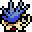
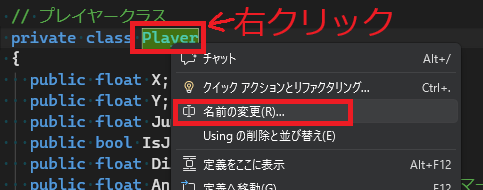
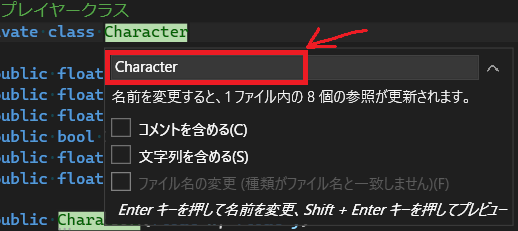
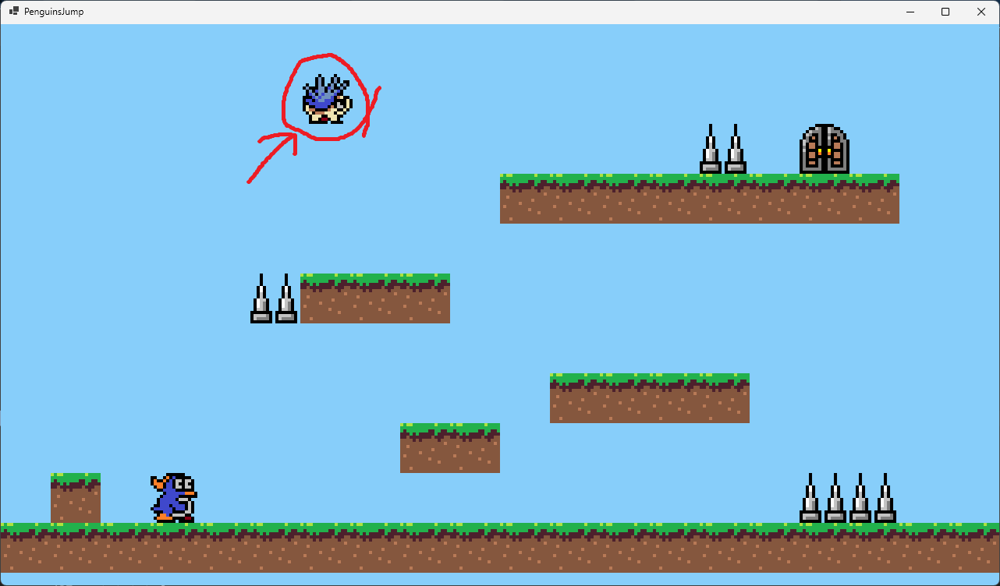
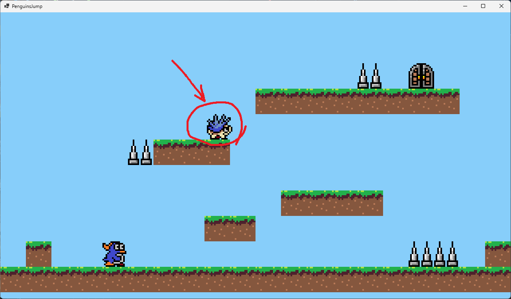

[C#言語2026 第12回]

# プラットフォームゲームの改良

## キーポイント

* 
* 
* 
* 
* 

## 1 敵を作る

&emsp;前々回: 地形の表示, プレイヤーとゴールの表示, プレイヤーの移動、ジャンプ、着地、向き<br>
&emsp;前回: プレイヤーの頭上と側面の判定, ゴール判定, クリア状態, トゲブロック, 死亡状態<br>
&emsp;**今回: 敵の表示, 敵の衝突判定, ステージ数を増やす**

### 1.1 敵クラスを作る

トゲブロックだけでは、プレイヤーに選択を迫る状況のバリエーションを作りにくいです。<br>
「左右に移動する敵」を追加して、バリエーションを作りやすくしましょう。

<div align="center"></div>

というわけで、「移動する敵」のクラスを作るわけですが、必要なフィールドを考えてみましょう。<br>
「移動する敵」は、当然ながら移動します。移動するためには座標フィールドが必要です。<br>
そして、移動先にブロックがあったら向きを変えたいです。となると、向きフィールドも必要です。<br>
また、ブロックの端から落ちたりするかもしれません。落ちるには、ジャンプ状態フィールドが必要です。<br>
アニメーションさせたいなら、アニメーション制御タイマーも必要です。

どうやら、「移動する敵」クラスのフィールドは、プレイヤークラスとほとんど同じになりそうです。<br>
それなら、プレイヤークラスを流用すれば、わざわざ敵クラスを作る必要はないはずです。

問題があるとすればクラス名です。「`Player`型の敵」というのは違和感があります。<br>
そこで、 **クラス名を変える** ことにします。新しいクラス名は、プレイヤーと敵の両方に使える名前にしたいです。<br>
どちらもゲーム空間を動き回るキャラクターなので、`Character`(キャラクター)という名前にしましょう。

名前を変更するには、変更したい名前の上で右クリックして、メニューから「名前の変更」を選びます。

<div align="center"></div>

名前の入力欄が表示されるので、`Character`と入力してEnterキーを押してください。

<div align="center"></div>

名前を変更したら、一度プログラムを実行して、エラーが起きないことを確認すること。<br>
もしエラーが出たら、エラーメッセージを読んで修正しなくてはなりません。

`Player`クラスの名前を変えただけですが、これで敵クラスが手に入りました。

#### コメントをなおす

さて、クラス名は変わりましたが、コメントは「プレイヤークラス」もしくは「Playerクラス」のままです。<br>
プログラムとコメントが一致しないと、あとで見たとき混乱する原因となります。そこで、コメントを修正します。<br>
`Character`クラスのコメントの「プレイヤークラス」を、「キャラクタークラス」に書き直してください。

```diff
     } // Goalクラスブロックの終わり
     private static Goal goal = new(1024.0f, 128.0f);

-    // プレイヤークラス
+    // キャラクタークラス
     public class Character
     {
       public float X; // X座標
       public float Y; // Y座標
```

<div style="page-break-after: always"></div>

次に、`Character`クラスブロックの終わりにあるコメントを、次のように変更してください。

```diff
         if (AnimeTimer >= bmpPlayer.Length)
         {
           AnimeTimer -= bmpPlayer.Length;
         }
       }
-    } // Playerクラスブロックの終わり
+    } // Characterクラスブロックの終わり
     private static Character player = new(192.0f, 576.0f);

     // 長方形クラス
     public class Box
```

これで、クラス名とコメントが一致するようになりました。

### 1.2 敵を表示する

プレイヤーは1体だけですが、敵は複数同時に出現させたいでしょう。<br>
そこで、敵データは配列で管理することにします。変数名は`enemyList`(エネミー・リスト)とします。<br>
`player`変数の定義の下に、敵の配列変数を定義してください。

```diff
     } // Playerクラスブロックの終わり
     private static Character player = new(160.0f, 448.0f);
+
+    // 敵の配列
+    private static Character[] enemyList = {
+      new(384.0f, 64.0f),
+    };

     // 長方形クラス
     public class Box
```

「複数同時に出せる」とはいえ、本当にいきなり何体も表示すると、バグやエラーが起きたときが大変です。<br>
そこで、とりあえず1体だけ配置することにします。

<div style="page-break-after: always"></div>

それから、敵を画面に表示するには画像データが必要です。<br>
プレイヤーの画像を読み込むプログラムの下に、敵の画像を読み込むプログラムを追加してください。

```diff
     private static Bitmap[] bmpPlayer = {
       new("assets/images/player_0.png"),
       new("assets/images/player_1.png"),
       new("assets/images/player_2.png"),
       new("assets/images/player_1.png"),
     };
+    private static Bitmap[] bmpEnemy = {
+      new("assets/images/hedgehog_0.png"),
+      new("assets/images/hedgehog_1.png"),
+    };
     private static Bitmap bmpGoal = new("assets/images/door_closed.png");
     private static Bitmap bmpBackground = new("assets/images/bg_forest.png");
```

> 画像ファイル名の`hedgehog`(ヘッジホッグ)は「ハリネズミ」という意味です。

それでは、`DrawImage`メソッドを使って敵を表示しましょう。<br>
`PaintPlay`メソッドの、ゴールを描くプログラムの下に、すべての敵を描くプログラムを追加してください。

```diff
       // ゴールを描く
       g.DrawImage(bmpGoal, goal.X, goal.Y, 64.0f, 64.0f);
+
+      // すべての敵を描く
+      for (int a = 0; a < enemyList.Length; a += 1)
+      {
+        Character enemy = enemyList[a];
+        g.DrawImage(bmpEnemy[(int)enemy.AnimeTimer],
+          enemy.X + (32.0f - enemy.Direction * 32.0f), enemy.Y,
+          enemy.Direction * 64.0f, 64.0f);
+      }

       // プレイヤーを描く
       g.DrawImage(bmpPlayer[(int)player.AnimeTimer],
```

表示座標の計算式は、プレイヤーの計算式とまったく同じです。<br>
同じ`Character`型を使い、画像サイズも同じ64x64なので、同じ式が使えるわけです。

プログラムが書けたら`>PenguinsJump`ボタンをクリックしてアプリを実行してください。<br>
今まで表示されたことのないキャラクターが表示されていたら成功です。

<div align="center"></div>

### 1.3 移動する敵を移動させる

さて、「移動する敵」は移動するべきです。そこで、敵を現在向いている方向に移動させましょう。<br>
敵の移動プログラムを書く場所は、プレイヤーの処理が全て終わった後、プレイヤーのゴール判定の後にしましょう。

ゴールを判定するプログラムの下に、敵を移動するプログラムを追加してください。

```diff
     // プレイヤーとゴールが重なっていたらゴール状態にする
     if (boxGoal.Intersect(boxPlayer))
     {
       goalLogoY = -100.0f; // 上側の画面外に設定
       gameState = gsGoal;
     }

+    // 敵の処理
+    for (int a = 0; a < enemyList.Length; a += 1)
+    {
+      Character enemy = enemyList[a];
+
+      // 敵の横移動
+      const float enemySpeed = 2.0f;
+      enemy.X += enemySpeed * enemy.Direction;
+    } // 敵の処理の終わり
   } // UpdatePlayメソッドブロックの終わり

   // プレイ状態を描く
   private static void PaintPlay()
```

プログラムが書けたら`>PenguinsJump`ボタンをクリックしてアプリを実行してください。<br>
敵がゆっくりと右に移動していたら成功です。

### 1.4 敵もUpdateAnimeTimerメソッドを使えるようにする

移動する敵をアニメーションさせましょう。<br>
ただし、今の`UpdateAnimeTimer`メソッドはプレイヤー用で、敵には使えません。<br>

プレイヤー用の「タイマーを進める時間」と「画像の枚数」を決めていて、変えられないためです。

敵にも使えるようにするには、例えば「タイマーを進める時間」と「画像の枚数」をパラメータにします。<br>
ですが、メソッドを実行するたびに時間と枚数を指定するのでは、メソッド化の利点が薄れます。

解決方法は、メソッドで使うデータを **クラスのメンバーフィールドにする** ことです。名前は以下のようにします。

* タイマーを進める時間: `AnimeTimestep`(アニメ・タイムステップ、「アニメを進める間隔」という意味)
* 画像の枚数: `AnimeLength`(アニメ・レングス、「アニメの長さ」という意味)

`Character`クラスに、この2つのフィールドを追加してください。

```diff
       public float JumpSpeed; // ジャンプ力
       public bool IsJumping;  // ジャンプ中なら true
       public float Direction; // 向き
       public float AnimeTimer;// アニメーション制御タイマー
+      public float AnimeTimestep; // タイマーを進める間隔
+      public int AnimeLength;     // アニメーションの枚数

       // コンストラクタ
       public Character(float x, float y)
       {
         Init(x, y);
+        AnimeTimestep = 10.0f / 60.0f;
+        AnimeLength = 1;
       }

       // 初期状態にする
       public void Init(float x, float y)
```

次に、追加したフィールドを使うように、`UudateAnimeTimer`メソッドを変更してください。

```diff
     // アニメーション制御タイマーを更新する
     public void UpdateAnimeTimer()
     {
-      AnimeTimer += 10.0f / 60.0f;
-      if (AnimeTimer >= bmpPlayer.Length)
+      AnimeTimer += AnimeTimestep;
+      if (AnimeTimer >= AnimeLength)
       {
-        AnimeTimer -= bmpPlayer.Length;
+        AnimeTimer -= AnimeLength;
       }
     }
   } // Characterクラスブロックの終わり
```

それから、`AnimeTimestep`と`AnimeLenght`はキャラクターごとに違うでしょう。<br>
そこで、この2つのフィールドを変更するメソッドを作ります。<br>
名前は`SetAnimeData`(セット・アニメ・データ、「アニメ情報を設定する」という意味)とします。

`Character`クラスの`UpdateAnimeTimer`メソッドの定義の下に、次のプログラムを追加してください。

```diff
       AnimeTimer += AnimeTimestep;
       if (AnimeTimer >= AnimeLength)
       {
         AnimeTimer -= AnimeLength;
       }
     }
+
+    // アニメーション情報を設定する
+    public void SetAnimeData(float timestep, int length)
+    {
+      AnimeTimestep = timestep;
+      AnimeLength = length;
+    }
   } // Characterクラスブロックの終わり
   private static Character player = new(192.0f, 576.0f);
```

これで、キャラクターごとにアニメーションの速度や枚数を変えられます。

それでは、プレイヤーのアニメ情報を設定しましょう。<br>
ゲームの途中でアニメ情報を変更する予定はありません。<br>
そこで、ゲームループに入る前に設定しておきます。

`Main`メソッドにあるゲームループの手前に、次のプログラムを追加してください。

```diff
       // フォームを作成して表示
       Form1 form = new();
       form.ClientSize = new(1280, 720);
       form.Show();
+
+      // アニメ情報を設定
+      player.SetAnimeData(10.0f / 60.0f, bmpPlayer.Length);

       // ゲームループ
       Stopwatch stopwatch = new(); // 繰り返し時間の管理用のストップウオッチ
       for ( ; form.IsDisposed == false; )
```

プログラムが書けたら`>PenguinsJump`ボタンをクリックしてアプリを実行してください。<br>
プレイヤーが、アニメ情報を設定する前と同じようにアニメーションしていたら成功です。

### 1.5 敵をアニメーションさせる

それでは、敵をアニメーションさせましょう。まずアニメ情報を設定しなければなりません。<br>
プレイヤーのアニメ―情報を設定するプログラムの下に、次のプログラムを追加してください。

```diff
       // アニメ情報を設定
       player.SetAnimeData(10.0f / 60.0f, bmpPlayer.Length);
+      for (int a = 0; a < enemyList.Length; a += 1)
+      {
+        enemyList[a].SetAnimeData(4.0f / 60.0f, bmpEnemy.Length);
+      }

       // ゲームループ
       Stopwatch stopwatch = new(); // 繰り返し時間の管理用のストップウオッチ
       for ( ; form.IsDisposed == false; )
```

敵の画像は２枚だけなので、画像が切り替わる速度は遅めにしてみました。

次に、アニメーション制御タイマーを更新します。<br>
`UpdatePlay`メソッドにある敵を移動させるプログラムの下に、次のプログラムを追加してください。

```diff
       // 敵の横移動
       const float enemySpeed = 2.0f;
       enemy.X += enemySpeed * enemy.Direction;
+
+      // 敵のアニメーション
+      enemy.UpdateAnimeTimer();
     } // 敵の処理の終わり
   } // UpdatePlayメソッドブロックの終わり
```

プログラムが書けたら`>PenguinsJump`ボタンをクリックしてアプリを実行してください。<br>
敵がアニメーションしていたら成功です。

<div style="page-break-after: always"></div>

## 2 衝突判定をメソッドにする

### 2.1 移動する敵を落下させる

移動する敵は、足元にブロックがなくても右に動き続けます。<br>
敵にはまだ、ジャンプ速度や重力を影響させるプログラムがないからです。<br>
ジャンプ速度や重力を扱うプログラムを追加して、移動する敵を落下させましょう。

一般的に、ジャンプ速度や重力のプログラムは、プレイヤーでも敵でも同じです。<br>
ということは、メソッドにすると使いまわしができて便利そうです。<br>
ジャンプ状態を更新するメソッドなので、名前は`UpdateJump`(アップデート・ジャンプ)としましょう。

`Character`クラスの`SetAnimeData`メソッドの定義の下に、次のプログラムを追加してください。

```diff
     public void SetAnimeData(float timestep, int length)
     {
       AnimeTimestep = timestep;
       AnimeLength = length;
     }
+
+    // ジャンプ状態を更新する
+    public void UpdateJump()
+    {
+    }
   } // Characterクラスブロックの終わり
   private static Character player = new(192.0f, 576.0f);
```

ジャンプ状態を更新するログラムは、プレイヤーのプログラムのものが使えます。<br>
`UpdatePlay`メソッドにあるジャンプ状態を更新するプログラムの上に、次のプログラムを追加してください。

```diff
       player.IsJumping = true;   // ジャンプ状態を「ジャンプ中」にする
       player.JumpSpeed = 800.0f; // ジャンプ速度を設定する
     }
+
+    // ジャンプ状態を更新する
+    player.UpdateJump();

     // ジャンプ中ならジャンプ状態を更新する
     if (player.IsJumping)
```

次に、すぐ下にある「ジャンプ中ならジャンプ状態を更新する」プログラムを範囲選択して、`Ctrl+X`で切り取ってください。

```diff
       player.JumpSpeed = 800.0f; // ジャンプ速度を設定する
     }

     // ジャンプ状態を更新する
     player.UpdateJump();

-    // ジャンプ中ならジャンプ状態を更新する
-    if (player.IsJumping)
-    {
-      player.JumpSpeed -= 2300.0f / 60.0f;  // 重力に従ってジャンプ速度を減らす
-      player.Y -= player.JumpSpeed / 60.0f; // Y座標を更新
-
-      // 落下速度が着地判定の高さを越えないようにする
-      if (player.JumpSpeed < -20.0f * 60.0f)
-      {
-        player.JumpSpeed = -20.0f * 60.0f;
-      }
-    }

     // プレイヤーとブロックの衝突
     player.IsJumping = true; // ジャンプ中にする
     for (int a = 0; a < blockList.Length; a++)
```

切り取ったプログラムを、`Character`クラスの`UpdateJump`メソッドに`Ctrl+V`で貼り付けてください。

```diff
     // ジャンプ状態を更新する
     public void UpdateJump()
     {
+      // ジャンプ中ならジャンプ状態を更新する
+      if (player.IsJumping)
+      {
+        player.JumpSpeed -= 2300.0f / 60.0f;  // 重力に従ってジャンプ速度を減らす
+        player.Y -= player.JumpSpeed / 60.0f; // Y座標を更新
+
+        // 落下速度が着地判定の高さを越えないようにする
+        if (player.JumpSpeed < -20.0f * 60.0f)
+        {
+          player.JumpSpeed = -20.0f * 60.0f;
+        }
+      }
     }
   } // Characterクラスブロックの終わり
   private static Character player = new(192.0f, 576.0f);
```

貼り付けたプログラムのうち、`player.`の部分は不要なので削除してください。

```diff
     // ジャンプ状態を更新する
     public void UpdateJump()
     {
       // ジャンプ中ならジャンプ状態を更新する
-      if (player.IsJumping)
+      if (IsJumping)
       {
-        player.JumpSpeed -= 2300.0f / 60.0f;  // 重力に従ってジャンプ速度を減らす
-        player.Y -= player.JumpSpeed / 60.0f; // Y座標を更新
+        JumpSpeed -= 2300.0f / 60.0f;  // 重力に従ってジャンプ速度を減らす
+        Y -= JumpSpeed / 60.0f; // Y座標を更新

         // 落下速度が着地判定の高さを越えないようにする
-        if (player.JumpSpeed < -20.0f * 60.0f)
+        if (JumpSpeed < -20.0f * 60.0f)
         {
-          player.JumpSpeed = -20.0f * 60.0f;
+          JumpSpeed = -20.0f * 60.0f;
         }
       }
     }
   } // Characterクラスブロックの終わり
```

これで、`Character`クラスの変数ならどれでもジャンプ状態を更新できます。<br>
敵をアニメーションさせるプログラムの下に、次のプログラムを追加してください。

```diff
       // 敵の横移動
       const float enemySpeed = 2.0f;
       enemy.X += enemySpeed * enemy.Direction;

       // 敵のアニメーション
       enemy.UpdateAnimeTimer();
+
+      // 敵のジャンプ状態を更新
+      enemy.UpdateJump();
     } // 敵の処理の終わり
   } // UpdatePlayメソッドブロックの終わり
```

プログラムが書けたら`>PenguinsJump`ボタンをクリックしてアプリを実行してください。<br>
敵が下に落ちて・・・いかないですね？

敵が落ちない理由は **足元の判定をしていないので、ジャンプ状態にならない** からです。<br>
「足元に地面がない」ことに気づいていないんですね。

### 2.2 移動する敵の足元に着地判定を付ける

敵を落下させるには、「足元には何もない」と気づいてもらう必要があります。<br>
そこで、敵の足元にブロックの着地判定を追加しましょう。

プログラムは、プレイヤーの足元の判定のときと同じです。やりたいことが同じなので当然ですね。<br>
違いは「プレイヤーの足の座標を使う」か、「敵の足の座標を使う」かという点です。<br>
とりあえず、足の座標はプレイヤーと同じ`8.0f`と`56.0f`にしておきます。

敵を落下させるプログラムの下に、敵とブロックの衝突を判定するプログラムを追加してください。

```diff
       // 敵のアニメーション
       enemy.UpdateAnimeTimer();

       // 敵のジャンプ状態を更新
       enemy.UpdateJump();
+
+      // 敵とブロックの衝突
+      enemy.IsJumping = true; // ジャンプ中にする
+      for (int b = 0; b < blockList.Length; b++)
+      {
+        // 上昇中でなければ着地を判定する
+        if (enemy.JumpSpeed <= 0.0f)
+        {
+          // 敵の足元の座標を計算
+          Box boxFoot = new(
+            enemy.X + 8.0f, enemy.X + 56.0f,
+            enemy.Y + 64.0f, enemy.Y + 64.0f);
+
+          // ブロックの着地可能範囲の座標を計算
+          Box boxGround = new(
+            blockList[b].X * 64.0f,
+            blockList[b].X * 64.0f + blockList[b].Size * 64.0f,
+            blockList[b].Y * 64.0f,
+            blockList[b].Y * 64.0f + 20.0f);
+
+          // 足が、ブロックの上側 20 ドットの範囲に入ったら、着地したことにする
+          if (boxGround.Intersect(boxFoot))
+          {
+            enemy.Y = boxGround.Top - 64.0f; // ブロックの上に強制移動
+            enemy.IsJumping = false;         // ジャンプしていない状態にする
+            enemy.JumpSpeed = 0.0f;          // ジャンプ速度を0にする
+          }
+        }
+      } // 敵とブロックの衝突の終わり
     } // 敵の処理の終わり
   } // UpdatePlayメソッドブロックの終わり
```

プログラムが書けたら`>PenguinsJump`ボタンをクリックしてアプリを実行してください。<br>
敵が、足元に地面がないことに気づいて落下し、それからブロックの上に着地したら成功です。

<div align="center"></div>

### 2.3 移動する敵に側面の判定を付ける

現在の敵は、もし目の前にブロックがあっても、ブロックをすり抜けて前に進みつづけます。<br>
なぜなら、左右の衝突を判定するプログラムを書いていないからです。<br>
敵の目の前にブロックがあったら、向きを反転させしましょう。

まずはブロックと敵の左右の座標を計算しましょう。<br>
ブロック上部への着地を判定するプログラムの下に、次のプログラムを追加してください。

```diff
             enemy.Y = boxGround.Top - 64.0f; // ブロックの上に強制移動
             enemy.IsJumping = false;         // ジャンプしていない状態にする
             enemy.JumpSpeed = 0.0f;          // ジャンプ速度を0にする
           }
         }
+
+        // ブロックの上下左右の座標を計算
+        Box boxBlock = new(
+          blockList[b].X * 64.0f,
+          blockList[b].X * 64.0f + blockList[b].Size * 64.0f,
+          blockList[b].Y * 64.0f,
+          blockList[b].Y * 64.0f + 20.0f);
+
+        // 敵の左側と右側の座標を計算
+        Box boxLeft = new(
+          enemy.X + 4.0f, enemy.X + 4.0f,
+          enemy.Y + 12.0f, enemy.Y + 52.0f);
+        Box boxRight = new(
+          enemy.X + 60.0f, enemy.X + 60.0f,
+          enemy.Y + 12.0f, enemy.Y + 52.0f);
       } // 敵とブロックの衝突の終わり
     } // 敵の処理の終わり
   } // UpdatePlayメソッドブロックの終わり
```

敵の左右の座標は、ブロックに密着する直前に反転するように、画像の端から4ドット内側にしてみました。

次に、計算した座標を使って衝突を判定し、衝突していたら向きを逆にします。<br>
`Direction`フィールドは、右向きが`1.0f`、左向きが`-1.0f`なので、向きを変えるには符号を変えます。<br>
敵の左側とブロックの衝突を判定するプログラムの下に、敵の右側の判定を行うプログラムを追加してください。

```diff
         Box boxRight = new(
           enemy.X + 60.0f, enemy.X + 60.0f,
           enemy.Y + 12.0f, enemy.Y + 52.0f);
+
+        // 敵の左側とブロックの衝突判定
+        if (boxBlock.Intersect(boxLeft))
+        {
+          enemy.X = boxBlock.Right - 4.0f; // ブロックの右に強制移動
+          enemy.Direction *= -1.0f; // 向きを反転する
+        }
+
+        // 敵の右側とブロックの衝突判定
+        if (boxBlock.Intersect(boxRight))
+        {
+          enemy.X = boxBlock.Left - 60.0f; // ブロックの左に強制移動
+          enemy.Direction *= -1.0f; // 向きを反転する
+        }
       } // 敵とブロックの衝突の終わり
     } // 敵の処理の終わり
   } // UpdatePlayメソッドブロックの終わり
```

プログラムが書けたら`>PenguinsJump`ボタンをクリックしてアプリを実行してください。<br>
敵がブロックの側面で向きを変えたら成功です。

### 2.4 ブロックの上下左右の座標計算をメソッドにする

`Box`クラスの変数は、毎回同じような計算式で作成しています。<br>
例えば、ブロックの`Box`はプレイヤーと敵とで2回同じ計算式を使っています。<br>
この先、新しい敵などを増やしたとすると、そのときも同じ計算式を書くことになるでしょう。

このような、何度も使う計算式をはメソッドにしておくと便利です。<br>
ブロック用の`Box`変数を作るメソッドを作り、計算式をメソッドで置き換えましょう。

今回は「`Box`クラスの`static`なメソッド」として作ることにします。<br>
普通のメソッドは変数が必要ですが、今回は **まだ存在しない変数そのもの** を作りたいからです。

<div style="page-break-after: always"></div>

名前は`MakeBlockBox`(メイク・ブロック・ボックス、「ブロック用の長方形を作る」という意味)とします。<br>
`Box`クラスの定義に、次のプログラムを追加してください。

```diff
   public class Box
   {
     public float Left;   // 左側のX座標
     public float Right;  // 右側のX座標
     public float Top;    // 上側のY座標
     public float Bottom; // 下側のY座標
+
+    // Block全体を範囲とする長方形を作る
+    public static Box MakeBlockBox(Block block)
+    {
+      return new(
+        block.X * 64.0f, (block.X + block.Size) * 64.0f,
+        block.Y * 64.0f, (block.Y + 1.0f) * 64.0f);
+    }

     // コンストラクタ
     public Box(float l, float r, float t, float b)
```

`MakeBlockBox`メソッドは、`Block`型のパラメータの`X`、`Y`、`Size`フィールドを使って、ブロック全体を囲む長方形を計算します。
そして、作成した`Box`型の変数を返します。

なお、このメソッドでは`new`で作成した変数を、変数名を付けずに直接`return`文で返しています。<br>
名前を付けるのは、その変数を何度も使う可能性があるからです。<br>
すぐに`return`で返す場合、メソッド内で変数を使う機会はないので、名前は不要です。

それでは、`MakeBlockBox`メソッドで計算式を書き直しましょう。<br>
ブロックの上下左右の座標を計算しているのは2ヶ所あるので、両方を書き直します。まず、プレイヤーとブロックの衝突のプログラムにある`boxBlock`変数の計算式を、`MakeBlockBox`を使うように書き直してください。

```diff
     // プレイヤーとブロックの衝突
     for (int a = 0; a < blockList.Length; a++)
     {
       // ブロックの上下左右の座標を計算
-      Box boxBlock = new(
-        blockList[a].X * 64.0f,
-        blockList[a].X * 64.0f + blockList[a].Size * 64.0f,
-        blockList[a].Y * 64.0f,
-        blockList[a].Y * 64.0f + 64.0f);
+      Box boxBlock = Box.MakeBlockBox(blockList[a]);

       // 上昇中だけ頭を判定する
       if (player.JumpSpeed > 0.0f)
```

もうひとつは、敵とブロックの衝突のプログラムにある`boxBlock`変数の計算式です。<br>
この計算式を、`MakeBlockBox`を使うように書き直してください。

```diff
             enemy.Y = boxGround.Top - 64.0f; // ブロックの上に強制移動
             enemy.IsJumping = false;         // ジャンプしていない状態にする
             enemy.JumpSpeed = 0.0f;          // ジャンプ速度を0にする
           }
         }

         // ブロックの上下左右の座標を計算
-        Box boxBlock = new(
-          blockList[b].X * 64.0f,
-          blockList[b].X * 64.0f + blockList[b].Size * 64.0f,
-          blockList[b].Y * 64.0f,
-          blockList[b].Y * 64.0f + 20.0f);
+        Box boxBlock = Box.MakeBlockBox(blockList[b]);

         // 敵の左側と右側の座標を計算
         Box boxLeft = new(
           enemy.X + 4.0f, enemy.X + 4.0f,
```

プログラムが書けたら`>PenguinsJump`ボタンをクリックしてアプリを実行してください。<br>
計算式を`MakeBlockBox`で書き直す前と同じように、ブロックに乗り降りできたら成功です。

### 2.5 ブロックの上部20ドットの座標計算をメソッドにする

着地判定に使っている、ブロックの上部20ドットの座標計算もメソッドにしましょう。<br>
名前は`MakeGroundBox`(メイク・グラウンド・ボックス、「地表用の長方形を作る」という意味)とします。<br>
`MakeBlockBox`メソッドの定義の下に、次のプログラムを追加してください。

```diff
       return new(
         block.X * 64.0f, (block.X + block.Size) * 64.0f,
         block.Y * 64.0f, (block.Y + 1.0f) * 64.0f);
     }
+
+    // Blockの上部20ドットを範囲とする長方形を作る
+    public static Box MakeGroundBox(Block block)
+    {
+      return new(
+        block.X * 64.0f, (block.X + block.Size) * 64.0f,
+        block.Y * 64.0f, block.Y * 64.0f + 20.0f);
+    }

     // コンストラクタ
     public Box(float l, float r, float t, float b)
```

それでは、`MakeGroundBox`メソッドで計算式を書き直しましょう。<br>
ブロックの上部20ドットの座標の計算は2ヶ所あるので、両方を書き直します。まず、プレイヤーとブロックの衝突のプログラムにある`boxGround`変数の計算式を、`MakeGroundBox`を使うように書き直してください。

```diff
       Box boxFoot = new(
         player.X + 12.0f, player.X + 52.0f,
         player.Y + 64.0f, player.Y + 64.0f);

       // ブロックの着地可能範囲の座標を計算
-      Box boxGround = new(
-        boxBlock.Left, boxBlock.Right,
-        boxBlock.Top, boxBlock.Top + 20.0f);
+      Box boxGround = Box.MakeGroundBox(blockList[a]);

       // 足が、ブロックの上側 20 ドットの範囲に入ったら、着地したことにする
       if (boxGround.Intersect(boxFoot))
```

次は、敵とブロックの衝突のプログラムにある`boxGround`変数の計算式です。<br>
この計算式を、`MakeGroundBox`を使うように書き直してください。

```diff
           Box boxFoot = new(
             enemy.X + 8.0f, enemy.X + 56.0f,
             enemy.Y + 64.0f, enemy.Y + 64.0f);

           // ブロックの着地可能範囲の座標を計算
-          Box boxGround = new(
-            blockList[b].X * 64.0f,
-            blockList[b].X * 64.0f + blockList[b].Size * 64.0f,
-            blockList[b].Y * 64.0f,
-            blockList[b].Y * 64.0f + 20.0f);
+          Box boxGround = Box.MakeGroundBox(blockList[b]);

           // 足が、ブロックの着地可能範囲に入ったら、着地したことにする
           if (boxGround.Intersect(boxFoot))
```

プログラムが書けたら`>PenguinsJump`ボタンをクリックしてアプリを実行してください。<br>
計算式を`MakeGroundBox`で書き直す前と同じように、ブロックに乗り降りできたら成功です。

<div style="page-break-after: always"></div>

### 2.6 足元、左側、右側の座標計算をメソッドにする

足元と左右の判定もメソッドにしていきます。左右の判定は座標が違うだけなので、共通メソッドにします。<br>
メソッド名は`MakeFootBox`(メイク・フット・ボックス、「足用の長方形を作る」という意味)と、<br>
`MakeSideBox`(メイク・サイド・ボックス、「側面用の長方形を作る」という意味)とします。

`MakeGroundBox`メソッドの定義の下に、次のプログラムを追加してください。

```diff
       return new(
         block.X * 64.0f, (block.X + block.Size) * 64.0f,
         block.Y * 64.0f, block.Y * 64.0f + 20.0f);
     }
+
+    // Characterの足元を範囲とする長方形を作る
+    public static Box MakeFootBox(
+      Character c, float left, float right, float y)
+    {
+      return new(c.X + left, c.X + right, c.Y + y, c.Y + y);
+    }
+
+    // Characterの側面を範囲とする長方形を作る
+    public static Box MakeSideBox(
+      Character c, float x, float top, float bottom)
+    {
+      return new(c.X + x, c.X + x, c.Y + top, c.Y + bottom);
+    }

    // コンストラクタ
    public Box(float l, float r, float t, float b)
```

それでは、座標計算をメソッドで書き直していきましょう。`UpdatePlay`メソッドにあるプレイヤーの足元の座標計算を、`MakeFootBox`メソッドを使うように書き直してください。

```diff
     // 上昇中でなければ着地を判定する
     if (player.JumpSpeed <= 0.0f)
     {
       // プレイヤーの足元の座標を計算
-      Box boxFoot = new(
-        player.X + 12.0f, player.X + 52.0f,
-        player.Y + 64.0f, player.Y + 64.0f);
+      Box boxFoot = Box.MakeFootBox(player, 12.0f, 52.0f, 64.0f);

       // ブロックの着地可能範囲の座標を計算
       Box boxGround = Box.MakeGroundBox(blockList[a]);
```

次に、プレイヤーの左側と右側の座標計算を、`MakeSideBox`メソッドを使うように書き直してください。

```diff
         player.IsJumping = false;  // ジャンプしていない状態にする
         player.JumpSpeed = 0.0f;   // ジャンプ速度を 0 にする
       }

       // 左側と右側の座標を計算
-      Box boxLeft = new(
-        player.X + 8.0f, player.X + 8.0f,
-        player.Y + 12.0f, player.Y + 52.0f);
-      Box boxRight = new(
-        player.X + 56.0f, player.X + 56.0f,
-        player.Y + 12.0f, player.Y + 52.0f);
+      Box boxLeft = Box.MakeSideBox(player, 8.0f, 12.0f, 52.0f);
+      Box boxRight = Box.MakeSideBox(player, 56.0f, 12.0f, 52.0f);

       // 左側の衝突判定
       if (boxBlock.Intersect(boxLeft))
```

これで、プレイヤーの座標計算は書き直しできました。

続いて、敵の座標計算を書き直します。<br>
敵の足元の座標計算を、`MakeFootBox`メソッドを使うように書き直してください。

```diff
       // 上昇中でなければ着地を判定する
       if (enemy.JumpSpeed <= 0.0f)
       {
         // 敵の足元の座標を計算
-        Box boxFoot = new(
-          enemy.X + 8.0f, enemy.X + 56.0f,
-          enemy.Y + 64.0f, enemy.Y + 64.0f);
+        Box boxFoot = Box.MakeFootBox(enemy, 8.0f, 56.0f, 64.0f);

         // ブロックの着地可能範囲の座標を計算
         Box boxGround = Box.MakeGroundBox(blockList[b]);
```

<div style="page-break-after: always"></div>

次に、敵の左側と右側の座標計算を、`MakeSideBox`メソッドを使うように書き直してください。

```diff
         // ブロックの上下左右の座標を計算
         Box boxBlock = Box.MakeBlockBox(blockList[b]);

         // 敵の左側と右側の座標を計算
-        Box boxLeft = new(
-          enemy.X + 4.0f, enemy.X + 4.0f,
-          enemy.Y + 12.0f, enemy.Y + 52.0f);
-        Box boxRight = new(
-          enemy.X + 60.0f, enemy.X + 60.0f,
-          enemy.Y + 12.0f, enemy.Y + 52.0f);
+        Box boxLeft = Box.MakeSieBox(enemy, 4.0f, 12.0f, 52.0f);
+        Box boxRight = Box.MakeSieBox(enemy, 60.0f, 12.0f, 52.0f);

         // 敵の左側とブロックの衝突判定
         if (boxBlock.Intersect(boxLeft))
```

プログラムが書けたら`>PenguinsJump`ボタンをクリックしてアプリを実行してください。<br>
計算式をメソッドで書き直す前と同じように、ブロックにぶつかったり乗り降りできたら成功です。

### 2.7 プレイヤーと敵の衝突判定

移動する敵がそれっぽく移動できるようになったので、プレイヤーを攻撃しましょう。<br>
攻撃といってもただの体当たりで、敵とプレイヤーが衝突したら死亡状態にするだけです。<br>
ですが、「キャラクター用の長方形を作る」メソッドはまだ作っていません。ですから、作りましょう。

メソッド名は`MakeHitBox`(メイク・ヒットボックス、「衝突判定用の長方形を作る」という意味)としましょう。<br>
`Box`クラスに、衝突判定を計算するスタティックメソッドを定義してください。

```diff
     public static Box MakeSideBox(
       Character c, float x, float top, float bottom)
     {
       return new(c.X + x, c.X + x, c.Y + top, c.Y + bottom);
     }
+
+    // Characterの一部を範囲とする長方形を作る
+    public static Box MakeHitBox(
+      Character c, float left, float right, float top, float bottom)
+    {
+      return new(c.X + left, c.X + right, c.Y + top, c.Y + bottom);
+    }

     // コンストラクタ
     public Box(float l, float r, float t, float b)
```

それでは、敵とプレイヤーの衝突を判定するプログラムを追加しましょう。<br>
敵とブロックの衝突を判定するfor文ブロックの下に、次のプログラムを追加してください。

```diff
           enemy.X = boxBlock.Left - 60.0f; // ブロックの左に強制移動
           enemy.Direction *= -1.0f; // 向きを反転する
         }
       } // 敵とブロックの衝突の終わり
+
+      // 敵とプレイヤーの衝突
+      Box boxEnemy = Box.MakeHitBox(enemy, 16.0f, 48.0f, 24.0f, 60.0f);
+      if (boxEnemy.Intersect(boxPlayer))
+      {
+        gameState = gsDead; // 死亡状態にする
+      }
     } // 敵の処理の終わり
   } // UpdatePlayメソッドブロックの終わり
```

プログラムが書けたら`>PenguinsJump`ボタンをクリックしてアプリを実行してください。<br>
プレイヤーを敵に衝突させたとき、死亡状態になったら成功です。

<div style="page-break-after: always"></div>

## 3 マップを増やす

### 3.1 レベルデータクラスを作る

現在のプログラムでは、ゴールに到達したらゲームが終わってしまいます。<br>
終わるのが早すぎるので、ゴールするたびに新しい画面に切り替わるようにしましょう。<br>
それから、今後はひとつの画面のことを「レベル」と呼ぶことにします。

まず、「現在のレベル」をあらわす変数を宣言します。<br>
名前は`currentLevel`(カレント・レベル、「現在のレベル」という意味)とします。<br>
`gameState`変数の宣言の下に、次のプログラムを追加してください。

```diff
     const int gsGoal = 2;  // ゴール状態
     const int gsDead = 3;  // 死亡状態
     private static int gameState = gsPlay; // 現在のゲーム状態
+
+    // 現在のレベル番号
+    private static int currentLevel = 0;

     // ゴールの文字のY座標
     private static float goalLogoY = 0.0f;
```

レベルごとにブロックや敵の配置を変えたいので、「レベルに必要なデータをまとめたクラス」を作ります。<br>
クラスの名前は`LevelData`(レベル・データ)とします。<br>
`Box`クラスの定義の下に、次のプログラムを追加してください。

```diff
           return true;
         }
         return false;
       }
     } // Boxクラスブロックの終わり
+
+    // レベルデータクラス
+    public class LevelData
+    {
+      public Block[] BlockList;     // ブロックの配列
+      public Block[] SpikeList;     // トゲブロックの配列
+      public Block[] DownSpikeList; // 下向きトゲブロックの配列
+      public Point[] EnemyList;     // 敵の出現位置の配列
+      public Point Start;           // プレイヤーの出現位置
+      public Point Goal;            // ゴールの位置
+
+      // コンストラクタ
+      public LevelData(Block[] blockList, Block[] spikeList, Block[] downSpikeList,
+        Point[] enemyList, Point start, Point goal)
+      {
+        BlockList = blockList;
+        SpikeList = spikeList;
+        DownSpikeList = downSpikeList;
+        EnemyList = enemyList;
+        Start = start;
+        Goal = goal;
+      }
+    } // LevelDataクラスブロックの終わり

     // ファイルから画像を読み込む
     private static Bitmap bmpBlock = new("assets/images/block_soil_ct.png");
     private static Bitmap[] bmpPlayer = {
```

次に、レベルデータの配列を作ります。配列名は`levelDataList`(レベルデータ・リスト)とします。<br>
`LevelData`クラスの定義の下に、次のプログラムを追加してください。

```diff
         Start = start;
         Goal = goal;
       }
     } // LevelDataクラスブロックの終わり
+
+    // レベルデータの配列
+    private static LevelData[] levelDataList = {
+      // レベル１
+      new LevelData(
+        new Block[]{ // ブロックの配列
+        },
+        new Block[]{ // トゲブロックの配列
+        },
+        new Block[]{ // 下向きトゲブロックの配列
+        },
+        new Point[]{ // 敵の配列
+        },
+        new Point(3, 9), new Point(16, 2) // スタートとゴール
+      ),
+    };

     // ファイルから画像を読み込む
     private static Bitmap bmpBlock = new("assets/images/block_soil_ct.png");
     private static Bitmap[] bmpPlayer = {
```

スタートとゴールの座標は、ブロックと同じく16x16単位の位置で指定することにしました。<br>
そのほうが、他のブロックとの位置調整がやりやすいと考えたためです。

レベルデータには、以前に作ったブロックやトゲブロックの配列の内容を使います。<br>
ブロックの配列の内容を選択して、`Ctrl+X`で切り取ってください。

```diff
     } // Blockクラスブロックの終わり

     // ブロックの配列
     private static Block[] blockList = {
-      new(0.0f, 10.0f, 20), new(8.0f, 8.0f, 2), new(11.0f, 7.0f, 4),
-      new(6.0f, 5.0f, 3), new(10.0f, 3.0f, 8), new(1.0f, 9.0f, 1),
-      new(19.0f, 9.0f, 1),
     };

     // トゲブロックの配列
     private static Block[] spikeList = {
```

次に、レベルデータ配列の、ブロック配列の部分に、`Ctrl+V`で貼り付けてください。

```diff
     // レベルデータの配列
     private static LevelData[] levelDataList = {
       // レベル１
       new LevelData(
         new Block[]{ // ブロックの配列
+          new(0.0f, 10.0f, 20), new(8.0f, 8.0f, 2), new(11.0f, 7.0f, 4),
+          new(6.0f, 5.0f, 3), new(10.0f, 3.0f, 8), new(1.0f, 9.0f, 1),
+          new(19.0f, 9.0f, 1),
         },
         new Block[]{ // トゲブロックの配列
         },
```

同じ手順で、トゲブロックの中身も移動します。トゲブロックの配列の内容を選択して、`Ctrl+X`で切り取ってください。

```diff
     // トゲブロックの配列
     private static Block[] spikeList = {
-      new(16.0f, 9.0f, 2), new(5.0f, 5.0f, 1), new(14.0f, 2.0f, 1),
     };

     // 下向きトゲブロックの配列
     private static Block[] downSpikeList = {
```

そして、レベルデータ配列の、トゲブロック配列の部分に、`Ctrl+V`で貼り付けてください。

```diff
       new LevelData(
         new Block[]{ // ブロックの配列
           new(0.0f, 10.0f, 20), new(8.0f, 8.0f, 2), new(11.0f, 7.0f, 4),
           new(6.0f, 5.0f, 3), new(10.0f, 3.0f, 8), new(1.0f, 9.0f, 1),
           new(19.0f, 9.0f, 1),
         new Block[]{ // トゲブロックの配列
+          new(16.0f, 9.0f, 2), new(5.0f, 5.0f, 1), new(14.0f, 2.0f, 1),
         },
         new Block[]{ // 下向きトゲブロックの配列
         },
```

<pre class="tnmai_assignment">
<strong>【課題05 下向きトゲブロック配列の内容をレベルデータに移動する】</strong>
<code>downSpikeList</code>配列の内容を切り取って、
レベルデータ配列の「下向きトゲブロック配列」の部分に貼り付けなさい。
</pre>

<pre class="tnmai_assignment">
<strong>【課題05 敵の配列の内容をレベルデータに移動する】</strong>
<code>enemyList</code>配列の内容を切り取って、
レベルデータ配列の「敵の配列」の部分に貼り付けなさい。
</pre>

ところで、レベルデータの`new`の書きかたは、これまでと少し違って、以下の書きかたを使っています。<br>

&emsp;<span class="hljs-function"><span class="hljs-keyword">new</span> <span class="hljs-title">クラス名[]</span>{ <span class="hljs-params">要素1</span>, <span class="hljs-params">要素2</span>, <span class="hljs-params">要素3</span>, ... }</span>

実は、**newに続けてクラス名を書くほうが、本来の書きかた** です。ただし、以下の場合は`new`とクラス名を省略できます。

* コンピュータがクラス名を推測できる場合、クラス名を省略できる。
* 配列変数の宣言では、`new クラス名[]`まで省略できる。

以下の2つの書きかたは、どちらも同じ配列を作成します。

&emsp;<span class="hljs-title">Block</span>[] blockListA = { <span class="hljs-keyword">new</span>(1, 1, 1), <span class="hljs-keyword">new</span>(2, 2, 2) };<br>
&emsp;<span class="hljs-title">Block</span>[] blockListB = <span class="hljs-keyword">new</span> Block[]{ <span class="hljs-keyword">new</span>(1, 1, 1), <span class="hljs-keyword">new</span>(2, 2, 2) };

さて、レベルデータがひとつだけでは、レベルの変化を確認できません。<br>
もうひとつデータを作りましょう。レベル１のデータの下に、レベル２のデータを追加してください。

```diff
         new Point[]{
           new(6, 1),
         },
         new Point(3, 9), new Point(16, 2)
       ),
+      // レベル２
+      new LevelData(
+        new Block[]{ new(0.0f, 10.0f, 20), new(8.0f, 8.0f, 2), new(12.0f, 7.0f, 4) },
+        new Block[]{ new(10.0f, 8.0f, 2) },
+        new Block[]{ new(14.0f, 5.0f, 3) },
+        new Point[]{ new(6, 1) },
+        new Point(4, 9), new Point(15, 6)
+      ),
     };

     // ファイルから画像を読み込む
     private static Bitmap bmpBlock = new("assets/images/block_soil_ct.png");
     private static Bitmap[] bmpPlayer = {
```

次に、「レベルデータを、ゲームで使う変数に反映するメソッド」を作ります。<br>
メソッド名は`ApplyLevelData`(アプライ・レベルデータ、「レベルデータを適用する」という意味)とします。

ゲームで使う変数は`Program`クラスのスタティックメンバーです。<br>
それらのメンバーを扱う`ApplyLevelData`メソッドも、`Program`クラスのスタティックメンバーになります。

ひとまずメソッドの定義から始めましょう。
`Program.cs`の一番下にある`DrawText`メソッドの定義の下に、次のプログラムを追加してください。

```diff
     private static void DrawText(
       Graphics g, string text, Font font, int x, int y, Color color)
     {
       TextRenderer.DrawText(g, t, f, new Point(x, y), color);
     }
+
+    // 現在のレベルデータをゲーム用変数に反映する
+    private static void ApplyLevelData()
+    {
+      LevelData data = levelDataList[currentLevel];
+    }
   } // Programクラスブロックの終わり
 } // DinoRun名前空間ブロックの終わり```
```

それでは、変数にレベルデータを反映しましょう。<br>
`ApplyLevelData`メソッドブロックに、次のプログラムを追加してください。

```diff
     private static void ApplyLevelData()
     {
       LevelData data = levelDataList[currentLevel];
+
+      // ブロックとトゲブロックのデータを反映
+      blockList = data.BlockList;
+      spikeList = data.SpikeList;
+      downspikeList = data.DownSpikeList;
+
+      // 敵の座標から敵キャラクターを作成
+      enemyList = new Character[data.EnemyList.Length];
+      for (int a = 0; a < enemyList.Length; a += 1)
+      {
+        enemyList[a] = new(data.EnemyList[a].X * 64.0f, data.EnemyList[a].Y * 64.0f);
+        enemyList[a].SetAnimeData(4.0f / 60.0f, bmpEnemy.Length);
+      }
+
+      // プレイヤーを初期状態に戻し、座標を反映
+      player.Init(data.Start.X * 64.0f, data.Start.Y * 64.0f);
+
+      // ゴールの座標を反映
+      goal.X = data.Goal.X * 64.0f;
+      goal.Y = data.Goal.Y * 64.0f;
     }
   } // Programクラスブロックの終わり
 } // DinoRun名前空間ブロックの終わり
```

### 3.2 ゲーム開始時にレベルデータを反映する

ゲーム開始時に、最初のレベルデータを設定する必要があります。<br>
アニメ情報を設定するプログラムを、次のように変更してください。

```diff
     // アニメ情報を設定
     player.SetAnimeData(10.0f / 60.0f, bmpPlayer.Length);
-    for (int a = 0; a < enemyList.Length; a += 1)
-    {
-      enemyList[a].SetAnimeData(4.0f / 60.0f, bmpEnemy.Length);
-    }
+
+    // 最初のレベルデータを反映
+    ApplyLevelData();

     // ゲームループ
     Stopwatch stopwatch = new(); // 繰り返し時間の管理用のストップウオッチ
     for ( ; form.IsDisposed == false; )
```

敵のアニメ情報の設定は`ApplyLevelData`メソッドで実行しているので削除しています。

プログラムが書けたら`>PenguinsJump`ボタンをクリックしてアプリを実行してください。<br>
ゲーム開始時に、普通にレベルが表示されたら成功です。

### 3.3 レベルクリア時にレベルデータを反映する

ゴールに到達したら、Enterキーが押されたときに`currentLevel`を1増やします。<br>
そして、レベルデータを変数に反映して、プレイ状態に戻します。<br>
`UpdateGoal`メソッドの定義を、次のように変更してください。

```diff
     private static void UpdateGoal()
     {
       // Enterキーが押されたらプレイ状態にする
       if (GetAsyncKeyState(vkReturn))
       {
-        // プレイヤーを初期状態に戻す
-        player.Init(192.0f, 576.0f);
+        // 次のレベルに進む
+        currentLevel += 1;
+        if (currentLevel >= levelDataList.Length)
+        {
+          currentLevel = 0;
+        }
+        ApplyLevelData();

         // プレイ中の状態にする
         gameState = gsPlay;
       }
```

`player.Init`メソッドは`ApplyLevelData`メソッドの中でも実行しています。<br>
何回も実行する必要はないので、`UpdateGoal`メソッドからは無くしました。

プログラムが書けたら`>PenguinsJump`ボタンをクリックしてアプリを実行してください。<br>
ゴールしてEnterキーを押したとき、次のレベルが表示されたら成功です。

<pre class="tnmai_assignment">
<strong>【課題05 死亡状態でもApplyLevelDataを実行する】</strong>
<code>UpdateDead</code>メソッドにある<code>Init</code>メソッド呼び出しを削除し、
<code>ApplyLevelData</code>メソッドに変更しなさい(※レベルは進めないこと)。
</pre>

<pre class="tnmai_assignment">
<strong>【課題05 レベル２のデータを作る】</strong>
レベルデータ配列のレベル２に、レベル１とは別のブロック配置データを作りなさい。
</pre>

<pre class="tnmai_assignment">
<strong>【課題05 レベル３のデータを作る】</strong>
レベルデータ配列にレベル３を追加し、レベル１や２とは別のブロック配置データを作りなさい。
</pre>
