[C#言語2026 第13回]

# シューティングゲームの基礎を作る

## キーポイント

* フォームクラスのプログラムを開くには「フォーム名だけの項目」をクリックする
* プログラムを複数のファイルに分けると、「どこに何を書いたのか」が分かりやすくなる
* 範囲を２つ指定するバージョンの`DrawImage`を使うと、画像の一部だけを表示できる
* クラスごとにファイルを作ると、簡単にクラスを見つけられる
* `readonly`属性が付いたフィールドは **書き換え禁止** になる

## 1 プロジェクトを作る

今回から5回かけて、簡単な縦方向2Dシューティングゲームを作ります。<br>
プレイヤーは移動と射撃を使って敵を倒し、ステージ最後に待ち受けるボスの破壊を目指します。
このゲームの制作を通じて、クラスごとにファイルを分ける方法を学習します。

各回では以下の内容を予定しています。
&emsp;**今回:**<br>
&emsp;2回目: <br>
&emsp;3回目: <br>
&emsp;4回目: <br>
&emsp;5回目: <br>

### 1.1 Windowsフォームアプリを作成する

何をするにも、Visual Studioのプロジェクトがないと話が進みません。<br>
プロジェクト名は **ShootEmUp** (シューテム・アップ、「撃ちまくれ」という意味)とします。<br>
以下の手順にしたがって、新しいプロジェクトを作成してください。

1. Visual Studioを起動して「新しいプロジェクトの作成」をクリック
2. 「新しいプロジェクトの作成」画面になったら、右上の検索ボックスに「form」と入力
3. テンプレート一覧に`form`を含むテンプレートが表示されるので、<br>
   C#の「Windowsフォームアプリ」を選択し、右下の「次へ」ボタンをクリック
4. 「プロジェクト名」を`ShootEmUp`(シューテム・アップ)に変更
5. 「場所」は「自分で作った他のプロジェクトのあるフォルダ」を選択
6. 「ソリューションとプロジェクトを同じディレクトリに配置する」にチェックを入れ、「次へ」をクリック
7. 「追加情報」は変更不要。何も変えずに、右下の「作成」ボタンをクリック

手順を終えると、プロジェクト用のファイルが作成された後、プロジェクトが開きます。

フォームのデザイン画面が表示されたら、以下の手順でフォームの設定を変更してください。

1. フォーム内の白い部分を右クリック
2. 右クリックメニューが開くので、「プロパティ」項目をクリック<br>
   Visual Studioの右側の「プロパティ・ウィンドウ」が表示されていることを確認
3. プロパティウィンドウをスクロールさせて「動作」欄の`DoubleBufferd`(ダブル・バッファード)を探す
4. `DoubleBufferd`項目をクリックし、`True`(トゥルー)を選択

設定を変更したら、Visual Sutidoの上部の`>ShootEmUp`ボタンをクリックし、アプリを実行してください。<br>
何もないウィンドウが表示されたら成功です。ウィンドウ右上の`X`ボタンでウィンドウを閉じてください。

<div style="page-break-after: always"></div>

### 1.2 ゲーム状態を扱うメソッドを作る

これまでは、全てのプログラムを`Program.cs`だけに書いてきました。<br>
プログラムの分量が少ないあいだは、ひとつのファイルにすべてを書くほうが簡単で便利です。<br>
ですが、ある程度プログラムの行数が増えると **どこに何を書いたのか** が分からなくなってきます。

「どこに何を書いたのか分からない」問題に対処するために、今回はプログラムを複数のファイルに分散します。<br>
手始めに、ゲームループを以下のように分担します。

* **Form1.cs** : ゲーム状態の初期化、ゲーム状態の更新、画面の描画(びょうが)
* **Program.cs** : ゲームループ

まずは`Form.cs`に「初期化」、「更新」、「描画」を行うメソッドを作ります。<br>
ただし、`Form1.cs`のような「フォーム」を管理するファイルは、項目をクリックするだけではファイルを開けません。<br>
以下の手順にしたがって「プログラム」のファイルを開いてください。

1. `Form1.cs`の左側にある`>`アイコンをクリックして、配下の項目を表示。
2. `Form1`とだけ書いてある項目をダブルクリック。

<div align="center">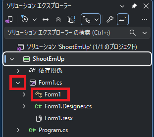</div>

`Form1`の「プログラム」を開くと、そこには`Form1`クラスの定義が書かれているはずです。<br>
とりあえず、後で使いそうな名前空間を`using`(ユージング)宣言しておきましょう。

```diff
+using System.Runtime.InteropServices;
+using System.Drawing.Drawing2D;
+using System.Drawing.Imaging;
+
 namespace ShootEmUp
 {
   public partial class Form1 : Form
   {
+    public const int RenderWidth = 1024; // 横のピクセル数
+    public const int RenderHeight = 896; // 縦のピクセル数
+
+    // コンストラクタ
     public Form1()
     {
       InitializeComponent();
+      ClientSize = new Size(RenderWidth, RenderHeight); // 画面サイズを設定
-    }
-  }
-}
+    } // コンストラクタブロックの終わり
+  } // Form1 型ブロックの終わり
+} // ShootEmUp 名前空間ブロックの終わり
```

`RenderWidth`(レンダー・ウィス、「描画する幅」という意味)と`RenderHeight`(レンダー・ハイト、「描画する高さ」という意味)は、ウィンドウの描画領域の大きさです。

以前に作ったジャンプゲームの描画領域は、横への移動が基本だったので1280x720でした。<br>
しかし、今回作成する縦方向2Dシューティングでは、縦方向に広い画面のほうが見やすいです。<br>
そこで、横を狭めて(1280→1024)、縦を長く(720→896)してみました。

続いて、この`Form1`クラスに、以下の3つのメソッドを追加します。

* **Init**(イニット、イニシャライズの略語): ゲーム状態を初期化するメソッド
* **Tick**(ティック、「時計の針が1つ進む」という意味): ゲーム状態を更新するメソッド
* **OnPaint**(オン・ペイント): 画面を描くメソッド

それでは、`Form1`クラスに、次のプログラムを追加してください。

```diff
     // コンストラクタ
     public Form1()
     {
       InitializeComponent();
       ClientSize = new Size(RenderWidth, RenderHeight);
     } // コンストラクタブロックの終わり
+
+    // ゲーム状態を初期化する
+    public void Init()
+    {
+    } // Init メソッドブロックの終わり
+
+    // ゲーム状態を更新する
+    public void Tick()
+    {
+    } // Tick メソッドブロックの終わり
+
+    // 画面を描く
+    protected override void OnPaint(PaintEventArgs e)
+    {
+    } // OnPaint メソッドブロックの終わり
   } // Form1 型ブロックの終わり
 } // ShootEmUp 名前空間ブロックの終わり
```

ここで目新しいのは、画面を描く`OnPaint`メソッドの定義でしょう。<br>
`OnPaint`という名前は「フォームの画面を描くためのメソッド名」として予約されています。<br>
`OnPaint`メソッドを書くと、画面を描き直す必要があるときは自動的に実行されます。

それから、予約名のメソッドを追加する場合、以下の２つの属性を付けるルールになっています。

* `override`(オーバーライド): 予約されたメソッド名を使うことを示す。
* `protected`(プロテクテッド): メンバーが使える範囲を「同じクラス」と「継承クラス」に制限する。

>「継承クラス」は本テキストでは扱いません。もっとあとで学習する予定です。

### 1.3 ゲームループを作る

次にゲームループを作ります。まずは必要な名前空間を`using`し、不要なコメントを消しましょう。<br>
それと、`timeBeginPeriod`(タイム・ビギン・ピリオド)メソッドも使えるようにしておきます。<br>
`Program.cs`を開き、プログラムを次のように変更してください。

```diff
+using System.Runtime.InteropServices; // DllImportを使えるようにする
+using System.Diagnostics; // Stopwatchを使えるようにする
+
 namespace ShootEmUp
 {
   internal static class Program
   {
+    // OSの「スリープ時間の精度を変える機能」を使えるようにする
+    [DllImport("winmm.dll")]
+    static extern uint timeBeginPeriod(uint uMilliseconds);
+
-    /// <summary>
-    ///  The main entry point for the application.
-    /// </summary>
     [STAThread]
     static void Main()
     {
-      // To customize application configuration such as set high DPI settings or default font,
-      // see https://aka.ms/applicationconfiguration.
+      timeBeginPeriod(1); // スリープの精度を1ミリ秒に設定
       ApplicationConfiguration.Initialize();
       Application.Run(new Form1());
-    }
-  }
-}
+    } // Main メソッドブロックの終わり
+  } // Program 型ブロックの終わり
+} // ShootEmUp 名前空間ブロックの終わり
```

それでは、ゲームループを作りましょう。<br>
`Progra.cs`にある`Main`メソッドを、次のように変更してください。

```diff
     [STAThread]
     static void Main()
     {
       timeBeginPeriod(1); // スリープの精度を1ミリ秒に設定
       ApplicationConfiguration.Initialize();
-      Application.Run(new Form1());
+
+      // フォームを作成して表示
+      Form1 form = new(); // フォームを作成
+      form.Init();        // ゲーム状態を初期化
+      form.Show();        // フォームを表示
+
+      // ゲームループ
+      Stopwatch stopwatch = new(); // 繰り返し時間の管理用のストップウオッチ
+      for ( ; form.IsDisposed == false; )
+      {
+        stopwatch.Restart(); // 時間計測を開始
+
+        form.Tick();            // ゲーム状態を更新
+        form.Refresh();         // ウィンドウの描き直しを指示
+        Application.DoEvents(); // ウィンドウのイベントを実行
+
+        stopwatch.Stop(); // 時間計測を終了
+
+        // 経過時間が1/60秒未満の場合、1/60秒が経過するまで待つ
+        if (stopwatch.ElapsedMilliseconds < 1000 / 60)
+        {
+          Thread.Sleep(1000 / 60 - (int)stopwatch.ElapsedMilliseconds);
+        }
+      } // ゲームループの終わり
     } // Main メソッドブロックの終わり
   } // Program 型ブロックの終わり
 } // ShootEmUp 名前空間ブロックの終わり
```

プログラムが書けたら、`>ShootEmUp`ボタンをクリックしてアプリを実行してください。<br>
何もないウィンドウが表示されたら成功です。ウィンドウ右上の`X`ボタンでウィンドウを閉じてください。

<div align="center">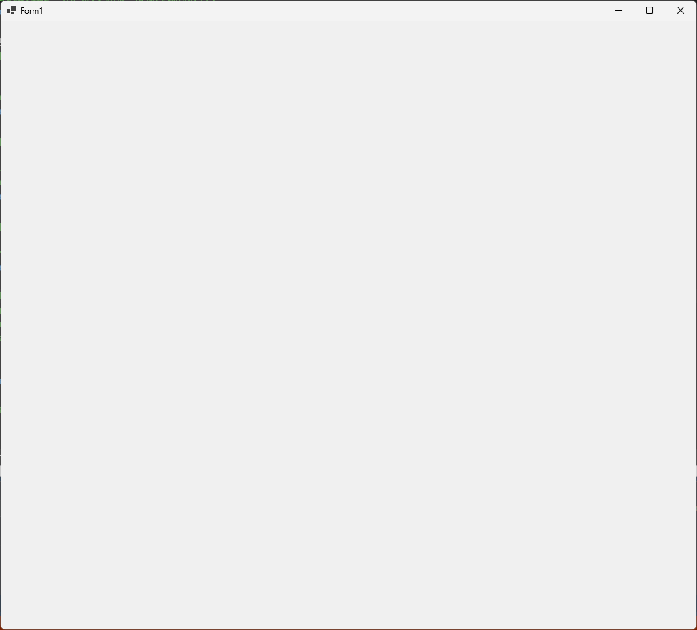</div>

### 1.4 ゲーム状態を作る

今回作るシューティングゲームは、以下の3つのゲーム状態を取れるものとします。

* **プレイ状態**: ゲームを遊んでいる状態
* **ステージクリア状態**: プレイヤーがボスを倒した状態
* **死亡状態**: プレイヤーが敵や敵弾に当たった状態

これらのゲーム状態をあらわす変数を作ります。`Form1`クラスの定義に次のプログラムを追加してください。

```diff
   public partial class Form1 : Form
   {
     public const int RenderWidth = 1024; // 横のピクセル数
     public const int RenderHeight = 896; // 縦のピクセル数
+
+    // ゲーム状態
+    const int gsPlay = 0;   // プレイ状態
+    const int gsClear = 1;  // ステージクリア状態
+    const int gsDead = 2;   // 死亡状態
+    private int gameState = gsPlay; // 現在のゲーム状態

     // コンストラクタ
     public Form1()
     {
       InitializeComponent();
       ClientSize = new Size(RenderWidth, RenderHeight);
```

最初は「プレイ状態」で始めます。

### 1.5 状態を扱うメソッドを作る

次に、ゲーム状態に対応する「状態更新」メソッドを定義します。<br>
`Form1`クラスの`OnPaint`メソッドブロックの下に、次のプログラムを追加してください。

```diff
     // 画面を描く
     protected override void OnPaint(PaintEventArgs e)
     {
     } // OnPaint メソッドブロックの終わり
+
+    // プレイ状態を更新する
+    //   deltaTime  状態を進める秒数
+    private void UpdatePlay(float deltaTime)
+    {
+    } // UpdatePlay メソッドブロックの終わり
+
+    // クリア状態を更新する
+    //   deltaTime  状態を進める秒数
+    private void UpdateClear(float deltaTime)
+    {
+    } // UpdateClear メソッドブロックの終わり
+
+    // 死亡状態を更新する
+    //   deltaTime  状態を進める秒数
+    private void UpdateDead(float deltaTime)
+    {
+    } // UpdateDead メソッドブロックの終わり
   } // Form1 型ブロックの終わり
 } // ShootEmUp 名前空間ブロックの終わり
```

> `deltaTime`(デルタ・タイム)は「時間の差分」をあらわす単語です。<br>
>「デルタ」は **変化** や **差分** という意味で、物理や数学の`Δ`(「デルタ」と読む)記号と同じものです。

そして、作成した更新メソッドを`Tick`メソッドから呼び出します。<br>
`Tick`メソッドの定義に、次のプログラムを追加してください。

```diff
     // ゲーム状態を更新する
     public void Tick()
     {
+      float deltaTime = 1.0f / 60.0f; // 更新間隔(秒)
+
+      // ゲーム状態に対応する更新メソッドを実行
+      if (gameState == gsPlay)
+      {
+        UpdatePlay(deltaTime);
+      }
+      else if (gameState == gsClear)
+      {
+        UpdateClear(deltaTime);
+      }
+      else if (gameState == gsDead)
+      {
+        UpdateDead(deltaTime);
+      }
     } // Tick メソッドブロックの終わり

     // 画面を描く
     protected override void OnPaint(PaintEventArgs e)
```

変数`deltaTime`(デルタ・タイム)は「ゲームの更新間隔」をあらわします。<br>
この数値を小さくすればスローモーションになり、大きくすれば高速化されます。<br>
最初は、これまでのゲームと同じ1/60秒にしておきます。<br>

次に、ゲーム状態を描くメソッドを定義します。<br>
`Form1`クラスの`UpdateDead`メソッドブロックの下に、次のプログラムを追加してください。

```diff
     // 死亡状態を更新する
     //   deltaTime  状態を進める秒数
     private void UpdateDead(float deltaTime)
     {
     } // UpdateDead メソッドブロックの終わり
+
+    // プレイ状態を描く
+    private void PaintPlay(Graphics g)
+    {
+    } // PaintPlay メソッドブロックの終わり
+
+    // クリア状態を描く
+    private void PaintClear(Graphics g)
+    {
+    } // PaintClear メソッドブロックの終わり
+
+    // 死亡状態を描く
+    private void PaintDead(Graphics g)
+    {
+    } // PaintDead メソッドブロックの終わり
   } // Form1 型ブロックの終わり
 } // ShootEmUp 名前空間ブロックの終わり
```

続いて、作成した画面を描くメソッドを`OnPaint`メソッドから呼び出します。<br>
`OnPaint`メソッドの定義に、次のプログラムを追加してください。

```diff
     // 画面を描く
     protected override void OnPaint(PaintEventArgs e)
     {
+      // 描く速度を上げるための設定
+      Graphics g = e.Graphics;
+      g.InterpolationMode = InterpolationMode.NearestNeighbor;
+      g.PixelOffsetMode = PixelOffsetMode.Half;
+
+      // ゲーム状態に対応する描画メソッドを実行
+      if (gameState == gsPlay)
+      {
+        PaintPlay(g);
+      }
+      if (gameState == gsClear)
+      {
+        PaintClear(g);
+      }
+      if (gameState == gsDead)
+      {
+        PaintDead(g);
+      }
     } // OnPaint メソッドブロックの終わり

     // プレイ状態を更新する
     //   deltaTime  状態を進める秒数
     private void UpdatePlay(float deltaTime)
```

このプログラムでは、絵を描くメソッドを実行する前に、以下の2つのモードを設定しています。<br>

* **InterpolationMode**(インターポレーション・モード): 画像を拡大縮小するときのなめらかさ<br>
  &emsp;`NearestNeighbor`(ニアレスト・ネイバー)は、「高速な代わりに一切なめらかにしない」モードです。
* **PixelOffsetMode**(ピクセル・オフセット・モード): 画像を拡大縮小するときの基準座標<br>
  &emsp;`Half`(ハーフ)は、「基準座標をピクセル中心とする」モードです。

この２つの設定をすると、拡大縮小したときに画像がカクカクになる代わりに、描く速度が向上します。

プログラムが書けたら、`>ShootEmUp`ボタンをクリックしてアプリを実行してください。<br>
何もないウィンドウが表示されたら成功です。ウィンドウ右上の`X`ボタンでウィンドウを閉じてください。

これで、ゲーム状態によって異なるメソッドが実行されるようになりました。<br>
ようやく、ゲームを作る下準備が完了しました。

### 1.6 背景を表示する

画面に何も表示されないのは味気ないので、とりあえず背景を表示しましょう。画像は以下のURLにあります。<br>
**Webブラウザ** のアドレスバーに以下のURLを入力し、ページを開いてください。

&emsp;`github.com/tn-mai/CSharp2026`

ページが開いたら、以下の手順で画像を含むZIPファイルをダウンロードしてください。

1. ファイル`ShootEmUpAssets.zip`をクリック
2. 右端にある「下矢印」アイコンをクリック
3. ダウンロード先を選択

<div align="center"></div>

ファイルをダウンロードしたら、以下の手順で`assets`フォルダのコピーを作成してください。

1. ダウンロードした`ShootEmUpAssets.zip`ファイルを開く
2. `assets`(アセッツ)というフォルダを選択
3. `Ctrl`キーを押しながら`C`キーを押して、`assets`フォルダをコピー
4. `ShootEmUp`プロジェクトのフォルダを開く
5. `Ctrl`キーを押しながら`V`キーを押して、`assets`フォルダを貼り付け

次に、コピーしたファイルを読み込めるようにします。以下の手順で「作業ディレクトリ」を設定してください。

1. Visual Studioウィンドウ最上部にある「デバッグ」項目をクリックして開く
2. デバッグメニューの一番下にある「ShootEmUpのデバッグ プロパティ」をクリック
3. 「作業ディレクトリ」項目に「 **$(ProjectDir)** 」と入力する
4. 「プロファイルの起動」ウィンドウ右上の`x`ボタンをクリックして、ウィンドウを閉じる

<div align="center"></div>

### 1.7 背景を表示する

それでは、画像ファイルを読み込みましょう。ファイル名は`bg_space.png`(ビージー・スペース・ピーエヌジー)です。<br>
このファイルは宇宙空間の画像で、大きさは1024*3584ピクセルです。

ゲーム状態を定義するプログラムの下に、次のプログラムを追加してください。

```diff
     const int gsClear = 1; // ステージクリア状態
     const int gsDead = 2;  // 死亡状態
     private int gameState = gsPlay; // 現在のゲーム状態
+
+    // ファイルから画像を読み込む
+    private Bitmap bmpBackground = new("assets/images/bg_space.png");

     // コンストラクタ
     public Form1()
     {
       InitializeComponent();
       ClientSize = new Size(RenderWidth, RenderHeight);
```

変数名は`bmpBackground`(ビーエムピー・バックグラウンド、「背景のビットマップ画像」という意味)としました。

次に`DrawImage`メソッドを使って`bmpBackground`を表示します。<br>
`PaintPlay`メソッドに、背景を表示するプログラムを追加してください。

```diff
     // プレイ状態を描く
     private void PaintPlay(Graphics g)
     {
+      // 背景を描く
+      g.CompositingMode = CompositingMode.SourceCopy; // 透明度を無視する
+      g.DrawImage(bmpBackground, 0, 0, bmpBackground.Width, bmpBackground.Height);
+      g.CompositingMode = CompositingMode.SourceOver; // 透明度を反映する
     } // PaintPlay メソッドブロックの終わり

     // クリア状態を描く
     private void PaintClear(Graphics g)
```

`CompositingMode`(コンポジティング・モード、「合成方法」という意味)には、画面と画像の合成方法を設定します。合成方法は以下の２種類から選びます。

* `SourceCopy`(ソース・コピー)&emsp;: 画面の色を無視して画像を上書き(合成しない)
* `SourceOver`(ソース・オーバー) : 画像の透明度によって画面の色と合成(合成する)

背景のように、画面全体を覆ってしまう画像を描く場合は、`SourceCopy`を指定します。<br>
すると、合成処理がスキップされて速く描けるようになります。<br>
背景を描いたら`SourceOver`に戻しておきます。

背景を描くとき、`Bitmap`クラスの、`Width`(ウィス)フィールドと、`Height`(ハイト)フィールドを使っています。<br>
これらのフィールドを使うと、画像のサイズが変わってもサイズを書き換える必要がないので便利です。

* `Width`(ウィス)&nbsp;&nbsp;: 画像の幅(ピクセル数)
* `Height`(ハイト): 画像の高さ(ピクセル数)

プログラムが書けたら`>ShootEmUp`ボタンをクリックしてアプリを実行してください。<br>
画面に宇宙が表示されていたら成功です。

<div align="center">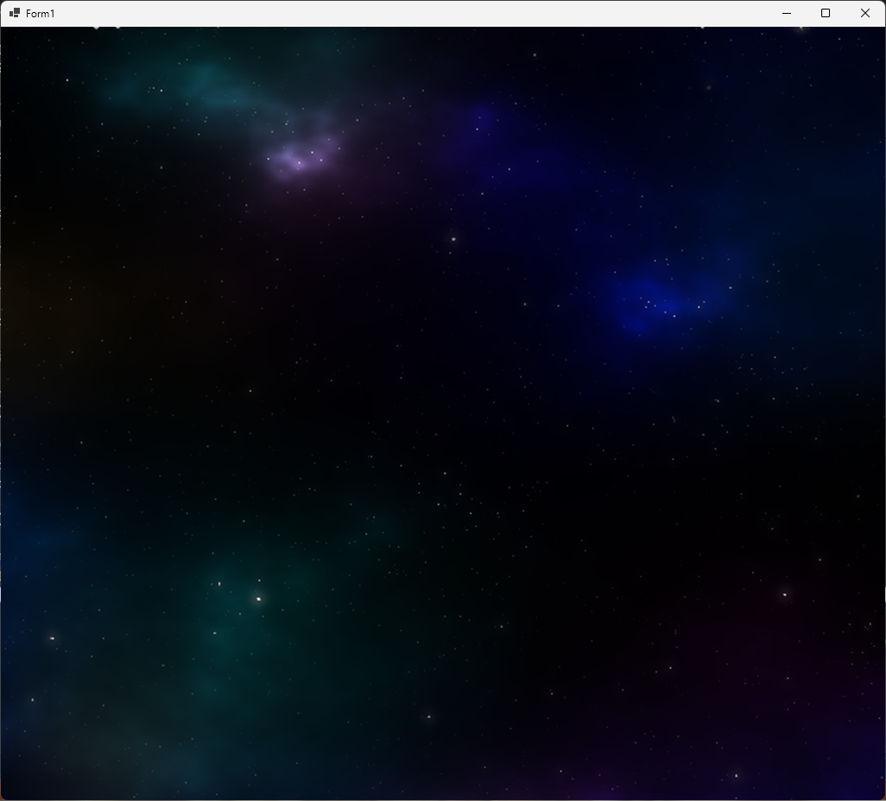</div>

### 1.8 背景を動かす(スクロールさせる)

背景の表示範囲を少しずつ変化させると、動いているように見せかけられます。

まずは表示位置をあらわす変数を宣言しましょう。<br>
変数名は`backgroundY`(バックグラウンド・ワイ、「背景のY座標」という意味)とします。<br>
`Form1`クラスにある「画像を読み込むプログラム」の下に、次のプログラムを追加してください。

```diff
     const int gsDead = 2;  // 死亡状態
     private int gameState = gsPlay; // 現在のゲーム状態

     // ファイルから画像を読み込む
     private Bitmap bmpBackground = new("assets/images/bg_space.png");
+
+    // 背景の変数
+    private float backgroundY = 0; // 背景のY座標

     // コンストラクタ
     public Form1()
```

次に、`backgroundY`を少しずつ変化させます。`UpdatePlay`メソッドに、次のプログラムを追加してください。

```diff
     // プレイ状態を更新する
     //   deltaTime  状態を進める秒数
     private void UpdatePlay(float deltaTime)
     {
+      // 背景を動かす
+      backgroundY += 60.0f * deltaTime; // 秒速60ドットの速度で動かす
     } // UpdatePlay メソッドブロックの終わり
 
     // クリア状態を更新する
     //   deltaTime  状態を進める秒数
```

なにかを移動させる場合は、このプログラムのように、

&emsp;**1秒間の変化量 * deltaTime**

という式を使います。`deltaTime`を使うと、「秒速」のような理解しやすい単位で変化量を決められます。

最後に、背景の元画像のY座標を`backgroundY`に変更します。<br>
`PaintPlay`メソッドにある「背景を描く」プログラムを、次のように変更してください。

```diff
     // プレイ状態を描く
     private void PaintPlay(Graphics g)
     {
       // 背景を描く
       g.CompositingMode = CompositingMode.SourceCopy; // 透明度を無視する
-      g.DrawImage(bmpBackground, 0, 0, bmpBackground.Width, bmpBackground.Height);
+      g.DrawImage(bmpBackground, 0, backgroundY, bmpBackground.Width, bmpBackground.Height);
       g.CompositingMode = CompositingMode.SourceOver; // 透明度を反映する
     } // PaintPlay メソッドブロックの終わり
```

プログラムが書けたら`>ShootEmUp`ボタンをクリックしてアプリを実行してください。<br>
宇宙が少しずつ下に流れていったら成功です。

<div align="center">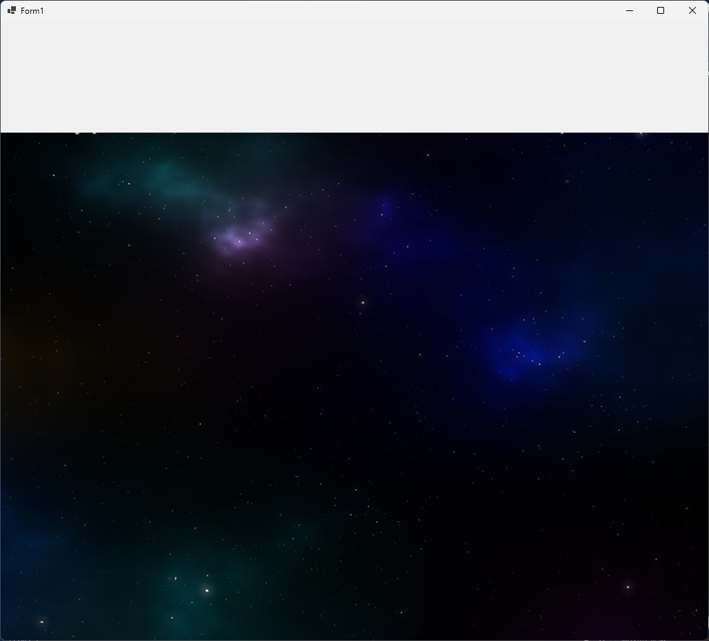</div>

### 1.9 背景の位置を設定する

宇宙の上側が白くなってしまう原因は、画像の一番上の部分を表示して、それを下に移動させたからです。<br>
下に移動させるのですから、最初は画像をウィンドウの上のほうに表示して、徐々に下げていくべきです。<br>
つまり、最初はマイナスのY座標を指定するわけです。

`bg_space.png`の高さは`3584`ピクセルで、これは4画面分に相当します。<br>
ウィンドウに対して3画面だけ上に表示すると、ちょうど4画面目がウィンドウに表示されるはずです。

そこで、画像の`Height`フィールドから1画面分の高さを引いた値を、上方向、つまりマイナス方向に設定します。<br>
`Init`メソッドの定義に次のプログラムを追加してください。

```diff
     // ゲーム状態を初期化する
     public void Init()
     {
+      // 背景のY座標を、一番下の1画面がちょうどウィンドウ内に表示されるように設定
+      backgroundY = -(bmpBackground.Height - RenderHeight);
     } // Init メソッドブロックの終わり

     // ゲーム状態を更新する
     public void Tick()
```

プログラムが書けたら`>ShootEmUp`ボタンをクリックしてアプリを実行してください。<br>
宇宙が下に流れていって、しばらくの間、白い部分が表示されなければ成功です。

<div align="center"><br>[スクロールが止まっている]</div>

<pre class="tnmai_assignment">
<strong>【課題01 スクロールを止める】</strong>
背景が最後までスクロールすると、また白い部分が表示されます。
白い部分が表示されないように、背景を動かすプログラムの下に、以下の処理を行うif文を追加しなさい。

  <code>backgroundY</code>が「0以上」だったら、<code>backgroundY</code>を 0 にする

追加したif文が適切だった場合、約45秒後に背景が停止するはずです。
</pre>

<pre class="tnmai_assignment">
<strong>【課題02 コメントを追加する】</strong>
背景の停止を確認したら、追加したif文の上に、以下のコメントを追加しなさい。

  <strong>画像の上端まで来たらスクロールを止める</strong>
</pre>

<div style="page-break-after: always"></div>

## 2 敵を表示する

### 2.1 敵を表示する

背景の次は何かキャラクターを表示しましょう。まずはキャラクター用の画像を読み込みます。<br>
変数名は`bmpObjects`(ビーエムピー・オブジェクツ、「物体のビットマップ画像」という意味)とします。<br>
背景用の`bmpBackground`変数の宣言の下に、次のプログラムを追加してください。

```diff
     const int gsDead = 2;  // 死亡状態
     private int gameState = gsPlay; // 現在のゲーム状態

     // ファイルから画像を読み込む
     private Bitmap bmpBackground = new("assets/images/bg_space.png");
+    private Bitmap bmpObjects    = new("assets/images/tile_objects.png");

     // 背景の変数
     private float backgroundY = 0; // 背景のY座標
```

次に画像を表示します。

`tile_objects.png`(タイル・オブジェクツ・ピーエヌジー)は、複数の画像をひとつにまとめたものです。<br>
このような画像は「タイル・シート」や「スプライト・シート」と呼ばれます。<br>
`DrawImage`メソッドに、「描き込み先の範囲」と「元画像の描きたい範囲」の両方を指定すると、タイルシートの特定の範囲だけを画面に表示できます。

実際に試してみましょう、`PaintPlay`メソッドに次のプログラムを追加してください。

```diff
       // 背景を描く
       g.CompositingMode = CompositingMode.SourceCopy; // 透明度を無視する
       g.DrawImage(bmpBackground, 0, backgroundY, bmpBackground.Width, bmpBackground.Height);
       g.CompositingMode = CompositingMode.SourceOver; // 透明度を反映する
+
+      // 敵を描く
+      g.DrawImage(bmpObjects,          // 元画像
+        new Rectangle(0, 0, 32, 32),   // 描き込み先の範囲
+        new Rectangle(0, 112, 32, 32), // 元画像の描きたい範囲
+        GraphicsUnit.Pixel);           // 範囲の数値の単位
     } // PaintPlay メソッドブロックの終わり

     // クリア状態を描く
     private void PaintClear(Graphics g)
```

`Rectangle`(レクタングル)クラスのコンストラクタ・パラメータの意味は、以下のようになっています。

&emsp;**Rectangle(X座標, Y座標, 幅, 高さ)**

`GraphicsUnit`(グラフィックス・ユニット)は、メソッドに指定する数値の単位をあらわします。<br>
画像を画面に描く場合は`Pixel`(ピクセル)を選んで、「数値 = ピクセル数」とします。<br>
印刷物を扱う場合は、`Inch`(インチ)や`Millimeter`(ミリメートル)などの単位を使います。

プログラムが書けたら`>ShootEmUp`ボタンをクリックしてアプリを実行してください。<br>
ウィンドウの左上に「灰色の敵」が表示されていたら成功です。

<div align="center">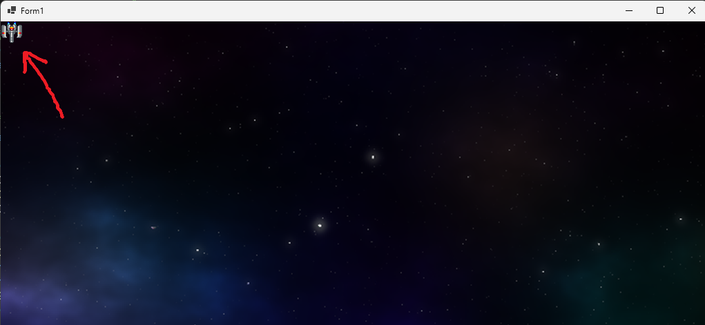</div>

### 2.2 画像の大きさを変える

少し画像が小さいので、大きく表示してみましょう。<br>
描く大きさを変えるには、書き込み先の範囲の **幅** と **高さ** を変更します。<br>
例えば、`32x32`ピクセルの絵を4倍の大きさで描くには、幅と高さに`128`を指定します。

敵を描くプログラムの「書き込み先の範囲」を、次のように変更してください。

```diff
       g.DrawImage(bmpBackground, 0, backgroundY, bmpBackground.Width, bmpBackground.Height);
       g.CompositingMode = CompositingMode.SourceOver; // 透明度を反映する

       // 敵を描く
       g.DrawImage(bmpObjects,          // 元画像
-        new Rectangle(0, 0, 32, 32),   // 描き込み先の範囲
+        new Rectangle(0, 0, 128, 128), // 描き込み先の範囲
         new Rectangle(0, 112, 32, 32), // 元画像の描きたい範囲
         GraphicsUnit.Pixel);           // 範囲の数値の単位
     } // PaintPlay メソッドブロックの終わり
```

プログラムが書けたら`>ShootEmUp`ボタンをクリックしてアプリを実行してください。<br>
ウィンドウの左上の「灰色の敵」が、大きく表示されていたら成功です。

<div align="center">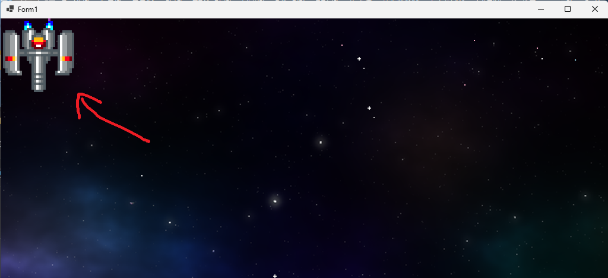</div>

<pre class="tnmai_assignment">
<strong>【課題03 敵の大きさを２倍にする】</strong>
４倍は大きすぎました。
敵の大きさが２倍になるように、<strong>書き込み先の範囲の幅と高さ</string>を<code>64</code>に変更しなさい。
</pre>

### 2.3 画像の位置を変える

ウィンドウに表示される位置を変えるには、書き込み先の範囲の **X座標**、**Y座標**を変更します。<br>
敵を描くプログラムの「書き込み先の範囲」を、次のように変更してください。

```diff
       g.DrawImage(bmpBackground, 0, backgroundY, bmpBackground.Width, bmpBackground.Height);
       g.CompositingMode = CompositingMode.SourceOver; // 透明度を反映する

       // 敵を描く
       g.DrawImage(bmpObjects,          // 元画像
-        new Rectangle(0, 0, 64, 64),   // 描き込み先の範囲
+        new Rectangle(128, 128, 64, 64), // 描き込み先の範囲
         new Rectangle(0, 112, 32, 32), // 元画像の描きたい範囲
         GraphicsUnit.Pixel);           // 範囲の数値の単位
     } // PaintPlay メソッドブロックの終わり
```

プログラムが書けたら`>ShootEmUp`ボタンをクリックしてアプリを実行してください。<br>
「灰色の敵」が、少し左下に移動していたら成功です。

<div align="center">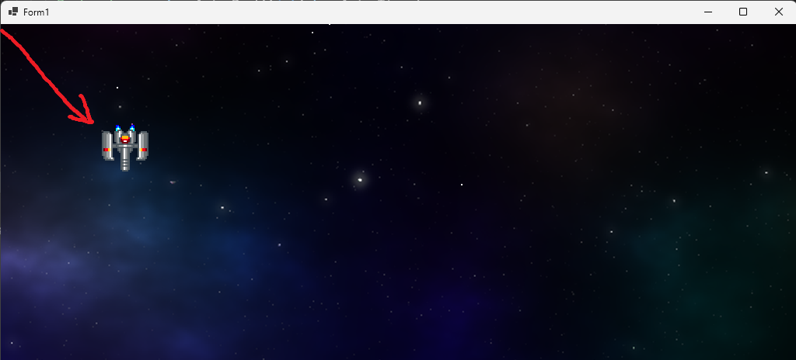</div>

<pre class="tnmai_assignment">
<strong>【課題04 敵をウィンドウ中央に表示する】</strong>
敵がウィンドウの中央付近に表示されるように、<strong>書き込み先の範囲のX座標とY座標</string>を次のように変更しなさい。
  X座標=480
  Y座標=320
</pre>

### 2.4 絵を変える

描く絵を変えるには、「元画像の描きたい範囲」を変更します。<br>
敵を描くプログラムを、次のように変更してください。

```diff
       // 敵を描く
       g.DrawImage(bmpObjects,          // 元画像
         new Rectangle(480, 320, 64, 64), // 描き込み先の範囲
-        new Rectangle(0, 112, 32, 32), // 元画像の描きたい範囲
+        new Rectangle(192, 0, 32, 32),  // 元画像の描きたい範囲
         GraphicsUnit.Pixel);           // 範囲の数値の単位
     } // PaintPlay メソッドブロックの終わり
```

プログラムが書けたら`>ShootEmUp`ボタンをクリックしてアプリを実行してください。<br>
「灰色の敵」が、「緑色の敵」に変わっていたら成功です。

<div align="center">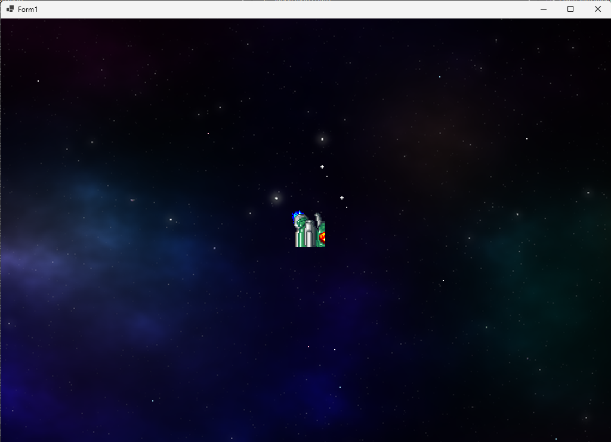</div>

絵が変わったのは分かると思いますが、絵が途中で切れているように見えます。<br>
見た目がおかしいのは、画像の幅と高さが間違っているからです。<br>
座標`(64, 0)`にある絵の大きさは`64x64`です。そのため、左上の`32x32`が切り取られて表示されているのです。

意図されたとおりに画像を表示するには、「元画像の描きたい範囲」の幅と高さを適切に設定します。<br>
今回の場合はどちらも`64`です。<br>
敵を描くプログラムを、次のように変更してください。

```diff
       // 敵を描く
       g.DrawImage(bmpObjects,          // 元画像
         new Rectangle(480, 320, 64, 64), // 描き込み先の範囲
-        new Rectangle(192, 0, 32, 32),  // 元画像の描きたい範囲
+        new Rectangle(192, 0, 64, 64),  // 元画像の描きたい範囲
         GraphicsUnit.Pixel);           // 範囲の数値の単位
     } // PaintPlay メソッドブロックの終わり
```

プログラムが書けたら`>ShootEmUp`ボタンをクリックしてアプリを実行してください。<br>
「緑色の敵」の全体が表示されていたら成功です。

<div align="center">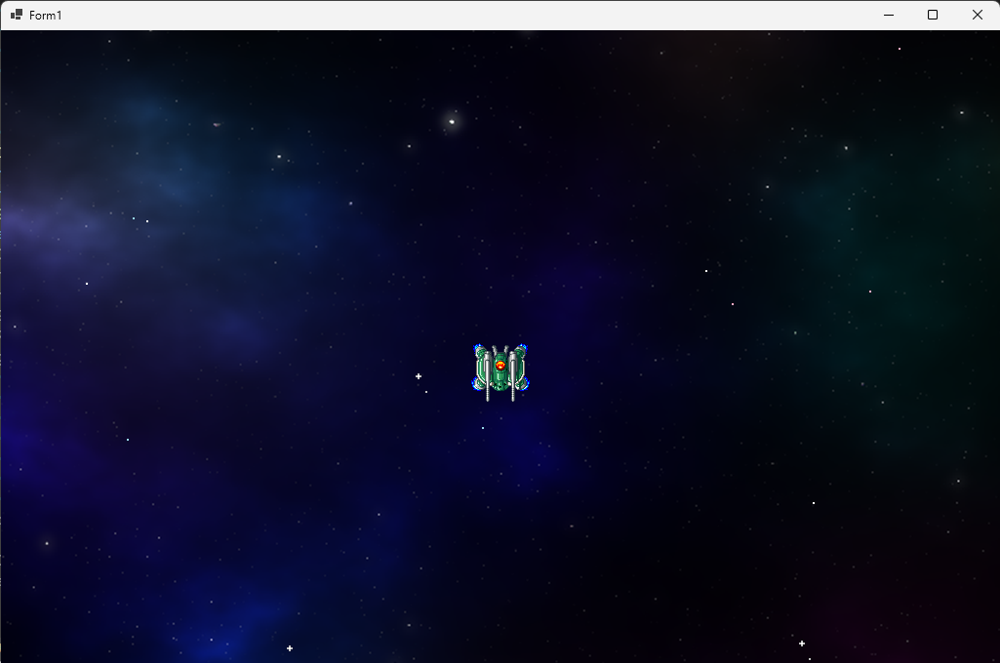</div>

さて、たしかに全体が表示されていますが。なんだか画像が小さいです。<br>
灰色の敵の大きさが`32x32`で、緑色の敵が`64x64`なら、緑色の敵は２倍の大きさで表示されてもいいはずです。<br>

意図した大きさで表示するには、「元画像の範囲の幅と高さ」に合わせて「描き込み先の範囲の幅と高さ」を変更します。<br>
敵を描くプログラムを、次のように変更してください。

```diff
       // 敵を描く
       g.DrawImage(bmpObjects,          // 元画像
-        new Rectangle(480, 320, 64, 64), // 描き込み先の範囲
+        new Rectangle(480, 320, 128, 128), // 描き込み先の範囲
         new Rectangle(192, 0, 64, 64),  // 元画像の描きたい範囲
         GraphicsUnit.Pixel);           // 範囲の数値の単位
     } // PaintPlay メソッドブロックの終わり
```

プログラムが書けたら`>ShootEmUp`ボタンをクリックしてアプリを実行してください。<br>
緑色の敵が、２倍の大きさで表示されていたら成功です。

<div align="center">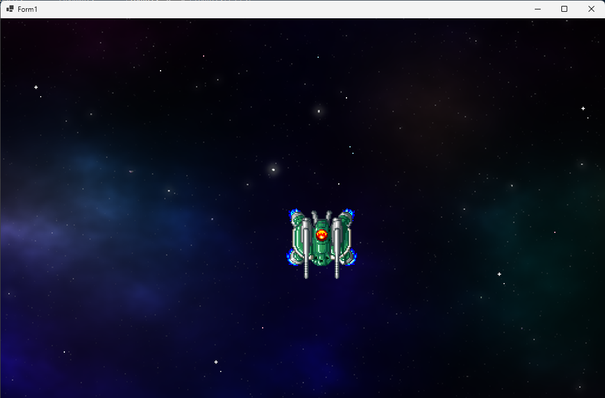</div>

<pre class="tnmai_assignment">
<strong>【課題05 敵の絵を変える】</strong>
<strong>元画像の描きたい範囲</strong>を変更して、敵の絵を「小型の緑色の敵」に変えなさい。
<strong>書き込み先の範囲</string>の幅と高さを、元画像の範囲の幅と高さの２倍にすること。
[小型の緑色の敵の範囲]
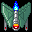 X座標=0
      Y座標=176
      幅と高さ=32x32
</pre>

<div style="page-break-after: always"></div>

## 3 敵をクラスにする

### 3.1 Characterクラス用のファイルを作る

敵を移動したりアニメーションさせるには、移動やアニメーション用の変数が必要です。<br>
移動やアニメーションのプログラムは敵以外でも使いそうなので、クラスにまとめましょう。

ところで、これまでは`Program.cs`にすべてのクラスを定義していました。<br>
そのため、クラスが増えるたびに少しずつ、プログラムの全体像を見渡しにくくなっていました。<br>
そこで今回は、見渡しやすさを維持するために、クラスごとにファイルを作ります。

クラス用のファイル名は、特に理由がなければ「クラス名.cs」とします。<br>
クラスを探すとき、ソリューションエクスプローラーで同名のファイルを探せば済むからです。<br>
ファイル名の末尾の`cs`(シーエス)は、`c sharp`(シー・シャープ)の略称です。

さて、今回作りたいのは移動やアニメーションをまとめたクラス、つまり「キャラクタークラス」です。<br>
そこで、クラス名は`Character`とします。クラス用のファイル名は`Character.cs`とします。

ファイルを追加するには、以下の手順で操作します。

1. ソリューションエクスプローラーのプロジェクト名(今回の場合は`ShootEmUp`)を右クリック
2. 「追加」項目にマウスカーソルを合わせる
3. 「新しい項目」を左クリック

<div align="center">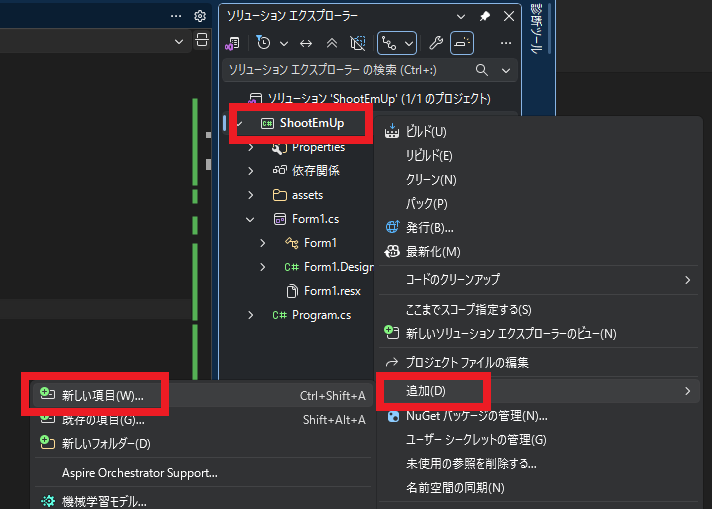</div>

上記の手順を行うと、「新しい項目の追加」というタイトルを持つ小さなウィンドウが開きます。<br>
以下の手順にしたがって、新しいクラス用のファイルを作成してください。

1. 中央の空欄(`FileName.cs`となっている部分)を`Character.cs`に書き換える
2. 「追加」ボタンをクリック

<div align="center">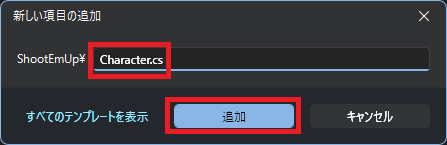</div>

追加した`Character.cs`の内容は、次のようになっていると思います。<br>
このように、クラス用のファイルを作成すると、自動的にクラスの雛形が作られます。

<div align="center">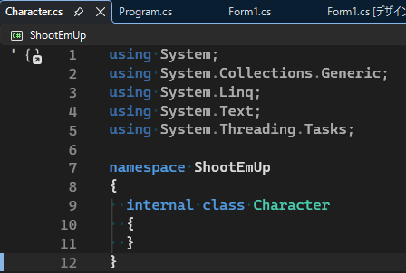</div>

### 3.2 Characterクラスを作る

それでは、`Character`クラスに移動とアニメーションの機能を追加しましょう。<br>
必要なのは「変数」、「コンストラクタ」、それから「アニメーションを進めるメソッド」、の３つです。

まずは変数を追加します。それと、ブロックを分かりやすくするためにコメントも追加しましょう。<br>
`Character`クラスの定義を、次のように変更してください。

```diff
 using System;
 using System.Collections.Generic;
 using System.Linq;
 using System.Text;
 using System.Threading.Tasks;

 namespace ShootEmUp
 {
+  // 移動やアニメーションの機能をまとめたクラス
   internal class Character
   {
-  }
-}
+    public float X; // X座標
+    public float Y; // Y座標
+    public Rectangle[] AnimeRect; // アニメーション表示する範囲の配列
+    public float AnimeTimestep;   // 1秒間にアニメーションが切り替わる枚数
+    public float AnimeTimer;      // アニメーション制御タイマー
+  } // Character 型ブロックの終わり
+} // ShootEmUp 名前空間ブロックの終わり
```

今回のキャラクタークラスと、前に作成したキャラクタークラスとの主な違いは、`AnimeRect`(アニメ・レクト)配列の有無です。<br>
この配列は、複数の「元画像の描きたい範囲」を、アニメーション順に並べて作ります。

以前に作成したジャンプゲームやプラットフォームゲームでは、アニメーション用の画像は1枚ずつ異なるファイルに分けられていました。<br>
ですが、今回のシューティングゲームでは、ひとつの画像の中に全ての画像が詰め込まれています。<br>
そのため、元画像の範囲を複数用意して、範囲を切り替えることでアニメーションを行います。

変数の次は、コンストラクタを追加します。変数宣言の下に、次のコンストラクタを追加してください。

```diff
     public Rectangle[] AnimeRect; // アニメーション表示する範囲の配列
     public float AnimeTimestep;   // 1秒間にアニメーションが切り替わる枚数
     public float AnimeTimer;      // アニメーション制御タイマー(秒)
+
+    // コンストラクタ
+    public Character(float x, float y, Rectangle[] animeRect, float timestep)
+    {
+      X = x;
+      Y = y;
+      AnimeRect = animeRect;
+      AnimeTimestep = timestep;
+      AnimeTimer = 0.0f;
+    } // コンストラクタブロックの終わり
   } // Character 型ブロックの終わり
 } // ShootEmUp 名前空間ブロックの終わり
```

コンストラクタでは、パラメータを対応するフィールドに代入します。

続いて、アニメーションを更新するメソッドを追加します。<br>
名前は`UpdateAnimeTimer`(アップデート・アニメ・タイマー)とします。<br>
コンストラクタの定義の下に、次のメソッドを追加してください。

```diff
       AnimeRect = animeRect;
       AnimeTimestep = timestep;
       AnimeTimer = 0.0f;
     } // コンストラクタブロックの終わり
+
+    // アニメーションを更新する
+    //   deltaTime  状態を進める秒数
+    public void UpdateAnimeTimer(float deltaTime)
+    {
+      // タイマーを進める
+      AnimeTimer += AnimeTimestep * deltaTime;
+
+      // タイマーの数値が画像枚数以上になったら最初に戻す
+      if (AnimeTimer >= AnimeRect.Length)
+      {
+        AnimeTimer -= AnimeRect.Length;
+      }
+    } // UpdateAnimeTimer メソッドブロックの終わり
   } // Character 型ブロックの終わり
 } // ShootEmUp 名前空間ブロックの終わり
```

### 3.3 敵をキャラクタークラスにする

キャラクタークラスを使って敵を表示しましょう。<br>
`Form1`クラスにある「画像を読み込むプログラム」の下に、次のプログラムを追加してください。

```diff
     // ファイルから画像を読み込む
     private Bitmap bmpBackground = new("assets/images/bg_space.png");
     private Bitmap bmpObjects    = new("assets/images/tile_objects.png");
+
+    // 敵のアニメーション範囲の配列
+    private static readonly Rectangle[] animeSmallGray = {
+      new(0, 112, 32, 32),  // 1枚目
+      new(32, 112, 32, 32), // 2枚目
+      new(64, 112, 32, 32), // 3枚目
+      new(96, 112, 32, 32), // 4枚目
+    };
+
+    // 敵の変数
+    private Character enemy = new(480, 320, animeSmallGray, 8);

     // 背景の変数
     private float backgroundY = 0; // 背景のY座標

     // コンストラクタ
     public Form1()
```

アニメーション範囲の配列を作るとき、`readonly`(リード・オンリー)という属性を指定しています。<br>
`readonly`属性が付いたフィールドは、 **書き換え禁止** になります。<br>
宣言した後は書き換える予定がなく、誤って書き換えられると困るフィールドに付けます。

敵の変数を定義したら、敵のアニメーションタイマーを更新します。`UpdatePlay`メソッドに次のプログラムを追加してください。

```diff
       // 画像の端まで来たらスクロールを止める
       if (backgroundY > 0.0f)
       {
         backgroundY = 0.0f;
       }
+
+      // 敵のアニメーションを更新する
+      enemy.UpdateAnimeTimer(deltaTime);
     } // UpdatePlay メソッドブロックの終わり

     // クリア状態を更新する
     //   deltaTime  状態を進める秒数
```

続いて、敵を描くプログラムを、次のように変更してください。

```diff
       // 背景を描く
       g.CompositingMode = CompositingMode.SourceCopy; // 透明度を無視する
       g.DrawImage(bmpBackground, 0, backgroundY, bmpBackground.Width, bmpBackground.Height);
       g.CompositingMode = CompositingMode.SourceOver; // 透明度を反映する

       // 敵を描く
+      Rectangle rect = enemy.AnimeRect[(int)enemy.AnimeTimer];
       g.DrawImage(bmpObjects,          // 元画像
-        new Rectangle(480, 320, 64, 64),   // 描き込み先の範囲
-        new Rectangle(0, 176, 32, 32), // 元画像の描きたい範囲
+        new RectangleF(
+          (int)enemy.X - rect.Width, (int)enemy.Y - rect.Height,
+          rect.Width * 2, rect.Height * 2), // 描き込み先の範囲
+        rect, // 元画像の描きたい範囲
         GraphicsUnit.Pixel);           // 範囲の数値の単位
     } // PaintPlay メソッドブロックの終わり
```

描き込み先の左上座標は、「X座標 - 画像の幅」、「Y座標 - 画像の高さ」としています。<br>
これは、アニメーションで範囲の大きさが変化した場合でも、キャラクターの座標が常に画像の中心を指すようにするためです。

プログラムが書けたら`>ShootEmUp`ボタンをクリックしてアプリを実行してください。<br>
敵がアニメーションしていたら成功です。

<div align="center">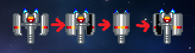</div>

### 3.4 画像を描くプログラムをメソッドにする

画像を描くプログラムは、２つの範囲を指定する必要があるので、ちょっと複雑です。<br>
これから、さまざまなキャラクターを描くことを考えると、毎回こんな面倒なプログラムを書きたくはないでしょう。
そこで、画像を描くプログラムをメソッドにします。

メソッド名は`Draw`(ドロー、「描く」という意味)とします。<br>
まずは何もしない`Draw`メソッドを作ります。<br>
`Character.cs`を開き、`UpdateAnimeTimer`メソッドの下に、次のプログラムを追加してください。

```diff
       if (AnimeTimer >= AnimeRect.Length)
       {
         AnimeTimer -= AnimeRect.Length;
       }
     } // UpdateAnimeTimer メソッドブロックの終わり
+
+    // キャラクターを描く
+    public void Draw()
+    {
+
+    }
   } // Character 型ブロックの終わり
 } // ShootEmUp 名前空間ブロックの終わり
```

次に`Form1`を開き、敵の画像を描くプログラムの上に、`Draw`メソッドの呼び出しを追加してください。

```diff
       // 背景を描く
       g.CompositingMode = CompositingMode.SourceCopy; // 透明度を無視する
       g.DrawImage(bmpBackground, 0, backgroundY, bmpBackground.Width, bmpBackground.Height);
       g.CompositingMode = CompositingMode.SourceOver; // 透明度を反映する

       // 敵を描く
+      enemy.Draw();
       Rectangle rect = enemy.AnimeRect[(int)enemy.AnimeTimer];
       g.DrawImage(bmpObjects,          // 元画像
         new RectangleF(
           (int)enemy.X - rect.Width, (int)enemy.Y - rect.Height,
           rect.Width * 2, rect.Height * 2), // 描き込み先の範囲
         rect, // 元画像の描きたい範囲
         GraphicsUnit.Pixel);           // 範囲の数値の単位
```

`Draw`メソッドを追加したら、次は敵の画像を描くプログラムを選択して、`Ctrl+X`キーを押して切り取ってください。

```diff
       // 背景を描く
       g.CompositingMode = CompositingMode.SourceCopy; // 透明度を無視する
       g.DrawImage(bmpBackground, 0, backgroundY, bmpBackground.Width, bmpBackground.Height);
       g.CompositingMode = CompositingMode.SourceOver; // 透明度を反映する

       // 敵を描く
       enemy.Draw();
-      Rectangle rect = enemy.AnimeRect[(int)enemy.AnimeTimer];
-      g.DrawImage(bmpObjects,          // 元画像
-        new RectangleF(
-          (int)enemy.X - rect.Width, (int)enemy.Y - rect.Height,
-          rect.Width * 2, rect.Height * 2), // 描き込み先の範囲
-        rect, // 元画像の描きたい範囲
-        GraphicsUnit.Pixel);           // 範囲の数値の単位
     } // PaintPlay メソッドブロックの終わり

     // クリア状態を描く
     private void PaintClear(Graphics g)
```

`Character.cs`を開き、`Draw`メソッドの`{}`の間で`Ctrl+V`キーを押して、切り取ったプログラムを貼り付けてください。

```diff
         AnimeTimer -= AnimeRect.Length;
       }
     } // UpdateAnimeTimer メソッドブロックの終わり

     // キャラクターを描く
     public void Draw()
     {
+      Rectangle rect = enemy.AnimeRect[(int)enemy.AnimeTimer];
+      g.DrawImage(bmpObjects,          // 元画像
+        new RectangleF(
+          (int)enemy.X - rect.Width, (int)enemy.Y - rect.Height,
+          rect.Width * 2, rect.Height * 2), // 描き込み先の範囲
+        rect, // 元画像の描きたい範囲
+        GraphicsUnit.Pixel);           // 範囲の数値の単位
     }
   } // Character 型ブロックの終わり
 } // ShootEmUp 名前空間ブロックの終わり
```

いくつかエラーが表示されるので直します。まず、`enmey`変数をなくします。<br>
インスタンスメソッドの中ではフィールド名を書くだけで済むからです。<br>
次のように、`enemy`変数を削除してください。

```diff
     // キャラクターを描く
     public void Draw()
     {
-      Rectangle rect = enemy.AnimeRect[(int)enemy.AnimeTimer];
+      Rectangle rect = AnimeRect[(int)AnimeTimer];
       g.DrawImage(bmpObjects,          // 元画像
         new RectangleF(
-          (int)enemy.X - rect.Width, (int)enemy.Y - rect.Height,
+          (int)X - rect.Width, (int)Y - rect.Height,
           rect.Width * 2, rect.Height * 2), // 描き込み先の範囲
         rect, // 元画像の描きたい範囲
         GraphicsUnit.Pixel);           // 範囲の数値の単位
     }
```

次に、変数`g`と`bmpObjects`が見つからない、というエラーを直します。<br>
メソッド化によって見つからなくなった変数は、メソッドのパラメータにします。<br>
`Draw`メソッドに次のパラメータを追加してください。

```diff
         AnimeTimer -= AnimeRect.Length;
       }
     } // UpdateAnimeTimer メソッドブロックの終わり

     // キャラクターを描く
-    public void Draw()
+    public void Draw(Graphics g, Bitmap bmpObjects)
     {
       Rectangle rect = AnimeRect[(int)AnimeTimer];
       g.DrawImage(bmpObjects,          // 元画像
         new Rectangle(
```

これで`Draw`メソッドのエラーはなくなりました。<br>
しかし、今度は`Form1`の`Draw`メソッド呼び出しがエラーになります。<br>
次のように、`Draw`メソッド呼び出しにパラメータを付け加えて、エラーをなくしてください。

```diff
       // 背景を描く
       g.CompositingMode = CompositingMode.SourceCopy; // 透明度を無視する
       g.DrawImage(bmpBackground, 0, backgroundY, bmpBackground.Width, bmpBackground.Height);
       g.CompositingMode = CompositingMode.SourceOver; // 透明度を反映する

       // 敵を描く
-      enemy.Draw();
+      enemy.Draw(g, bmpObjects);
     } // PaintPlay メソッドブロックの終わり

     // クリア状態を描く
     private void PaintClear(Graphics g)
```

これで、キャラクターの画像を描くプログラムをメソッドにすることができました。

プログラムが書けたら`>ShootEmUp`ボタンをクリックしてアプリを実行してください。<br>
アニメーションが、敵を描くプログラムをメソッド化する前と同じように再生されていたら成功です。

> プログラムのメソッド化に慣れてくると、これらの手順はまとめて行うことで作業量を減らせます。<br>
> 例えば、メソッドを作るとき、必要なパラメータを予想して書いておく、などです。

### 3.5 敵を増やす

敵のひとつだけだと画面がさびしいので、数を配列にして増やしましょう。<br>
`Form1`にある「敵の変数」を定義するプログラムを、次のように変更してください。

```diff
       new(32, 176, 32, 32), // 2枚目
       new(64, 176, 32, 32), // 3枚目
       new(32, 176, 32, 32), // 4枚目
     };

     // 敵の変数
-    private Character enemy = new(480, 320, animeSmallGray, 8);
+    private Character[] enemyList = {
+      new(512, 320, animeSmallGray, 8),
+      new(384, 256, animeSmallGray, 8),
+      new(640, 256, animeSmallGray, 8),
+    };

     // 背景の変数
     private float backgroundY = 0; // 背景のY座標
```

敵の変数を配列に変えたので、敵の更新と敵を描くプログラムを配列に対応させます。<br>
`UpdatePlay`メソッドにある「敵のアニメーションを更新する」プログラムを、次のように変更してください。

```diff
       // 画像の端まで来たらスクロールを止める
       if (backgroundY > 0.0f)
       {
         backgroundY = 0.0f;
       }

       // 敵のアニメーションを更新する
-      enemy.UpdateAnimeTimer(deltaTime);
+      for (int a = 0; a < enemyList.Length; a += 1)
+      {
+        enemyList[a].UpdateAnimeTimer(deltaTime);
+      }
     } // UpdatePlay メソッドブロックの終わり

     // クリア状態を更新する
     //   deltaTime  状態を進める秒数
```

続いて、`PaintPlay`メソッドにある「敵を描く」プログラムも、次のように変更してください。

```diff
       // 背景を描く
       g.CompositingMode = CompositingMode.SourceCopy; // 透明度を無視する
       g.DrawImage(bmpBackground, 0, backgroundY, bmpBackground.Width, bmpBackground.Height);
       g.CompositingMode = CompositingMode.SourceOver; // 透明度を反映する

       // 敵を描く
-      enemy.Draw(g, bmpObjects);
+      for (int a = 0; a < enemyList.Length; a += 1)
+      {
+        enemyList[a].Draw(g, bmpObjects);
+      }
     } // PaintPlay メソッドブロックの終わり

     // クリア状態を描く
     private void PaintClear(Graphics g)
```

プログラムが書けたら`>ShootEmUp`ボタンをクリックしてアプリを実行してください。<br>
３つの敵が表示されたら成功です。

<div align="center">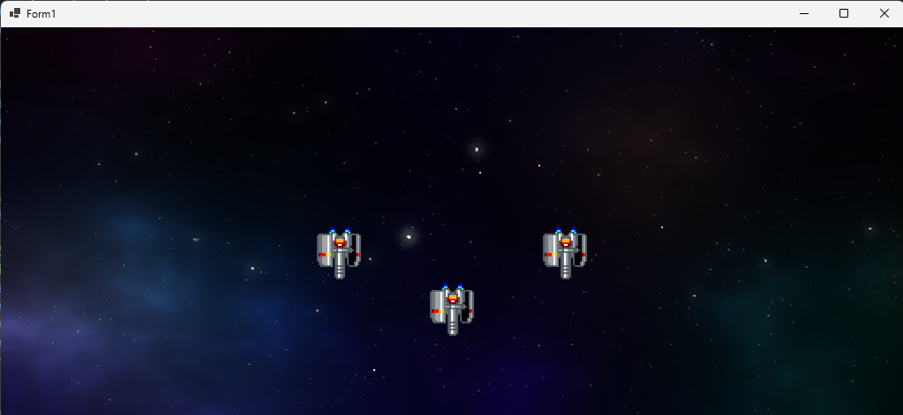</div>

<pre class="tnmai_assignment">
<strong>【課題06 敵を増やす】</strong>
以下の座標に小型の緑色の敵を追加しなさい。
  敵１: X座標=448 Y座標=128
  敵２: X座標=584 Y座標=128
</pre>

### 3.6 敵の見た目を変える

同じ見た目の敵ばかりではつまらないので、見た目の違う敵を作りましょう。<br>
といっても、やることは簡単で、「新しいアニメーション範囲を作って、敵に割り当てる」だけです。

配列の名前は、`animeMediumRed`(アニメ・ミディアム・レッド、「赤い中型のアニメ」という意味)とします。<br>
「敵のアニメーション範囲の配列」の下に、新しいアニメーション範囲を追加してください。

```diff
     // 敵のアニメーション範囲の配列
     private static readonly Rectangle[] animeSmallGray= {
       new(0, 176, 32, 32),  // 1枚目
       new(32, 176, 32, 32), // 2枚目
       new(64, 176, 32, 32), // 3枚目
       new(32, 176, 32, 32), // 4枚目
     };
+
+    // 中型の赤い敵のアニメーション範囲の配列
+    private static readonly Rectangle[] animeMediumRed = {
+      new(0, 0, 32, 32),
+      new(64, 0, 32, 32),
+    };

     // 敵の変数
     private Character[] enemyList = {
       new(512, 320, animeSmallGray, 7),
       new(384, 256, animeSmallGray, 7),
```

次に、敵の配列に新しい敵を追加してください。

```diff
     // 敵の変数
     private Character[] enemyList = {
       new(512, 320, animeSmallGray, 7),
       new(384, 256, animeSmallGray, 7),
       new(640, 256, animeSmallGray, 7),
       new(448, 128, animeSmallGray, 7),
       new(584, 128, animeSmallGray, 7),
+      new(192, 192, animeMediumRed, 10),
     };

     // 背景の変数
     private float backgroundY = 0; // 背景のY座標
```

プログラムが書けたら`>ShootEmUp`ボタンをクリックしてアプリを実行してください。<br>
ウィンドウの右側に、中型の敵が表示されたら成功です。

<div align="center">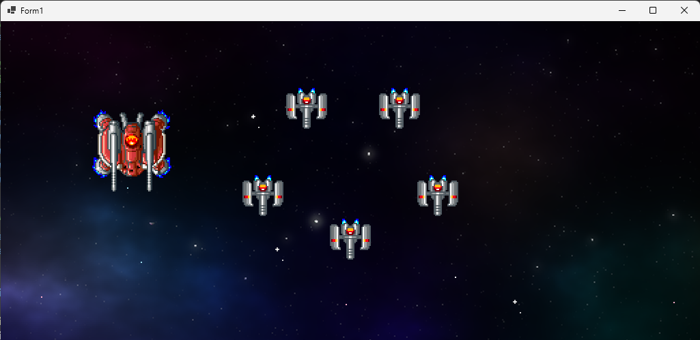</div>

<pre class="tnmai_assignment">
<strong>【課題07 中型の青い敵を増やす】</strong>
「中型の青い敵」を、座標<code>(832, 192)</code>に追加しなさい。
配列名は<code>animeMediumBlue</code>(アニメ・ミディアム・ブルー)とすること。
アニメーション範囲は以下の２つです。
  範囲１: X座標=256 Y座標=0 幅と高さ=64x64
  範囲２: X座標=320 Y座標=0 幅と高さ=64x64
</pre>
