[C#言語2026 第14回]

# キャラクターを動かす

## キーポイント

* 
* 
* 
* 

## 1 流れる星を追加する

### 1.1 背景を流れる星クラスを作る

敵以外のキャラクターとして、背景に流れる星を表示しましょう。<br>
星は、以下のような挙動をするものとします。

* 星は、最初にランダムな位置に表示される。星の数は16個とする。
* 星は、上から下に向かって秒速120ドットで移動する。
* 星のY座標が画面外に到達したら、画面の上側のランダムな位置に戻す。

この挙動を`Form1`に直接書いてしまうと、他のプログラムと区別しにくくなってしまいます。<br>
そこで、星を制御するためのクラスを作ります。

クラス名は`BackgroundStar`(バックグラウンド・スター、「背景の星」という意味)とします。<br>
クラス用のファイル名は`StarList.cs`とします。

ファイルを追加するには、以下の手順で操作します。

1. ソリューションエクスプローラーのプロジェクト名(今回の場合は`ShootEmUp`)を右クリック
2. 「追加」項目にマウスカーソルを合わせる
3. 「新しい項目」を左クリック

<div align="center"></div>

上記の手順を行うと、「新しい項目の追加」というタイトルを持つ小さなウィンドウが開きます。<br>
以下の手順にしたがって、新しいクラス用のファイルを作成してください。

1. 中央の空欄(`FileName.cs`となっている部分)を`BackgroundStar.cs`に書き換える
2. 「追加」ボタンをクリック

`BackgroundStar`クラスに必要なのは以下の４つです。

* 変数
* コンストラクタ
* 状態を更新するメソッド
* 星を描くメソッド

まずは変数と、それからコメントを追加します。<br>
`BackgroundStar`クラスの定義を、次のように変更してください。

```diff
 using System;
 using System.Collections.Generic;
 using System.Linq;
 using System.Text;
 using System.Threading.Tasks;

 namespace ShootEmUp
 {
+  // 背景を流れる星
   internal class BackgroundStar
   {
-  }
-}
+    private Character[] starList = new Character[16];
+    private Random rand = new();
+  } // StarList クラスブロックの終わり
+} // ShootEmUp 名前空間ブロックの終わり
```

### 1.2 コンストラクタを作る

次にコンストラクタを書きます。コンストラクタでは、16個の星キャラクターを作成します。<br>
変数宣言の下に、次のプログラムを追加してください。

```diff
   // 背景を流れる星
   internal class BackgroundStar
   {
     private Character[] starList = new Character[16];
     private Random rand = new();
+
+    // コンストラクタ
+    public BackgroundStar()
+    {
+      for (int a = 0; a < starList.Length; a += 1)
+      {
+        // 画面内のランダムな位置に表示
+        float x = rand.Next(16, Form1.RenderWidth - 16);
+        float y = rand.Next(16, Form1.RenderHeight - 16);
+
+        // 星の画像のサイズは16x16、Y座標は286で共通。アニメーションはしない(範囲の数は１)。
+        // X座標は 128, 144, 160, 172 の４つから均等に選ぶ
+        int imageNo = a % 4;
+        Rectangle[] anime = { new(128 + imageNo * 16, 286, 16, 16) };
+        starList[a] = new(x, y,anime , 0);
+      }
+    } // コンストラクタブロックの終わり
   } // StarList クラスブロックの終わり
 } // ShootEmUp 名前空間ブロックの終わり
```

他のクラスで宣言したスタティックフィールドを使うには、クラス名とフィールド名を`.`(ドット)記号で結びます。<br>
例えば、`Form1`クラスの`RenderWidth`フィールドを使う場合は`Form1.RnderWidth`と書きます。

星の座標には、ウィンドウ内のランダムな位置を選びます。ただし、座標が画面端すぎると画像が見切れてしまいます。<br>
画像のサイズは16x16ドットで、２倍のサイズで表示すると32x32ドットになります。<br>
つまり、２倍サイズでは、中心から画像の端までの長さは`16`ドットです。そこで、画面端`16`ドットを避けて配置しています。

<div align="center">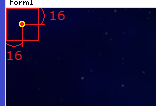</div>

`tile_objects.png`における星の画像は４種類あり、`(128, 286)`から、X方向に16ドット単位で分かれています。<br>
４つの画像は個別に描かれることを想定しており、アニメーションはしません。<br>
画像の大きさは共通で、`16x16`ドットです。

<div align="center">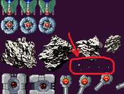</div>

また、すべての星の画像が均等に出現するように、「添字を４で割った余り」番目の画像を選んでいます。

### 1.3 更新メソッドを作る

続いて、星の状態を更新するメソッドを書きます。<br>
名前は`Update`(アップデート、「更新する」という意味)とします。

コンストラクタブロックの下に、次のプログラムを追加してください。

```diff
         int imageNo = a % 4;
         Rectangle[] anime = { new(128 + imageNo * 16, 286, 16, 16) };
         starList[a] = new(x, y,anime , 0);
       }
     } // コンストラクタブロックの終わり
+
+    // 星の状態を更新する
+    public void Update(float deltaTime)
+    {
+      for (int a = 0; a < starList.Length; a += 1)
+      {
+        Character star = starList[a];
+
+        // 星を下に移動
+        star.Y += 120 * deltaTime;
+
+        // 星が画面下に完全に消えたら、画面上のランダムな位置に戻す
+        if (star.Y >= Form1.RenderHeight + 16)
+        {
+          star.X = rand.Next(16, Form1.RenderWidth - 16);
+          star.Y = rand.Next(-120, -16);
+        }
+      }
+    } // Update メソッドブロックの終わり
   } // StarList クラスブロックの終わり
 } // ShootEmUp 名前空間ブロックの終わり
```

このプログラムでは、星が画面下に消えた場合に画面上に戻しています。<br>
「画面の下」とは、つまり、

&emsp;**画像全体が、ウィンドウの高さ`Form1.RenderHeight`より下にある**

状態です。画像の大きさを考慮すると、「Y座標が`Form1.RenderHeight + 16`より下にある」となります。

X座標のランダム範囲は、コンストラクタで星の座標を決めたときと同じです。<br>
ただし、Y座標の範囲は違います。下に消えた星が、画面内に突然現れてほしくはないからです。<br>
そこで、上側の画面外16～120ドットの範囲でランダムに選んでいます。

Y座標のランダム範囲が広すぎると、星が見えない期間が長くなり、画面上の星の密度が下がります。<br>
逆に狭くするとランダムにする意味が弱くなり、プレイヤーに規則性を感じさせてしまいます。<br>
そこで、遅い星の移動速度に合わせて、遅くとも1秒後には画面に現れる範囲にしています。

> プログラムに現れる数値には、はっきり言葉にできないとしても、何らかの意図があります。<br>
> 意図を説明できないような数値は、バグやエラーを起こしたり、ゲームの面白さを損ねる場合があります。

### 1.4 星を描くメソッドを作る

最後に星を描くメソッドを作ります。これは、全ての星キャラクターの`Draw`メソッドを呼び出すだけです。<br>
メソッド名は`Draw`(ドロー、「描く」という意味)とします。<br>
`Update`メソッドブロックの下に、`Draw`メソッドを追加してください。

```diff
           star.X = rand.Next(16, Form1.RenderWidth - 16);
           star.Y = rand.Next(-120, -16);
         }
       }
     } // Update メソッドブロックの終わり
+
+    // 星を描く
+    public void Draw(Graphics g, Bitmap bmp)
+    {
+      for (int a = 0; a < starList.Length; a += 1)
+      {
+        starList[a].Draw(g, bmp);
+      }
+    } // Draw メソッドブロックの終わり
   } // StarList クラスブロックの終わり
 } // ShootEmUp 名前空間ブロックの終わり
```

これで、４つの機能を全て作り終えました。<br>
`BackgroundStar`クラスは完成です。

### 1.5 Form1にBackgroundStarを追加する

完成した`BackgroundStar`クラスを`Form1`クラスに組み込みましょう。<br>
`Form1`のプログラムを開き、背景の変数宣言の下に、`BackgroundStar`クラスの変数を宣言してください。

```diff
     // 背景の変数
     private float backgroundY = 0; // 背景のY座標
+    private BackgroundStar backgroundStar = new(); // 背景に流れる星

     // コンストラクタ
     public Form1()
     {
```

次に、`UpdatePlay`メソッドにある背景を動かすプログラムの下に、`backgroundStar`の`Update`メソッド呼び出しを追加してください。

```diff
       // 画像の端まで来たらスクロールを止める
       if (backgroundY > 0.0f)
       {
         backgroundY = 0.0f;
       }
+
+      // 背景を流れる星を動かす
+      backgroundStar.Update(deltaTime);

       // 敵を動かす
       for (int a = 0; a < enemyList.Length; a += 1)
       {
         Character enemy = enemyList[a];
         enemy.UpdateAnimeTimer(deltaTime);
```

最後に、`PaintPlay`メソッドにある背景を描くプログラムの下に、`backgroundStar`の`Draw`メソッド呼び出しを追加してください。

```diff
       // 背景を描く
       g.CompositingMode = CompositingMode.SourceCopy; // 透明度を無視する
       g.DrawImage(bmpBackground, 0, backgroundY, bmpBackground.Width, bmpBackground.Height);
       g.CompositingMode = CompositingMode.SourceOver; // 透明度を反映する
+
+      // 背景に流れる星を描く
+      backgroundStar.Draw(g, bmpObjects);

       // 敵を描く
       for (int a = 0; a < enemyList.Length; a += 1)
       {
         enemyList[a].Draw(g, bmpObjects);
```

プログラムが書けたら`>ShootEmUp`ボタンをクリックしてアプリを実行してください。<br>
背景の上に、「流れる星」が表示されていたら成功です。

<div align="center">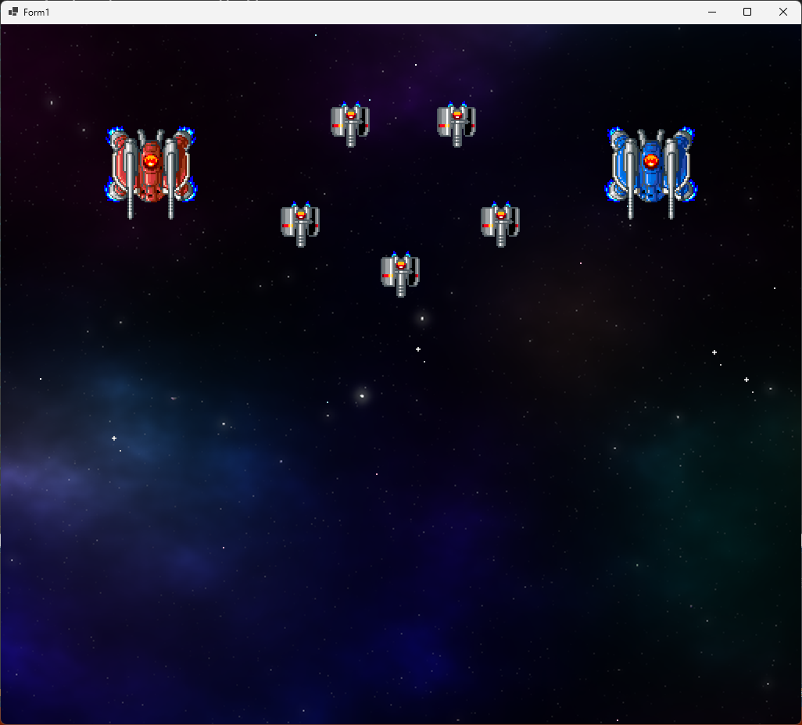</div>

### 1.6 星の動く速度を変える

星によって動く速度を変えると、空間に奥行きが加わります。<br>
星は16個あるので、最初の8個は秒速120ドット、残りの8個は秒速180ドットで動かしてみましょう。<br>

これは、添字を条件とするif文で表現できます。
とりあえず速度を120にしておいて、添字が`8`以上なら180で上書きします。<br>
`BackgroundStar.cs`を開き、`Update`メソッドの星を下に移動するプログラムを、次のように変更してください。

```diff
       for (int a = 0; a < starList.Length; a += 1)
       {
         Character star = starList[a];

         // 星を下に移動
+        float speed = 120;
+        if (a >= 8)
+        {
+          speed = 180;
+        }
-        star.Y += 120 * deltaTime;
+        star.Y += speed * deltaTime;

         // 画面下に完全に消えたら、画面上のランダムな位置に戻す
       }
     } // Update メソッドブロックの終わり
   } // StarList クラスブロックの終わり
```

プログラムが書けたら`>ShootEmUp`ボタンをクリックしてアプリを実行してください。<br>
「流れる星」が、２種類の異なる速度で移動していたら成功です。

<div align="center">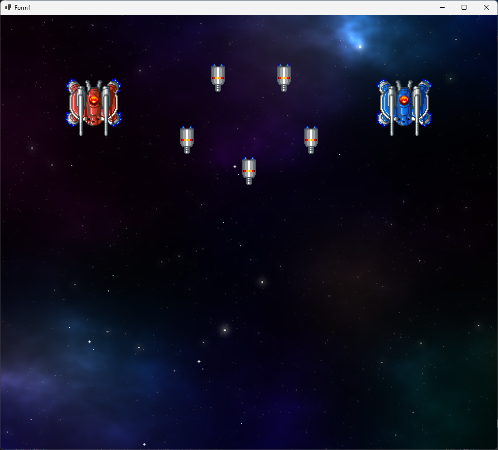</div>

> 「星を表示する」「星の速度を２段階以上に分ける」などは、プログラムとしては簡単なことです。<br>
> ですが、良いゲームはこうした「小さくて簡単な工夫」の積み重ねで出来ています。

<div style="page-break-after: always"></div>

## 2 敵を動かす

### 2.1 敵のクラスを作る

背景は一旦置いておいて、そろそろ敵にも動いてもらいましょう。<br>
敵の動きを処理するクラスを作ります。敵なので、名前は`Enemy`(エネミー、「敵」という意味)とします。

<pre class="tnmai_assignment">
<strong>【課題01 Enemy.csを追加する】</strong>
1章1節の手順を参考に、<code>Enemy.cs</code>というファイルを追加しなさい。
</pre>

`Enemy`クラスは`Character`クラスの変数と、動きを制御する変数およびプログラムを持ちます。

* 変数
* コンストラクタ
* 状態を更新するメソッド
* 敵を描くメソッド

まずは変数を宣言しましょう。最低限必要そうな変数として、キャラクターと移動速度を宣言することにします。<br>
`Enemy`クラスの定義に、表示用のキャラクター変数と移動速度の変数を追加してください。

```diff
 using System.Linq;
 using System.Text;
 using System.Threading.Tasks;

 namespace ShootEmUp
 {
+  // 敵クラス
   internal class Enemy
   {
-  }
-}
+    // 敵の変数
+    private Character character;
+    private float moveSpeedX; // X方向の速度
+    private float moveSpeedY; // Y方向の速度
+  } // Enemy クラスブロックの終わり
+} // ShootEmUp 名前空間ブロックの終わり
```

### 2.2 コンストラクタを作る

次にコンストラクタを書きます。とりあえず、パラメータは`Character`クラスと同じにしておきます。<br>
移動速度の変数宣言の下に、コンストラクタを追加してください。

```diff
     // 敵の変数
     private Character character;
     private float moveSpeedX; // X方向の速度
     private float moveSpeedY; // Y方向の速度
+
+    // コンストラクタ
+    public Enemy(float x, float y, Rectangle[] animeRect, float timespan)
+    {
+      // キャラクターを作る
+      character = new Character(x, y, animeRect, timespan);
+
+      // 移動速度を設定する
+      moveSpeedX = 50;
+      moveSpeedY = 200;
+    } // コンストラクタブロックの終わり
   } // Enemy クラスブロックの終わり
 } // ShootEmUp 名前空間ブロックの終わり
```

移動速度の`50`と`100`は、動作を確認するための「仮(かり)データ」です。あとでちゃんとした値に差し替えます。

### 2.3 更新メソッドを作る

続いて、敵の状態を更新するメソッドを作ります。名前は`Update`(アップデート)とします。<br>
`Update`メソッドでは、「アニメの更新」と「位置の更新」を行います。<br>
コンストラクタブロックの下に、`Update`メソッドを追加してください。

```diff
       // 移動速度を設定する
       moveSpeedX = 50;
       moveSpeedY = 200;
     } // コンストラクタブロックの終わり
+
+    // 敵の状態を更新する
+    public void Update(float deltaTime)
+    {
+      // アニメを更新
+      character.UpdateAnimeTimer(deltaTime);
+
+      // 位置を更新
+      character.X += moveSpeedX * deltaTime;
+      character.Y += moveSpeedY * deltaTime;
+    } // Update メソッドブロックの終わり
   } // Enemy クラスブロックの終わり
 } // ShootEmUp 名前空間ブロックの終わり
```

### 2.4 敵を描くメソッドを作る

敵を描くメソッドを追加します。名前は`Draw`(ドロー)とします。<br>
`Update`メソッドブロックの下に、`Draw`メソッドを追加してください。

```diff
       // 位置を更新
       character.X += moveSpeedX * deltaTime;
       character.Y += moveSpeedY * deltaTime;
     } // Update メソッドブロックの終わり
+
+    // 敵を描く
+    public void Draw(Graphics g, Bitmap bmp)
+    {
+      character.Draw(g, bmp);
+    }
   } // Enemy クラスブロックの終わり
 } // ShootEmUp 名前空間ブロックの終わり
```

このメソッドは`Character`クラスの`Draw`を呼び出すだけです。<br>
全ての機能が作成できたので、ひとまず`Enemy`クラスは完成です。

### 2.5 敵クラスを使う

作成した`Enemy`クラスを使って、敵を表示しましょう。<br>
`Form1`を開き、`enmeyList`の型を、`Character`から`Enemy`に変更してください。

```diff
     // 中型の青い敵のアニメーション範囲の配列
     private static readonly Rectangle[] animeMediumBlue = {
       new(256, 0, 64, 64),
       new(320, 0, 64, 64),
     };

     // 敵の変数
-    private Character[] enemyList = {
+    private Enemy[] enemyList = {
       new(512, 320, animeSmallGray, 7),
       new(384, 256, animeSmallGray, 7),
       new(640, 256, animeSmallGray, 7),
```

次に、`UpdatePlay`メソッドにある「敵のアニメーションを更新する」プログラムを、次のように変更してください。

```diff
       // 背景を流れる星を動かす
       backgroundStar.Update(deltaTime);

-      // 敵のアニメーションを更新する
+      // 敵の状態を更新する
       for (int a = 0; a < enemyList.Length; a += 1)
       {
-        enemyList[a].UpdateAnimeTimer(deltaTime);
+        enemyList[a].Update(deltaTime);
       }
     } // UpdatePlay メソッドブロックの終わり

     // クリア状態を更新する
     //   deltaTime  状態を進める秒数
```

プログラムが書けたら`>ShootEmUp`ボタンをクリックしてアプリを実行してください。<br>
敵が右下に向かって移動していったら成功です。

<div align="center">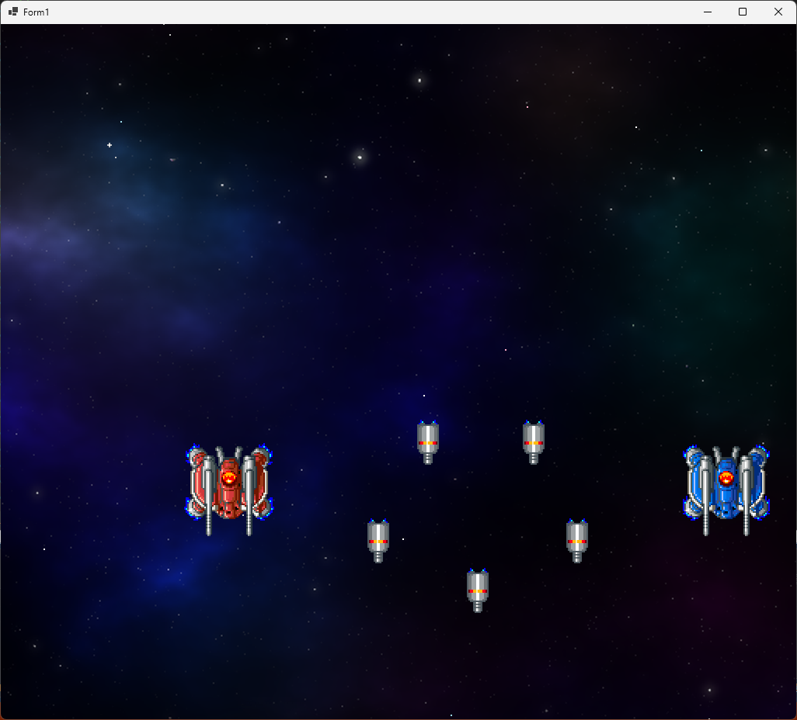</div>

### 2.6 敵の外見を敵クラスで決める

現在、敵のアニメーション範囲は`Form1`クラスが管理しています。しかし、敵のことは敵がやるべきです。<br>
そこで、アニメーション範囲を敵クラスに移動します。<br>
`Form1`を開き、３つの敵のアニメーション範囲を選択し、`Ctrl+X`キーで切り取ってください。

```diff
     // ファイルから画像を読み込む
     private Bitmap bmpBackground = new("assets/images/bg_space.png");
     private Bitmap bmpObjects = new("assets/images/tile_objects.png");
-
-    // 敵アニメーション範囲の配列
-    private static Rectangle[] animeSmallGray = {
-      new(0, 112, 32, 32),
-      new(32, 112, 32, 32),
-      new(64, 112, 32, 32),
-      new(96, 112, 32, 32),
-    };
-
-    // 中型の敵のアニメーション範囲の配列
-    private static readonly Rectangle[] animeMediumRed = {
-      new(0, 0, 64, 64),
-      new(64, 0, 64, 64),
-    };
-
-    // 中型で青色の敵のアニメーション範囲の配列
-    private static readonly Rectangle[] animeMediumBlue = {
-      new(256, 0, 64, 64),
-      new(320, 0, 64, 64),
-    };

     // 敵の変数
     private Enemy[] enemyList = {
       new(512, 320, animeSmallGray, 7),
       new(384, 256, animeSmallGray, 7),
```

次に`Enemy.cs`を開き、`Enemy`クラスの先頭に`Ctrl+V`キーで貼り付けてください。

```diff
 namespace ShootEmUp
 {
   // 敵クラス
   internal class Enemy
   {
+    // 敵アニメーション範囲の配列
+    private static Rectangle[] animeSmallGray = {
+      new(0, 112, 32, 32),
+      new(32, 112, 32, 32),
+      new(64, 112, 32, 32),
+      new(96, 112, 32, 32),
+    };
+
+    // 中型の敵のアニメーション範囲の配列
+    private static readonly Rectangle[] animeMediumRed = {
+      new(0, 0, 64, 64),
+      new(64, 0, 64, 64),
+    };
+
+    // 中型で青色の敵のアニメーション範囲の配列
+    private static readonly Rectangle[] animeMediumBlue = {
+      new(256, 0, 64, 64),
+      new(320, 0, 64, 64),
+    };

     // 敵の変数
     private Character character;
     private float moveSpeedX; // X方向の速度
     private float moveSpeedY; // Y方向の速度
```

それから、敵の種類をあらわす変数を追加します。名前は`type`(タイプ、「種類、型」という意味)とします。<br>
「敵の変数」に`type`変数と、種類を表す以下の変数を追加してください。

```diff
     // 敵の変数
     private Character character;
     private float moveSpeedX; // X方向の速度
     private float moveSpeedY; // Y方向の速度
+    private int type;         // 敵の種類

+    // 敵の種類
+    public const int SmallGray = 0;  // 小型で灰色(スモール・グレー)
+    public const int MediumRed = 1;  // 中型で赤色(ミディアム・レッド)
+    public const int MediumBlue = 2; // 中型で青色(ミディアム・ブルー)

     // コンストラクタ
     public Enemy(float x, float y, Rectangle[] animeRect, float timespan)
```

敵の種類をコンストラクタのパラメータに追加します。そして、種類に応じてアニメーション範囲を設定します。<br>
コンストラクタを次のように変更してください。

```diff
     public const int MediumRed = 1;
     public const int MediumBlue = 2;

     // コンストラクタ
-    public Enemy(float x, float y, Rectangle[] animeRect, float timespan)
+    public Enemy(float x, float y, int t)
     {
+      type = t; // 敵の種類を設定
+
       // キャラクターを作る
-      character = new Character(x, y, animeRect, timespan);
+      if (type == SmallGray)
+      {
+        character = new Character(x, y, animeSmallGray, 7);
+      }
+      else if (type == MediumRed)
+      {
+        character = new Character(x, y, animeMediumRed, 10);
+      }
+      else if (type == MediumBlue)
+      {
+        character = new Character(x, y, animeMediumBlue, 10);
+      }

       // 移動速度を設定する
       moveSpeedX = 50;
       moveSpeedY = 200;
     } // コンストラクタブロックの終わり
```

```diff
     // 敵の変数
     private Character[] enemyList = {
-      new(512, 320, animeSmallGray, 7),
-      new(384, 256, animeSmallGray, 7),
-      new(640, 256, animeSmallGray, 7),
-      new(448, 128, animeSmallGray, 7),
-      new(584, 128, animeSmallGray, 7),
-      new(192, 192, animeMediumRed, 10),
-      new(832, 192, animeMediumRed, 10),
+      new(512, 320, Enemy.SmallGray),
+      new(384, 256, Enemy.SmallGray),
+      new(640, 256, Enemy.SmallGray),
+      new(448, 128, Enemy.SmallGray),
+      new(584, 128, Enemy.SmallGray),
+      new(192, 192, Enemy.MediumRed),
+      new(832, 192, Enemy.MediumRed),
     };

     // 背景の変数
     private float backgroundY = 0; // 背景のY座標
```

プログラムが書けたら`>ShootEmUp`ボタンをクリックしてアプリを実行してください。<br>
アニメーション範囲を敵クラスに移動する前と、同じように敵が動いていたら成功です。

<div align="center"></div>

<div style="page-break-after: always"></div>

## 3 敵の発生を制御する

### 3.1 List(リスト)クラスを使う

現在、画面下に消えた敵は、二度と戻ってくることはありません。
シューティングゲームとしては、敵を次々に発生させたいところです。<br>
ですが、「下に消えた敵をランダムに上に戻す」だけでは、毎回同じ敵しか現れず、ゲームが単調になってしまいます。

単調さをなくすために、「適当な間隔で、敵の種類と数をランダムにして登場させる」ようにしたいです。<br>
数をランダムにするには **配列の大きさを変える** 必要があります。

配列の大きさを変えるには、配列全体を作り直す必要があります。<br>
しかし、配列の作り直しには時間がかかるので、あまり頻繁に行いたくはありません。<br>
このような、「データの総数が変化する」場合は、配列の代わりに`List`(リスト)クラスを使います。

| 名前 | 書きかた | 要素数の変更 |
|:-:|:--|:--|
| 配列 | `クラス名[] 変数名 = { データ... };` | 時間がかかる |
| リスト | `List<クラス名> 変数名 = new();` | すぐできる |

リストクラスは、宣言するときにデータ数を決めません。`Add`(アド)メソッドを使って、必要なだけ追加します。<br>
また、`Remove`(リムーブ)メソッドを使ってデータを削除することもできます。<br>
これらの操作を行ってもリスト全体を作り直したりはしないので、比較的高速に実行できます。

まず、敵の配列を`List`クラスで置き換えましょう。<br>
`Form1`を開き、敵の変数を次のように変更してください。

```diff
     // ファイルから画像を読み込む
     private Bitmap bmpBackground = new("assets/images/bg_space.png");
     private Bitmap bmpObjects = new("assets/images/tile_objects.png");

     // 敵の変数
-    private Enemy[] enemyList = {
-      new(512, 320, Enemy.SmallGray),
-      new(384, 256, Enemy.SmallGray),
-      new(640, 256, Enemy.SmallGray),
-      new(448, 128, Enemy.SmallGray),
-      new(584, 128, Enemy.SmallGray),
-      new(192, 192, Enemy.MediumRed),
-      new(832, 192, Enemy.MediumBlue),
-    };
+    private List<Enemy> enemyList = new();

     // 背景の変数
     private float backgroundY = 0; // 背景のY座標
     private BackgroundStar backgroundStar = new(); // 背景に流れる星
```

配列の大きさを調べるときは`Length`(レングス)フィールドを使いました。<br>
`List`クラスの大きさを調べるには、`Count`(カウント)フィールドを使います。<br>
`UpdatePlay`メソッドにある「敵を動かす」for文を、`Count`を使うように書き換えてください。

```diff
       // 背景を流れる星を動かす
       backgroundStar.Update(deltaTime);

       // 敵の状態を更新する
-      for (int a = 0; a < enemyList.Length; a += 1)
+      for (int a = 0; a < enemyList.Count; a += 1)
       {
         enemyList[a].Update(deltaTime);
       }
```

`Length`は`PaintPlay`メソッドでも使っています。<br>
`PaintPlay`メソッドにある「敵を描く」for文を、`Count`を使うように書き換えてください。

```diff
       // 背景に流れる星を描く
       backgroundStar.Draw(g, bmpObjects);

       // 敵を描く
-      for (int a = 0; a < enemyList.Length; a += 1)
+      for (int a = 0; a < enemyList.Count; a += 1)
       {
         enemyList[a].Draw(g, bmpObjects);
       }
     } // PaintPlay メソッドブロックの終わり
```

それでは、`Add`メソッドを使って敵を追加しましょう。<br>
多くのシューティングゲームでは、経過時間か、背景の移動量に応じて敵を発生させています。<br>
今回は「1秒おきに敵を出す」ようにしてみます。

「敵の変数」の宣言に、敵の発生間隔を制御する`enemySpawnTimer`(エネミー・スポーン・タイマー、<br>
「敵発生タイマー」という意味)と、乱数用の変数`rand`(ランド、`random`の略称)を追加してください。

```diff
     // 敵の変数
     private List<Enemy> enemyList = new();
+    private float enemySpawnTimer = 0.0f; // 敵発生タイマー
+
+    // 乱数
+    private Random rand = new();

     // 背景の変数
     private float backgroundY = 0; // 背景のY座標
     private BackgroundStar backgroundStar = new(); // 背景に流れる星
```

`UpdatePlay`メソッドにある「敵の状態を更新する」プログラムの下に、次のプログラムを追加してください。

```diff
       // 敵の状態を更新する
       for (int a = 0; a < enemyList.Count; a += 1)
       {
         enemyList[a].Update(deltaTime);
       }
+
+      // 敵を発生させる
+      enemySpawnTimer += deltaTime;
+      if (enemySpawnTimer >= 1.0f)
+      {
+        enemySpawnTimer -= 1.0f; // 敵発生タイマーの時間を戻す
+
+        float x = rand.Next(32, RenderWidth - 32); // 発生位置のX座標 
+        int type = rand.Next(3); // 敵の種類
+        enemyList.Add(new(x, -32, type));
+      }
     } // UpdatePlay メソッドブロックの終わり

     // クリア状態を更新する
     //   deltaTime  状態を進める秒数
```

プログラムが書けたら`>ShootEmUp`ボタンをクリックしてアプリを実行してください。<br>
約1秒の間隔で敵が発生し、右下に向かって移動していったら成功です。

<div align="center">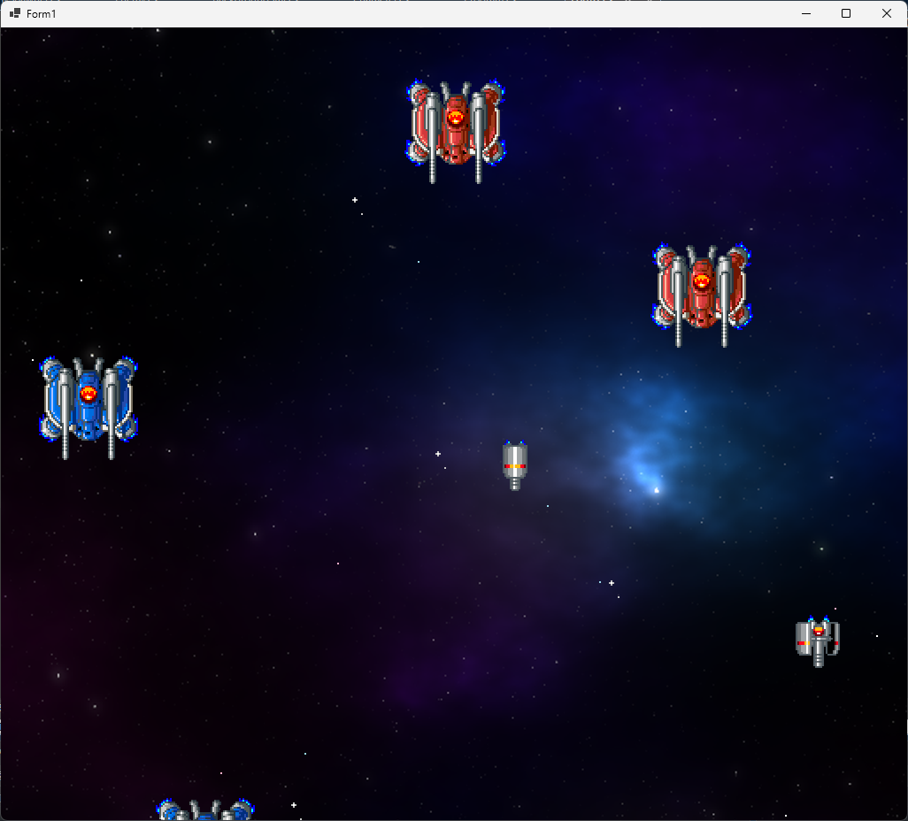</div>

### 3.2 敵を消す

敵を消していないので、敵の数はどんどん増え続けます。<br>
実際にどれくらいの敵が出ているのか表示してみましょう。<br>
`UpdatePlay`メソッドにある「敵を発生させる」プログラムの下に、次のプログラムを追加してください。

```diff
         float x = rand.Next(32, RenderWidth - 32); // 発生位置のX座標
         int type = rand.Next(3); // 敵の種類
         enemyList.Add(new(x, -32, type));
       }
+      Text = "敵の数" + enemyList.Count;
     } // UpdatePlay メソッドブロックの終わり

     // クリア状態を更新する
     //   deltaTime  状態を進める秒数
```

プログラムが書けたら`>ShootEmUp`ボタンをクリックしてアプリを実行してください。<br>
ウィンドウ上部のタイトルバーに、敵の数が表示されるはずです。

<div align="center">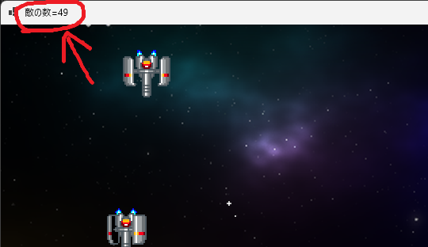</div>

例えば上の画像では、敵の数は49個となっています。しかし、実際に画面に映っているのはわずか数個にすぎません。<br>
残りの敵は、画面外に向かって永遠に飛び続けます。

二度と画面に映らない敵のために、その敵の更新プログラムを実行するのは無駄でしかありません。<br>
そこで、画面に戻ってこない、つまり **行動を終えた敵** を、リストから削除しましょう。

まずは敵クラスに、行動を終えたこと判定する変数とメソッドを追加します。<br>
変数は`bool`型で、名前は先頭小文字の`isFinished`(イズ・フィニッシュド、「終わった？」という意味)とします。<br>
メソッド名は、先頭大文字の`IsFinished`(イズ・フィニッシュド)とします。<br>
`Enemy.cs`を開き、`isFinished`変数を追加してください。

```diff
   internal class Enemy
   {
     // 敵の変数
     private Character character;
     private float moveSpeedX; // X方向の速度
     private float moveSpeedY; // Y方向の速度
+    private bool isFinished;  // true=行動終了 false=行動中
     private int type;         // 敵の種類
```

次に、コンストラクタで`isFinished`変数を初期化してください。

```diff
     // コンストラクタ
     public Enemy(float x, float y, int t)
     {
+      isFinished = false; // 「行動中」にする
       type = t; // 敵の種類を設定

       // キャラクターを作る
       if (type == SmallGray)
       {
         character = new Character(x, y, animeSmallGray, 7);
```

それから、`Draw`メソッドブロックの下に、`IsFinished`メソッドを追加してください。

```diff
     // 敵を描く
     public void Draw(Graphics g, Bitmap bmp)
     {
       character.Draw(g, bmp);
     } // Draw メソッドブロックの終わり
+
+    // 行動が終わったことを判定する
+    public bool IsFinished()
+    {
+      return isFinished;
+    } // IsFinished メソッドブロックの終わり
   } // Enemyクラスブロックの終わり
 } // ShootEmUp 名前空間ブロックの終わり
```

あとは終了判定を追加します。`Update`メソッドに、次のプログラムを追加してください。

```diff
       // アニメを更新
       character.UpdateAnimeTimer(deltaTime);
 
       // 位置を更新
       character.X += moveSpeedX * deltaTime;
       character.Y += moveSpeedY * deltaTime;
+
+      // 敵が画面の下に消えたら行動終了
+      if (character.Y >= Form1.RenderHeight + 64)
+        isFinished = true;
+      }
     } // Update メソッドブロックの終わり

     // 敵を描く
     public void Draw(Graphics g, Bitmap bmp)
```

これで、敵の行動終了を判定できるようになりました。<br>
作成した`IsFinished`メソッドを使って、敵を消すプログラムを追加しましょう。

`List`からデータを削除するには、`Remove`(リムーブ)系のメソッドを使います。<br>
名前が`Remove`で始まるメソッドは以下の４つです。

| 名前 | 機能 |
|:-----|:-----|
| Remove(データ) | 指定されたのと同じ要素を削除する |
| RemoveAll(条件) | 条件を満たすすべての要素を削除する |
| RemoveAt(添字) | 添字の位置にある要素を削除する |
| RemoveRange(添字, 個数) | 添字の位置から「個数」個の要素を削除する |

今回は「行動が終わった敵」をすべて消したいので、`RemoveAll`(リムーブ・オール)を使います。<br>

`Form1`を開き、`UpdatePlay`メソッドにある「敵の状態を更新する」プログラムの下に、敵を削除するプログラムを追加してください。

```diff
       // 敵の状態を更新する
       for (int a = 0; a < enemyList.Count; a += 1)
       {
         enemyList[a].Update(deltaTime);
       }
+
+      // 行動の終わった敵を削除する
+      enemyList.RemoveAll((e) => { return e.IsFinished(); });

      // 敵を発生させる
      enemySpawnTimer += deltaTime;
      if (enemySpawnTimer >= 1.0f)
```

「条件」の書きかたは、メソッドとほぼ同じで、次のように書きます。<br>
メソッドとの主な違いは、「メソッド名を書かない」、「変数とプログラムを`=>`記号で結ぶ」の２点です。

&emsp;**(変数名) => { プログラム }**

`RemoveAll`は、リストのすべてのデータに対して、この「条件」を実行します。<br>
各データは「変数名」に代入され、「プログラム」が実行されます。<br>
そして、プログラムの結果が`true`になったデータをすべて削除します。

> 「条件」の結果は常に`bool`型です。`int`や`float`などを返そうとするとエラーになります。

プログラムが書けたら`>ShootEmUp`ボタンをクリックしてアプリを実行してください。<br>
画面外に出た敵が消されて、敵の数が増え続けなくなっていたら成功です。

<div align="center">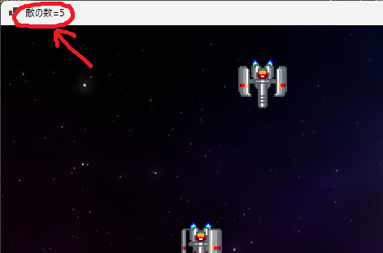</div>

### 3.3 敵発生装置クラスを作る

敵が1個ずつしか登場しないのは少なすぎます。登場間隔を短くすれば数を増やせますが、画面がごちゃついてしまいます。<br>
そこで、敵を連続的に登場させるクラスを作ります。<br>
クラス名は`EnemySpawner`(エネミー・スポナー、「敵発生装置」という意味)とします。

<pre class="tnmai_assignment">
<strong>【課題02 EnemySpawner.csを追加する】</strong>
1章1節の手順を参考に、<code>EnemySpawner.cs</code>というファイルを追加しなさい。
</pre>

`EnemySpawner`クラスは、敵の発生位置と発生間隔を制御する変数およびメソッドを持ちます。

* 変数
* コンストラクタ
* 状態を更新するメソッド

変数として、敵の種類や発生させる数などが必要です。<br>
`EnemySpawner`クラスの定義に、以下の変数を追加してください。

```diff
 using System.Linq;
 using System.Text;
 using System.Threading.Tasks;

 namespace ShootEmUp
 {
+  // 敵を発生させるクラス
   internal class EnemySpawner
   {
-  }
-}
+    private float spawnX;   // 敵発生位置のX座標
+    private float spawnY;   // 敵発生位置のY座標
+    private int pattern;    // 発生パターン
+    private int count;      // 発生させる数
+    private float timer;    // 発生タイマー
+  } // EnemySpawner クラスブロックの終わり
+} // ShootEmUp 名前空間ブロックの終わり
```

### 3.4 コンストラクタを作る

コンストラクタでは、`timer`以外のすべての変数をパラメータで受け取ります。<br>
変数宣言の下に、コンストラクタを追加してください。

```diff
     private int pattern;    // 発生パターン
     private int count;      // 発生させる数
     private float timer;    // 発生タイマー
+
+    // コンストラクタ
+    public EnemySpawner(float x, float y, int p, int c)
+    {
+      spawnX = x;
+      spawnY = y;
+      pattern = p;
+      count = c;
+      timer = 0.0f;
+    } // コンストラクタブロックの終わり
   } // EnemySpawner クラスブロックの終わり
 } // ShootEmUp 名前空間ブロックの終わり
```

### 3.5 敵を発生させるメソッドを作る

次に、`EnemySpawner`の状態を更新し、敵を発生させるメソッドを作ります。<br>
メソッド名は`Update`(アップデート、「更新する」という意味)とします。<br>
コンストラクタブロックの下に、次の`Update`メソッドを追加してください。

```diff
       count = c;
       timer = 0.0f;
     } // コンストラクタブロックの終わり
+
+    // 敵を発生させる
+    public void Update(float deltaTime, List<Enemy> enemyList)
+    {
+      // すべての敵が発生済みなら何もしない
+      if (count <= 0)
+      {
+        return;
+      }
+
+      timer -= deltaTime; // 発生タイマーを減らす
+
+      // 時間が残っていたら何もしない
+      if (timer > 0)
+      {
+        return;
+      }
+
+      // 時間になったので敵を発生させる
+      enemyList.Add(new(spawnX, spawnY, pattern));
+
+      timer += 0.5f; // 次の発生までの時間を設定
+      count -= 1; // 発生数を1減らす
+    } // Update メソッドブロックの終わり
   } // EnemySpawner クラスブロックの終わり
 } // ShootEmUp 名前空間ブロックの終わり
```

### 3.6 発生完了を判定するメソッドを作る

`Enemy`クラスと同様に、`EnemySpawner`クラスも`List`で管理したいです。<br>
すべての敵を発生させた`EnemySpawner`を削除できるように、「発生完了を判定する」メソッドを追加します。<br>
メソッド名は`IsFinished`(イズ・フィニッシュド、「終わった？」という意味)とします。

`Update`メソッドブロックの下に、`IsFinished`メソッドを追加してください。

```diff
       timer += 0.5f; // 次の発生までの時間を設定
       count -= 1; // 発生数を1減らす
     } // Update メソッドブロックの終わり
+
+    // 発生完了を判定する
+    public bool IsFinished()
+    {
+      return count <= 0; // 発生数が0以下なら発生完了とする
+    } // IsFinished メソッドブロックの終わり
   } // EnemySpawner クラスブロックの終わり
 } // ShootEmUp 名前空間ブロックの終わり
```

これでひとまず、`EnemySpawer`クラスは完成です。

### 3.7 敵発生装置を使う

敵発生装置を使ってみましょう。まず、敵発生装置のリストを用意します。<br>
変数名は`enemySpawnerList`(エネミー・スポナー・リスト、「敵発生装置のリスト」という意味)とします。<br>
`Form1`を開き、「敵の変数」に`enemySpawnerList`変数を追加してください。

```diff
     // ファイルから画像を読み込む
     private Bitmap bmpBackground = new("assets/images/bg_space.png");
     private Bitmap bmpObjects = new("assets/images/tile_objects.png");

     // 敵の変数
+    private List<EnemySpawner> enemySpawnerList = new();
     private List<Enemy> enemyList = new();
     private float enemySpawnTimer = 0.0f; // 敵発生タイマー
```

次に、`UpdatePlay`メソッドにある「敵を発生させるプログラム」を、次のように変更してください。

```diff
       // 行動が終わった敵を削除する
       enemyList.RemoveAll((e) => { return e.IsFinished(); });

-      // 敵を発生させる
+      // 敵発生装置を作る
       enemySpawnTimer += deltaTime;
       if (enemySpawnTimer >= 1.0f)
       {
         enemySpawnTimer -= 1.0f; // 敵発生タイマーの時間を戻す

         float x = rand.Next(32, RenderWidth - 32); // 発生位置のX座標
-        int type = rand.Next(3); // 敵の種類
-        enemyList.Add(new(x, -32, type));
+        int pattern = rand.Next(3); // 敵発生パターン
+        enemySpawnerList.Add(new(x, -32, pattern, 4));
       }
+
+      // 敵発生装置を更新する
+      for (int a = 0; a < enemySpawnerList.Count; a += 1)
+      {
+        enemySpawnerList[a].Update(deltaTime, enemyList);
+      }
+      enemySpawnerList.RemoveAll((e) => { return e.IsFinished(); });
+
       Text = "敵の数" + enemyList.Count;
     } // UpdatePlay メソッドブロックの終わり
```

プログラムが書けたら`>ShootEmUp`ボタンをクリックしてアプリを実行してください。<br>
敵が4個ずつ連続して発生していたら成功です。

<div align="center">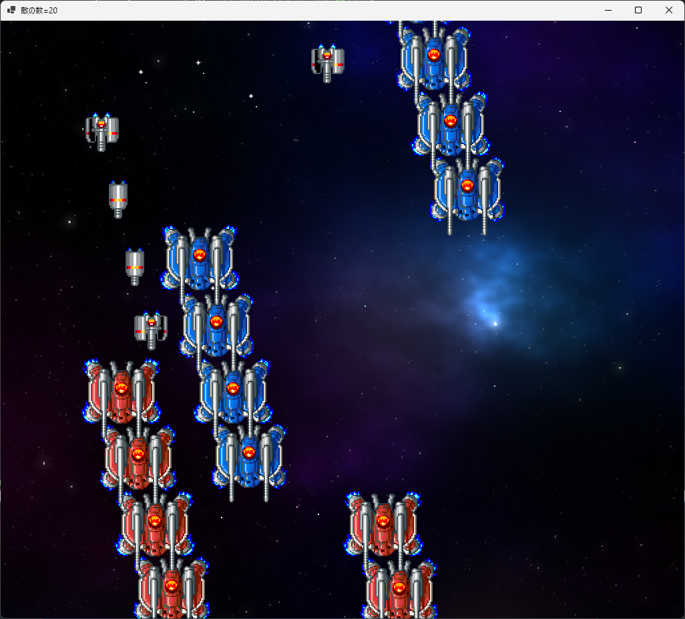</div>

### 3.8 敵発生パターンを増やす

同じ位置に敵を発生させるパターン以外に、他の発生パターンも作りましょう。<br>
現在の、敵が縦に発生するものをパターン0として、以下の4つのパターンを作ります。

&emsp;パターン0 : 小型で灰色の敵を、縦方向に発生<br>
&emsp;パターン1 : 小型で灰色の敵を、横方向に発生<br>
&emsp;パターン2 : 中型で赤色の敵を、間隔を開けて左右に発生<br>
&emsp;パターン3 : 中型で青色の敵を、間隔を開けて左右に発生

`EnemySpawner.cs`を開き、`Update`メソッドを次のように変更してください。

```diff
       // 時間が残っていたら何もしない
       if (timer > 0)
       {
         return;
       }

       // 時間になったので敵を発生させる
+      if (pattern == 0)
+      {
+        // 小型で灰色の敵を、縦方向に発生
-        enemyList.Add(new(spawnX, spawnY, pattern0));
+        enemyList.Add(new(spawnX, spawnY, Enemy.SmallGray));
+        timer += 0.5f; // 次の発生までの時間を設定
+      }
+      else if (pattern == 1)
+      {
+        // 小型で灰色の敵を、横方向に発生
+        enemyList.Add(new(spawnX, spawnY, Enemy.SmallGray));
+        spawnX += 128; // 発生位置を右にずらす
+      }
+      else if (pattern == 2)
+      {
+        // 中型で赤色の敵を、間隔を開けて左右に発生
+        enemyList.Add(new(spawnX, spawnY, Enemy.MediumRed));
+        spawnX = Form1.RenderWidth - spawnX; // 発生位置の左右を逆転
+        timer += 3.5f; // 次の発生までの時間を設定
+      }
+      else if (pattern == 3)
+      {
+        // 中型で青色の敵を、間隔を開けて左右に発生
+        enemyList.Add(new(spawnX, spawnY, Enemy.MediumBlue));
+        spawnX = Form1.RenderWidth - spawnX; // 発生位置の左右を逆転
+        timer += 3.5f; // 次の発生までの時間を設定
+      }

-      timer += 0.5f; // 次の発生までの時間を設定
       count -= 1; // 発生数を1減らす
     } // Update メソッドブロックの終わり
```

次に、`Form1`を開き、`UpdatePlay`メソッドにあるパターン数を増やしてください。

```diff
       if (enemySpawnTimer >= 1.0f)
       {
         enemySpawnTimer -= 1.0f; // 敵発生タイマーの時間を戻す

         float x = rand.Next(32, RenderWidth - 32); // 発生位置のX座標
-        int pattern = rand.Next(3); // 敵発生パターン
+        int pattern = rand.Next(4); // 敵発生パターン
         enemySpawnerList.Add(new(x, -32, pattern, 4));
       }
```

プログラムが書けたら`>ShootEmUp`ボタンをクリックしてアプリを実行してください。<br>
敵が、4種類の異なるパターンで発生していたら成功です。

<div align="center">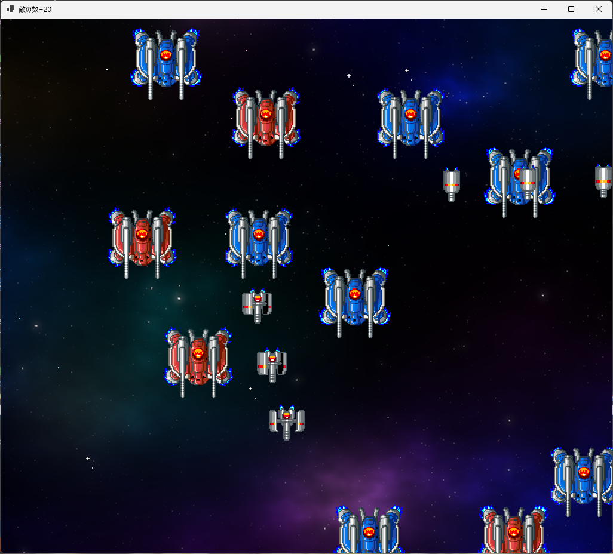</div>

### 3.9 敵の移動パターンを増やす

敵が同時に複数発生することで、画面がにぎやかになってきました。<br>
ですが、まだ少し単調な気がします。それは、敵が全部同じ動きをしているからです。<br>
そこで、以下の3種類の動きを作りましょう。

* 直進: 下に向かって進む
* U字ターン: 下に向かって画面中央まで進み、上に戻っていく
* S字カーブ: 左右に波のように揺れながら下に向かって進む

これらの敵の行動を制御するために、以下の変数を追加します。

* 発生からの経過時間
* 発生時のX座標とY座標

変数名は`timer`(タイマー)、`startX`(スタート・エックス)、`startY`(スタート・ワイ)とします。<br>
`Enemy.cs`を開き、`Enemy`クラスにこれらの変数を追加してください。

```diff
     // 敵の変数
     private Character character;
     private float moveSpeedX; // X方向の速度
     private float moveSpeedY; // Y方向の速度
     private bool isFinished;  // true=行動終了 false=行動中
     private int type;         // 敵の種類
+    private float timer;      // 発生からの経過時間(秒)
+    private float startX;     // 発生時のX座標
+    private float startY;     // 発生時のY座標

     // 敵の種類
     public const int SmallGray = 0;  // 小型で灰色(スモール・グレー)
     public const int MediumRed = 1;  // 中型で赤色(ミディアム・レッド)
```

それから、コンストラクタを次のように変更してください。

```diff
     // コンストラクタ
     public Enemy(float x, float y, int t)
     {
+      moveSpeedX = 0.0f;
+      moveSpeedY = 0.0f;
       isFinished = false; // 「行動中」にする
       type = t; // 敵の種類を設定
+      timer = 0.0f;   // 経過時間を0にする
+      startX = x;
+      startY = y;

       // キャラクターを作る
       if (type == SmallGray)
       {
         character = new Character(x, y, animeSmallGray, 7);
+        moveSpeedY = 200.0f;
       }
       else if (type == MediumRed)
       {
         character = new Character(x, y, animeMediumRed, 10);
+        // 画面中央より左に発生したら右へ、右に発生したら左へ移動させる
+        moveSpeedX = 50;
+        if (x >= Form1.RenderWidth * 0.5f)
+        {
+          moveSpeedX = -50;
+        }
       }
       else if (type == MediumBlue)
       {
         character = new Character(x, y, animeMediumBlue, 10);
+        moveSpeedY = 100;
       }
 
-      // 移動速度を設定する
-      moveSpeedX = 50;
-      moveSpeedY = 200;
     } // コンストラクタブロックの終わり
```

次に、「小型で灰色の敵」の移動パターンを設定します。<br>
`Update`メソッドに、次のプログラムを追加してください。

```diff
     // 敵の状態を更新する
     public void Update(float deltaTime)
     {
       // アニメを更新
       character.UpdateAnimeTimer(deltaTime);
+
+      // 経過時間を更新
+      timer += deltaTime;
 
       // 位置を更新
+      if (type == SmallGray)
+      {
+        // 下に向かって移動
         character.X += moveSpeedX * deltaTime;
         character.Y += moveSpeedY * deltaTime;

         // 敵が画面の下に消えたら行動終了
         if (character.Y >= Form1.RenderHeight + 64)
           isFinished = true;
         }
+      }
     } // Update メソッドブロックの終わり

     // 敵を描く
     public void Draw(Graphics g, Bitmap bmp)
```

次に、「U字ターン」の移動パターンを作ります。<br>
今回は、２次関数 $ y = 1 - t^2 $ の曲線を使うことにします。

<div align="center">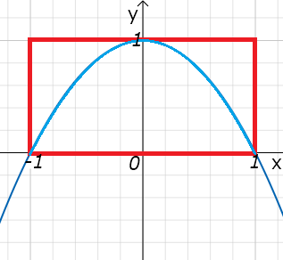</div>

このグラフの「`y`が`0`より上の範囲(赤枠)」の部分を、U字ターンとして使います。<br>
それでは、`Update`メソッドに、次のプログラムを追加してください。

```diff
         // 敵が画面の下に消えたら行動終了
         if (character.Y >= Form1.RenderHeight + 64)
           isFinished = true;
         }
       }
+      else if (type == MediumRed)
+      {
+        // U字ターン
+        character.X += moveSpeedX * deltaTime;
+
+        float targetY = 384.0f - startY; // U字の頂点のY座標
+        float t = timer * 0.5f - 1.0f;
+        character.Y = (1 - t * t) * targetY + startY;
+
+        // 敵が画面の上に消えたら行動終了
+        if (character.Y < -64)
+          isFinished = true;
+        }
+      }
     } // Update メソッドブロックの終わり

     // 敵を描く
     public void Draw(Graphics g, Bitmap bmp)
```

全体の動作時間は約4秒で、つまり`timer`は`0`から`4`まで変化します。<br>
式`timer * 0.5f - 1.0f`は、`timer`の値を`t`の範囲`-1～1`に変換しています。

最後に、「S字カーブ」の移動パターンを作ります。<br>
S字カーブは、`sin`(サイン)関数の式 $ y = sin(x) $ を元にして作ります。

<div align="center">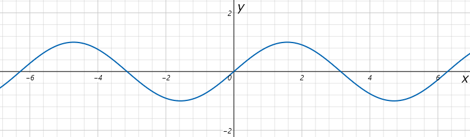</div>

U字ターンのプログラムの下に、次の「S字カーブ」のプログラムを追加してください。

```diff
         // 敵が画面の上に消えたら行動終了
         if (character.Y < -64)
           isFinished = true;
         }
       }
+      else if (type == MediumBlue)
+      {
+        // S字カーブ
+        float a = 5.0f;   // 周波数(振動1回にかかる秒数)
+        float b = 128.0f; // 振幅
+        character.X = spawnX + MathF.Sin(MathF.PI * 2.0f / a * timer) * b;
+
+        character.Y += moveSpeedY * deltaTime;
+
+        // 敵が画面の下に消えたら行動終了
+        if (character.Y >= Form1.RenderHeight + 64)
+        {
+          isFinished = true;
+        }
+      }
     } // Update メソッドブロックの終わり

     // 敵を描く
     public void Draw(Graphics g, Bitmap bmp)
```

`sin`などの数学関数は、`MathF`(マスエフ)クラスのメソッドになっています。<br>
例えば`sin`関数は`MathF.Sin`(マスエフ・サイン)メソッドを使います。

`MathF.PI`(マスエフ・パイ)は、円周率 **π** です。<br>
C#では、角度を`0～2π`の「弧度法(こどほう)」で表します(`0～360`の「度数法」ではありません)。

プログラムが書けたら`>ShootEmUp`ボタンをクリックしてアプリを実行してください。<br>
敵の種類によって、異なるパターンで移動していたら成功です。

<div align="center">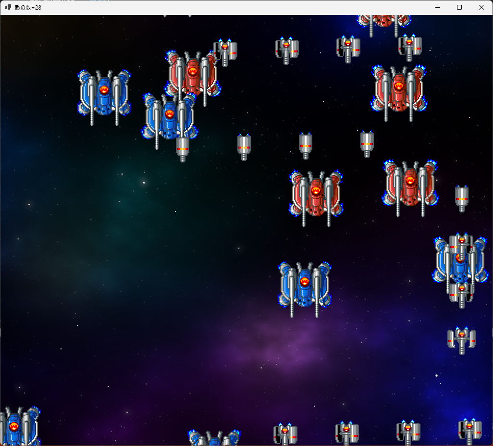</div>

<pre class="tnmai_assignment">
<strong>【課題03 小型で緑色の敵を増やす】</strong>
「小型で緑色の敵」を追加し、以下の移動パターンと発生パターンで発生させなさい。
  アニメーション範囲:
    (0, 176, 32, 32), (32, 176, 32, 32), (64, 176, 32, 32)

  移動パターン:
    S字カーブ、周波数=3、振幅=256ドット

  発生パターン:
    縦一列、発生位置=変更しない、次の発生までの時間=0.25秒
</pre>
