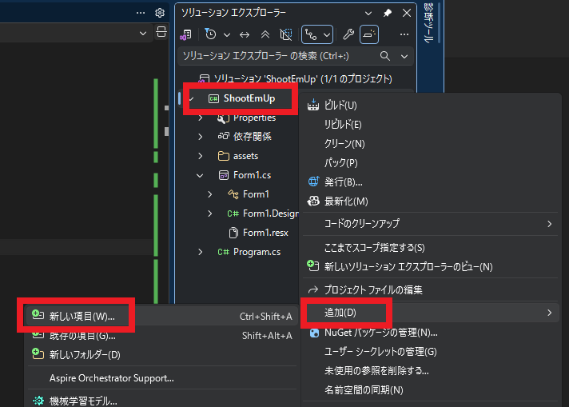
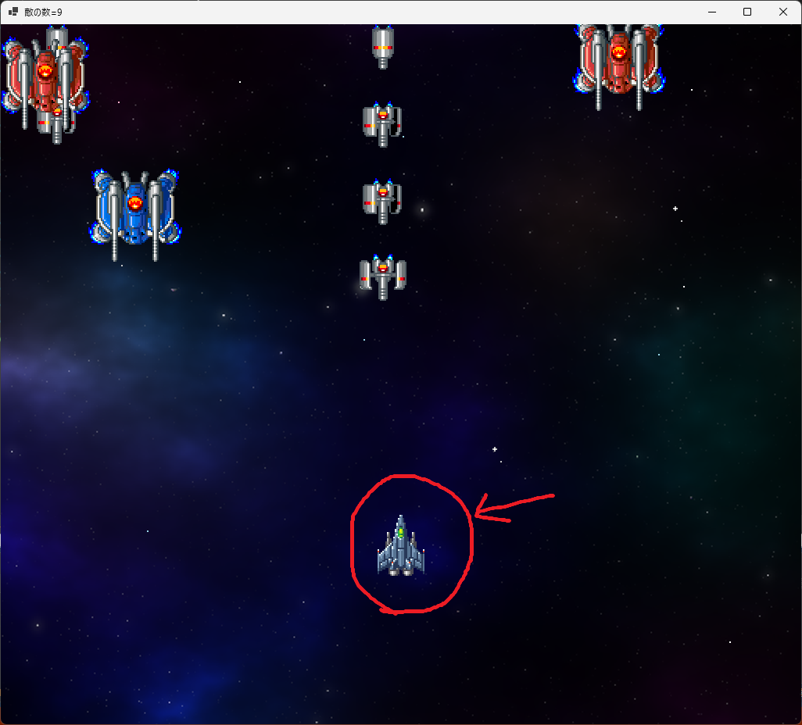
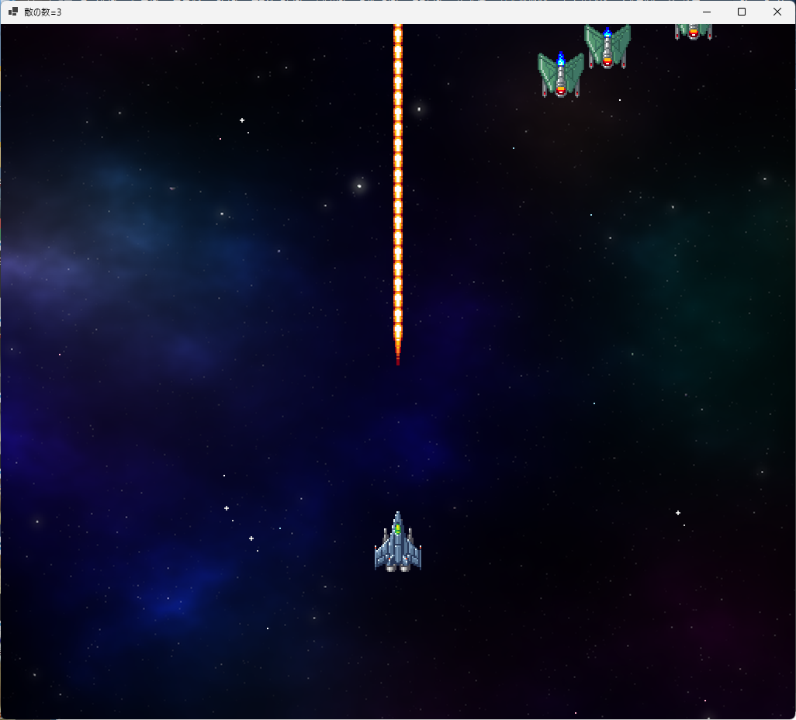
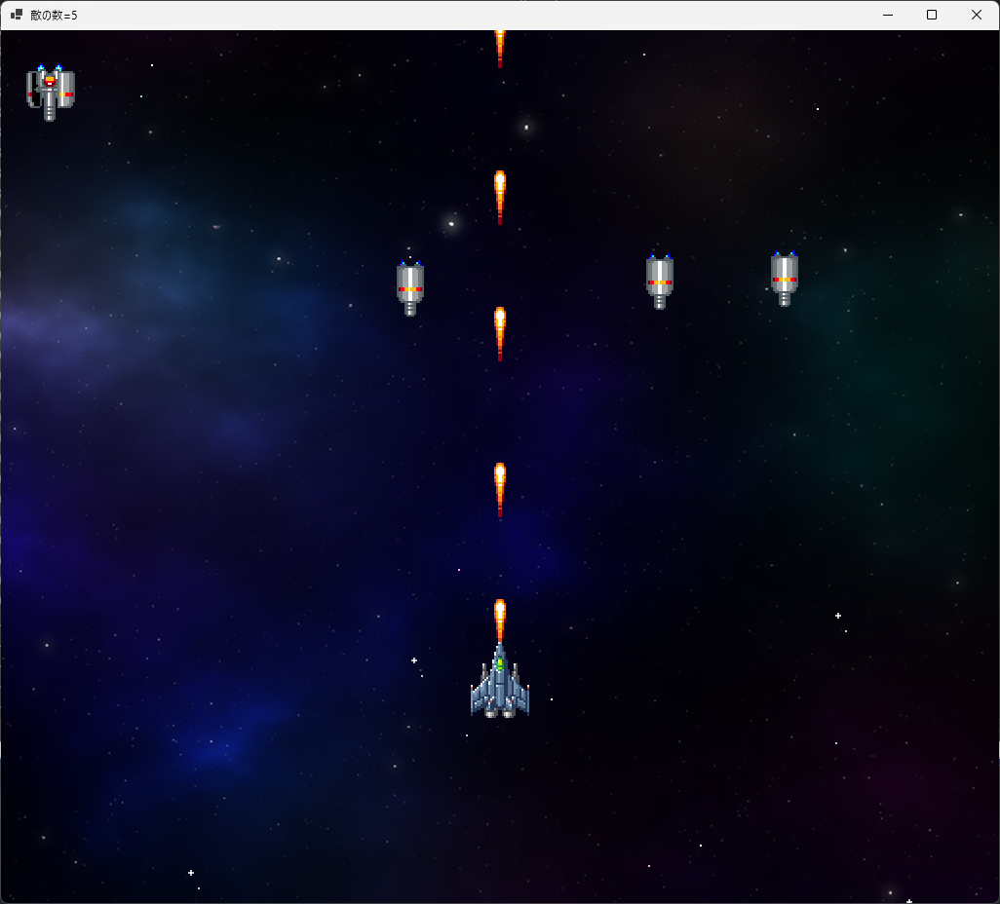
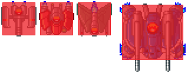
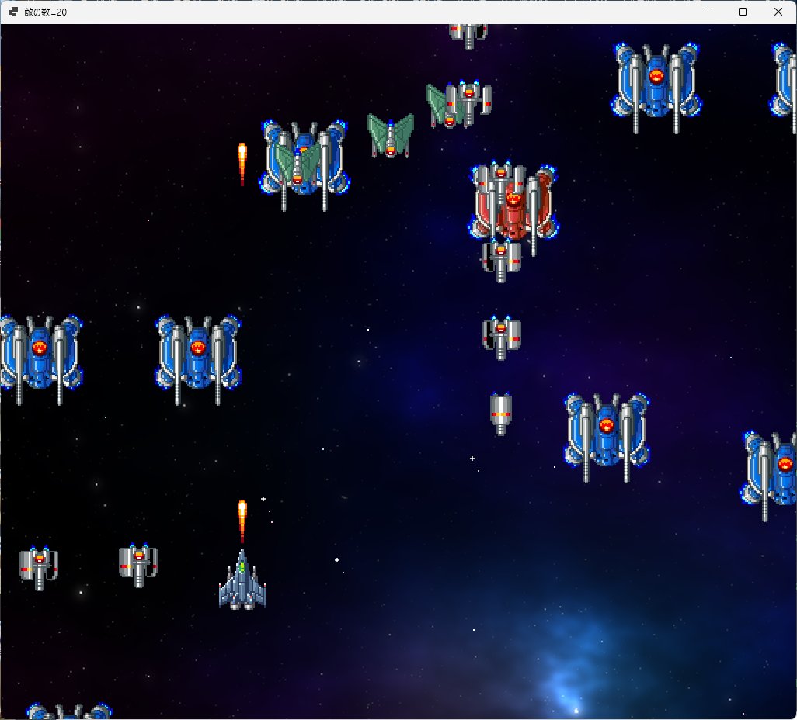
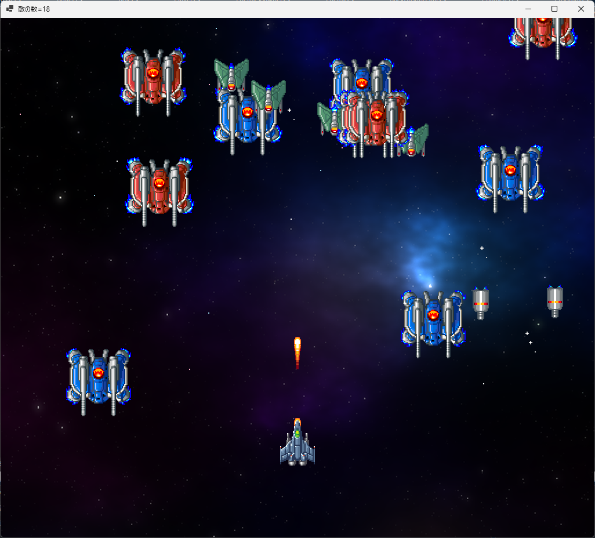
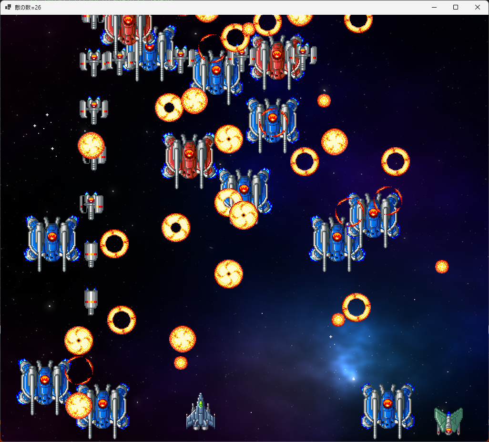
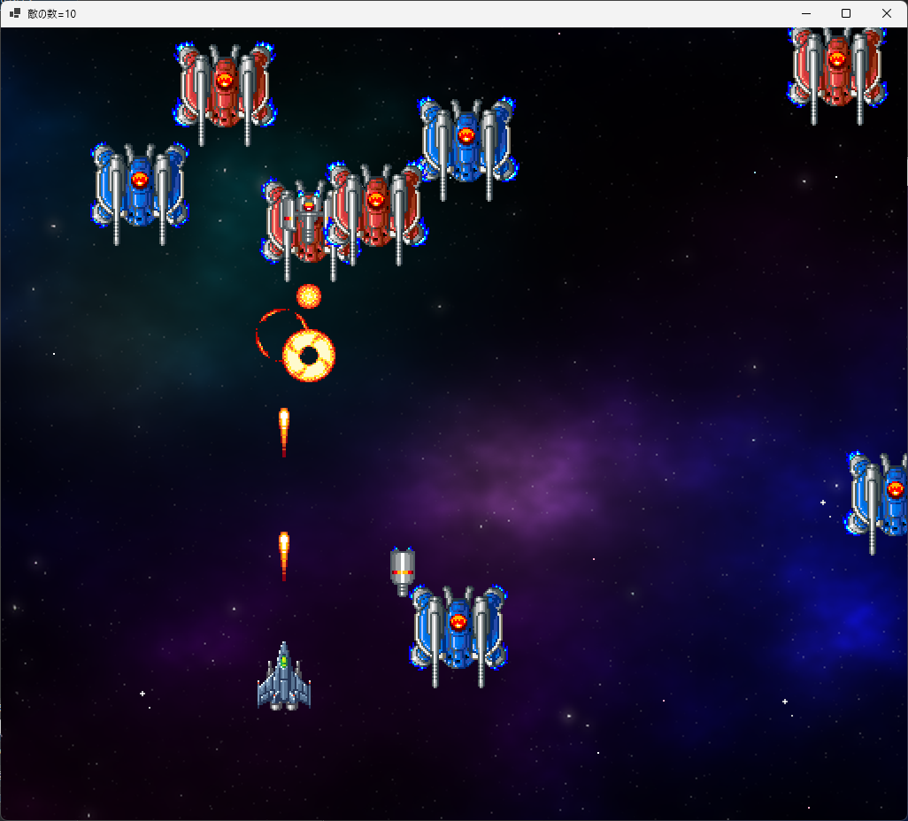

[C#言語2026 第15回]

# プレイヤーを動かす

## キーポイント

* 
* 
* 
* 

## 1 

### 1.1 プレイヤークラスを作る

敵ばかり増えてしまったので、そろそろプレイヤーを登場させましょう。<br>
まず、プレイヤーが操作する機体(=自機)のためのクラスを追加します。

クラス名は`Player`(プレイヤー)とします。クラス用のファイル名は`Player.cs`とします。<br>
以下の手順にしたがって、プロジェクトに`Player.cs`を追加してください。

1. ソリューションエクスプローラーのプロジェクト名(今回の場合は`ShootEmUp`)を右クリック
2. 「追加」項目にマウスカーソルを合わせる
3. 「新しい項目」を左クリック(「新しい項目の追加」というウィンドウが開く)<br>
4. ウィンドウ中央の空欄(`FileName.cs`となっている部分)を`Player.cs`に書き換える
5. 「追加」ボタンをクリック

<div align="center"></div>

`Player`クラスに必要なのは以下の４つです。

* 変数
* コンストラクタ
* 自機の状態を更新するメソッド
* 自機を描くメソッド

まずは変数と、それからコメントを追加します。<br>
`Player`クラスの定義を、次のように変更してください。

```diff
 using System;
 using System.Collections.Generic;
 using System.Linq;
 using System.Text;
 using System.Threading.Tasks;

 namespace ShootEmUp
 {
+  // 自機クラス
   internal class Player
   {
-  }
-}
+    // 自機のアニメーション範囲
+    private static readonly Rectangle[] animePlayer = { new(0, 464, 32, 48) };
+
+    public Character Character;
+    public float MoveSpeed; // 移動速度
+  } // Player クラスブロックの終わり
+} // ShootEmUp 名前空間ブロックの終わり
```

### 1.2 コンストラクタを作る

次にコンストラクタを書きます。<br>
変数宣言の下に、次のプログラムを追加してください。

```diff
     // 自機のアニメーション範囲
     private static readonly Rectangle[] animePlayer = { new(0, 464, 32, 48) };

     public Character Character;
     public float MoveSpeed; // 移動速度
+    
+    // コンストラクタ
+    public Player(float x, float y)
+    {
+      // キャラクターの座標とアニメーションを設定
+      Character = new(x, y, animePlayer, 0);
+
+      // 移動速度を設定
+      MoveSpeed = 500.0f;
+    } // コンストラクタブロックの終わり
   } // Player クラスブロックの終わり
 } // ShootEmUp 名前空間ブロックの終わり
```

移動速度は秒速500ドットにしておきます。ウィンドウの幅が`1024`ドットなので、約2秒で端から端へ移動できます。

### 1.3 自機を更新するメソッドを作る

続いて、自機の状態を更新するメソッドを書きます。<br>
名前は`Update`(アップデート、「更新する」という意味)とします。

`Update`メソッドでは、キー入力によって自機を移動させたいです。<br>
まずは、キー入力を調べるために、`GetAsyncKeyState`メソッドを使えるようにしましょう。<br>
`Player`クラスに次のプログラムを追加してください。

```diff
 using System;
 using System.Collections.Generic;
 using System.Linq;
 using System.Text;
 using System.Threading.Tasks;
+using System.Runtime.InteropServices;

 namespace ShootEmUp
 {
   // 自機クラス
   internal class Player
   {
+    // OSの「キーを調べる機能」を使えるようにする
+    [DllImport("user32.dll")]
+    private static extern short GetAsyncKeyState(int key);
+
+    // GetAsyncKeyState で使う仮想キー番号
+    private const int vkSpace = 32;     // スペースキー
+    private const int vkLeft = 37;      // 矢印キー(左)
+    private const int vkUp = 38;        // 矢印キー(上)
+    private const int vkRight = 39;     // 矢印キー(右)
+    private const int vkDown = 40;      // 矢印キー(下)
+
     // 自機のアニメーション範囲
     private static readonly Rectangle[] animePlayer = { new(0, 464, 32, 48) };

     public Character Character;
     public float MoveSpeed; // 移動速度
```

キー入力を調べられるようになったので、更新メソッドを書きましょう。<br>
コンストラクタブロックの下に、次のプログラムを追加してください。

```diff
       // キャラクターの座標とアニメーションを設定
       Character = new(x, y, animePlayer, 0);

       // 移動速度を設定
       MoveSpeed = 500.0f;
     } // コンストラクタブロックの終わり
+
+    // 自機の状態を更新する
+    public void Update(float deltaTime)
+    {
+      // アニメを更新
+      Character.UpdateAnimeTimer(deltaTime);
+
+      // キー入力に応じて自機を左右に動かす
+      if (GetAsyncKeyState(vkLeft) < 0)
+      {
+        Character.X -= MoveSpeed * deltaTime;
+      }
+      else if (GetAsyncKeyState(vkRight) < 0)
+      {
+        Character.X += MoveSpeed * deltaTime;
+      }
+
+      // キー入力に応じて自機を上下に動かす
+      if (GetAsyncKeyState(vkUp) < 0)
+      {
+        Character.Y -= MoveSpeed * deltaTime;
+      }
+      else if (GetAsyncKeyState(vkDown) < 0)
+      {
+        Character.Y += MoveSpeed * deltaTime;
+      }
+    } // Update メソッドブロックの終わり
   } // Player クラスブロックの終わり
 } // ShootEmUp 名前空間ブロックの終わり
```

### 1.4 自機を描くメソッドを作る

続いて、自機を描くメソッドを作ります。メソッド名は`Draw`(ドロー、「描く」という意味)とします。<br>
`Update`メソッドブロックの下に、`Draw`メソッドを追加してください。

```diff
       else if (GetAsyncKeyState(vkDown) < 0)
       {
         Character.Y += MoveSpeed * deltaTime;
       }
     } // Update メソッドブロックの終わり
+
+    // 自機を描く
+    public void Draw(Graphics g, Bitmap bmp)
+    {
+      Character.Draw(g, bmp);
+    } // Draw メソッドブロックの終わり
   } // Player クラスブロックの終わり
 } // ShootEmUp 名前空間ブロックの終わり
```

ここまでのプログラミングの結果、とりあえず使える`Player`クラスが完成しました。

### 1.5 Form1にPlayerを追加する

完成した`Player`クラスを`Form1`クラスに組み込みましょう。<br>
`Form1`のプログラムを開き、敵の変数の宣言の下に、`Player`クラスの変数を宣言してください。

```diff
     // 敵の変数
     private List<Enemy> enemyList = new();
     private List<EnemySpawner> enemySpawnerList = new(); // 敵発生装置のリスト
     private float enemySpawnTimer = 0.0f; // 敵出現タイマー
+
+    // 自機の変数
+    private Player player = new(RenderWidth * 0.5f, RenderHeight * 0.75f);

     // 乱数
     private Random rand = new();
```

自機の座標は、「画面中央より少し下」にしてみました。

次に、`UpdatePlay`メソッドにある「星を動かす」プログラムの下に、`Player`クラスの`Update`メソッド呼び出しを追加してください。

```diff
       if (backgroundY > 0.0f)
       {
         backgroundY = 0.0f;
       }

       // 背景を流れる星を動かす
       backgroundStar.Update(deltaTime);
+
+      // 自機の状態を更新する
+      player.Update(deltaTime);

       // 敵の状態を更新する
       for (int a = 0; a < enemyList.Count; a += 1)
```

続いて、`PaintPlay`メソッドにある「敵を描く」プログラムの下に、`Player`クラスの`Draw`メソッド呼び出しを追加してください。

```diff
       // 敵を描く
       for (int a = 0; a < enemyList.Count; a += 1)
       {
         enemyList[a].Draw(g, bmpObjects);
       }
+
+      // 自機を描く
+      player.Draw(g, bmpObjects);
     } // PaintPlay メソッドブロックの終わり

     // クリア状態を描く
     private void PaintClear(Graphics g)
```

プログラムが書けたら`>ShootEmUp`ボタンをクリックしてアプリを実行してください。<br>
敵に混ざって「自機」が表示され、自機を矢印キーで移動できたら成功です。

<div align="center"></div>

### 1.6 自機が画面外に出ないようにする

現在、自機は画面の外側にも移動できます。自機が見えないと操作が難しいので、画面外に出ないようにしましょう。<br>
例えば、自機の座標が画面の左側に行き過ぎていたら、座標を左端に設定します。<br>
この処理を、上下左右の４方向で行います。

まずは、横方向の制限を追加しましょう。<br>
`Player.cs`を開き、自機を動かすプログラムの下に、次のプログラムを追加してください。

```diff
       else if (GetAsyncKeyState(vkDown) < 0)
       {
         Character.Y += MoveSpeed * deltaTime;
       }
+
+      // 画面の横方向の移動範囲を制限する
+      float w = Character.AnimeRect[0].Width; // 画像の横幅
+      float minX = w; // X座標の最小値
+      float maxX = Form1.RenderWidth - w; // X座標の最大値
+      if (Character.X < minX)
+      {
+        Character.X = minX;
+      }
+      else if (Character.X > maxX)
+      {
+        Character.X = maxX;
+      }
     } // Update メソッドブロックの終わり

     // 自機を描く
     public void Draw(Graphics g, Bitmap bmp)
```

移動可能な範囲は、自機の画像が画面端で見きれないように、画像の横幅を考慮して決めています。

次に、縦方向の制限を追加します。<br>
横方向の移動範囲を制限するプログラムの下に、次のプログラムを追加してください。

```diff
       else if (Character.X > maxX)
       {
         Character.X = maxX;
       }
+
+      // 画面の縦方向の移動範囲を制限する
+      float h = Character.AnimeRect[0].Height; // 画像の高さ
+      float minY = h; // 上側の限界座標
+      float maxY = Form1.RenderHeight - h; // 下側の限界座標
+      if (Character.Y < minY)
+      {
+        Character.Y = minY;
+      }
+      else if (Character.Y > maxY)
+      {
+        Character.Y = maxY;
+      }
     } // Update メソッドブロックの終わり

     // 自機を描く
     public void Draw(Graphics g, Bitmap bmp)
```

プログラムが書けたら`>ShootEmUp`ボタンをクリックしてアプリを実行してください。<br>
自機を移動させたとき、画面外に出られなくなっていたら成功です。

<div style="page-break-after: always"></div>

## 2 弾を発射する

### 2.1 弾丸クラスを作る

シューティングゲームなので弾を発射しましょう。<br>
まずは、弾丸をあらわす`Bullet`(バレット、「弾丸」という意味)クラスを作ります。<br>
以下の手順にしたがって、プロジェクトに`Bullet.cs`を追加してください。

1. ソリューションエクスプローラーのプロジェクト名(今回の場合は`ShootEmUp`)を右クリック
2. 「追加」項目にマウスカーソルを合わせる
3. 「新しい項目」を左クリック(「新しい項目の追加」というウィンドウが開く)<br>
4. ウィンドウ中央の空欄(`FileName.cs`となっている部分)を`Bullet.cs`に書き換える
5. 「追加」ボタンをクリック

それでは、変数から追加していきましょう。<br>
`Bullet`クラスを次のように変更してください。

```diff
 using System;
 using System.Collections.Generic;
 using System.Linq;
 using System.Text;
 using System.Threading.Tasks;

 namespace ShootEmUp
 {
+  // 弾丸クラス
   internal class Bullet
   {
-  }
-}
+    // 弾丸のアニメーション範囲
+    private static readonly Rectangle[] animePlayerBullet = { new(48, 432, 16, 32) };
+ 
+    public Character Character;
+    public float MoveSpeedX; // X方向の移動速度
+    public float MoveSpeedY; // Y方向の移動速度
+    public bool IsFinished;  // true=行動終了 false=行動中
+  } // Bullet クラスブロックの終わり
+} // ShootEmUp 名前空間ブロックの終わり
```

変数の構成は、`Enemy`クラスとちょっと似ています。<br>
どちらも移動と終了判定が必要なので、同じような変数が必要なのです。<br>
`IsFinished`(イズ・フィニッシュド)変数は、あとで弾丸をリストから削除するために使います。

### 2.2 弾丸のコンストラクタを作る

次に、コンストラクタを作ります。<br>
パラメータは、敵やプレイヤーと同じくX,Y座標と、あと移動速度を指定できるようにします。<br>
変数の宣言の下に、コンストラクタを追加してください。

```diff
     public Character Character;
     public float MoveSpeedX; // X方向の移動速度
     public float MoveSpeedY; // Y方向の移動速度
     public bool IsFinished;  // true=動作終了 false=動作中
+
+    // コンストラクタ
+    public Bullet(float x, float y, float sx, float sy)
+    {
+      // キャラクターの座標とアニメーションを設定
+      Character = new(x, y, animePlayerBullet, 0);
+
+      // 移動速度を設定
+      MoveSpeedX = sx;
+      MoveSpeedY = sy;
+
+      // 行動中にする
+      IsFinished = false;
+    } // コンストラクタブロックの終わり
   } // Bullet クラスブロックの終わり
 } // ShootEmUp 名前空間ブロックの終わり
```

### 2.3 弾丸を更新するメソッドを作る

続いて、弾丸の状態を更新するメソッドを書きます。<br>
名前は`Update`(アップデート、「更新する」という意味)とします。

`Update`メソッドでは、移動速度に合わせて弾丸を移動させます。<br>
コンストラクタブロックの下に、`Update`メソッドを追加してください。

```diff
       // 移動速度を設定
       MoveSpeedX = sx;
       MoveSpeedY = sy;
 
       // 行動中にする
       IsFinished = false;
     } // コンストラクタブロックの終わり
+
+    // 弾丸の状態を更新する
+    public void Update(float deltaTime)
+    {
+      // 動作終了していたら何もしない
+      if (IsFinished)
+      {
+        return;
+      }
+
+      // アニメーションを更新する
+      Character.UpdateAnimeTimer(deltaTime);
+
+      // 弾丸の位置を更新する
+      Character.X += MoveSpeedX * deltaTime;
+      Character.Y += MoveSpeedY * deltaTime;
+    } // Update メソッドブロックの終わり
   } // Bullet クラスブロックの終わり
 } // ShootEmUp 名前空間ブロックの終わり
```

それから、弾丸が画面外に出たら、「行動終了」にします。<br>
`Player`クラスの場合、キャラクターが **ちょっとでも画面外に出ないように** していましたが、今回は **完全に画面外に出たら** 行動終了にします。

弾丸の位置を更新するプログラムの下に、次のプログラムを追加してください。

> 記号`|`を出すには、`Shift`キーを押しながら、キーボード右上の`￥`キーを押します。

```diff
       // 弾丸の位置を更新する
       Character.X += MoveSpeedX * deltaTime;
       Character.Y += MoveSpeedY * deltaTime;
+
+      // 弾丸のX座標が画面外に出たら行動終了にする
+      float w = Character.AnimeRect[0].Width; // 画像の幅
+      float minX = -w; // 画面内と判定されるX座標の最小値
+      float maxX = Form1.RenderWidth + w; // 画面内と判定されるX座標の最大値
+      if (Character.X < minX || Character.X > maxX)
+      {
+        IsFinished = true;
+      }
+
+      // 弾丸のY座標が画面外に出たら行動終了にする
+      float h = Character.AnimeRect[0].Height; // 画像の高さ
+      float minY = -h; // 画面内と判定されるY座標の最小値
+      float maxY = Form1.RenderHeight + h; // 画面内と判定されるY座標の最大値
+      if (Character.Y < minY || Character.Y > maxY)
+      {
+        IsFinished = true;
+      }
     } // Update メソッドブロックの終わり
   } // Bullet クラスブロックの終わり
 } // ShootEmUp 名前空間ブロックの終わり
```

このプログラムの条件式では、記号`||`を使っています。<br>
この記号`||`は、`式A || 式B`のように使い、以下の意味になります。

&emsp;**式Aが成立、または式Bが成立なら、全体として成立**

図にするとこうです。

| 式Aの結果 | 式Bの結果 | 全体の結果 |
|:--------:|:--------:|:--------:|
| ✖(不成立) | ✖(不成立)| ✖(不成立) |
| ◯(成立)  | ✖(不成立) | ◯(成立)  |
| ✖(不成立) | ◯(成立)  | ◯(成立)  |
| ◯(成立)  | ◯(成立)  | ◯(成立)  |

例えば、`Character.X < minX || Character.X > maxX`という条件式は、<br>
&emsp;`Character.X < minX`
と
&emsp;`Character.X > maxX`
のどちらか片方だけでも成立すれば、条件式全体が成立したことになります。

このように、記号`||`を使うと、複数の条件式をひとつの条件式にまとめられます。

### 2.4 弾丸を描くメソッドを作る

続いて、弾丸を描くメソッドを作ります。メソッド名は`Draw`(ドロー、「描く」という意味)とします。<br>
`Update`メソッドブロックの下に、`Draw`メソッドを追加してください。

```diff
       if (Character.Y < minY || Character.Y >= maxY)
       {
         IsFinished = true;
       }
     } // Update メソッドブロックの終わり
+
+    // 弾丸を描く
+    public void Draw(Graphics g, Bitmap bmp)
+    {
+      Character.Draw(g, bmp);
+    } // Draw メソッドブロックの終わり
   } // Bullet クラスブロックの終わり
 } // ShootEmUp 名前空間ブロックの終わり
```

これで、弾丸に必要な機能は完成です。

### 2.5 Form1にBulletを追加する

完成した`Bullet`クラスを`Form1`クラスに組み込みましょう。<br>
`Form1`のプログラムを開き、自機の変数に`Bullet`クラスのリストを宣言してください。<br>
弾丸のリストの名前は`playerBulletList`(プレイヤー・バレット・リスト、「自機の弾丸のリスト」という意味)とします。

```diff
     // 敵の変数
     private List<Enemy> enemyList = new();
     private List<EnemySpawner> enemySpawnerList = new(); // 敵発生装置のリスト
     private float enemySpawnTimer = 0.0f; // 敵出現タイマー

     // 自機の変数
     private Player player = new(RenderWidth * 0.5f, RenderHeight * 0.75f);
+    private List<Bullet> playerBulletList = new(); // 自機の弾丸のリスト

     // 乱数
     private Random rand = new();
```

次に、`UpdatePlay`メソッドにある「自機の状態を更新する」プログラムの下に、弾丸リストを更新するfor文を追加してください。

```diff
       // 背景を流れる星を動かす
       backgroundStar.Update(deltaTime);

       // 自機の状態を更新する
       player.Update(deltaTime);
+
+      // 自機の弾の状態を更新する
+      for (int a = 0; a < playerBulletList.Count; a += 1)
+      {
+        playerBulletList[a].Update(deltaTime);
+      }
+      playerBulletList.RemoveAll((e) => { return e.IsFinished; });

       // 敵の状態を更新する
       for (int a = 0; a < enemyList.Count; a += 1)
```

続いて、`PaintPlay`メソッドにある「敵を描く」プログラムの下に、弾丸リストを描くfor文を追加してください。

```diff
       // 敵を描く
       for (int a = 0; a < enemyList.Count; a += 1)
       {
         enemyList[a].Draw(g, bmpObjects);
       }
+
+      // 自機の弾を描く
+      for (int a = 0; a < playerBulletList.Count; a += 1)
+      {
+        playerBulletList[a].Draw(g, bmpObjects);
+      }

       // 自機を描く
       player.Draw(g, bmpObjects);
     } // PaintPlay メソッドブロックの終わり
```

### 2.6 Playerクラスに弾丸発射機能を追加する

`Player`クラスに「弾丸を発射する機能」を追加しましょう。<br>
`Player.cs`を開き、`Update`メソッドのパラメータとして弾丸リストを追加してください。

```diff
       // 移動速度を設定
       MoveSpeed = 500.0f;
     } // コンストラクタブロックの終わり

     // 自機の状態を更新する
-    public void Update(float deltaTime)
+    public void Update(float deltaTime, List<Bullet> bulletList)
     {
       // アニメを更新
       Character.UpdateAnimeTimer(deltaTime);
```

「スペースバー」が押されたら、弾丸を発射します。<br>
`Update`メソッドにある「自機の移動範囲を制限する」プログラムの下に、弾丸を発射するプログラムを追加してください。

```diff
       else if (Character.Y >= maxY)
       {
         Character.Y = maxY;
       }
+
+      // 弾丸を発射する
+      if (GetAsyncKeyState(vkSpace) < 0)
+      {
+        float bulletSpeed = -1200;
+        bulletList.Add(new(Character.X, Character.Y, 0, bulletSpeed));
+      }
     } // Update メソッドブロックの終わり

     // 自機を描く
     public void Draw(Graphics g, Bitmap bmp)
```

プログラムが書けたら`>ShootEmUp`ボタンをクリックしてアプリを実行してください。<br>
スペースバーを押しているとき、弾丸が発射されたら成功です。

<div align="center"></div>

### 2.7 弾丸の発射間隔を制御する

スペースバーが押されていたら弾丸を発射する設計では、弾丸が棒のようにつながってしまいます。<br>
弾丸に見えないので、次の弾丸を発射するまでの待ち時間を作りましょう。

`Player.cs`を開き、

```diff
     // 自機のアニメーション範囲
     private static readonly Rectangle[] animePlayer = { new(0, 464, 32, 48) };

     public Character Character;
     public float MoveSpeed; // 移動速度
+    public float ShotTimer; // 弾丸の発射間隔タイマー

     // コンストラクタ
     public Player(float x, float y)
     {
       // キャラクターの座標とアニメーションを設定
       Character = new(x, y, animePlayer, 0);

       // 移動速度を設定
       MoveSpeed = 500.0f;
+
+      // 弾丸の発射間隔タイマーを初期化
+      ShotTimer = 0.0f;
     } // コンストラクタブロックの終わり
```

```diff
       // 弾丸を発射する
       if (GetAsyncKeyState(vkSpace) < 0)
       {
+        // 発射間隔タイマーが 0 以下になったら弾丸を発射
+        ShotTimer -= deltaTime;
+        if (ShotTimer <= 0)
+        {
+          ShotTimer += 0.125f; // 次の発射までの時間を設定
           float bulletSpeed = -1200;
           bulletList.Add(new(Character.X, Character.Y, 0, bulletSpeed));
+        }
       }
+      else
+      {
+        // 発射キーが離されたら発射間隔タイマーを0に戻す
+        ShotTimer = 0.0f;
+      }
     } // Update メソッドブロックの終わり

     // 自機を描く
     public void Draw(Graphics g, Bitmap bmp)
```

プログラムが書けたら`>ShootEmUp`ボタンをクリックしてアプリを実行してください。<br>
スペースバーを押しているとき、弾丸が一定間隔で発射されたら成功です。

<div align="center"></div>

<div style="page-break-after: always"></div>

## 3 衝突判定

### 3.1 四角形クラスを作る

弾丸を撃つのは、敵を倒すためです。弾丸が敵に当たるようにしましょう。<br>
方法として、物体ごとに衝突範囲をあらわす長方形を定めて、２つの長方形の交差状態を調べます。

そのために、衝突判定を行う`Box`(ボックス)クラスを作ります。<br>
以下の手順にしたがって、プロジェクトに`Box.cs`を追加してください。

1. ソリューションエクスプローラーのプロジェクト名(今回の場合は`ShootEmUp`)を右クリック
2. 「追加」項目にマウスカーソルを合わせる
3. 「新しい項目」を左クリック(「新しい項目の追加」というウィンドウが開く)<br>
4. ウィンドウ中央の空欄(`FileName.cs`となっている部分)を`Box.cs`に書き換える
5. 「追加」ボタンをクリック

それでは、変数から追加していきましょう。<br>
`Box`クラスを次のように変更してください。

```diff
 using System;
 using System.Collections.Generic;
 using System.Linq;
 using System.Text;
 using System.Threading.Tasks;

 namespace ShootEmUp
 {
+  // 長方形クラス
   internal class Box
   {
-  }
-}
+    public float Left;   // 四角形の左辺のX座標
+    public float Right;  // 四角形の右辺のX座標
+    public float Top;    // 四角形の上辺のY座標
+    public float Bottom; // 四角形の下辺のY座標
+  } // Box クラスブロックの終わり
+} // ShootEmUp 名前空間ブロックの終わり
```

長方形の定義として、衝突判定に向いている「４つの辺の座標を指定」する方法を選びました。

### 3.2 長方形のコンストラクタを作る

次は、コンストラクタを書きます。<br>
変数宣言の下に、コンストラクタを追加してください。

```diff
     public float Left;   // 四角形の左辺のX座標
     public float Right;  // 四角形の右辺のX座標
     public float Top;    // 四角形の上辺のY座標
     public float Bottom; // 四角形の下辺のY座標
+
+    // コンストラクタ
+    public Box(float l, float r, float t, float b)
+    {
+      Left = l;
+      Right = r;
+      Top = t;
+      Bottom = b;
+    } // コンストラクタブロックの終わり
   } // Box クラスブロックの終わり
 } // ShootEmUp 名前空間ブロックの終わり
```

コンストラクタでは、４つの辺の座標を設定します。

### 3.3 衝突判定メソッドを作る

続いて、衝突判定を行うメソッドを作ります。<br>
衝突とは「２つ以上の物体が交差している状態」のことです。<br>
メソッド名は、「交差する」の英語`Intersect`(インターセクト)とします。

さて、判定方法ですが、長方形`A`と長方形`B`について、以下の４つの判定によって衝突の有無を判定します。

* `A`が`B`より左側にある → 衝突していない
* `A`が`B`の右側にある → 衝突していない
* `A`が`B`より上側にある → 衝突していない
* `A`が`B`の下側にある → 衝突していない
* 上記のどれでもない → 衝突している

コンストラクタブロックの下に、`Intersect`メソッドを追加してください。

```diff
       Left = l;
       Right = r;
       Top = t;
       Bottom = b;
     } // コンストラクタブロックの終わり
+
+    // ボックス同士の衝突判定
+    // 戻り値: true  衝突している
+    //         false 衝突していない
+    public bool Intersect(Box other)
+    {
+      // ボックスがotherより右にあるなら、衝突していない
+      if (Left > other.Right)
+      {
+        return false;
+      }
+
+      // ボックスがotherの左にあるなら、衝突していない
+      if (Right <= other.Left)
+      {
+        return false;
+      }
+
+      // ボックスがotherより下にあるなら、衝突していない
+      if (Top > other.Bottom)
+      {
+        return false;
+      }
+
+      // ボックスがotherの上にあるなら、衝突していない
+      if (Bottom <= other.Top)
+      {
+        return false;
+      }
+
+      // 上記のどれにも当てはまらないなら、衝突している
+      return true;
+    } // Intersect メソッドブロックの終わり
   } // Box クラスブロックの終わり
 } // ShootEmUp 名前空間ブロックの終わり
```

### 3.4 敵に衝突判定を追加する

<div align="center"><br>[赤枠が衝突判定]</div>

シューティングゲームでは、多数の敵と弾丸が同時に表示されます。<br>
100体の敵と100発の弾丸が表示されたとすると、それらの衝突判定の回数は100x100で、1万回になります。

回数が多いので、判定のたびに四角形を作るのは非効率です。<br>
そこで、敵と弾丸の両方に、`Box`クラスの変数を追加します。<br>
これらの作成済み変数を使って衝突判定を行うことで、`Box`作成にかかる時間をなくします。

それでは、弾丸と敵に衝突判定を追加しましょう。

`Enemy.cs`を開き、`Enemy`クラスに次の変数を追加してください。

```diff
     public bool IsFinished;  // true=行動終了 false=行動中
     public int Type;         // 敵の種類
     public float Timer;      // 発生からの経過時間(秒)
     public float StartX;     // 発生時のX座標
     public float StartY;     // 発生時のY座標
+    public Box Hitbox;       // 衝突判定
+    public Box HitboxOrigin; // 衝突判定の基本座標

     // 敵の種類
     public const int SmallGray = 0;  // 小型で灰色(スモール・グレー)
     public const int MediumRed = 1;  // 中型で赤色(ミディアム・レッド)
```

`Hitbox`(ヒットボックス)は、実際に使う衝突判定です。<br>
`HitboxOrigin`(ヒットボックス・オリジン、「原点のヒットボックス」という意味)は、敵が原点(0, 0)にいる場合の衝突判定の座標です。

`Hitbox`は、敵が移動するたびに計算し直す必要があります。<br>
コンストラクタで`HitboxOrigin`に基本の座標を設定しておき、`Hitbox`にはこの基本座標に、現在の敵の座標を加算して代入します。

コンストラクタの「キャラクターを作る」プログラムに、原点のヒットボックスを作るプログラムを追加してください。

```diff
       // キャラクターを作る
       if (Type == SmallGray)
       {
         Character = new Character(x, y, animeSmallGray, 7);
+        HitboxOrigin = new(-28, 28, -28, 28);
         MoveSpeedY = 200.0f;
       }
       else if (Type == MediumRed)
       {
         Character = new Character(x, y, animeMediumRed, 10);
+        HitboxOrigin = new(-56, 56, -56, 38);

         // 画面中央より左に発生したら右へ、右に発生したら左へ移動させる
         MoveSpeedX = 50;
         if (x >= Form1.RenderWidth * 0.5f)
```

<pre class="tnmai_assignment">
<strong>【課題01 残りの敵の衝突判定を作る】</strong>
中型で青色の敵と、小型で緑色の敵について、原点の衝突判定を作るプログラムを追加しなさい。
衝突判定の大きさは以下の値にすること。
  中型で青色の敵: (-56, 56, -56, 38)
  小型で緑色の敵: (-28, 28, -28, 28)
</pre>

### 3.5 敵の衝突判定を計算する

コンストラクタの最後で、実際のヒットボックスを計算します。<br>
コンストラクタに次のプログラムを追加してください。

```diff
       else if (Type == SmallGreen)
       {
         Character = new Character(x, y, animeSmallGreen, 8);
         HitboxOrigin = new(-28, 28, -28, 28);
         MoveSpeedX = 100;
       }
+      // 実際のヒットボックスを計算
+      Hitbox = new(
+        HitboxOrigin.Left + Character.X, HitboxOrigin.Right + Character.X,
+        HitboxOrigin.Top + Character.Y, HitboxOrigin.Bottom + Character.Y);
     } // コンストラクタブロックの終わり

     // 敵の状態を更新する
     public void Update(float deltaTime)
```

同様に、`Update`メソッドの最後でもヒットボックスを計算します。<br>
`Update`メソッドに次のプログラムを追加してください。

```diff
       else if (Type == SmallGreen)
       {
         float a = 3.0f; // 周波数(振動1回にかかる秒数)
         float b = 256.0f; // 振幅
         Character.X = SpawnX + MathF.Sin(MathF.PI * 2.0f / a * Timer) * b;
         Character.Y += MoveSpeedY * deltaTime;
 
         // 敵が画面の下に消えたら行動終了
         if (Character.Y >= Form1.RenderHeight + 64)
         {
           IsFinished = true;
         }
       }
+
+      // 実際のヒットボックスを計算
+      Hitbox = new(
+        HitboxOrigin.Left + Character.X, HitboxOrigin.Right + Character.X,
+        HitboxOrigin.Top + Character.Y, HitboxOrigin.Bottom + Character.Y);
     } // Update メソッドブロックの終わり

     // 敵を描く
     public void Draw(Graphics g, Bitmap bmp)
```

### 3.6 弾丸の衝突判定を作る

<div align="center"><br>[自機の弾の判定は大きくする]</div>

敵の次は、弾丸にも衝突判定を追加します。<br>
`Bullet.cs`を開き、`Bullet`クラスに衝突判定用の変数を追加してください。

```diff
     public Character Character;
     public float MoveSpeedX; // X方向の移動速度
     public float MoveSpeedY; // Y方向の移動速度
     public bool IsFinished;  // true=行動終了 false=行動中
+    public Box Hitbox;       // 衝突判定
+    public Box HitboxOrigin; // 衝突判定の基本座標

     // コンストラクタ
     public Bullet(float x, float y, float sx, float sy)
```

次に、コンストラクタに、原点の衝突判定を設定するプログラムを追加してください。

```diff
     // コンストラクタ
     public Bullet(float x, float y, float sx, float sy)
     {
       // キャラクターの座標とアニメーションを設定
       Character = new(x, y, animePlayerBullet, 0);
+
+      // 衝突判定を設定
+      HitboxOrigin = new(-16, 16, -32, 32);

       // 移動速度を設定
       MoveSpeedX = sx;
       MoveSpeedY = sy;

       // 行動中にする
       IsFinished = false;
+
+      // 実際のヒットボックスを計算
+      Hitbox = new(
+        HitboxOrigin.Left + Character.X, HitboxOrigin.Right + Character.X,
+        HitboxOrigin.Top + Character.Y, HitboxOrigin.Bottom + Character.Y);
     } // コンストラクタブロックの終わり

     // 弾丸の状態を更新する
     public void Update(float deltaTime)
```

続いて、`Update`メソッドにも、実際のヒットボックスを計算するプログラムを追加してください。

```diff
       // 弾丸の位置を更新する
       Character.X += MoveSpeedX * deltaTime;
       Character.Y += MoveSpeedY * deltaTime;
+
+      // 実際のヒットボックスを計算
+      Hitbox = new(
+        HitboxOrigin.Left + Character.X, HitboxOrigin.Right + Character.X,
+        HitboxOrigin.Top + Character.Y, HitboxOrigin.Bottom + Character.Y);

       // 弾丸のX座標が画面外に出たら行動終了にする
       float w = Character.AnimeRect[0].Width; // 画像の幅
       float minX = -w; // 画面内と判定されるX座標の最小値
```

### 3.7 二重for文による敵と弾丸の衝突判定

ここまでのプログラミングで、敵と弾丸の衝突判定ボックスが、`Update`メソッドを実行するたびに更新されるようになりました。
更新された衝突判定ボックスを使って、衝突判定を行いましょう。

ひとつの敵ごとに、すべての弾丸との衝突判定を行います。これをすべての敵について行うので、二重のfor文になります。<br>
`Form1`を開き、`Update`メソッドの末尾に、敵と弾丸の二重for文を追加してください。

```diff
       enemySpawnerList[a].Update(deltaTime, enemyList);
     }
     enemySpawnerList.RemoveAll((e) => { return e.IsFinished; });

     Text = "敵の数=" + enemyList.Count;
+
+    // 敵と自機の弾丸の衝突判定
+    for (int a = 0; a < enemyList.Count; a += 1)
+    {
+      Enemy enemy = enemyList[a];
+
+      // 敵1体ごとに、すべての弾丸との衝突判定を行う
+      for (int b = 0; b < playerBulletList.Count; b += 1)
+      {
+        Bullet bullet = playerBulletList[b];
+
+      } // playerBulletList のforブロックの終わり
+    } // enemyList のforブロックの終わり
   } // UpdatePlay メソッドブロックの終わり

   // クリア状態を更新する
   //   deltaTime  状態を進める秒数
   private void UpdateClear(float deltaTime)
```

衝突判定は、弾丸のfor文の中で行います。弾丸のfor文の中に、次のプログラムを追加してください。

```diff
     // 敵と自機の弾丸の衝突判定
     for (int a = 0; a < enemyList.Count; a += 1)
     {
       Enemy enemy = enemyList[a];
 
       // 敵1体ごとに、すべての弾丸との衝突判定を行う
       for (int b = 0; b < playerBulletList.Count; b += 1)
       {
         Bullet bullet = playerBulletList[b];
+
+        // 敵と弾丸が衝突していたら、両者を終了状態にする
+        if (bullet.Hitbox.Intersect(enemy.Hitbox))
+        {
+          bullet.IsFinished = true;
+          enemy.IsFinished = true;
+          break; // 弾丸のループを終了する
+        }
       } // playerBulletList のforブロックの終わり
     } // enemyList のforブロックの終わり
   } // UpdatePlay メソッドブロックの終わり
```

これで、弾丸が的に命中したら、弾丸と敵の両方がいなくなります。

プログラムが書けたら`>ShootEmUp`ボタンをクリックしてアプリを実行してください。<br>
弾丸と敵が衝突したあと、その弾丸も敵も画面から消えたら成功です。

<div align="center"></div>

### 3.8 敵に耐久値を付ける

どんな大きさの敵も1発で破壊されてしまっては、敵の差別化ができません。<br>
そこで、敵に耐久値を設定しましょう。<br>
弾丸が当たるたびに耐久値を1ずつ減らしていき、0以下になったら破壊される、という仕組みにします。

耐久値の変数名は`Hp`(エイチピー、「ヒットポイント、耐久値」という意味)とします。<br>
`Enemy.cs`を開き、`Hp`変数を追加してください。

```diff
     public bool IsFinished;  // true=行動終了 false=行動中
     public int Type;         // 敵の種類
     public float Timer;      // 発生からの経過時間(秒)
     public float StartX;     // 発生時のX座標
     public float StartY;     // 発生時のY座標
     public Box Hitbox;       // 衝突判定
     public Box HitboxOrigin; // 衝突判定の基本座標
+    public int Hp;           // 耐久値

     // 敵の種類
     public const int SmallGray = 0;  // 小型で灰色(スモール・グレー)
     public const int MediumRed = 1;  // 中型で赤色(ミディアム・レッド)
```

次に、コンストラクタで耐久値を設定します。コンストラクタに次のプログラムを追加してください。

```diff
     // コンストラクタ
     public Enemy(float x, float y, int t)
     {
       MoveSpeedX = 0.0f;
       MoveSpeedY = 0.0f;
       IsFinished = false; // 「行動中」にする
       Type = t; // 敵の種類を設定
       Timer = 0.0f; // 経過時間を0にする
       StartX = x;   // 発生時のX座標を記録
       StartY = y;   // 発生時のY座標を記録
+      Hp = 1;       // 基本の耐久値を設定

       // キャラクターを作る
       if (Type == SmallGray)
```

敵の種類に関わらず、とりあえず`1`の耐久値を設定しておきます。<br>
これは、小型の敵の標準的な耐久値になります。

中型以上の敵には、個別に耐久値を設定します。

```diff
       else if (Type == MediumRed)
       {
         Character = new Character(x, y, animeMediumRed, 10);
         HitboxOrigin = new(-56, 56, -56, 56);
+        Hp = 8;
+
         // 画面中央より左に発生したら右へ、右に発生したら左へ移動させる
         MoveSpeedX = 50;
         if (x >= Form1.RenderWidth * 0.5f)
```

<pre class="tnmai_assignment">
<strong>【課題02 中型で青色の敵の耐久値を設定する】</strong>
中型で青色の敵について、耐久値を<code>10</code>に設定するプログラムを追加しなさい。
</pre>

耐久値を作ったので、衝突判定を耐久値に対応させます。<br>
`Form1`を開き、`UpdatePlay`メソッドにある「敵と弾丸の衝突判定」プログラムに、次のプログラムを追加してください。

```diff
         // 敵と弾丸が衝突していたら、両者を終了状態にする
         if (bullet.Hitbox.Intersect(enemy.Hitbox))
         {
           bullet.IsFinished = true;
+          enemy.Hp -= 1;
+          if (enemy.Hp <= 0)
+          {
             enemy.IsFinished = true;
             break; // 弾丸のループを終了する
+          }
         }
       } // playerBulletList のforブロックの終わり
     } // enemyList のforブロックの終わり
```

プログラムが書けたら`>ShootEmUp`ボタンをクリックしてアプリを実行してください。<br>
中型の敵が１発では消えなくなっていたら成功です。

<div align="center"></div>

### 3.9 爆発を表示する

敵を倒したとき、ただ消えてしまうのは味気ないです。<br>
そこで、敵を消すのと同時に、爆発アニメーションを表示しましょう。

まず、爆発を管理するためのリストを作ります。<br>
変数名は`effectList`(エフェクト・リスト、「演出効果リスト」という意味)とします。<br>
`Form1`を開き、自機の変数の宣言の下に、次の変数宣言を追加してください。

```diff
     // 自機の変数
     private Player player = new(RenderWidth * 0.5f, RenderHeight * 0.75f);
     private List<Bullet> playerBulletList = new();
+
+    // 爆発などのエフェクトのリスト
+    private List<Character> effectList = new();
+
+    // 小型の爆発のアニメーション範囲
+    private static Rectangle[] animeSmallBlast = {
+      new(848, 384, 16, 16), new(864, 368, 32, 32), new(896, 368, 32, 32),
+      new(928, 368, 32, 32), new(960, 368, 32, 32), new(992, 368, 32, 32),
+    };

     // 乱数
     private Random rand = new();
```

次に、エフェクトの状態を更新するプログラムを書きます。<br>
`UpdatePlay`メソッドにある「敵発生装置を更新する」プログラムの下に、次のプログラムを追加してください。

```diff
         enemySpawnerList[a].Update(deltaTime, enemyList);
       }
       enemySpawnerList.RemoveAll((e) => { return e.IsFinished; });

       Text = "敵の数=" + enemyList.Count;
+
+      // エフェクトを更新する
+      for (int a = 0; a < effectList.Count; a += 1)
+      {
+        effectList[a].UpdateAnimeTimer(deltaTime);
+      }

       // 敵と自機の弾丸の衝突判定
       for (int a = 0; a < enemyList.Count; a += 1)
       {
         Enemy enemy = enemyList[a];
```

続いて、エフェクトを描きます。<br>
`PaintPlay`メソッドにある「敵を描く」プログラムの下に、エフェクトを描くプログラムを追加してください。

```diff
       for (int a = 0; a < enemyList.Count; a += 1)
       {
         enemyList[a].Draw(g, bmpObjects);
       }
+
+      // エフェクトを描く
+      for (int a = 0; a < effectList.Count; a += 1)
+      {
+        effectList[a].Draw(g, bmp);
+      }

       // 自機の弾を描く
       for (int a = 0; a < playerBulletList.Count; a += 1)
```

最後に、敵を破壊したときに爆発エフェクトを表示します。<br>
`UpdatePlay`メソッドにある敵と球の衝突判定プログラムに、次のプログラムを追加してください。

```diff
           bullet.IsFinished = true;
           enemy.Hp -= 1;
           if (enemy.Hp <= 0)
           {
             enemy.IsFinished = true;
+
+            // 爆発エフェクトを追加する
+            Character c = new(x, y, animeSmallBlast, 15);
+            effectList.Add(c);
+
             break; // 弾丸のループを終了する
           }
         }
       } // playerBulletList のforブロックの終わり
     } // enemyList のforブロックの終わり
```

プログラムが書けたら`>ShootEmUp`ボタンをクリックしてアプリを実行してください。<br>
敵を破壊したとき爆発アニメーションが表示されたら成功です。

<div align="center"></div>

### 3.10 アニメーションを停止する

現在、爆発アニメーションが繰り返し再生されて、ずっと画面に残り続けています。<br>
邪魔で仕方ないので、一度のアニメーションで終わるようにします。<br>
そのために、キャラクタークラスに、アニメーションの繰り返しを制御する機能を追加します。

`Character.cs`を開き、変数とコンストラクタに次のプログラムを追加してください。

```diff
    public float Y; // Y座標
     public Rectangle[] AnimeRect; // アニメーション表示する範囲の配列
     public float AnimeTimestep;   // 1秒間にアニメーションが切り替わる枚数
     public float AnimeTimer;      // アニメーション制御タイマー(秒)
+    public bool AnimeIsLoop;      // true=アニメを繰り返し再生 false=アニメを1回だけ再生
+    public bool AnimeIsEnd;       // true=アニメ終了 false=アニメ実行中

     // コンストラクタ
     public Character(float x, float y, Rectangle[] animeRect, float timestep)
     {
       X = x;
       Y = y;
       AnimeRect = animeRect;
       AnimeTimestep = timestep;
       AnimeTimer = 0.0f;
+      AnimeIsLoop = true;
+      AnimeIsEnd = false;
     } // コンストラクタブロックの終わり

    // アニメーションを更新する
    //   deltaTime  状態を進める秒数
    public void UpdateAnimeTimer(float deltaTime)
```

繰り返しを制御するために、２つの変数`AnimeIsLoop`(アニメ・イズ・ループ、「アニメは繰り返すか？」という意味)と<br>
`AnimeIsEnd`(アニメ・イズ・エンド、「アニメは終わったか？」という意味)を追加しました。

`AnimeIsLoop`に`false`を代入すると、アニメーションが一度だけ再生されます。<br>
`AnimeIsEnd`は、`AnimeIsLoop`が`false`の場合に、再生が終わったら`true`を設定します。

それでは、これらの変数を使って繰り返しを制御しましょう。<br>
`Update`メソッドに次のプログラムを追加してください。

```diff
     // アニメーションを更新する
     //   deltaTime  状態を進める秒数
     public void UpdateAnimeTimer(float deltaTime)
     {
+      // アニメが終了していたら何もしない
+      if (AnimeIsEnd)
+      {
+        return;
+      }
+
       // タイマーを進める
       AnimeTimer += AnimeTimestep * deltaTime;
 
       // タイマーの数値が画像枚数以上になったら最初に戻す
       if (AnimeTimer >= AnimeRect.Length)
       {
+        if (AnimeIsLoop)
+        {
           AnimeTimer -= AnimeRect.Length;
+        }
+        else
+        {
+          AnimeIsEnd = true; // 再生終了
+          AnimeTimer = AnimeRect.Length - 1; // タイマーを「最後のコマ」に設定
+        }
       }
     } // UpdateAnimeTimer メソッドブロックの終わり
```

`Form1`を開き、`UpdatePlay`メソッドにある「爆発エフェクトを追加する」プログラムに、次のプログラムを追加してください。

```diff
           if (enemy.Hp <= 0)
           {
             enemy.IsFinished = true;

             // 爆発エフェクトを追加する
             Character c = new(x, y, animeSmallBlast, 15);
+            c.AnimeIsLoop = false; // 一度だけ再生する
             effectList.Add(c);

             break; // 弾丸のループを終了する
           }
```

最後に、再生が終わった爆発エフェクトを削除します。
`UpdatePlay`メソッドにある「エフェクトを更新する」プログラムの下に、次のプログラムを追加してください。

```diff
       // エフェクトを更新する
       for (int a = 0; a < effectList.Count; a += 1)
       {
         effectList[a].UpdateAnimeTimer(deltaTime);
       }
+      effectList.RemoveAll((e) => { return e.AnimeIsEnd; });

       // 敵と自機の弾丸の衝突判定
       for (int a = 0; a < enemyList.Count; a += 1)
```

プログラムが書けたら`>ShootEmUp`ボタンをクリックしてアプリを実行してください。<br>
爆発アニメーションが一度だけ再生され、画面から消えたら成功です。

<div align="center"></div>
