[C#言語2026 第16回]

# 自機の強化と敵の攻撃

## キーポイント

* 
* 
* 
* 

## 1 自機のパワーアップ

&emsp;1回目: 背景の表示、敵の表示、敵のクラス化、敵を増やす<br>
&emsp;2回目: 流れる星の表示、敵を動かす、敵の発生を制御する、敵の行動パターンを増やす<br>
&emsp;3回目: 自機の表示、弾丸を発射する、敵と弾丸の衝突判定、爆発を表示<br>
&emsp;**今回:** 自機のパワーアップ、敵の弾丸を発射する、自機と敵の弾丸の衝突判定、ゲームオーバー、敵の調整<br>
&emsp;5回目: 得点の表示、敵出現順の制御、ボス敵の表示、ステージクリア、ステージを増やす

### 1.1 自機にパワーアップ機能を追加する

現在の状態では、敵が多すぎてとても撃ちきれません。<br>
そこで、パワーアップアイテムを出して、自機の攻撃力を上げましょう。<br>
パワーアップのためには、`Player`クラスに以下の変数を追加する必要があります。

* 攻撃力レベルをあらわす変数
* 衝突判定

衝突判定は、パワーアップアイテムとの衝突を判定するために使います。<br>
`Player.cs`を開き、次の変数を追加してください。

```diff
     public Character Character;
     public float MoveSpeed; // 移動速度
     public float ShotTimer; // 弾丸の発射間隔タイマー
+    public int ShotLevel;   // 攻撃レベル
+    public Box Hitbox;       // 衝突判定
+    public Box HitboxOrigin; // 衝突判定の基本座標

     // コンストラクタ
     public Player(float x, float y)
```

```diff
     // コンストラクタ
     public Player(float x, float y)
     {
       // キャラクターの座標とアニメーションを設定
       Character = new(x, y, animePlayer, 0);

       // 移動速度を設定
       MoveSpeed = 500;

       // 弾丸の発射間隔タイマーを初期化
       ShotTimer = 0.0f;
+
+      // 攻撃レベルを初期化
+      ShotLevel = 0;
+
+      // 衝突判定を設定
+      HitboxOrigin = new(-8, 8, 12, 12);
+      Hitbox = new(
+        HitboxOrigin.Left + Character.X, HitboxOrigin.Right + Character.X,
+        HitboxOrigin.Top + Character.Y, HitboxOrigin.Bottom + Character.Y);
     } // コンストラクタブロックの終わり

     // プレイヤーを更新する
     public void Update(float deltaTime, List<Bullet> bulletList)
```

自機の衝突判定は小さめにしています。<br>
これは、後で敵や敵弾との衝突判定を行うとき、衝突しにくくするためです。

<div align="center">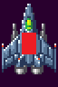<br>[自機の判定は小さくする]</div>

次に、レベルに応じて発射する弾丸を増やすように、弾丸を発射するプログラムを変更します。<br>
`Update`メソッドにある弾丸を発射するプログラムを、次のように変更してください。

```diff
         // 発射間隔タイマーが 0 以下になったら弾丸を発射
         ShotTimer -= deltaTime;
         if (ShotTimer <= 0.0f)
         {
           ShotTimer += 0.125f; // 次の発射までの時間を設定
+
+          // レベルに合わせて発射数を増やす
+          float bulletSpeed = -1200; // 弾丸の速度
+          for (int a = 0; a <= ShotLevel; a += 1)
+          {
+            // 発射位置を計算
+            float x = a * 32 - ShotLevel * 16;
-            bulletList.Add(new(Character.X, Character.Y, 0, bulletSpeed));
+            bulletList.Add(new(Character.X + x, Character.Y, 0, bulletSpeed));
+          }
         }
```

レベルが0のときは1発、レベルが1のときは2発というように、攻撃レベルごとに発射数が1発ずつ増やしています。<br>
また、同じ位置から複数の弾丸を発射しても、パワーアップしたようには見えません。<br>
そこで、弾丸１発ごとに、発射位置を少しずつずらしています。

### 1.2 パワーアップアイテムを追加する

パワーアップ用のアイテムをあらわすクラスを作ります。クラス名は`Item`(アイテム)とします。<br>
以下の手順にしたがって、プロジェクトに`Item.cs`を追加してください。

1. ソリューションエクスプローラーのプロジェクト名(今回の場合は`ShootEmUp`)を右クリック
2. 「追加」項目にマウスカーソルを合わせる
3. 「新しい項目」を左クリック(「新しい項目の追加」というウィンドウが開く)<br>
4. ウィンドウ中央の空欄(`FileName.cs`となっている部分)を`Item.cs`に書き換える
5. 「追加」ボタンをクリック

まずは変数と、それからコメントを追加します。<br>
`Item`クラスの定義を、次のように変更してください。

```diff
 using System;
 using System.Collections.Generic;
 using System.Linq;
 using System.Text;
 using System.Threading.Tasks;

 namespace ShootEmUp
 {
+  // アイテムクラス
   internal class Item
   {
-  }
-}
+    public Character Character;
+    public bool IsFinished;  // true=行動終了 false=行動中
+    public Box Hitbox;       // 衝突判定
+    public Box HitboxOrigin; // 衝突判定の基本座標
+
+    // アイテムのアニメーション範囲
+    private static readonly Rectangle[] animeItem = { new(320, 480, 32, 32) };
+
+    // コンストラクタ
+    public Item(float x, float y)
+    {
+      Character = new(x, y, animeItem, 0);
+      IsFinished = false;
+      HitboxOrigin = new(-40, 40, -40, 40);
+      Hitbox = new(
+        HitboxOrigin.Left + Character.X, HitboxOrigin.Right + Character.X,
+        HitboxOrigin.Top + Character.Y, HitboxOrigin.Bottom + Character.Y);
+    } // コンストラクタブロックの終わり
+  } // Item クラスブロックの終わり
+} // ShootEmUp 名前空間ブロックの終わり
```

アイテムの衝突判定の大きさは、画像サイズより大きくしています。<br>
プレイヤーの衝突判定が小さめなので、アイテム側は少し大きくしないと衝突が難しくなるからです。

### 1.3 アイテムを動かすメソッドを作る

アイテムは画面の上から下に向かって、ゆっくりと移動させます。<br>
そして、画面下に消えたら行動終了とします。<br>
この動きを更新メソッドにプログラムしましょう。メソッド名は`Update`(アップデート)とします。

コンストラクタブロックの下に、`Update`メソッドを追加してください。

```diff
       Hitbox = new(
         HitboxOrigin.Left + Character.X, HitboxOrigin.Right + Character.X,
         HitboxOrigin.Top + Character.Y, HitboxOrigin.Bottom + Character.Y);
     } // コンストラクタブロックの終わり
+
+    // アイテムの状態を更新する
+    public void Update(float deltaTime)
+    {
+      // 動作終了していたら何もしない
+      if (IsFinished)
+      {
+        return;
+      }
+
+      // アニメを更新
+      Character.UpdateAnimeTimer(deltaTime);
+
+      // アイテムを毎秒100ドットの速度で下に移動
+      Character.Y += 100 * deltaTime;
+
+      // アイテムが画面下に消えたら動作終了
+      if (Character.Y >= Form1.RenderHeight + Character.AnimeRect[0].Height)
+      {
+        IsFinished = true;
+      }
+
+      // 衝突判定を更新
+      Hitbox = new(
+        HitboxOrigin.Left + Character.X, HitboxOrigin.Right + Character.X,
+        HitboxOrigin.Top + Character.Y, HitboxOrigin.Bottom + Character.Y);
+    } // Update メソッドブロックの終わり
   } // Item クラスブロックの終わり
 } // ShootEmUp 名前空間ブロックの終わり
```

### 1.4 アイテムを描くメソッドを作る

続いて、アイテムを描くメソッドを追加します。メソッド名は`Draw`(ドロー、「描く」という意味)とします。<br>
`Update`メソッドブロックの下に、`Draw`メソッドを追加してください。

```diff
       // 衝突判定を更新
       Hitbox = new(
         HitboxOrigin.Left + Character.X, HitboxOrigin.Right + Character.X,
         HitboxOrigin.Top + Character.Y, HitboxOrigin.Bottom + Character.Y);
     } // Update メソッドブロックの終わり
+
+    // アイテムを描く
+    public void Draw(Graphics g, Bitmap bmp)
+    {
+      Character.Draw(g, bmp);
+    } // Draw メソッドブロックの終わり
   } // Item クラスブロックの終わり
 } // ShootEmUp 名前空間ブロックの終わり
```

### 1.5 Form1にアイテムを追加する

完成した`Item`クラスを`Form1`クラスに組み込みましょう。<br>
`Form1`のプログラムを開き、自機の変数に`Item`クラスのリストを宣言してください。<br>
アイテムのリストなので、名前は`itemList`(アイテム・リスト、「アイテムのリスト」という意味)とします。

```diff
     // 自機の変数
     private Player player = new(RenderWidth * 0.5f, RenderHeight * 0.75f);
     private List<Bullet> playerBulletList = new(); // 自機の弾丸のリスト
+    private List<Item> itemList = new(); // アイテムのリスト

     // 乱数
     private Random rand = new();
```

次に、`UpdatePlay`メソッドにある「自機の弾の状態を更新する」プログラムの下に、アイテムリストを更新するfor文を追加してください。

```diff
       // 自機の弾の状態を更新する
       for (int a = 0; a < playerBulletList.Count; a += 1)
       {
         playerBulletList[a].Update(deltaTime);
       }
       playerBulletList.RemoveAll((e) => { return e.IsFinished; });
+
+      // アイテムの状態を更新する
+      for (int a = 0; a < itemList.Count; a += 1)
+      {
+        itemList[a].Update(deltaTime);
+      }
+      itemList.RemoveAll((e) => { return e.IsFinished; });

       // 敵の状態を更新する
       for (int a = 0; a < enemyList.Count; a += 1)
```

続いて、`PaintPlay`メソッドにある「敵を描く」プログラムの下に、アイテムリストを描くfor文を追加してください。

```diff
       // 敵を描く
       for (int a = 0; a < enemyList.Count; a += 1)
       {
         enemyList[a].Draw(g, bmpObjects);
       }
+
+      // アイテムを描く
+      for (int a = 0; a < itemList.Count; a += 1)
+      {
+        itemList[a].Draw(g, bmpObjects);
+      }

       // 自機の弾を描く
       for (int a = 0; a < playerBulletList.Count; a += 1)
       {
         playerBulletList[a].Draw(g, bmpObjects);
```

### 1.6 アイテムを出現させる

準備ができたので、アイテムを出現させましょう。<br>
アイテムを出現させるルールには、以下のようなものがあります。

* 一定時間、あるいは一定距離進むごとに出現
* あらかじめマップの特定の場所に配置されている
* 特定の種類の敵を倒すと出現
* 特定の敵編隊を全滅させると出現
* 一定のスコアを得るごとに出現

今回は作るのが簡単な「一定距離進むごとに出現」させるルールを使います。<br>
進んだ距離は`backgroundY`を調べれば分かります。<br>
そこで、`backgroundY`を`500`で割ったあまりが`-200`になったら、アイテムを出現させます。

>「割られる数」がマイナスの場合、「あまり」もマイナスになります。

`UpdatePlay`メソッドにある、アイテムの状態を更新するプログラムの下に、アイテムを出すプログラムを追加してください。

```diff
       // アイテムの状態を更新する
       for (int a = 0; a < itemList.Count; a += 1)
       {
         itemList[a].Update(deltaTime);
       }
       itemList.RemoveAll((e) => { return e.IsFinished; });
+
+      // アイテムを出現させる
+      if (backgroundY % 1000 == 1)
+      {
+        float x = rand.Next(128, RenderWidth - 128);
+        float y = -rand.Next(RenderHeight);
+        itemList.Add(new(x, y));
+      }

       // 敵の状態を更新する
       for (int a = 0; a < enemyList.Count; a += 1)
```

プログラムが書けたら`>ShootEmUp`ボタンをクリックしてアプリを実行してください。<br>
ゲーム開始後しばらくして、画面上からアイテムが出現したら成功です。

<div align="center"></div>

### 1.6 アイテムを取る

プレイヤーとアイテムの衝突判定を書いて、パワーアップを完成させましょう。<br>
プレイヤーはひとつだけなので、単純なfor文で判定できます。

アイテムを出現させるプログラムの下に、アイテムとプレイヤーの衝突判定を追加してください。

```diff
       // アイテムを出現させる
       if (backgroundY % 500 == -200)
       {
         float x = rand.Next(128, RenderWidth - 128);
         itemList.Add(new(x, -64));
       }
+
+      // アイテムとプレイヤーの衝突判定
+      for (int a = 0; a < itemList.Count; a += 1)
+      {
+        Item item = itemList[a];
+        if (item.Hitbox.Intersect(player.Hitbox))
+        {
+          // 衝突したらアイテムを消して、弾丸レベルを上げる
+          item.IsFinished = true;
+          int maxShotLevel = 4; // 最大レベル
+          if (player.ShotLevel < maxShotLevel)
+          {
+            player.ShotLeve += 1;
+          }
+        }
+      }

       // 敵の状態を更新する
       for (int a = 0; a < enemyList.Count; a += 1)
```

プログラムが書けたら`>ShootEmUp`ボタンをクリックしてアプリを実行してください。<br>
アイテムを取得するたびに、弾丸の同時発射数が増えたら成功です。

<div align="center">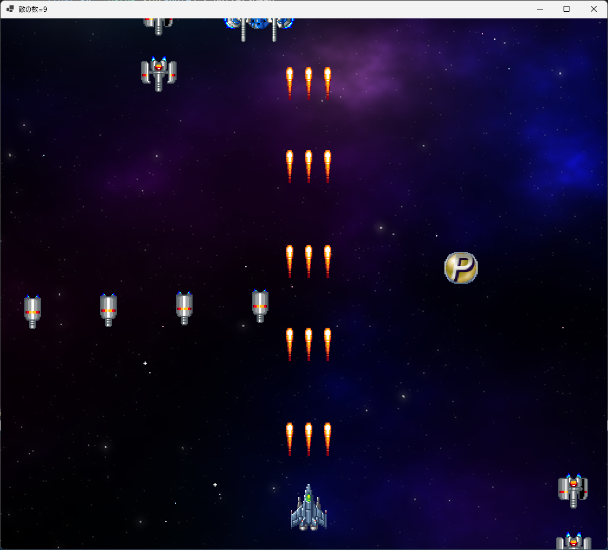</div>

<div style="page-break-after: always"></div>

## 2 敵の弾丸

### 2.1 弾丸を発射する砲塔クラスを作る

シューティングゲームなので、敵にも攻撃手段を作りましょう。<br>
弾丸の発射を管理するクラスを作ります。クラス名は`Turret`(ターレット、「砲塔(ほうとう)」という意味)とします。

以下の手順にしたがって、プロジェクトに`Turret.cs`を追加してください。

1. ソリューションエクスプローラーのプロジェクト名(今回の場合は`ShootEmUp`)を右クリック
2. 「追加」項目にマウスカーソルを合わせる
3. 「新しい項目」を左クリック(「新しい項目の追加」というウィンドウが開く)<br>
4. ウィンドウ中央の空欄(`FileName.cs`となっている部分)を`Turret.cs`に書き換える
5. 「追加」ボタンをクリック

今回作成する砲塔は、指定された時間間隔で、真下に1発の弾丸を発射します。<br>
まずは変数と、それからコメントを追加します。発射間隔は`Interval`(インターバル、「間隔」という意味)、弾丸の速度は`BulletSpeed`(バレット・スピード、「弾丸の速度」という意味)とします。

`Turret`クラスの定義を、次のように変更してください。

```diff
 using System;
 using System.Collections.Generic;
 using System.Linq;
 using System.Text;
 using System.Threading.Tasks;
 
 namespace ShootEmUp
 {
+  // 砲塔クラス
   internal class Turret
   {
-  }
-}
+    public float Interval;    // 発射間隔(秒)
+    public float BulletSpeed; // 弾丸の速度
+    public float Timer;       // 発射タイマー
+  } // Turret クラスブロックの終わり
+} // ShootEmUp 名前空間ブロックの終わり
```

### 2.2 砲塔のコンストラクタを作る

次にコンストラクタを書きます。コンストラクタのパラメータは「発射間隔」と「弾丸の速度」にします。<br>
変数の宣言の下に、次のコンストラクタを追加してください。

```diff
   // 砲塔クラス
   internal class Turret
   {
     public float Interval;    // 発射間隔(秒)
     public float BulletSpeed; // 弾丸の速度
     public float Timer;       // 発射タイマー
+
+    // コンストラクタ
+    public Turret(float interval, float speed)
+    {
+      Interval = interval;
+      BulletSpeed = speed;
+      Timer = 0.0f;
+    } // コンストラクタブロックの終わり
   } // Turret クラスブロックの終わり
 } // ShootEmUp 名前空間ブロックの終わり
```

### 2.3 砲塔の状態を更新するメソッドを作る

続いて、砲塔の状態を更新するメソッドを作ります。<br>
メソッド名は`Update`(アップデート、「更新する」という意味)とします。<br>
`Update`メソッドでは、タイマーを進めて、発射時間になったら弾丸リストに弾丸を追加します。

コンストラクタブロックの下に、次の`Update`メソッドを追加してください。

```diff
       Interval = interval;
       BulletSpeed = speed;
       Timer = 0.0f;
     } // コンストラクタブロックの終わり
+
+    // 砲塔の状態を更新する
+    public void Update(float deltaTime, Character character, List<Bullet> bulletList)
+    {
+      // 発射までの時間が残っていたら何もしない
+      Timer -= deltaTime;
+      if (Timer > 0.0f)
+      {
+        return;
+      }
+
+      // 発射タイマーの時間を戻す
+      Timer += Interval;
+
+      // 弾丸を発射
+      bulletList.Add(new(character.X, character.Y, 0, BulletSpeed));
+    } // Update メソッドブロックの終わり
   } // Turret クラスブロックの終わり
 } // ShootEmUp 名前空間ブロックの終わり
```

これで、`Turret`クラスは完成です。

### 2.4 Enemyクラスに砲塔を追加する

完成した`Turret`クラスを敵に追加しましょう。<br>
`Enemy.cs`を開き、砲塔のリストを追加してください。

```diff
     public float StartX;     // 発生時のX座標
     public float StartY;     // 発生時のY座標
     public Box Hitbox;       // 衝突判定
     public Box HitboxOrigin; // 衝突判定の基本座標
     public int Hp;           // 耐久値
+    public List<Turret> TurretList; // 砲塔のリスト

     // 敵の種類
     public const int SmallGray = 0;  // 小型で灰色(スモール・グレー)
     public const int MediumRed = 1;  // 中型で赤色(ミディアム・レッド)
```

次に、砲塔を作成します。<br>
コンストラクタに、砲塔を作るプログラムを追加してください。

```diff
       Type = t; // 敵の種類を設定
       Timer = 0.0f; // 経過時間を0にする
       StartX = x;   // 発生時のX座標を記録
       StartY = y;   // 発生時のY座標を記録
       Hp = 1;       // 基本の耐久値を設定
+      TurretList = new(); // 砲塔リストを作る
+
+      // 砲塔を追加する
+      TurretList.Add(new(2.0f, 300.0f));

       // キャラクターを作る
       if (Type == SmallGray)
```

砲塔を更新するには、「弾丸のリスト」が必要です。<br>
`Enemy`クラスの`Update`メソッドのパラメータに、「弾丸リスト」を追加しましょう。<br>
`Update`メソッドのパラメータを次のように変更してください。

```diff
       // 実際のヒットボックスを計算
       Hitbox = new(
         HitboxOrigin.Left + Character.X, HitboxOrigin.Right + Character.X,
         HitboxOrigin.Top + Character.Y, HitboxOrigin.Bottom + Character.Y);
     } // コンストラクタブロックの終わり

     // 敵の状態を更新する
-    public void Update(float deltaTime)
+    public void Update(float deltaTime, List<Bullet> bulletList)
     {
       // 行動終了していたら何もしない
       if (IsFinished)
```

追加したパラメータを使って、敵の砲塔を更新しましょう。<br>
`Update`メソッドの敵を作成するif文の下に、砲塔の状態を更新するプログラムを追加してください。

```diff
         // 敵が画面の下に消えたら行動終了
         if (Character.Y >= Form1.RenderHeight + 64)
         {
           IsFinished = true;
         }
       }
+
+      // 砲塔の状態を更新
+      for (int a = 0; a < TurretList.Count; a += 1)
+      {
+        TurretList[a].Update(deltaTime, bulletList);
+      }

       // 実際のヒットボックスを計算
       Hitbox = new(
         HitboxOrigin.Left + Character.X, HitboxOrigin.Right + Character.X,
         HitboxOrigin.Top + Character.Y, HitboxOrigin.Bottom + Character.Y);
     } // Update メソッドブロックの終わり
```

これで、`Enemy`クラスに砲塔が追加されました。

### 2.5 Form1クラスに敵の弾丸リストを追加する

`Enemy`クラスの`Update`メソッドのパラメータを変更したので、`Form1`クラスの敵の更新プログラムも変更が必要です。<br>
まず、パラメータとして必要な「敵の弾丸のリスト」を追加します。<br>
`Form1`を開き、敵の弾丸のリストを追加してください。

```diff
     // 敵の変数
     private List<Enemy> enemyList = new();
     private List<EnemySpawner> enemySpawnerList = new(); // 敵発生装置のリスト
     private float enemySpawnTimer = 0.0f; // 敵発生タイマー
+    private List<Bullet> enemyBulletList = new(); // 敵の弾丸のリスト
 
     // 自機の変数
     private Player player = new(RenderWidth * 0.5f, RenderHeight * 0.75f);
     private List<Bullet> playerBulletList = new();
     private List<Item> itemList = new();
```

これで、`Enemy`クラスの`Update`メソッド呼び出しで起きているエラーを直せます。<br>
`Form1`の`Update`メソッドにある「敵の状態を更新する」プログラムのパラメータに、敵の弾丸のリストを追加してください。

```diff
       // 敵の状態を更新する
       for (int a = 0; a < enemyList.Count; a += 1)
       {
-        enemyList[a].Update(deltaTime);
+        enemyList[a].Update(deltaTime, enemyBulletList);
       }

       // 行動が終わった敵を削除する
       enemyList.RemoveAll((e) => { return e.IsFinished; });
```

「敵の弾丸」は、まだ移動もしないし画面にも映りません。<br>
弾丸を移動させるには、`Update`メソッドの呼び出しを追加する必要があります。<br>
「鼓動が終わった敵を削除する」プログラムの下に、敵の弾丸の状態を更新するプログラムを追加してください。

```diff
         enemyList[a].Update(deltaTime, enemyBulletList);
       }

       // 行動が終わった敵を削除する
       enemyList.RemoveAll((e) => { return e.IsFinished; });
+
+      // 敵の弾丸の状態を更新する
+      for (int a = 0; a < enemyBulletList.Count; a += 1)
+      {
+        enemyBulletList[a].Update(deltaTime);
+      }
+      enemyBulletList.RemoveAll((e) => { return e.IsFinished; });

       // 敵を発生させる
       enemySpawnTimer += deltaTime;
       if (enemySpawnTimer >= 1.0f)
```

最後に、敵の弾丸を画面に表示します。<br>
`PaintPlay`メソッドにある「自機を描く」プログラムの下に、敵の弾丸を描くプログラムを追加してください。

```diff
         playerBulletList[a].Draw(g, bmpObjects);
       }

       // 自機を描く
       player.Draw(g, bmpObjects);
+
+      // 敵の弾丸を描く
+      for (int a = 0; a < enemyBulletList.Count; a += 1)
+      {
+        enemyBulletList[a].Draw(g, bmpObjects);
+      }
     } // PaintPlay メソッドブロックの終わり

     // クリア状態を描く
     private void PaintClear(Graphics g)
```

プログラムが書けたら`>ShootEmUp`ボタンをクリックしてアプリを実行してください。<br>
敵から真下に向かって弾丸が発射されたら成功です。

<div align="center">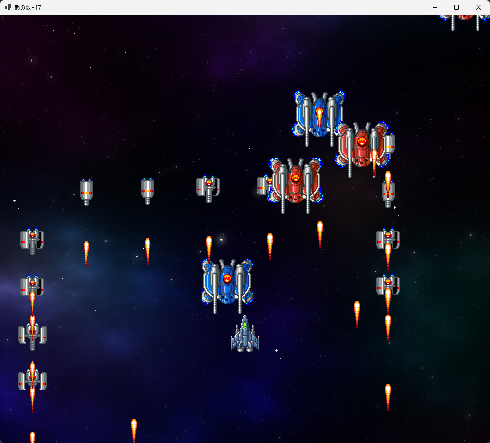</div>

### 2.6 弾丸の見た目を変える

自機の弾丸と敵の弾丸の見た目が同じだと分かりにくいです。敵の弾丸の画像を変えましょう。<br>
弾丸の管理は`Bullet`クラスの仕事なので、弾丸の画像変更も`Bullet`クラスで行うのがよいでしょう。<br>
`Bullet.cs`を開き、`Bullet`クラスに次の変数を追加してください。

```diff
   // 弾丸クラス
   internal class Bullet
   {
     // 弾丸のアニメーション範囲
     private static readonly Rectangle[] animePlayerBullet = { new(48, 432, 16, 32) };
+    private static readonly Rectangle[] animeEnemyBullet = { new(320, 464, 16, 16) };

     public Character Character;
     public float MoveSpeedX; // X方向の移動速度
     public float MoveSpeedY; // Y方向の移動速度
     public bool IsFinished;  // true=行動終了 false=行動中
     public Box Hitbox;       // 衝突判定
     public Box HitboxOrigin; // 衝突判定の基本座標
+    public int Type;         // 弾丸の種類
+
+    // 弾丸の種類
+    public const int PlayerBullet = 0; // 自機の弾丸
+    public const int EnemyBullet = 1;  // 敵の弾丸

    // コンストラクタ
    public Bullet(float x, float y, float sx, float sy)
```

弾丸の種類は、コンストラクタのパラメータで指定することにします。<br>
`Bullet`クラスのコンストラクタを、次のように変更してください。


```diff
     // 弾丸の種類
     public const int PlayerBullet = 0; // 自機の弾丸
     public const int EnemyBullet = 0;  // 敵の弾丸

     // コンストラクタ
-    public Bullet(float x, float y, float sx, float sy)
+    public Bullet(float x, float y, float sx, float sy, int type)
     {
+      // 弾丸の種類を設定
+      Type = type;
+
+      // 種類によって弾丸を作り分ける
+      if (Type == PlayerBullet)
+      {
+        // プレイヤーの弾丸を作る
         // キャラクターの座標とアニメーションを設定
         Character = new(x, y, animePlayerBullet, 0);

         // 衝突判定を設定
         HitboxOrigin = new(-16, 16, -32, 32);
+      }
+      else if (Type == EnemyBullet)
+      {
+        // 敵の弾丸を作る
+        Character = new(x, y, animeEnemyBullet, 0);
+        HitboxOrigin = new(-8, 8, -8, 8);
+      }

       // 移動速度を設定
       MoveSpeedX = sx;
       MoveSpeedY = sy;
```

敵の弾丸の画像はは丸い形で小さめです。そのため、衝突判定も小さめにしています。

さて、コンストラクタにパラメータを追加したことで、弾丸を発射するメソッドにエラーが出ています。<br>
弾丸を発射するメソッドは`Player`クラスの`Update`メソッドと、`Turret`クラスの`Update`メソッドです。<br>
これらのメソッドの弾丸作成プログラムを修正しましょう。

まずは`Player`クラスを修正します。<br>
`Player.cs`を開き、`Update`メソッドにある弾丸を発射するプログラムを、次のように変更してください。

```diff
           // レベルに合わせて発射数を増やす
           float bulletSpeed = -1200; // 弾丸の速度
           for (int a = 0; a <= ShotLevel; a += 1)
           {
             // 発射位置を計算
             float x = a * 32 - ShotLevel * 16;
-            bulletList.Add(new(Character.X + x, Character.Y, 0, bulletSpeed));
+            bulletList.Add(new(Character.X + x, Character.Y, 0, bulletSpeed, Bullet.PlayerBullet));
           }
         }
```

続いて、`Turret`クラスを修正します。<br>
`Turret.cs`を開き、`Update`メソッドにある弾丸を発射するプログラムを、次のように変更してください。

```diff
       // 発射タイマーの時間を戻す
       Timer += Interval;

       // 弾丸を発射
-      bulletList.Add(new(character.X, character.Y, 0, BulletSpeed));
+      bulletList.Add(new(character.X, character.Y, 0, BulletSpeed, Bullet.EnemyBullet));
     } // Update メソッドブロックの終わり
   } // Turret クラスブロックの終わり
 } // ShootEmUp 名前空間ブロックの終わり
```

プログラムが書けたら`>ShootEmUp`ボタンをクリックしてアプリを実行してください。<br>
敵の発射する弾丸が、丸い形の画像に変わっていたら成功です。

<div align="center">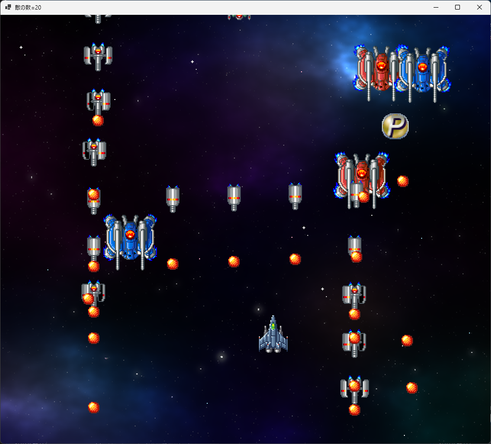</div>

### 2.7 敵の弾丸と自機の衝突判定を作る

自機が敵の弾丸と衝突したら、ゲームオーバーになるようにしましょう。<br>
`Form1`を開き、`UpdatePlay`メソッドにある「敵と自機の弾の衝突判定」の下に、「自機と敵の弾の衝突判定」を追加してください。

```diff
             // 爆発エフェクトを追加する
             Character c = new(x, y, animeSmallBlast, 15);
             c.AnimeIsLoop = false; // 一度だけ再生する
             effectList.Add(c);

             break; // 弾丸のループを終了する
           }
         }
       } // playerBulletList のforブロックの終わり
     } // enemyList のforブロックの終わり
+
+    // 自機と敵の弾の衝突判定
+    for (int a = 0; a < enemyBulletList.Count; a += 1)
+    {
+      Bullet bullet = enemyBulletList[a];
+      if (bullet.Hitbox.Intersect(player.Hitbox))
+      {
+        gameState = gsDead; // 死亡状態にする
+      }
+    }
   } // UpdatePlay メソッドブロックの終わり

   // クリア状態を更新する
   //   deltaTime  状態を進める秒数
   private void UpdateClear(float deltaTime)
```

それから、死亡状態でも画面が表示されるようにしておきます。<br>
`PaintDead`メソッドに、次のプログラムを追加してください。

```diff
     // 死亡状態を描く
     private void PaintDead(Graphics g)
     {
+      PaintPlay(g);
     } // PaintDead メソッドブロックの終わり
   } // Form1 型ブロックの終わり
 } // ShootEmUp 名前空間ブロックの終わり
```

プログラムが書けたら`>ShootEmUp`ボタンをクリックしてアプリを実行してください。<br>
自機が敵の弾丸と衝突したとき、ゲームが停止したら成功です。

<div align="center">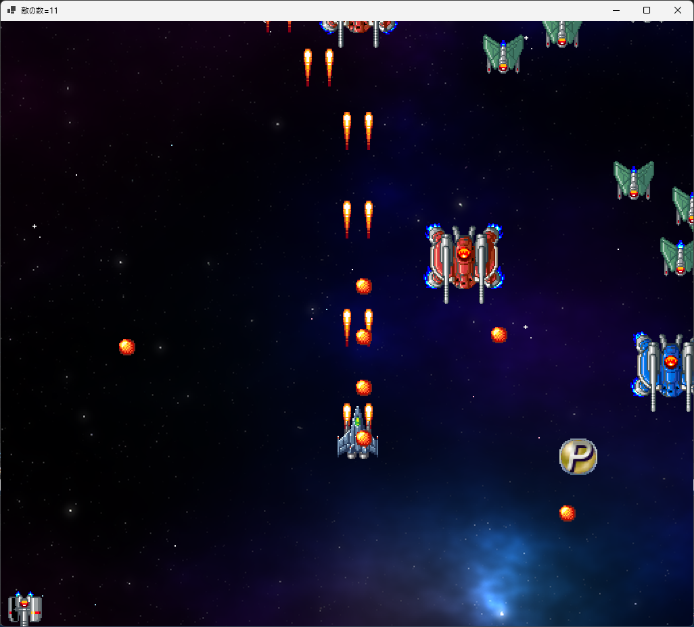</div>

### 2.8 ゲームオーバーの文字を表示する

ゲームオーバーになったことが分かるように、文字を表示しましょう。<br>
文字を表示するには「フォント」が必要です。フォント変数を追加しましょう。<br>
フォント変数の名前は`fontHeading`(フォント・ヘッディング、「見出しフォント」という意味)とします。

`Form1`クラスの「ゲーム状態」変数の宣言の下に、次のプログラムを追加してください。

```diff
     // ゲーム状態
     const int gsPlay = 0;   // プレイ状態
     const int gsClear = 1;  // ステージクリア状態
     const int gsDead = 2;   // 死亡状態
     private int gameState = gsPlay; // 現在のゲーム状態
+
+    // フォント変数
+    private Font fontHeading = null !; // 見出し用フォント

    // ファイルから画像を読み込む
    private Bitmap bmpBackground = new("assets/images/bg_space.png");
    private Bitmap bmpObjects = new("assets/images/tile_objects.png");
```

次に、`Init`メソッドでフォントを読み込みます。<br>
`Init`メソッドに次のプログラムを追加してください。

```diff
     // ゲーム状態を初期化する
     public void Init()
     {
+      // フォントを作成
+      float dpiScale = 96.0f / DeviceDpi;
+      fontHeading = new("Impact", 64 * dpiScale);
+
       // 背景のY座標を、一番下の1画面がちょうどウィンドウ内に表示されるように設定
       backgroundY = -(bmpBackground.Height - RenderHeight);
     } // Init メソッドブロックの終わり
```

フォントの準備ができたので、文字を表示しましょう。<br>
`PaintDead`メソッドに次のプログラムを表示してください。

```diff
     // 死亡状態を描く
     private void PaintDead(Graphics g)
     {
       PaintPlay(g);
+      TextRenderer.DrawText(g, "GAME OVER", fontHeading, new Point(300, 400), Color.Red);
     } // PaintDead メソッドブロックの終わり
   } // Form1 型ブロックの終わり
 } // ShootEmUp 名前空間ブロックの終わり
```

プログラムが書けたら`>ShootEmUp`ボタンをクリックしてアプリを実行してください。<br>
自機が敵の弾丸と衝突したとき、`GAME OVER`の文字が表示されたら成功です。

<div align="center">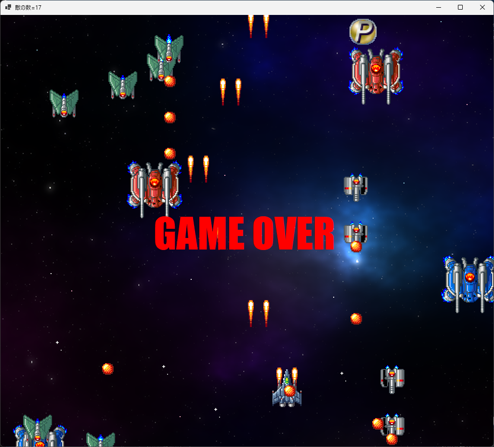</div>

### 2.9 ゲームを再開できるようにする

ゲームオーバーから復帰して、ゲームを再開できるようにしましょう。<br>
再開用のキー判定をしたいので、`Form1`でも`GetAsyncKeyState`を使えるようにしましょう。
`Form1`クラスの先頭に、次のプログラムを追加してください。

```diff
   // フォーム管理クラス
   public partial class Form1 : Form
   {
+    // OSの「キーを調べる機能」を使えるようにする
+    [DllImport("user32.dll")]
+    private static extern short GetAsyncKeyState(int key);
+
+    // GetAsyncKeyState で使う仮想キー番号
+    private const int vkReturn = 13; // Enterキー
+
     public const int RenderWidth = 1024; // 横のピクセル数
     public const int RenderHeight = 896; // 縦のピクセル数
```

これでキーの状態を調べられます。

それでは、ゲームを再開できるようにしましょう。<br>
`UpdateDead`メソッドに、「`Enter`キーが押されたらゲーム状態を`gsPlay`にする」プログラムを追加してください。

```diff
     // 死亡状態を更新する
     //   deltaTime  状態を進める秒数
     private void UpdateDead(float deltaTime)
     {
+      if (GetAsyncKeyState(vkReturn) < 0)
+      {
+        gameState = gsPlay; // ゲームを開始する
+      }
     } // UpdateDead メソッドブロックの終わり

     // プレイ状態を描く
     private void PaintPlay(Graphics g)
```

プログラムが書けたら`>ShootEmUp`ボタンをクリックしてアプリを実行してください。<br>
ゲームオーバーになったとき、`Enter`キーでゲームが再開できたら成功です。

### 2.10 変数を最初の状態に戻す

ゲームを再開すると、ゲームオーバーになった時の状態から始まります。<br>
ゲームを始めからやり直すには、敵のリストや弾のリストからデータを消去したり、背景の表示位置を戻したりする必要があります。

`List`クラスからデータを消去するには、`Clear`(クリア、「片付ける、きれいにする」という意味)メソッドを使います。<br>
`UpdateDead`メソッドに、データを初期化するプログラムを追加してください。

```diff
     private void UpdateDead(float deltaTime)
     {
       if (GetAsyncKeyState(vkReturn) < 0)
       {
+        // 敵のデータを初期化する
+        enemyList.Clear();
+        enemySpawnerList.Clear();
+        enemyBulletList.Clear();
+        enemySpawnTimer = 0.0f;
+
+        // 自機のデータを初期化する
+        player.Character.X = RenderWidth * 0.5f;
+        player.Character.Y = RenderHeight * 0.75f;
+        player.ShotLevel = 0;
+        playerBulletList.Clear();
+
+        // その他のデータを初期化する
+        itemList.Clear();
+        effectList.Clear();
+        backgroundY = -(bmpBackground.Height - RenderHeight);
+
         gameState = gsPlay; // ゲームを開始する
       }
     } // UpdateDead メソッドブロックの終わり
```

プログラムが書けたら`>ShootEmUp`ボタンをクリックしてアプリを実行してください。<br>
ゲームオーバーになって`Enter`キーでゲームを再開したとき、敵や弾が消えていたら成功です。

<div align="center">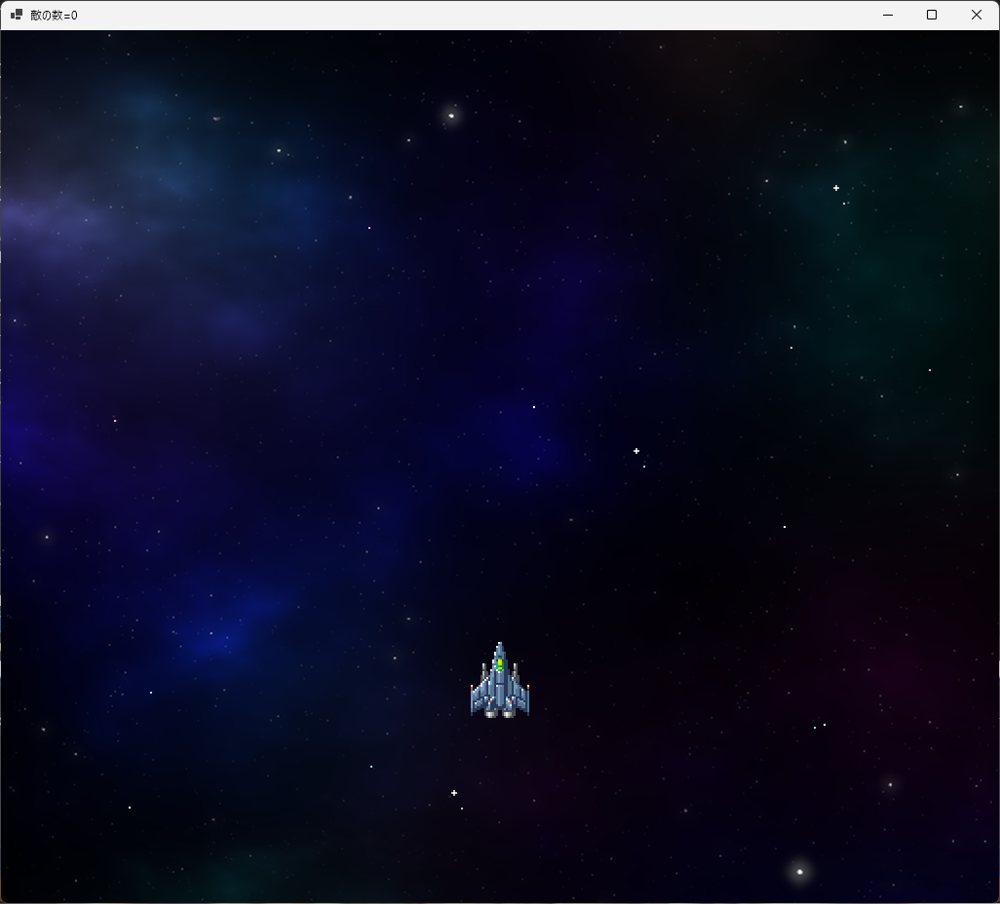</div>

<div style="page-break-after: always"></div>

## 3 自機を狙って撃つ

### 3.1 自機を狙う機能を追加する

真下に撃たれる弾丸を避けるのは、それほど難しいことではありません。<br>
ゲームを少し難しくするために、砲台が自機を狙って撃ってくるようにしましょう。<br>
そのために、砲台に「攻撃目標を指定する機能」を追加します。

まずは、攻撃目標をあらわす変数を追加します。変数名は`Target`(ターゲット、「目標」という意味)とします。<br>
`Turret.cs`を開き、`Turret`クラスに次のプログラムを追加してください。

> クラス名`Character`の直後に、記号`?`(クエスチョンマーク)が付いていることに注意してください。<br>
> クラス名に`?`を付けて変数を宣言すると、「ヌル許容型」という特別なクラスになります。
>
> Visual Sutidoは、データが`null`(ヌル、何も無い)の変数があると「緑の波線」で警告します。<br>
> `null`状態の変数を使おうとすると **プログラムが停止してしまう** からです。<br>
> そして、変数がヌル許容型の場合、「緑の波線」の警告が出なくなります。<br>
> プログラムの都合で`null`がありうる変数にとって、警告は邪魔だからです。

```diff
     public float Interval;    // 発射間隔(秒)
     public float BulletSpeed; // 弾丸の速度
     public float Timer;       // 発射タイマー
+    public Character? Target; // 攻撃目標

     // コンストラクタ
-    public Turret(float interval, float speed)
+    public Turret(float interval, float speed, Character? target)
     {
       Interval = interval;
       BulletSpeed = speed;
       Timer = 0.0f;
+      Target = target;
     } // コンストラクタブロックの終わり
```

続いて、攻撃目標に向かって弾丸を発射しましょう。<br>
それには、敵から攻撃目標への向きを決めなくてはなりません。

向きを求めるには、`MathF`(マス・エフ)クラスの`Atan2`(エータン・ツー)メソッドを使います。<br>
`Atan2`メソッドのパラメータに「Y軸方向の距離」と「X軸方向の距離」を指定すると、角度が得られます。

&emsp;`float MathF.Atan2(float Y軸方向の距離, float X軸方向の距離)`

そして、`Atan2`で求めた方向から、さらに「X軸方向の速度」と「Y軸方向の速度」を求めます。<br>
これには`MathF`クラスの`Cos`(コサイン)メソッドと`Sin`(サイン)メソッドを使います。<br>
`Update`メソッドのプログラムを、次のように変更してください。

```diff
       // 発射タイマーの時間を戻す
       Timer += Interval;
+
+      // 発射角度を計算
+      float angle = 0.5f * MathF.PI; // 攻撃目標がない場合、下向きに撃つ
+      if (Target != null)
+      {
+        // 攻撃目標がある場合、攻撃目標に向かう角度を計算
+        float dx = Target.X - character.X; // 敵から攻撃目標までの距離(X軸方向)
+        float dy = Target.Y - character.Y; // 敵から攻撃目標までの距離(Y軸方向)
+        angle = MathF.Atan2(dy, dx);
+      }
+
+      // 弾丸の速度を計算
+      float sx = MathF.Cos(angle) * BulletSpeed;
+      float sy = MathF.Sin(angle) * BulletSpeed;

       // 弾丸を発射
-      bulletList.Add(new(character.X, character.Y, 0, BulletSpeed, Bullet.EnemyBullet));
+      bulletList.Add(new(character.X, character.Y, sx, sy, Bullet.EnemyBullet));
     } // Update メソッドブロックの終わり
   } // Turret クラスブロックの終わり
 } // ShootEmUp 名前空間ブロックの終わり
```

`MathF.PI`(マス・エフ・パイ)は、円周率`π`をあらわします。<br>
C#では、一周の角度を`360`度ではなく、`2π`で表現します。<br>
この`π`を使った角度表現のことを、 **弧度法(こどほう)** または **ラジアン** といいます。

ゲーム内の角度は、右が`0`、下が`0.5π`、左が`π`、上が`1.5π`になります。<br>
例えば、下を狙う場合の角度は`0.5π`になります。

これで、自機を狙って弾丸が発射されるようになります。

### 3.2 砲台、敵、敵発生装置に攻撃目標パラメータを追加する

砲塔に自機を狙わせるために、`Enemy`クラスのコンストラクタに「攻撃目標」のパラメータを追加します。<br>
`Enemy.cs`を開き、コンストラクタを次のように変更してください。

```diff
     // 敵の種類
     public const int SmallGray = 0;
     public const int MediumRed = 1;
     public const int MediumBlue = 2;
     public const int SmallGreen = 3;

     // コンストラクタ
-    public Enemy(float x, float y, int t)
+    public Enemy(float x, float y, int t, Character? target)
     {
       MoveSpeedX = 0.0f;
       MoveSpeedY = 0.0f;
       IsFinished = false; // 「行動中」にする
       Type = t; // 敵の種類を設定
       Timer = 0.0f;   // 経過時間を0にする
       StartX = x; // 発生時のX座標を記録
       StartY = y; // 発生時のY座標を記録
       Hp = 1;     // 基本の耐久値を設定
       TurretList = new(); // 砲塔リストを作る

       // 砲塔を追加する
-      TurretList.Add(new(2.0f, 300.0f));
+      TurretList.Add(new(2.0f, 300.0f, target));

       // キャラクターを作る
       if (Type == SmallGray)
```

`Enemy`クラスのコンストラクタにパラメータを追加したので、コンストラクタを呼び出しているプログラムも変更していきます。
`EnemySpawner.cs`を開き、`Update`メソッドに攻撃目標パラメータを追加してください。

```diff
       Timer = 0.0f;
       IsFinished = false;
     } // コンストラクタブロックの終わり

     // 敵を発生させる
-    public void Update(float deltaTime, List<Enemy> enemyList)
+    public void Update(float deltaTime, List<Enemy> enemyList, Character? target)
     {
       // すべての敵が発生済みなら何もしない
       if (Count <= 0)
```

追加したパラメータを、`Enemy`クラスのコンストラクタに指定しましょう。<br>
ただ、どの敵からも狙われると危険すぎるので、中型で赤色の敵だけは狙ってこないようにします。<br>
`Update`メソッドにある敵を発生させるプログラムを、次のように変更してください。

```diff
       // 時間になったので敵を発生させる
       if (Pattern == PatternSmallGrayA)
       {
         // 小型で灰色の敵を、縦方向に発生
-        enemyList.Add(new(SpawnX, SpawnY, Enemy.SmallGray));
+        enemyList.Add(new(SpawnX, SpawnY, Enemy.SmallGray, target));
         Timer += 0.5f; // 次の発生までの時間を設定
       }
       else if (Pattern == PatternSmallGrayB)
       {
         // 小型で灰色の敵を、横方向に発生
-        enemyList.Add(new(SpawnX, SpawnY, Enemy.SmallGray));
+        enemyList.Add(new(SpawnX, SpawnY, Enemy.SmallGray, target));
         SpawnX += 128; // 発生位置を右にずらす
       }
       else if (Pattern == PatternMediumRed)
       {
         // 中型で赤色の敵を、間隔を開けて左右に発生
-        enemyList.Add(new(SpawnX, SpawnY, Enemy.MediumRed));
+        enemyList.Add(new(SpawnX, SpawnY, Enemy.MediumRed, null));
         SpawnX = Form1.RenderWidth - SpawnX;
         Timer += 3.5f; // 次の発生までの時間を設定
       }
       else if (Pattern == PatternMediumBlue)
       {
         // 中型で青色の敵を、間隔を開けて左右に発生
-        enemyList.Add(new(SpawnX, SpawnY, Enemy.MediumBlue));
+        enemyList.Add(new(SpawnX, SpawnY, Enemy.MediumBlue, target));
         SpawnX = Form1.RenderWidth - SpawnX;
         Timer += 3.5f; // 次の発生までの時間を設定
       }
       else if (Pattern == PatternSmallGreen)
       {
         // 小型で緑色の敵を、縦方向に発生
-        enemyList.Add(new(SpawnX, SpawnY, Enemy.SmallGreen));
+        enemyList.Add(new(SpawnX, SpawnY, Enemy.SmallGreen, target));
         Timer += 0.25f; // 次の発生までの時間を設定
       }

       count -= 1; // 発生数を1減らす
     } // Update メソッドブロックの終わり
```

最後に、`Form1`クラスにある`EnemySpawner`の`Update`メソッド呼び出しを修正します。<br>
`Form1`を開き、`UpdatePlayer`メソッドにある「敵発生装置を更新する」プログラムを、次のように変更してください。

```diff
       // 敵発生装置を更新する
       for (int a = 0; a < enemySpawnerList.Count; a += 1)
       {
-        enemySpawnerList[a].Update(deltaTime, enemyList);
+        enemySpawnerList[a].Update(deltaTime, enemyList, player.Character);
       }
       enemySpawnerList.RemoveAll((e) => { return e.IsFinished; });

       Text = "敵の数=" + enemyList.Count;
```

プログラムが書けたら`>ShootEmUp`ボタンをクリックしてアプリを実行してください。<br>
敵から、自機を狙って弾丸が発射されたら成功です。

<div align="center">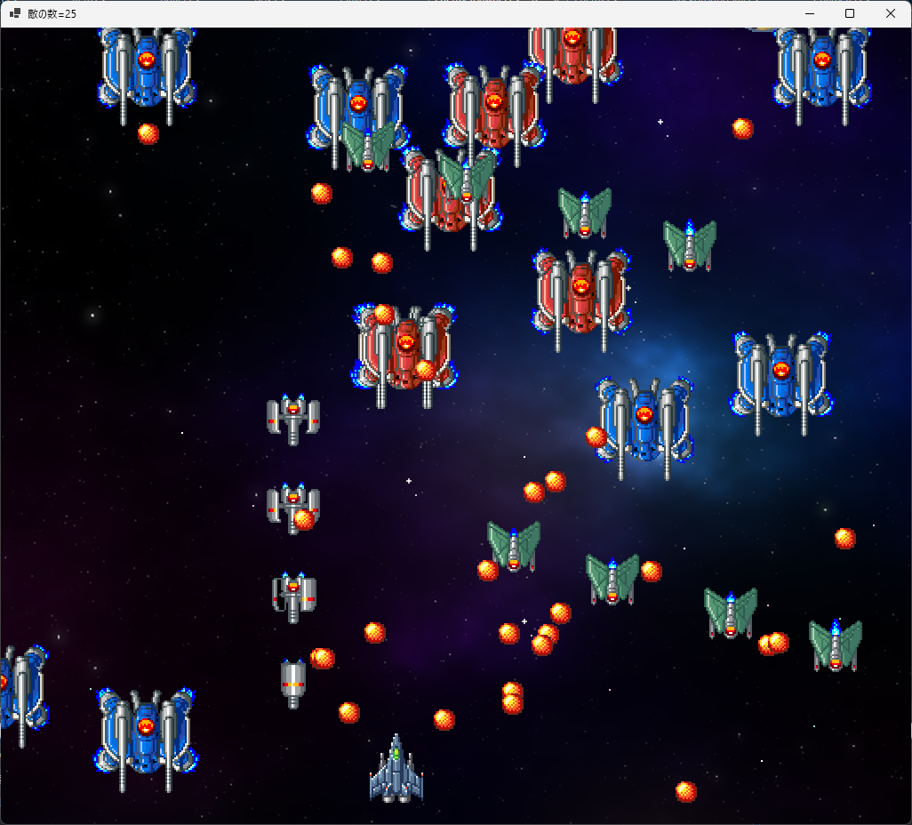</div>

### 3.3 敵の発生数を減らす

画面上の敵の数が多くなると、敵の弾丸を避けにくくなります。<br>
敵の数を少し減らせば、弾丸が減って避けやすくなるはずです。

そこで、敵の発生パターンによって、敵の出現数を変えましょう。<br>
`EnemySpawer.cs`を開き、コンストラクタにある`Count`を初期化するプログラムの下に、次のプログラムを追加してください。

```diff
     // コンストラクタ
     public EnemySpawner(float x, float y, int p, int c)
     {
       SpawnX = x;
       SpawnY = y;
       Pattern = p;
       Count = 4;
+      // 中型の敵は発生数を2つにする
+      if (Pattern == 2 || Pattern == 3)
+      {
+        Count = 2;
+      }
       Timer = 0.0f;
       IsFinished = false;
     } // コンストラクタブロックの終わり
```

プログラムが書けたら`>ShootEmUp`ボタンをクリックしてアプリを実行してください。<br>
中型の敵の数が減って、少しだけ戦いやすくなっていたら成功です。

<div align="center">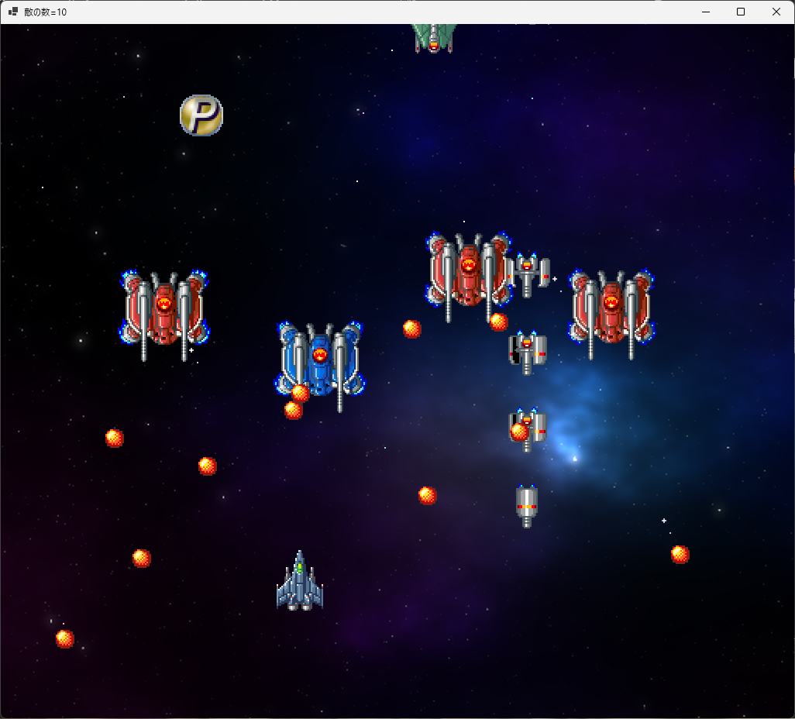</div>

### 3.4 敵の種類によって弾丸の発射間隔を変える

まだ弾丸が多い気がします。<br>
現在、敵の種類に関わらず、弾丸の発射間隔は同じです。<br>
小型でも中型でも同じ攻撃力を持っているのは、ちょっと納得できないところです。

そこで、小型の敵に限って、弾丸の発射間隔を長くしましょう。

```diff
       StartY = y; // 発生時のY座標を記録
       Hp = 1;     // 基本の耐久値を設定
       TurretList = new(); // 砲塔リストを作る

-      // 砲塔を追加する
-      TurretList.Add(new(2.0f, 300.0f, target));

       // キャラクターを作る
       if (Type == SmallGray)
       {
         Character = new Character(x, y, animeSmallGray, 7);
         HitboxOrigin = new(-28, 28, -28, 28);
+        TurretList.Add(new(3.0f, 300.0f, target));
         MoveSpeedY = 200.0f;
       }
       else if (Type == MediumRed)
       {
         Character = new Character(x, y, animeMediumRed, 10);
         HitboxOrigin = new(-56, 56, -56, 38);
+        TurretList.Add(new(2.0f, 500.0f, target));

         // 画面中央より左に発生したら右へ、右に発生したら左へ移動させる
         MoveSpeedX = 50;
         if (x >= Form1.RenderWidth * 0.5f)
```

<pre class="tnmai_assignment">
<strong>【課題01 残りの敵の砲台を作る】</strong>
中型で青色の敵と、小型で緑色の敵について、砲台を作るプログラムを追加しなさい。
発射間隔の弾丸の速度は以下の値にすること。
  中型で青色の敵: 発射間隔=2秒、弾丸の速度=秒速300ドット
  小型で緑色の敵: 発射間隔=3秒、弾丸の速度=秒速300ドット
</pre>

課題が完了したら、`>ShootEmUp`ボタンをクリックしてアプリを実行してください。<br>
小型の敵が撃ってくる弾丸の数が減って、より戦いやすくなっていたら成功です。

<div align="center">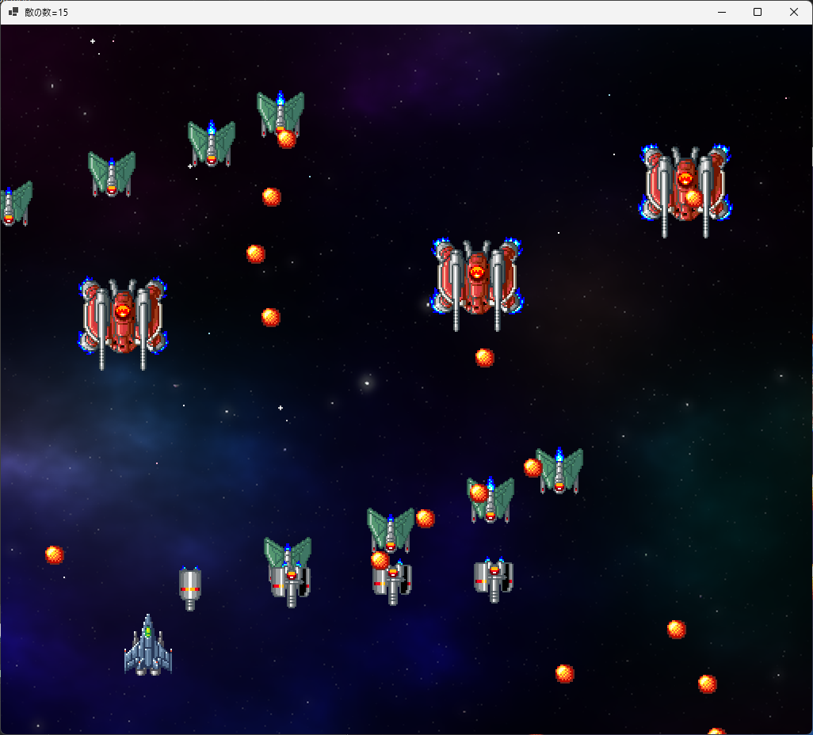</div>

### 3.5 砲塔のバリエーションを作る

敵の発生数や、弾丸の発射間隔を調整したことで、以前よりずっと遊びやすくなりました。<br>
ですが、少し簡単にしすぎたかもしれません。

そこで、砲塔に複数の弾丸を発射する機能を追加して、敵の攻撃の種類を増やしましょう。<br>
放題のコンストラクタに、以下の３つのパラメータを追加します。

* 発射数: 一度に発射される弾丸の数
* 発射開始角度: 弾丸の発射角度の初期変化量
* 角度変化量： １発毎の発射角度の変化量

例えば、「発射数=5，発射開始角度=30度、角度変化量=15度」で、計算で求めた発射角度が60度の場合、<br>
１発目の弾丸は`60 + 30`で90度の方向に発射されます。２発目は`90 + (-15)`で75度です。<br>
同様にして、３発目は60度、４発目は45度、５発目は30度の方向に発射されます。

「発射数」の変数名は`Count`(カウント、「個数」という意味)とします。<br>
「発射開始角度」の変数名は`AngleStart`(アングル・スタート、「角度の開始」という意味)とします。<br>
「角度変化量」の変数名は`AngleChange`(アングル・チェンジ、「角度の変化」という意味)とします。

`Turret.cs`を開き、`Turret`クラスに次のプログラムを追加してください。

```diff
     public float Interval;    // 発射間隔(秒)
     public float BulletSpeed; // 弾丸の速度
     public float Timer;       // 発射タイマー
     public Character? Target; // 攻撃目標
+    public int Count;         // 発射数
+    public float AngleStart;  // 発射開始角度(ラジアン)
+    public float AngleChange; // 角度変化量(ラジアン)

     // コンストラクタ
-    public Turret(float interval, float speed, Character? target)
+    public Turret(float interval, float speed, Character? target,
+      int count, float start, float change)
     {
       Interval = interval;
       Timer = interval * 0.25f;
       BulletSpeed = speed;
       Target = target;
+      Count = count;
+      AngleStart = start;
+      AngleChange = change;
     } // コンストラクタブロックの終わり

     // 砲台の状態を更新する
     public void Update(float deltaTime, Character character, List<Bullet> bulletList)
```

次に、弾丸を複数発射できるようにします。<br>
`Update`メソッドに、次のプログラムを追加してください。

```diff
         // 攻撃目標がある場合、攻撃目標に向かう角度を計算
         float dx = Target.X - character.X; // 敵から攻撃目標までの距離(X軸方向)
         float dy = Target.Y - character.Y; // 敵から攻撃目標までの距離(Y軸方向)
         angle = MathF.Atan2(dy, dx);
       }
+
+      // 発射開始角度を足す
+      angle += AngleStart;
+
+      for (int a = 0; a < Count; a += 1) 
+      {
         // 弾丸の速度を計算
         float sx = MathF.Cos(angle) * BulletSpeed;
         float sy = MathF.Sin(angle) * BulletSpeed;

         // 弾丸を発射
         bulletList.Add(new(character.X, character.Y, sx, sy, Bullet.EnemyBullet));
+        angle += AngleChange; // 次の弾丸の発射角度を計算
+      }
     } // Update メソッドブロックの終わり
   } // Turret クラスブロックの終わり
 } // ShootEmUp 名前空間ブロックの終わり
```

これで、砲塔が複数の弾丸を発射できるように鳴りました。

### 3.6 砲塔のパラメータを設定する

敵に砲塔を作るプログラムに、新しいパラメータを設定しましょう。<br>
`Enemy.cs`を開き、キャラクターを作るプログラムを次のように変更してください。

```diff
       // キャラクターを作る
       if (Type == SmallGray)
       {
         Character = new Character(x, y, animeSmallGray, 7);
         HitboxOrigin = new(-28, 28, -28, 28);
-        TurretList.Add(new(3.0f, 300.0f, target));
+        TurretList.Add(new(3.0f, 300.0f, target, 1, 0, 0));
         MoveSpeedY = 200.0f;
       }
       else if (Type == MediumRed)
       {
         Character = new Character(x, y, animeMediumRed, 10);
         HitboxOrigin = new(-56, 56, -56, 38);
-        TurretList.Add(new(2.0f, 500.0f, target));
+        TurretList.Add(new(2.0f, 500.0f, target, 8, 0, MathF.PI / 4));

         // 画面中央より左に発生したら右へ、右に発生したら左へ移動させる
         MoveSpeedX = 50;
         if (x >= Form1.RenderWidth * 0.5f)
```

<pre class="tnmai_assignment">
<strong>【課題02 残りの敵の砲台にパラメータを追加する】</strong>
中型で青色の敵と、小型で緑色の敵について、砲台のパラメータを追加しなさい。
発射数、発射開始角度、角度変化量は以下の値にすること。
  中型で青色の敵: 発射数=3発、発射開始角度=0.15f 角度変化量=-0.15f
  小型で緑色の敵: 発射数=l発、発射開始角度=0 角度変化量=-0
</pre>

課題が完了したら、`>ShootEmUp`ボタンをクリックしてアプリを実行してください。<br>
中型で赤色の敵が八方向に弾丸を発射し、中型で青色の敵が自機に向かって３発の弾丸を発射したら成功です。

<div align="center">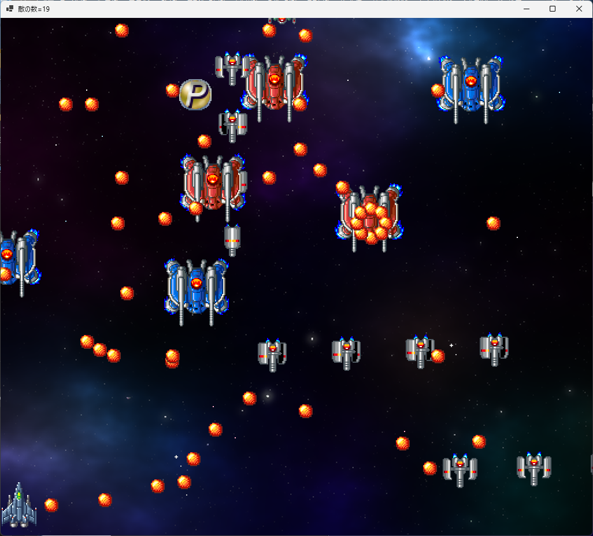</div>


